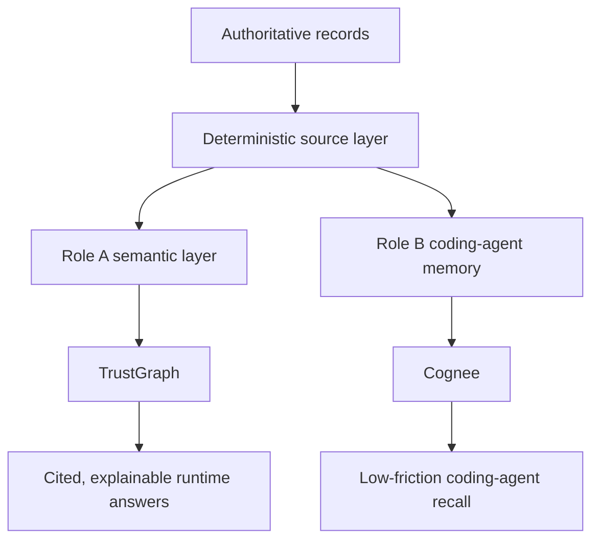
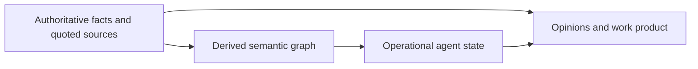

# Oracle Deep Research

## Run Metadata

- Status: COMPLETED (manual paste path)
- Date: 2026-07-08
- Path taken: the codex lane could not run the oracle CLI in its sandbox (no network for npm); after the CLI was installed the retry was superseded — the user submitted the rendered bundle to ChatGPT manually and provided the final answer at ~/Downloads/deep-research-report.md, transcribed below verbatim.
- Model: GPT-5.5 Pro, extended thinking (per oracle skill instruction; user-driven ChatGPT session)
- Citation caveat: the transcript uses ChatGPT-internal citation markers (citeturnNviewN / fileciteturnNfileN) that are not resolvable URLs outside the ChatGPT session. The "Prioritized sources" table at the end of the report is the human-readable source list.

---

# Deep Research on an AI Agent Memory Stack for a Local-First Legal Runtime

## Executive summary

Although the outer prompt described the topic as “unspecified,” the uploaded brief actually makes the research question concrete: choose and stress-test an AI-memory stack for a **local-first, professional/legal AI system**, with **separate decisions for runtime memory** and **coding-agent memory**, under a deterministic-first doctrine where LLMs are never the authoritative source of truth. fileciteturn0file0

The headline result is clear. **TrustGraph is the best fit for Role A**: the product-runtime memory layer for the firm’s own agents operating in a legal/professional domain. It is the strongest match on the things that matter most in that role: **self-hosting**, **Apache-2.0 licensing**, **explicit provenance**, **query-time explainability**, **ontology support**, **workspace isolation**, **TypeScript integration**, and a documented path to production readiness. Its architecture is heavier than the lightweight memory tools, but that weight buys the right properties for a law-domain truth-and-audit stack. citeturn4view0turn16view0turn17view6turn17view9turn18view0turn27view0turn28view0

For **Role B**, the dev-tooling memory used by Claude/Codex-style coding agents, my conclusion is more surprising: **Cognee should survive over Graphiti**. Graphiti is stronger on temporal rigor and lineage, and if the only criterion were “best temporal knowledge graph,” it would win. But the actual brief weights **recall quality, MCP reliability, local footprint, and maintenance burden**, and under those criteria Cognee’s **MCP packaging, TypeScript SDK, lighter local posture, session-to-permanent bridge, time-aware recall, and Apache-2.0 licensing** make it the better incumbent to keep. In other words: **your hunch that TrustGraph beats OriginTrail survives; your hunch that Graphiti beats Cognee does not survive once the real decision criteria are applied.** fileciteturn0file0 citeturn20view1turn23view0turn23view1turn6view1turn6view5turn30view0turn20view0

The rest of the field sorts into useful but non-winning tiers. **OriginTrail** is more credible than a reflexive “blockchain = no” dismissal would suggest, because it now has a TypeScript-heavy DKG Node with MCP, SQLite, and Express, plus an Apache-licensed JavaScript SDK. But it still remains fundamentally **blockchain-coupled**, and its AI-node repo surfaces **license ambiguity at the monorepo level** and no published releases, which is not what you want as the primary memory substrate for a local-first legal runtime. **Graphiti/Zep** is excellent technology, but the OSS core is still **Python-first and ops-heavier** than the coding-agent use case needs. **Supermemory** is an impressive challenger for developer experience, especially its local binary and MCP story, but its local server is still very early and its provenance model is less explicit than the legal domain demands. **Mem0 OSS** has become much stronger than many people realize, but the OSS line now emphasizes **built-in graph memory and HTTP/REST**, while **Temporal Reasoning is platform-only**, which weakens its fit for a law-grade source-grounded runtime. citeturn31view0turn32view2turn14view0turn15view3turn15view3turn30view0turn20view3turn25view2turn20view2turn22view1turn9view3

The brief’s doctrine also largely survives, but it needs a sharper formulation. “**LLM must never be source of truth**” is correct for legal/professional systems **if** it means that only deterministic, cited, versioned, reviewable records can authorize an answer. It becomes counterproductive only when interpreted so strictly that it forbids LLMs from creating **provisional**, **non-authoritative**, **fully traceable** semantic overlays—such as candidate entities, issue clusters, relationship suggestions, or routing hints. The right doctrine is not “no LLMs in memory”; it is “**no uncited LLM output may cross the authority boundary**.” fileciteturn0file0 citeturn16view0turn19view8turn25view0turn21view0

## Research question and decision criteria

The practical research question is:

> **Which of six memory/knowledge products should back a local-first, legal/professional AI system, separately for a runtime memory layer and for a coding-agent memory layer, under a deterministic-first doctrine?** fileciteturn0file0

The brief imposes several constraints that matter more than generic “best AI memory” rankings. For **Role A**, the hard gates are: **self-hostable or meaningfully local-first**, **OSI-style licensing without obvious copyleft/commercial traps**, and **TypeScript-native integration or a clean HTTP/MCP surface**. Token or blockchain machinery is not an automatic disqualifier, but it must be operationally sane. For **Role B**, the decision tilts toward **MCP reliability, local footprint, maintenance burden, and coding-agent ergonomics**, with Graphiti and Cognee explicitly identified as the current incumbents and only one expected to remain. The brief also states that legal-domain memory should treat **deterministic records as authority**, with semantic systems acting as managed caches or overlays rather than the authoritative substrate. fileciteturn0file0

From that, I used the following evaluation frame:

| Criterion | Why it matters here |
|---|---|
| Self-hostability and local-first posture | Legal/professional systems often need perimeter control, auditability, and predictable infra. fileciteturn0file0 |
| License clarity | A firm-specific runtime should avoid future relicensing surprises, usage constraints, or viral obligations. fileciteturn0file0 |
| TypeScript/API surface | The brief is explicitly TS-sensitive; a Python-first system can still win only if the HTTP/MCP boundary is excellent. fileciteturn0file0 |
| Provenance and explainability | In legal/professional work, the memory layer must show what came from where, and what was inferred later. fileciteturn0file0 |
| Temporal and bitemporal handling | Case status, advice validity, policy versions, and client facts all change over time; historical truth matters. fileciteturn0file0 |
| Ontology and governance fit | Legal memory benefits from typed entities, controlled vocabularies, and explicit schemas. fileciteturn0file0 |
| Operational maturity | Production-readiness matters more than research novelty in a law-domain product. fileciteturn0file0 |

The most important methodological caveat is that vendor docs sometimes overstate benchmark or maturity claims. Where possible, I weighted **official documentation, GitHub repos, release data, licenses, and original papers** more heavily than marketing copy. Where a claim remains mostly vendor-asserted, I treat it as directional rather than dispositive. citeturn18view0turn20view0turn20view1turn20view2turn20view3turn29academia0turn1academia0

## Comparative findings across the six products

The cleanest way to view the field is that the products split into three families: **knowledge-governance systems** like TrustGraph and OriginTrail; **temporal context-graph systems** like Graphiti/Zep and Cognee; and **thin memory layers / memory APIs** like Mem0 and Supermemory. Those families are optimized for very different failure modes. The legal runtime wants something much closer to the first family; the coding-agent layer usually wants something closer to the second or third. citeturn16view0turn17view6turn30view0turn23view0turn21view0turn25view0

| Product | Current public posture | Evidence that matters most here | Hard-gate verdict for Role A |
|---|---|---|---|
| **OriginTrail DKG** | The DKG is a decentralized, permissionless node network with provenance-bearing knowledge assets. The JS SDK is Apache-2.0. The newer DKG Node is TypeScript-heavy, SQLite-backed, MCP-enabled, and Express-exposed, but its node engine still performs blockchain interactions and staking-related functions. citeturn3view1turn14view0turn15view3turn31view0 | Strong on verifiable provenance and cryptographic authenticity; honest local dev path exists; TypeScript surface is real. The problem is that the architecture remains natively tied to a blockchain-backed network model, and the DKG Node repo itself does not present a single clear top-level OSI license in the surfaced metadata, instead deferring to “individual package licenses.” It also had no published releases at the time of inspection. citeturn14view0turn15view3turn15view3turn31view0turn32view2turn32view3 | **Borderline fail / do not choose as primary**. It is not unserious, but it is a poor first choice for a local-first legal runtime whose core memory should not depend on blockchain-shaped operational assumptions. citeturn15view3turn31view0turn32view3 |
| **TrustGraph** | Apache-2.0, self-hostable via Docker/Podman or Kubernetes, with REST/WebSocket APIs, TypeScript libraries, production-ready MCP support, OWL/SPARQL/RDF orientation, and explicit provenance and retrieval traces. citeturn4view0turn17view9turn17view10turn18view0turn27view0turn28view0 | This is the strongest match to legal/professional requirements. TrustGraph records provenance using the W3C PROV-O vocabulary, separates knowledge, extraction provenance, and query-time retrieval traces into named graphs, supports ontology-driven extraction, exposes TypeScript client libraries, and documents production-ready statuses for GraphRAG, Ontology RAG, REST/WebSocket, Agent ReAct, and MCP server support. The cost is complexity: a richer stack with graph, vector, object, and queueing infrastructure. citeturn16view0turn17view6turn17view9turn18view0turn27view0turn28view0 | **Pass**. Best fit for the firm-facing runtime layer. citeturn16view0turn18view0turn27view0 |
| **Graphiti / Zep** | Graphiti OSS is Apache-2.0, Python-first, self-hosted, and deployable with Neo4j or FalkorDB; it also ships an MCP server and FastAPI service. Zep is the managed/in-your-cloud commercial counterpart built on Graphiti. citeturn4view5turn4view6turn4view7turn4view9turn30view0turn20view0 | Graphiti’s differentiation is unusually strong: explicit validity windows, full temporal history, “episodes” as provenance, hybrid retrieval, and a direct claim of bi-temporal handling in its GraphRAG comparison table. It is excellent technology for dynamic facts and historical truth. The limitations are that the OSS core is still heavily Python-centric and requires a graph database plus model plumbing. That is acceptable for Role A, but not ideal against a TypeScript-and-governance-heavy competitor like TrustGraph. citeturn19view1turn19view2turn19view7turn19view8turn30view0turn20view0turn1academia0 | **Pass with reservations**. Technically excellent, but second to TrustGraph for a law-domain authority overlay. citeturn19view8turn30view0turn1academia0 |
| **Cognee** | Apache-2.0, self-hosted AI-memory platform with a knowledge-graph engine, MCP service, TypeScript SDK, and a three-store architecture spanning relational, vector, and graph stores. citeturn6view0turn23view0turn20view1turn6view1 | Cognee is more mature than many people assume. It has explicit provenance in the relational layer, versioned DataPoints, time-aware recall, ontology loading from RDF/OWL files, and a session-to-permanent self-improvement bridge. Its weaker point is that provenance is not as deeply formalized as TrustGraph’s PROV-O model or Graphiti’s episode lineage, and the ontology layer is optional rather than structural by default. Still, it is highly credible for coding-agent memory. citeturn23view0turn23view1turn6view3turn6view4turn6view5turn24view4turn20view1 | **Pass, but not first choice**. Strong tool, better suited to Role B than Role A. citeturn23view0turn20view1 |
| **Supermemory** | MIT-licensed open-source repo, TypeScript-dominant, available as a hosted API and as a local self-hosted binary; MCP server 4.0 is documented and open source. citeturn13view0turn20view3turn25view2turn26view4turn26view6 | Supermemory’s DX is excellent: one binary, zero-config local mode, TypeScript and Python SDKs, hosted MCP, and a graph model with updates/extends/derives and automatic forgetting. The concern for this brief is not capability but **authority semantics**. Its docs describe a living graph with inferred facts and auto-forgetting, which is useful for personal/coding memory, but less obviously aligned with law-grade provenance and review boundaries. Its public local server line is also still early, with `supermemory-server 0.0.3` as the latest surfaced release. citeturn13view2turn13view3turn25view0turn26view0turn26view4turn20view3 | **Pass for experimentation, not for primary legal runtime**. citeturn25view0turn20view3 |
| **Mem0** | Apache-2.0 OSS plus managed platform; OSS supports Node and Python, self-hosted server, FastAPI REST layer, and built-in graph memory. Managed Platform adds MCP and temporal reasoning. citeturn20view2turn10view0turn21view1turn22view3turn8view0turn9view3 | Mem0 OSS has improved materially. It now offers a clear Node SDK, self-hosted server, REST API, local-default backends, and a much cleaner surface than older comparisons would suggest. But the product’s strongest temporal features are explicitly Platform-only, and the OSS line removed external graph-store support in favor of built-in entity linking. That is good for simplicity, but weaker for legal-grade inspectability and provenance than TrustGraph or Graphiti. citeturn10view0turn21view1turn22view1turn22view2turn22view3turn9view3 | **Pass as a lighter OSS memory layer, not as the best fit for Role A**. citeturn21view0turn22view1turn9view3 |

The most important competing perspective is the one advanced implicitly by Mem0 and Supermemory: that a good memory system should be **thin**, fast, cheap, and operationally invisible. That perspective is compelling for assistants and developer tooling; it is less compelling for legal/professional runtime memory, because the hardest problem there is not “retrieve a user preference quickly,” but “show exactly why this answer is justified, what source it came from, and what was true at the relevant time.” That is where TrustGraph and Graphiti pull ahead. citeturn21view0turn25view0turn16view0turn19view8

At the same time, the graph-and-ontology camp has its own blind spot: infrastructure gravity. TrustGraph, Graphiti, and OriginTrail all ask you to accept substantially more moving parts than Mem0 or Supermemory. In a small-team setting, that cost is real. The right response is not to ignore it, but to choose a graph-heavy system only where the legal domain’s audit, ontology, and historical-truth requirements truly justify it. citeturn17view10turn30view0turn31view0turn9view0turn25view2

## Recommendations by role

For **Role A**, my recommendation is:

| Rank | Product | Decision |
|---|---|---|
| Best | **TrustGraph** | **Choose** as the primary runtime memory and semantic-governance layer. citeturn16view0turn17view6turn18view0turn27view0turn28view0 |
| Strong second | **Graphiti** | Keep as a serious fallback or targeted subsystem if temporal/historical reasoning becomes the dominant requirement. citeturn19view8turn30view0turn1academia0 |
| Third tier | **Mem0 OSS** | Reasonable if you intentionally down-scope the problem to a lightweight memory layer and accept weaker provenance semantics. citeturn21view0turn22view1turn22view3turn10view0 |
| Do not select as primary | **Cognee, Supermemory, OriginTrail** | Useful tools, but each misses the brief in a different way: less formal provenance semantics, early operational maturity in local mode, or too much blockchain-shaped coupling. citeturn23view0turn25view0turn20view3turn15view3turn31view0 |

The decisive argument for TrustGraph is not merely that it is “more enterprise.” It is that it natively matches the brief’s legal-domain doctrine. TrustGraph can keep **knowledge facts**, **source provenance**, and **query-time reasoning traces** as separate but queryable layers; it uses **PROV-O** for derivation chains; it supports **ontologies** and **typed graph retrieval**; and it documents **production-ready MCP support**, **REST/WebSocket APIs**, and **workspace-scoped isolation**. That combination is exactly what you want when semantic memory is allowed to accelerate work but is never allowed to become uncited authority. citeturn16view0turn17view6turn17view9turn18view0turn28view0

The architectural implication is that you should **not** treat TrustGraph itself as the final source-of-truth store. Instead, use it as the **semantic and explainability layer over a deterministic authority substrate**: contracts, filings, emails, product specs, docket events, canonical metadata, and quoted source passages stored in deterministic systems of record. TrustGraph should then index, type, and trace those materials—never silently replace them. fileciteturn0file0 citeturn16view0turn27view0

For **Role B**, my recommendation is:

| Rank | Product | Decision |
|---|---|---|
| Best incubent to keep | **Cognee** | **Winner** for coding-agent memory. citeturn20view1turn23view0turn6view1turn6view5 |
| Strong but not chosen | **Graphiti** | Excellent tech, but too Python/graph-ops heavy for this specific role. citeturn30view0turn20view0 |
| Interesting challenger | **Supermemory** | Promising DX and MCP story; worth watching, not yet the safest replacement path. citeturn25view2turn26view4turn20view3 |
| Secondary options | **Mem0, TrustGraph, OriginTrail** | Usable in pieces, but misaligned with the incumbent-replacement goal for coding agents. citeturn21view1turn22view3turn18view0turn31view0 |

Why **Cognee over Graphiti**? Because Graphiti is optimized for **temporal context graphs with explicit validity windows and episode lineage**, while Role B is asking for something slightly different: the best memory layer for **Claude/Codex-style coding agents working in a repo context**, where the main pain points are usually **low-friction local deployment**, **good MCP behavior**, **reasonable maintenance burden**, and a clean path into a TypeScript-heavy environment. Cognee offers an Apache-2.0 license, self-hosting, local defaults, a TypeScript SDK, a documented MCP deployment profile, versioned DataPoints, time-aware recall, and dataset-aware provenance—enough structure to be useful without requiring a graph-ops-heavy runtime around it. citeturn20view1turn23view0turn6view1turn6view3turn6view4turn6view5

Graphiti remains the better answer if the coding-agent memory problem becomes explicitly **historical-truth-intensive**—for example, if you need precise answers to questions like “what did the agent believe was true before the migration,” “what changed in the inferred architecture graph after this issue thread,” or “what is the complete lineage from generated edge back to raw episode.” But that is not the weighting in the brief. The brief says local footprint and maintenance burden matter, and that changes the winner. fileciteturn0file0 citeturn19view8turn30view0turn20view0

A compact decision picture looks like this:

That diagram reflects the recommended posture: **deterministic authority first**, then a **heavier provenance/ontology layer** for the legal runtime, and a **lighter coding-agent memory layer** for developer tooling. fileciteturn0file0 citeturn16view0turn23view0

## Stress-testing the deterministic-first doctrine

The uploaded doctrine’s strongest claim—effectively, that the LLM must never be the source of truth in a professional/legal domain—is substantively right. The legal risk of allowing an LLM-generated proposition to become authoritative without a replayable source chain is too high. TrustGraph’s explanation of why regulated domains need auditable reasoning, and Graphiti’s insistence that derived facts must trace back to raw episodes, both support the same conclusion from different technical traditions. fileciteturn0file0 citeturn16view0turn19view8

Where I would amend the doctrine is in the word **“never,”** if it is read operationally rather than normatively. An LLM can and should be allowed to produce: candidate entities, issue tags, ontology mappings, contradiction suggestions, likely citations, relationship proposals, or “possible current status” hypotheses. What it must **not** do is cross the authority boundary without one of three things: **deterministic derivation**, **human approval**, or **quoted source evidence plus reversible provenance**. In other words, the correct doctrine is:

> **LLMs may produce provisional semantic artifacts, but only deterministic or reviewed artifacts may authorize downstream legal/professional action.** fileciteturn0file0

That distinction matters because a fully deterministic-only semantic pipeline is rarely enough in practice. Legal systems still need clustering, normalization, issue spotting, entity resolution, conflict detection, and cross-document concept linking. If you ban LLMs from those functions entirely, you will usually end up either rebuilding fragile rule systems or quietly reintroducing ungoverned LLM behavior elsewhere. It is safer to allow LLMs in the system **as non-authoritative annotators** than to pretend they are absent. TrustGraph’s named-graph separation between core facts, source provenance, and retrieval traces is exactly the sort of mechanism that makes this governance boundary explicit. citeturn16view0turn27view0

The strongest adversarial critique of the doctrine is not that it is too strict; it is that it may still be **too coarse**. Legal/professional work usually contains at least four different classes of “memory” that should not be collapsed into one store:

Those layers behave differently. **Authoritative facts and quoted sources** need immutability, citation, versioning, and often bitemporal semantics. **Derived semantic graphs** need provenance, validation state, and review status. **Operational agent state** can be ephemeral and task-scoped. **Opinions and work product** need authorship, confidence, and revision tracking, because legal judgment itself evolves. The doctrine is strongest when it governs these layers separately rather than flattening them into a single slogan. fileciteturn0file0 citeturn16view0turn19view2turn21view0

My recommended doctrinal amendment is therefore:

1. Keep “**LLM must never be source of truth**” as a **governance rule**.
2. Add “**LLM-derived artifacts are permitted as provisional overlays if they are explicitly marked, reversible, and provenance-bound**.”
3. Require every legal/professional answer path to terminate in either **quoted authoritative text** or **deterministic structured records**.
4. Require **review states** such as `candidate`, `machine-extracted`, `human-reviewed`, and `authoritative`.
5. Require temporal fields that distinguish **when a fact was true in the world** from **when the system learned or updated it**. Graphiti is strongest on this pattern; TrustGraph is strongest on explainability and provenance governance. citeturn19view2turn19view7turn16view0turn28view0

## Prioritized sources

The most authoritative sources for this decision, in priority order, are the following:

| Priority | Source | Why it matters |
|---|---|---|
| Highest | **TrustGraph official docs and repo** | Primary basis for the Role A recommendation: provenance model, explainability, ontology support, deployment modes, TypeScript clients, MCP maturity, and release history. citeturn16view0turn17view6turn18view0turn27view0turn28view0 |
| Highest | **Graphiti official repo and Zep paper** | Primary basis for temporal/bitemporal reasoning, episode provenance, MCP capabilities, and the strongest alternative to TrustGraph for time-aware context graphs. citeturn30view0turn20view0turn1academia0 |
| Highest | **Cognee official docs and repo** | Primary basis for the Role B recommendation: architecture, MCP packaging, TS SDK presence, provenance model, time-aware retrieval, ontology loading, and release cadence. citeturn23view0turn23view1turn6view1turn6view3turn6view4turn6view5turn20view1 |
| High | **Mem0 official docs, repo, and paper** | Best source for evaluating modern OSS Mem0 rather than relying on older comparisons: Node SDK, self-hosted server, REST, graph-memory changes, and platform-only temporal features. citeturn21view0turn21view1turn22view1turn22view3turn29academia0 |
| High | **Supermemory official docs and repo** | Best source for local binary posture, MCP design, SDKs, graph-memory semantics, self-host/enterprise distinction, and early release maturity. citeturn25view0turn25view2turn26view4turn20view3 |
| High | **OriginTrail official docs and repos** | Necessary to evaluate OriginTrail honestly rather than dismissing it on reputation alone; especially useful for understanding its DKG Node, JS SDK, provenance model, and blockchain coupling. citeturn3view1turn15view3turn14view0turn31view0 |
| Context-setting | **Uploaded brief** | Governs the actual evaluation criteria: local-first posture, legal/professional domain, two-role split, and deterministic-first doctrine. fileciteturn0file0 |

If I reduce everything to one operational recommendation, it is this: **use TrustGraph as the runtime semantic-governance layer over deterministic legal records, keep Cognee as the coding-agent memory system, and amend the doctrine so that LLM outputs are allowed only as provenance-bound provisional overlays—never as authority.** fileciteturn0file0 citeturn16view0turn23view0
---

## Exact Research Prompt

You are advising on the AI-agent memory stack for a local-first, Effect/TypeScript professional-services agent runtime (legal vertical). Attached: the repo's binding memory-architecture standard (deterministic-first; "semantic memory is a managed cache, never source of truth"; No-Escape Theorem; external services only behind driver wrappers; durable truth = claim+evidence+provenance+lifecycle rows in Postgres), the product spec, and three prior internal assessments.

Evaluate these six products, doing genuine deep research on each (current 2026 state — releases, licenses, architecture, self-host story, MCP/TS integration, provenance/bitemporal capabilities, operational maturity):
1. OriginTrail DKG (origintrail.io) 2. TrustGraph (trustgraph.ai) 3. Zep / Graphiti (getzep.com) 4. Cognee (cognee.ai) 5. Supermemory (supermemory.ai) 6. Mem0 (mem0.ai)

For TWO separate roles:
- Role A — product-runtime memory for the runtime's own agents, under the attached standard: products may serve ONLY as capability donors, operational memory caches, or rebuildable projection/retrieval engines behind driver wrappers — never system of record. Hard gates: self-hostable/local-first; OSI license without copyleft trap (SSPL/BUSL fail, AGPL flagged); TS-native or clean HTTP/MCP API (Python sidecar acceptable). Token/blockchain infra is not an auto-fail (evaluate OriginTrail honestly).
- Role B — dev-tooling memory for Claude/Codex coding agents working on the monorepo. Weights: recall quality into agent context, MCP server reliability, local resource footprint, maintenance burden. Graphiti and Cognee are the incumbents (both currently run; only one should survive).

Also, ADVERSARIALLY STRESS-TEST the attached deterministic-first/No-Escape doctrine against 2026 state of the art: where is it wrong, overfit, or outdated? Does any product or research result genuinely undermine "semantic memory must never be source of truth" for a professional/legal domain?

Deliver: (1) per-product scorecard for both roles with hard-gate verdicts; (2) a recommended stack per role — compositions allowed for Role A, single winner for Role B; (3) the doctrine critique with specific counter-evidence or a verdict that it holds; (4) citations (URLs) for every material claim, including license sources.

## Exact Approved File List

- `standards/memory-architecture/README.md`
- `standards/memory-architecture/00-no-escape-theorem.md`
- `standards/memory-architecture/01-memory-layer-taxonomy.md`
- `standards/memory-architecture/03-saas-landscape-assessment.md`
- `standards/memory-architecture/04-decision-log.md`
- `standards/memory-architecture/05-context-graph-capability-assessment.md`
- `goals/agentic-professional-runtime/README.md`
- `goals/agentic-professional-runtime/SPEC.md`
- `explorations/atlas-synthesis/synthesis/21-external-memory-kg-donors.md`
- `explorations/agent-memory-tiers-bitemporal-edges/DECISIONS.md`
