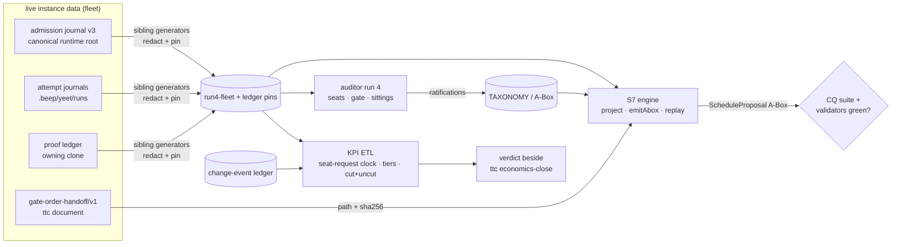

# Brief

<!--
Stage 3. Shaped 2026-10-01 from CAPTURE.md, the Spark, the grilled pipeline v2,
DECISIONS.md and the run-4 intake docket, against main 886de7a261, and confirmed
at the 2026-10-01 graduation sitting. "graduation Ruling n" is Ruling n of the
DECISIONS.md entry "2026-10-01 — graduation sitting (11 rulings, steward:
Benjamin)". Fat-marker fidelity: file cites say where work lands, not how.
-->

## Problem

The packet set out to answer one question with one number. What is the fastest pipeline
from an agent writing code to that agent knowing it passes? The number is the
fleet-aggregated P50/P95 time-to-certainty per verification episode, tier-relative and
epoch-relative (DECISIONS kpi-shape). The baseline was episode P50 41.3 min and P95 3.1 h,
59% red attempts and 17% lock bounces over 27 checkouts
(`research/kpi-baseline-2026-08-27.md`). The packet's answer was to formalize the repo's
verification and backpressure semantics into a reasoned T-Box. A projection over live
instance data would then compute the route.

In five weeks every stage up to the loop-closer was built and ratified:

- **S2:** 26 CQs, 25 executing SPARQL tests and 20 must-fail fixtures.
- **S4/§4b:** 337 candidates and 1,112 normalized observations.
- **S5:** a 52-term TAXONOMY.
- **S6:** the A-Box, 83 predicates at S6 ratification (87 at HEAD after #963/#1089) and
  SHACL shapes.
- **S7:** `apps/labs/ciops`, a byte-deterministic admission projection whose differential
  replay reproduces the deployed scheduler's grant order on a frozen 79-event journal.
- **Auditor runs 1–3:** rat-001..rat-070.

Time-to-certainty spun out of the same KPI and shipped the levers this packet was meant to
derive or attribute: the wave order, proof shadow, detached proofs and death journaling.

Nothing runs the pipeline:

- The projection has only ever seen frozen bytes.
- Its `planEpisode` seam is a stub (`PlannerNotImplementedError`). Time-to-certainty's
  `gate-order-handoff/v1` is offered to it by path and wired to nothing.
- No KPI number obeys the packet's own ETL law. The seat-request clock and tier partitions
  in `kpi-measurement-rules.md` §1–2 are unimplemented, so every published number names the
  rules it skips.
- The change-event ledger stopped at iv-870; iv-929 and iv-1006 land with the graduation PR
  (graduation Ruling 6).
- Run 4 is fully docketed but was gated on a checkbox (time-to-certainty C4) whose
  enforcement half (C4.2) its owner deferred to an event-count sample with no date (that
  packet's ruling 80). Graduation Ruling 1 reads the gate as C4.1, the shadow proof-ledger
  writer checked 2026-09-21, plus ledger facts; only the realization and copy legs wait for
  C4.2.
- The packet held no session between 2026-09-12 and the 2026-10-01 graduation audit while
  main moved 207 commits. Its resume pointers went stale and its routing prose fell behind
  the 2026-09-24 pool doctrine.

The problem is no longer "what is the ontology". It is "who operates it, toward what
finish line". An exploration packet has no completion gate. It can run auditor sittings
indefinitely and never state a KPI verdict, which is the meta-work hazard the letter warns
about (`A_LETTER_FROM_THE_OTHER_SIDE_OF_THE_LOOP.md` at the repo root).

## Appetite

One goal packet, five PR-sized slices, about three weeks of lane time. This is a budget, not
an estimate, and it is defended from the packet's own history:

- Run 2 went from launch grill to merged run in two days with one end-of-run PR.
- Run 3 went from design grill (2026-09-03) to ratified run (2026-09-10) in eight days,
  including two instrumentation PRs and three residue-repair PRs that run 4 does not owe.
- S7 went from design grill to merged engine in two days with two lanes.

Run 4 is one frozen run with one end-of-run PR, budgeted at one week including its Stage C
capture. The cut line is the pin. The pin requires time-to-certainty C4.1 checked and
post-#1321 facts from both local stages in the owning clone's proof ledger (graduation
Ruling 1). If the ledger lacks them, the pin lane records the ledger census and stops; it
never pins without Queue B, and the budget never extends to wait for time-to-certainty
C4.2. Outside the budget are S8, any promotion of the lab into a slice package that
repo-cli or yeet consumes, and auditor runs after run 4. Each is a gated MAP candidate.

## Solution Sketch

### Vocabulary (packet-local)

- **capture pin:** a redacted, digest-pinned snapshot of live journals or ledgers, produced
  by a committed sibling generator (run-3 Rulings 3, 18 and 22). Pins are never edited.
- **projection:** `CiOpsProjection.project` / `emitAbox` in `apps/labs/ciops`, a pure core
  whose instant is an argument and whose emitted Turtle is byte-deterministic.
- **certainty test:** the CQ suite (`research/scripts/run_cq_suite.py`) plus the packet
  validators (`validate_packet.py` base, `--s5`, `--s6`). "100% certainty about classes" =
  CQ regression green (DECISIONS cq-gate).
- **auditor run:** one frozen run of the vendored `ontology-foundational-auditor` skill:
  pin, seats, mechanical gate, sittings, one PR.
- **KPI reading:** a number produced under `kpi-measurement-rules.md` v1.1 (the 2026-10-01
  amendment, §6) that names its rules, window, censorship and change-event partitions.
- **graduation Ruling n:** Ruling n of the 2026-10-01 graduation sitting. Older ruling
  numbers name their series (run-3, S7, time-to-certainty) wherever they could be confused.

### The loop

### Slices (in order)

1. **Inheritance and change events.** The graduation PR scribes the sitting and writes the
   iv-929 (checkout-scoped exclusion) and iv-1006 (B3 cost-ordered fail-fast ladder, with
   #1068 and #1269 as later landing-instant caveats) rows. The goal opens by carrying
   SOURCES forward with a capability table refreshed against HEAD. It then backfills
   `research/control-interventions.yaml` under the change-event admission criterion
   (graduation Ruling 6): a reproducible lever query adds every later lever as an
   observational `OperationalChangeEvent` under adoption-qualified membership. The auditor
   skill v16 seat-launcher amendment is optional hardening (graduation Ruling 4).
2. **Stage C capture.** Produce the `run4-fleet` pin through a NEW sibling generator on the
   run3b ETL mechanics with tree-pinned citation replay (graduation Ruling 8): each
   citation resolves against the manifest's recorded `corpus_tree`, and current-tree
   resolution is advisory. The 2026-10-01 admission-journal snapshot
   (`research/evidence/journal-snapshot-2026-10-01/`: raw payload gitignored, committed
   redacted projection `journal.redacted.ndjson` read by path and sha256) is a Queue D input
   beside the live re-census at the pin; a missing or mismatched projection fails Queue D
   closed. A second NEW sibling generator reads the owning clone's
   `.beep/yeet/proof-ledger.ndjson` (`proofLedgerPathForCheckout`, time-to-certainty
   ruling 71). It maps `originKey` to corpus-local tokens and applies
   run-3 Ruling 11 custody surrogates and run-3 Ruling 22 residue scans. Rotate the run-3
   records byte-identically at the pin.
3. **Projection on live data.** Extend differential replay from the 79-event golden to the
   `run4-fleet` admission chains (v3 enqueued, withdrawn and evicted rows) and report
   first-choice agreement. First amend S7 §3.2/§6 and widen `PlanEpisodeInput` to carry the
   handoff path and sha256 (graduation Ruling 11). Then give `planEpisode` a body: it reads
   `gate-order-handoff/v1` by path and sha256, builds the lane DAG with `effect/Graph` in
   canonical insertion order, fails typed on cycles, and emits lane steps into `ciops-prov:`
   as provisional terms; `schedulesWorkUnit` stays unratified until run 4. No repo-cli
   import; the deployed `QualityScheduler` stays the only writer of real admissions.
4. **Auditor run 4.** One frozen run on the run-3 choreography: pin commit, pushed evidence
   tag, detached worktree, Opus 5.5 seats in independent contexts (graduation Ruling 4),
   gate before the adversary, sittings, scribe, rotation, one PR. Queues A–F come from the
   docket, re-verified at the pin, and Queue F adopts tree-pinned replay (graduation
   Ruling 8). A Queue-G intake row brings `OperationalChangeEvent` and `landedAt` to
   ratification (graduation Ruling 6). CQ-009 is re-scoped at the pin with a new must-fail
   fixture (graduation Ruling 9), and a fourth `AssuranceTier` member for merged preview is
   proposed to the run (graduation Ruling 10).
5. **KPI reading and verdict.** Implement the durable ETL obligations the probe skips:
   - the seat-request clock from v3 `admission-enqueued`;
   - tier partitions, with merged preview reported as a sub-partition of
     `TierLocalFullProof` (graduation Ruling 10);
   - cut and uncut reports with censored counts, starvation beside percentiles, and
     adoption-qualified partitions at every change event.

   State the fleet P50/P95 for a ratified post-baseline window beside time-to-certainty's
   `economics-close.json` M1, with the mapping between the two episode definitions spelled
   out. Improvement is reported, not required (graduation Ruling 3). Close with the S9
   dogfood statement: what the projection says the route should be, and whether the
   deployed route matches.

### What stays with time-to-certainty (its ruling 79)

M1–M5, `yeet economics`, the proof ledger and its C4.2 enforcement flip, the deployed
`gate-order-lexicographic/v1` order and the handoff document's single writer. This goal
reads those surfaces as documents and never edits them.

## Rabbit Holes

- **Two episode definitions.** This KPI opens at seat request, per (checkout, branch) and
  per tier. Time-to-certainty's M1 is red-to-green per branch, reported cut at 24 h and
  uncut. The verdict must state the mapping and never present one as the other.
- **Ledger population.** Before #1321 each lane wrote its own ledger, and that ledger died
  when the lane retired (time-to-certainty receipt 2026-09-24). Only facts written inside a
  clone itself, or written after #1321, survive in the owning clone. Shadow facts are issued,
  not realized. Seats must not read a would-reuse hit as a realized claim.
- **Reading the owning clone from a capture.** The generator must resolve the owning clone
  the way time-to-certainty ruling 71 does, without git. It must not walk sibling lanes'
  `.beep/` trees, and it must not leak run ids that encode host paths.
- **Auditor seat launcher.** Skill v15's recipe launches every primary seat with
  `codex exec`, but validator v15 checks only a non-blank `agents.<role>.model`/`effort`, and
  run 3 already ran a non-Codex seat. Seats, the blinded alternative included, run on Opus
  5.5 in independent contexts; blinding comes from withheld inputs, never from model family.
  The run-4 launch entry records the deviation from the recipe, and Codex or Grok seats run
  only on an operator opt-in named there (graduation Ruling 4). The v16 model-agnostic
  launcher (its own self-test family and new pinned digests) is optional hardening, not a
  prerequisite.
- **Path coupling.** 34 tracked files outside the packet name it
  (`git grep -l beep-ci-operational-ontology`). Eleven sit outside `goals/` and
  `explorations/` (`.gitleaks.toml`, `.gitignore`, `.fallowrc.jsonc`, both Biome configs, the
  lab's tests and scripts, a repo-cli test, two skill files). The other 23 sit under
  `goals/**` and `explorations/turborepo-quality-cache`, including the executable consumer
  `goals/time-to-certainty/research/scripts/economics.py` (`DEFAULT_CORPUS` → `run2-fleet`).
  The ontology tree does not move; the goal owns it by back-link (graduation Ruling 7).
- **Seat-request clock coverage.** v3 `admission-enqueued` exists only from #1025
  (2026-09-09) onward. Windows before it fall back to attempt start under §1, and every
  episode's report must say which clock it used.
- **Planner seam scope creep.** `planEpisode` over a 32-lane handoff is an ordering of
  existing lanes. A cost/red ratio order or a reseed from live economics is a new literal
  that needs its own ruling (time-to-certainty rulings 76–77).
- **Handoff decode drift.** The lab cannot import repo-cli, and time-to-certainty ruling 78
  declined to mirror the handoff schema from its side. `planEpisode` decodes only the subset
  it reads and pins the document's sha256, so any shape drift fails loud.
- **Frozen-pin citation replay is red at HEAD.** The run-3 corpus verify modes and the corpus
  regression suite fail: #1160 refreshed citation lines in three ratified pin MANIFESTs
  without a ruling and was red at merge, later commits moved the cited lines further, and
  #1168/#1239 changed the schemas the regression tests read. A fresh capture on the
  unmodified run3b mechanics fails at `source_cite`. New pins use tree-pinned citation
  replay, resolving each citation against the manifest's recorded `corpus_tree` with
  current-tree resolution advisory, and frozen pins are never edited (graduation Ruling 8).
- **Deployed exclusion moved to the checkout at #929.** Since 2026-08-31 the scheduler skips
  a ticket on a same-checkout lease, a draining legacy same-origin owner, a fresh origin
  stamp, or a saturated review-fix cap (`isTicketSkippable`). Same-origin proofs in distinct
  checkouts are capacity peers; origin exclusion survives only in the legacy drain, the fresh
  stamp and the exclusive fallback lease on hosts below the memory envelope. CQ-009 (no two
  active origin-keyed grants may share an origin) flags legal post-#929 state.
  `scope.md` and `orsd.md` §9 carry the errata, and CQ-009 is re-scoped at the run-4 pin with
  a new must-fail fixture; `cq009-two-grants.ttl` keeps its pre-#929 meaning under a
  temporal scope (graduation Ruling 9). Until that re-scope CQ-009 is not a certainty gate
  over post-#929 admission state: slice 3's live-data runs evaluate it on pre-#929 rows only
  or report it as temporally out of scope, never as a pass or a failure (`scope.md` errata).
- **Run-PR size.** A run PR is too large for Greptile to score (run-2 Ruling 8; Stage B
  Ruling 21 puts the blind spot past 500 files). Merge readiness for the run PR is checks,
  threads and GitHub mergeability.
- **Public-repo residue.** Every new pin runs the residue scans. Ratified pins are repaired
  only under run-3 Ruling 23, and unratified pins are refreshed only under run-3 Ruling 22.
- **Stale ETL prose.** `kpi-measurement-rules.md` §5 still says the admission-transition
  journal is a "candidate repo improvement". The journal and its v3 events ship today, and
  the 2026-10-01 v1.1 amendment (§6) supersedes that bullet, so the slice-5 ETL designs from
  the deployed journal and §6, not the §5 prose.

## No-Gos

- **Never rewrite frozen pins.** `ontology/extraction/**` is byte-immutable. Run-3 Rulings
  22 and 23 are the only repair routes.
- **Never re-run runs 1–3,** §4b, or the S5, S6 and S7 baselines. Run 4 reads their indexes
  through the prior-index chain.
- **S8 stays out unless ruled in.** No IRI scheme, no OWL 2 RL formalization pass, no rules
  compilation, no formal T-Box pass and no `packages/ontology` incubation flow.
  `ciops-iri-formalization` is a gated candidate (run-3 Ruling 15, graduation Ruling 2).
- **No full OWL DL reasoner on the critical path** (launch decision reasoning-stack). It
  remains its own dogfooding goal, outside this one.
- **No scheduler, lock or repo-cli integration.** The projection advises and replays; the
  deployed `QualityScheduler` stays the only admission writer (S7 §6, the time-to-certainty
  GOAL rule). `apps/labs/ciops` stays an `active` lab owned by the goal; promotion is the
  gated `ciops-yeet-projection` candidate (graduation Ruling 5).
- **No proof-reuse enforcement** and no edit to time-to-certainty's tracked artifacts beyond
  dated receipts.
- **No vocabulary ratification outside an auditor run,** and no CQ, seed or fixture edit
  inside run 4 (docket "Not in scope") beyond the CQ-009 re-scope, its new must-fail fixture
  and the `orsd.md` §9 errata fold-in at the pin (graduation Ruling 9).
- **No move of the ontology tree** out of the exploration packet (graduation Ruling 7).
- **No merge queue** (ship-velocity E8 stays the flip condition).
