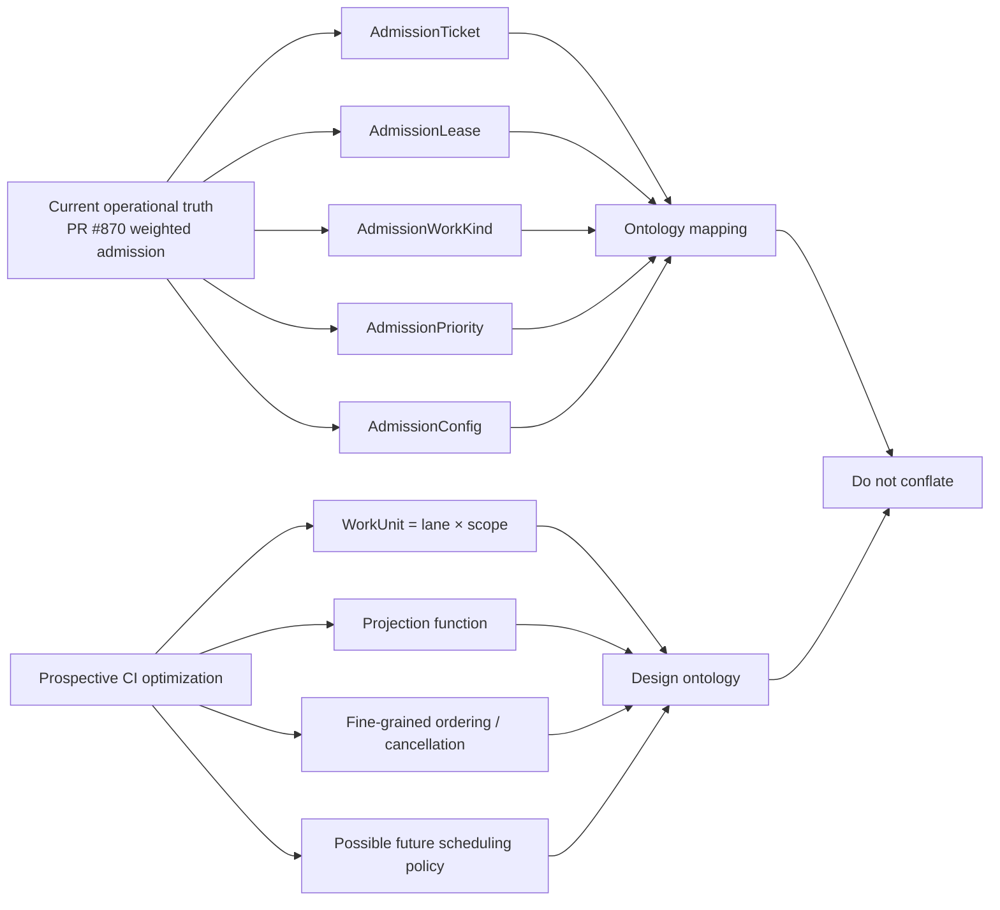
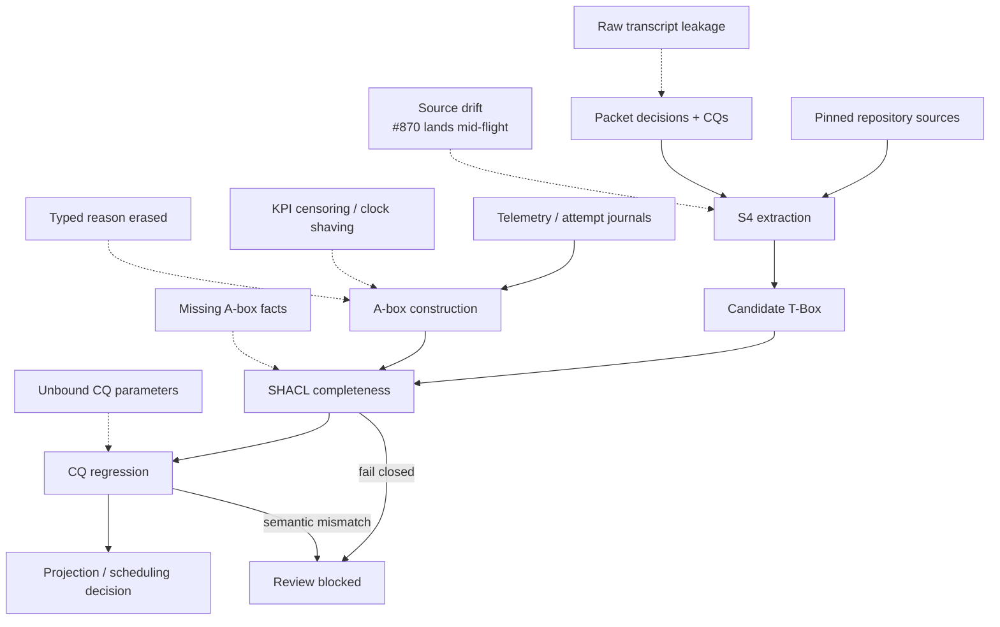
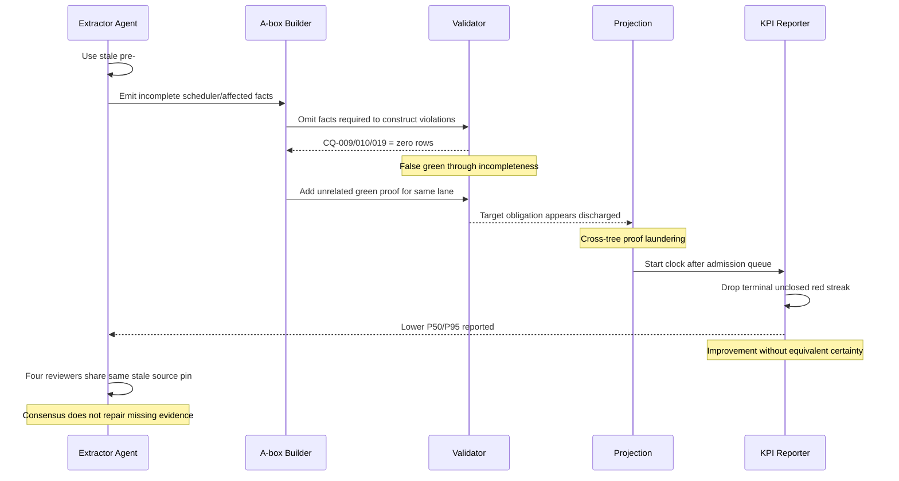
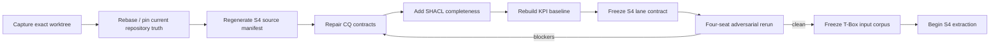

# Round 1 partner review (external, received 2026-08-27)

> Provenance: authored outside this session (operator-supplied, now at
> `~/Downloads/MY_REVIEW.md`); reviewed the MID-FLIGHT packet upload, so several of
> its blockers were already fixed by the round-1 fixer pass before receipt
> (independent convergence). Its runtime/model provenance is unverified. Load-bearing
> external claims verified against the live repo 2026-08-27 — see round1-triage.md
> addendum. Its 'beep-effect/beep-effectexploration' inaccessibility note concerns
> the request it was given, not this packet.

# Beep CI Operational Ontology: Reality-Grounded Audit and Adversarial Review

## Executive summary

**Overall verdict: do not freeze or promote the packet into S4 formal T-Box extraction in its present state.** The packet contains substantial good research and several unusually strong internal review findings, but the evidence base changed materially while the packet was in flight. The most important external fact is that the repository URL supplied in the request, `beep-effect/beep-effectexploration`, is not resolvable through the authenticated GitHub connection and is not among the organization’s public repositories. The repository that actually contains every referenced path, Yeet implementation, goals, and scheduler work is `beep-effect/beep-effect`. GitHub’s public organization page currently exposes `beep-effect` and `awesome_repositories`, not `beep-effectexploration`. citeturn3search1turn3search0

The authenticated repository is currently at least as new as commit `debbbb51f77ae10015788dec0b819f12b96c3552`, the merge commit for PR #870. PR #870 merged on **August 27, 2026 at 19:52:03 UTC** and introduced a machine-wide weighted admission scheduler: durable tickets and leases, weighted memory capacity, publish priority with aging, review-fix concurrency caps, per-origin lock coordination, heartbeat/reaping, quarantine, and operator status/reap commands. fileciteturn5file0L468-L475 fileciteturn15file0L3-L7 The accompanying design record explicitly says promotion uses effective priority plus enqueue time/PID/nonce and capacity-fitting FIFO behavior; it is **not deficit round robin**. fileciteturn8file0

That creates the dominant audit finding: **the packet is reasoning partly from a pre-#870 operational world while simultaneously proposing/criticizing DRR semantics as though they were the current scheduler truth.** The packet's review Seat D is correct that the packet's proposed DRR mechanism is not queryable through its CQs, but after #870 there is a second and more fundamental question: whether DRR is supposed to describe current reality at all. Current code models `AdmissionWorkKind`, `AdmissionPriority`, durable `YeetAdmissionTicket` and `YeetAdmissionLease`, and explicit capacity-policy parameters. Those concepts are now primary operational facts and therefore must enter the source corpus before a reality-grounded T-Box can be frozen. fileciteturn7file0

The packet itself is accessible only as the uploaded mid-flight artifact, not as a corresponding committed Git branch or PR. It says S3 research is complete and S4 formal-first extraction is next; it records a four-seat pre-S4 review loop and the requested high-effort Codex/Grok settings. I can audit the resulting review artifacts, but **I cannot independently prove which model actually produced any given review or reconstruct the uncommitted working tree's exact branch, HEAD, index, ignore state, or filesystem state from GitHub**. Those remain explicit assumptions rather than facts. fileciteturn0file0

Two parallel conclusions follow.

| Dimension | Analysis A — strict factual audit | Analysis B — very-strong adversary |
|---|---|---|
| Primary failure mode | Source/ontology drift plus internally inconsistent acceptance artifacts | Produce a formally green packet that is semantically false or operationally useless |
| Highest-severity finding | #870 changed the operational scheduler while the ontology packet remained in flight | Missing facts can make zero-row SPARQL constraints pass vacuously |
| CQ assessment | Multiple Must CQs do not answer their stated question | Unbound variables and absent A-box completeness let unrelated proofs or omitted facts launder correctness |
| KPI assessment | Baseline is not reproducible as the claimed fleet population and mishandles censoring | Clock shaving, right-censor suppression, tier downgrade, and omitted queue wait can manufacture KPI gains |
| Fail-open assessment | CQ-019 combines two incompatible questions and current Yeet discards affected-reason detail downstream | Full-scope safe fail-open can be rejected while an unsafe filtered schedule remains invisible |
| Scheduler assessment | Separate current weighted-admission policy from prospective WorkUnit scheduling research | An agent can freeze aspirational DRR vocabulary as “reality” or omit the actual #870 policy surface |
| S4 readiness | **Blocked** | **Blocked; easy to obtain a false green without additional completeness gates** |
| Recommended first move | Pin/rebase source state and rerun the pre-S4 review against current main | Build negative/metamorphic fixtures designed to make the suite fail when facts are omitted |

The packet's existing review should not be discarded. Seat A accurately identified CQ answerability defects; Seat B found cross-artifact coherence and admission-law issues; Seat C found serious KPI and reproducibility defects; Seat D found several powerful semantic attacks, including vacuous zero-row success and the malformed fail-open invariant. fileciteturn0file0 The correct move is to **rebase that review onto current operational reality rather than merely patch its current blockers**.

My confidence is **very high** on the current-repository drift, CQ defects visible in the packet, KPI-probe defects, and the missing S4 lane contract. Confidence is **moderate** on the exact current uncommitted packet state because there is no Git worktree snapshot, commit pin, or staged/untracked inventory accompanying the uploaded artifact.

## Scope, evidence, and assumptions

The factual scope is deliberately divided into three layers.

**Repository truth.** `beep-effect/beep-effect` is the current public monorepo containing the packet's referenced Yeet, Turbo, quality-scheduler, and goals paths. Its README describes an Effect-first/schema-first monorepo, and the current tooling guidance includes `bun run beep yeet verify` and the Codex quality-review loop. citeturn3search0 The specific repository supplied in the request was not available to the authenticated GitHub connector, while the main repository was available with repository access. The public organization listing independently corroborates that there is no public repository of the requested name. citeturn3search1

**Packet truth.** The uploaded artifact contains the mid-flight packet's documentation, CQs, SPARQL fixtures, manifest, KPI probe, research outputs, and pre-S4 review seats. It is the best available source for uncommitted content, but it is not a Git commit and therefore cannot itself prove current index/working-tree status. fileciteturn0file0

**External change during the packet.** PR #870 is a particularly important source because it landed on the same date as the packet and explicitly changes the lock/admission behavior that the packet is trying to model. The PR merged with 18 changed files, 4,927 additions, and 424 deletions. fileciteturn5file0L468-L475 Its design record names the new production entities and policy behavior, while its merge commit records the post-review hardening. fileciteturn8file0 fileciteturn15file0L3-L7

The following assumptions constrain every conclusion in this report:

| Assumption / unknown | What is known | Consequence |
|---|---|---|
| Exact packet branch | Not supplied | I do not claim the packet is based on a particular branch. |
| Packet base commit | Not supplied | #870 drift is proven relative to current main, but the precise divergence point is unknown. |
| Working-tree status | Unavailable through GitHub | I cannot distinguish staged, unstaged, ignored, or untracked packet files from the uploaded rendering alone. |
| Exact public/private status of `beep-effectexploration` | Authenticated GitHub lookup returned not found; public org list does not show it | I treat the requested repo as inaccessible/nonexistent from the available credentials, not as proof it could never exist elsewhere. citeturn3search1 |
| Packet reviewer model provenance | Packet says three GPT-5.6 Sol/max Codex seats and one Grok 4.6/xhigh seat | I audit the artifacts, not the truth of those runtime/model labels. fileciteturn0file0 |
| Local `.beep` fleet telemetry | Only excerpts/derived results in packet | Fleet numbers are packet claims unless Seat C independently reproduced them from sampled artifacts. fileciteturn0file0 |
| GitHub/CI historical population | Not exhaustively reconstructed here | No claim that the packet's 27-checkout fleet totals are complete. |
| Raw local transcript | Present in the uploaded packet representation and described as ignored/local | It is treated as potentially sensitive local material that must not accidentally cross the commit boundary. fileciteturn0file0 |
| Future DRR scheduler | Described in packet research/use cases | It must be labeled prospective architecture unless independently tied to a current implementation/accepted goal. |
| Current weighted scheduler | Landed in #870 | It must be represented as current operational truth if scheduling/admission is in ontology scope. fileciteturn8file0 |

A further packet-state inconsistency is worth making explicit: the packet says a `ScheduleProposal`/schedule-as-A-box amendment remains to be ruled on, while its manifest reports `openQuestions: []`. Because the packet's own governance says unresolved questions belong in the manifest, that is a control-plane defect, not just prose drift. fileciteturn0file0 It also matters directly to CQ-019: without a first-class schedule individual, the stated requirement “no proof **or schedule** may trust a fail-open affected result” is impossible to express faithfully.

The repository now gives a clean distinction that the ontology should preserve:



Current source makes that distinction concrete. `QualityScheduler.schemas.ts` defines `AdmissionWorkKind` as `full-proof | merged-preview | review-fix | publish`, `AdmissionPriority` as `publish | verify`, explicit ticket/lease schemas, and policy defaults including slot size, reserve, capacity, hard floor, heartbeat, aging, and review-fix class cap. fileciteturn7file0 The design record says current ordering is effective priority, enqueue time, PID, nonce, with capacity/FIFO and origin/class-cap skipping—not DRR. fileciteturn8file0

## Analysis A — strict factual audit and remediation

**Executive assessment.** The packet has enough high-quality research to continue, but not enough coherence or source pinning to freeze. The appropriate status is **research/review active, S4 blocked**. Its best feature is that its own review loop has already surfaced many of the blockers. Its worst feature is that those blockers are being reviewed against a moving operational target.

### Factual findings

| Finding | Severity | File/commit evidence | Impact | Confidence | Remediation complexity |
|---|---|---|---|---|---|
| **A1 — Current scheduler truth changed during packet review** | Blocker | PR #870 / commit `debbbb…`; `QualityScheduler.schemas.ts`; D1 design record. fileciteturn5file0L468-L475 fileciteturn7file0 | S4 could freeze obsolete scheduler concepts and false implementation claims. | Very high | Medium |
| **A2 — CQ suite is not answer-equivalent to its natural-language contract** | Blocker | Seat A: CQ-004/006/007/011/012/013/014/015/016/017/019. fileciteturn0file0 | A green SPARQL suite does not establish the ontology answers its Must questions. | Very high | Medium-high |
| **A3 — Current scheduler and proposed DRR model are conflated** | Blocker | UC-002 says DRR; current D1 design uses effective priority/FIFO/capacity. fileciteturn0file0 fileciteturn8file0 | Ontology becomes prescriptive fiction rather than descriptive operational model. | Very high | Medium |
| **A4 — CQ-019 encodes the wrong fail-open invariant** | Blocker | Seat A/D; current query links a proof to a fail-open computation but does not model the emitted schedule. fileciteturn0file0 | Safe full-scope remapping can fail while unsafe filtered scheduling can remain invisible. | Very high | Medium |
| **A5 — Affected-query reason is discarded by current Yeet mapping** | High | `TurboQuery.ts` decodes `reason.__typename` on an affected task but converts it to `TurboPlanTask` without preserving the reason; affected collection runs only for repair. fileciteturn3file0 | Ontology/A-box ingestion cannot reliably distinguish typed fail-open causes if it consumes the plan snapshot rather than raw Turbo output. | High | Medium |
| **A6 — KPI baseline is structurally incomplete and non-reproducible as the fleet claim** | Blocker | Seat C: retained journal window, right-censored red streaks, fleet calculation absent from supplied script, unversioned lock-message classification, percentile ambiguity. fileciteturn0file0 | Baseline can systematically understate time-to-certainty and cannot serve as rigorous intervention evidence. | Very high | High |
| **A7 — S4 extraction lane contract is not reproducible** | Blocker | Seat C identifies no exact source manifest, frozen T-Box digest, prompt binding contract, output schema, provenance schema, normalization/merge rules, or completion/retry semantics. fileciteturn0file0 | Four strong agents can still generate irreconcilable candidate ontologies. | Very high | Medium |
| **A8 — Zero-row constraints lack completeness preconditions** | Blocker | Seat D on CQ-009/010/019. fileciteturn0file0 | Missing A-box facts make violations disappear instead of fail. | Very high | Medium |
| **A9 — Traceability and governance artifacts drift from each other** | High | Seat B identifies stale/missing CQ references and matrix omissions; manifest also says no open questions while schedule representation awaits a ruling. fileciteturn0file0 | Admission-law checks become documentary rather than executable. | High | Low-medium |
| **A10 — Hash-surface modeling is important but must be derived from current Turbo configuration** | High | `turbo.json` declares `package.json`, root TS configs, runtime-version files as global inputs and enables `affectedUsingTaskInputs`, `filterUsingTasks`, and `globalConfiguration`. fileciteturn9file0 | An ontology that reasons only over package dependency closure will make unsound skip decisions. | Very high | Medium |
| **A11 — Local raw-capture boundary needs an executable guard** | High | Uploaded packet contains `prose/pre-packet-transcript` material while describing local capture/ignore behavior. fileciteturn0file0 | A force-add, ignore-rule change, or agent-generated citation could publish local paths/session material. | High | Low |

A1 is the gating finding. PR #870 did more than tune an implementation detail. It changed the operational state machine from “other full proof owns the coordinator → fail/bounce” toward durable queueing and weighted admission. The merge commit explicitly says contenders queue instead of failing fast, with the v3 origin lock retained underneath. fileciteturn15file0L3-L7 This also means the packet's observed **17% historical lock-bounce rate should now be represented as pre-intervention evidence**, not timeless current behavior. PR #870 is almost tailor-made for the packet's `ControlIntervention` concept: pin the intervention to commit `debbbb…`, split measurement epochs around the landing, and observe whether queue wait replaces bounce churn. The PR merge occurred at 2026-08-27T19:52:03Z. fileciteturn5file0L468-L475

A5 is particularly concrete. Current `TurboQuery.ts` has a typed `TurboQueryAffectedReason` containing `__typename`; affected tasks can therefore carry a reason. But `turboPlanTaskFromAffectedTask` constructs a `TurboPlanTask` from `fullName`, package, name, and optional path and omits that reason. The collector also only invokes the affected-task query for `repair` mode. fileciteturn3file0 Thus CQ-019 cannot safely assume the Yeet plan snapshot already preserves the diagnostic fact required to distinguish a typed fail-open from a normal affected result.

A10 is equally important for skip licensing. Current `turbo.json` makes root `package.json`, `.bun-version`, `.nvmrc`, and multiple root TypeScript configurations global task inputs, while task-specific inputs introduce further hash surfaces. fileciteturn9file0 Therefore a “package is not in dependency closure” inference is insufficient to license a skip; the proof identity needs to account for the task's declared input/hash surface or a primary-source Turbo affected computation.

### Factual remediation

The first patch is conceptual: **make current implementation policy data, not ontology constitution**.

```diff
--- a/ontology/docs/use-cases.yaml
+++ b/ontology/docs/use-cases.yaml
@@
- goal: >
-   Drain per-agent queues fairly using deficit round robin by cost,
-   without starvation.
+ goal: >
+   Admit and order runnable requests according to the active AdmissionPolicy,
+   while respecting machine capacity, checkout/origin exclusion, and
+   starvation bounds declared by that policy.

@@
- success:
-   - "Scheduler drains per-agent queues fairly (deficit round-robin by cost)."
+ success:
+   - "Every scheduling decision records the AdmissionPolicy that selected it."
+   - "Current-runtime policy facts are derived from the pinned repository revision."
+   - "Prospective policies such as deficit-round-robin are modeled separately
+      from the deployed policy until implemented."
```

Then instantiate the deployed policy as A-box/configuration facts rather than pretending it is the universal scheduling law:

```turtle
ciops:YeetWeightedAdmissionV1 a ciops:AdmissionPolicy ;
    ciops:sourceCommit "debbbb51f77ae10015788dec0b819f12b96c3552" ;
    ciops:slotSizeGiB 5 ;
    ciops:reserveGiB 10 ;
    ciops:capacityMaxTokens 10 ;
    ciops:hardFloorGiB 15 ;
    ciops:publishAgingSeconds 120 ;
    ciops:reviewFixClassCap 3 .
```

Those parameters are directly represented by current source. fileciteturn7file0

For CQ-019, split inventory from invariant and ratify a schedule representation first:

```diff
- id: CQ-019
- natural_language: >
-   Which affected-set computations completed fail-open ... and is any proof
-   or schedule trusting a fail-open affected set?
- expected_result: zero_rows
+ id: CQ-019A
+ natural_language: >
+   Which affected-set computations completed with a typed fail-open outcome,
+   and what full-scope remapping was emitted?
+ priority: must_have
+
+ id: CQ-019B
+ natural_language: >
+   Is any Proof or ScheduleProposal narrower than FullRepoScope when its
+   scope was derived from a fail-open AffectedComputation?
+ priority: must_have
+ expected_result: zero_rows
```

The corresponding negative constraint should target **narrow scope after fail-open**, not mere association with fail-open:

```sparql
SELECT ?subject ?computation ?scope WHERE {
  ?computation a ciops:AffectedComputation ;
               ciops:hasAffectedOutcome ?outcome .
  ?outcome a ciops:FailOpenOutcome .

  ?subject ciops:scopedByComputation ?computation ;
           ciops:hasScope ?scope .

  FILTER (?scope != ciops:FullRepoScope)
}
```

That fixes both Seat A's “inventory and constraint are mixed” finding and Seat D's deeper observation that the existing law rejects honest full-scope recovery while failing to see a schedule with no linkage. fileciteturn0file0

For CQ-007, the natural-language decomposition and query need to be identical:

```diff
- SELECT ?ep ?total ?lock ?exec ?repair ?ci WHERE {
+ SELECT ?ep ?total ?queue ?lock ?exec ?repair ?ci WHERE {
    ?ep ciops:timeToCertaintyMs ?total ;
+       ciops:queueWaitMs ?queue ;
        ciops:lockWaitMs ?lock ;
        ciops:executionMs ?exec ;
        ciops:repairGapMs ?repair ;
        ciops:ciWaitMs ?ci .
  }
```

Because #870 now creates real durable queueing, `queueWaitMs` is no longer hypothetical bookkeeping; it is a first-class post-intervention phase that should be observable. fileciteturn8file0

For the affected reason, either ingest raw Turbo query results or preserve the reason through Yeet. A minimal implementation direction is:

```diff
 export class TurboPlanTask extends S.Class<TurboPlanTask>(...)({
   taskId: S.String,
   packageName: S.String,
   task: S.String,
   packagePath: S.optionalKey(S.String),
+  affectedReason: S.optionalKey(S.String),
 }) {}

@@
 return TurboPlanTask.make({
   taskId: task.fullName,
   packageName: task.package.name,
   task: task.name,
   ...(O.isSome(packagePath) ? { packagePath: packagePath.value } : {}),
+  ...(task.reason !== undefined
+    ? { affectedReason: task.reason.__typename }
+    : {}),
 })
```

That diff is deliberately schematic because `TurboPlanTask`'s declaring schema should be edited at its actual primary-source definition, not patched blindly from the adapter alone. The factual need for preservation is supported by the current adapter behavior. fileciteturn3file0

The S4 lane must also acquire a machine-readable manifest before another four-agent pass:

```yaml
schemaVersion: ciops-s4-extraction/v1
repository:
  fullName: beep-effect/beep-effect
  commit: debbbb51f77ae10015788dec0b819f12b96c3552

tbox:
  path: ontology/tbox/ci-ops.ttl
  schemaVersion: ciops-tbox/v0
  sha256: "<required>"

inputs:
  - id: yeet-scheduler-schema
    path: packages/tooling/tool/cli/src/internal/repo-run/QualityScheduler.schemas.ts
    sha256: "<required>"
  - id: turbo-query
    path: packages/tooling/tool/cli/src/commands/Yeet/internal/TurboQuery.ts
    sha256: "<required>"
  - id: turbo-config
    path: turbo.json
    sha256: "<required>"

extractor:
  promptVersion: s4-formal-first/v1
  promptSha256: "<required>"
  outputSchemaVersion: ciops-candidate/v1

candidateRequiredFields:
  - localName
  - kind
  - definition
  - cqIds
  - decisionMechanism
  - sourcePath
  - sourceLineStart
  - sourceLineEnd
  - sourceCommit
  - rationale
  - status
```

The important part is not this exact YAML vocabulary; it is making every ambiguity Seat C identified impossible by construction. fileciteturn0file0

### Factual risk and tests

The strict threat model is not primarily an external-security threat model. The assets at risk are **semantic correctness, proof licensing, scheduler safety, KPI integrity, and review reproducibility**.



The minimum CI suite before S4 should include:

| Check | Regression it detects | Required failure fixture |
|---|---|---|
| `packet-source-pin` | Review corpus silently diverges from current repo | Change HEAD without updating manifest digest |
| `scheduler-schema-sync` | Current `AdmissionWorkKind`/priority/config changes but ontology remains stale | Add a temporary new work kind in fixture |
| `cq-parameter-binding` | “Given X” CQ uses unbound X | CQ-015-style unbound `ASK` |
| `cq-answer-shape` | Sample-answer fields cannot be produced by query projection | CQ-013's `earliestLane` mismatch |
| `a-box-completeness` | Zero-row constraint passes because required facts are absent | Remove `hasBudget` from an admitted WorkUnit |
| `fail-open-full-scope` | Fail-open licenses affected/filter scope | Fail-open computation + `AffectedScope` schedule |
| `safe-fail-open-accepted` | Correct full-scope remap is falsely rejected | Fail-open computation + `FullRepoScope` |
| `proof-provenance` | Out-of-scope or unrelated proof discharges obligations | IDE-like proof with no in-scope lane execution |
| `tree-epoch-isolation` | Proof from another branch/tree/epoch suppresses obligation | Add unrelated green proof and assert result unchanged |
| `kpi-censoring` | Unclosed red streak disappears | Red streak with no terminal green |
| `kpi-queue-clock` | Queue delay excluded from episode | Ticket enqueued before first proof attempt |
| `kpi-tier-stratification` | Repair/local-full/CI values are mixed | Same branch with three target tiers |
| `journal-schema` | Malformed/wrong-version events become valid red attempts | Wrong schemaVersion fixture |
| `journal-attempt-dedupe` | Duplicate finish double-counts | Two finishes with same `attemptId` |
| `redaction-boundary` | Local transcript/session material can be committed | Fixture containing `/home/...`, transcript path, `.jsonl` capture |
| `projection-determinism` | Same inputs produce different schedule | Re-run identical T/A/live fixture twice |

For the KPI specifically, the packet should stop treating incomplete red streaks as nonexistent. Seat C shows that terminal red runs can be right-censored and that the attempt journal retains a bounded window rather than unlimited append-only history. fileciteturn0file0 At minimum report closed episodes and right-censored episodes separately. A stronger statistical treatment is a survival estimate of time-to-certainty; if the project insists on ordinary P50/P95 over closed episodes, it should publish the censoring rate beside them and prohibit interpreting the quantiles as the fleet's uncensored distribution.

## Analysis B — simulated very-strong adversary

**Executive assessment.** A strong adversary does not need to break the ontology engine. It can win by giving the engine incomplete or weakly correlated facts while satisfying the literal tests. The packet is currently especially vulnerable to **vacuous truth, cross-context proof laundering, metric-boundary manipulation, source staleness, and governance ambiguity**. Those attacks remain strictly reality-grounded because they are constructed from the packet's actual SPARQL patterns, probe behavior, and current repository semantics. fileciteturn0file0

This is not a claim that any of the named review agents acted maliciously. It is a simulation of what the strongest skeptical reviewer should attempt.

### Adversarial findings

| Attack | Detection path | Exploit | Impact | Confidence | Remediation complexity |
|---|---|---|---|---|---|
| **B1 — Vacuous-green A-box** | CQ-009/010/019 | Omit the triple required for the violating row to exist | Safety constraint says green with incomplete reality | Very high | Medium |
| **B2 — Cross-tree proof laundering** | CQ-006 | Supply a proof for same lane but unrelated branch/tree/epoch | Required obligation disappears | Very high | Medium |
| **B3 — Fail-open schedule laundering** | CQ-019 | Emit a filtered schedule but do not link it through `scopedByComputation`; no proof exists yet | Unsafe affected-set trust passes | Very high | Medium |
| **B4 — Safe-remap denial** | CQ-019 | Correctly map fail-open → full scope and link proof to computation | Current zero-row law can classify valid recovery as violation | Very high | Low-medium |
| **B5 — KPI clock shaving** | CQ-007 + baseline | Start episode at first attempt rather than queue request | #870 queue delay disappears from KPI | Very high | Medium |
| **B6 — Right-censor suppression** | KPI probe | Never close a long red streak with green; current probe omits it from episode quantiles | P95 improves as worst episodes disappear | Very high | High |
| **B7 — Tier laundering** | KPI aggregation | Target/report repair green instead of local-full or CI-merge | “Time-to-certainty” gets faster without equivalent assurance | High | Medium |
| **B8 — Stale-source poisoning** | S4 corpus | Freeze pre-#870 scheduler language as truth | T-Box becomes confidently wrong on admission semantics | Very high | Low to detect, medium to fix |
| **B9 — Prospective-policy laundering** | UC-002 | Represent planned DRR as current runtime semantics | Design intent masquerades as observed implementation | Very high | Medium |
| **B10 — Reason erasure** | `TurboQuery.ts` adapter | Consume only `TurboPlanTask`; fail-open reason has already been dropped | Distinct operational outcomes collapse into same A-box state | High | Medium |
| **B11 — Cache-transfer overclaim** | CQ-015 | Prove only same cache + epoch; omit exact task-input/hash equivalence | One checkout's green licenses unsafe skip | High | High |
| **B12 — Review-consensus illusion** | Four-seat process | All reviewers share stale corpus or same missing fact | Four agreeing agents increase confidence without increasing truth | High | Low-medium |

B1 is the strongest general attack. A SPARQL query with `expected_result: zero_rows` only proves “no violating row can be constructed from asserted facts.” It does **not** prove the data is complete enough for a violation to have been discoverable. Seat D correctly identifies this for CQ-009, CQ-010, and CQ-019. fileciteturn0file0

An adversarial A-box can therefore make all three green:

```turtle
# Intentionally incomplete and therefore dangerous.

ciops:wu17 a ciops:WorkUnit .
# omit ciops:hasCostEstimate

ciops:grant17 a ciops:SeatGrant .
# omit ciops:hasBudget

ciops:affected17 a ciops:AffectedComputation .
# omit ciops:hasAffectedOutcome

# No constraint query has enough information to construct a violation.
```

The correct defense is **shape validation before constraint validation**:

```turtle
ciops:AdmittedWorkUnitCompletenessShape
    a sh:NodeShape ;
    sh:targetClass ciops:AdmittedWorkUnit ;
    sh:property [
        sh:path ciops:hasCostEstimate ;
        sh:minCount 1 ;
        sh:maxCount 1
    ] ;
    sh:property [
        sh:path ciops:admittedBy ;
        sh:minCount 1 ;
        sh:maxCount 1
    ] .

ciops:AffectedScopedSubjectCompletenessShape
    a sh:NodeShape ;
    sh:targetSubjectsOf ciops:scopedByComputation ;
    sh:property [
        sh:path ciops:scopedByComputation ;
        sh:minCount 1
    ] .
```

A stronger metamorphic test is more valuable than another happy-path sample: **delete each supposedly required fact one at a time and assert validation becomes red**. If deletion makes the invariant remain green, the test is not proving the law.

B2 exploits CQ-006's correlation defect. Seat A notes that the query's negation is effectively correlated by lane, while branch/head/tree/epoch are not all bound into the target obligation. fileciteturn0file0 The adversary adds an unrelated green proof for the lane, and a supposedly required WorkUnit vanishes. The invariant should instead behave monotonically with respect to unrelated proof insertion: adding a proof from another tree, epoch, checkout, or branch must not alter the obligations of the target episode.

B3/B4 are the strongest semantic attack pair because they demonstrate **both a false negative and a false positive**. The current fail-open rule can miss an unsafe future schedule that has no `scopedByComputation` relation, while rejecting an honest proof associated with a fail-open computation even after the scheduler safely expands it to full scope. fileciteturn0file0 This is a sign that CQ-019 is not merely under-tested; it encodes the wrong predicate.

B5 is newly amplified by current repository reality. #870 explicitly creates queue tickets and persistent waiting rather than immediately bouncing contenders. fileciteturn8file0 An agent optimizing the KPI could start the “verification episode” when actual execution begins and report excellent proof latency while users spend significant time in the admission queue. A robust metric must anchor episode start at a semantically fixed event—ideally the request/decision point relevant to the human/agent waiting for certainty—and expose queue time as a decomposition component.

B6 is an especially severe statistical attack. Seat C found that the probe only closes an episode when a later success arrives; a final red streak is not flushed as a censored observation. It also found that the journal is retention-bounded, despite the baseline prose calling it append-only history. fileciteturn0file0 The “adversary” need not falsify any event: the most expensive failure simply never reaches the denominator.

B9 attacks ontology epistemology rather than code. Current source says the deployed scheduler is weighted admission with effective-priority ordering and aging. fileciteturn7file0 fileciteturn8file0 The packet says UC-002 drains per-agent queues using DRR. fileciteturn0file0 A strong adversary asks one question: **“Show the commit that makes DRR current runtime behavior.”** Absent that evidence, DRR must remain a prospective policy/design hypothesis, not a current-runtime T-Box fact.

B10 exploits a real information-loss boundary. The raw Turbo affected schema knows an affected `reason`, but Yeet's conversion to plan task does not preserve it. fileciteturn3file0 An ontology ingest built at the wrong abstraction layer can therefore produce a perfectly valid but semantically impoverished A-box. The adversary does not need to forge evidence; it merely chooses the lossy adapter as the source of truth.

B11 attacks CQ-015's proposed green-skip license. Current `turbo.json` demonstrates that task validity depends on global and task-specific input/hash surfaces, not just an abstract cache object and epoch. fileciteturn9file0 Therefore “same epoch + same shared cache” is at best necessary context, not a complete proof of transferability. The transfer proof should include either the exact Turbo task hash/input fingerprint or a first-class equivalence relation whose derivation is grounded in Turbo's declared inputs.

### Adversarial attack workflow



The adversarial remediation principle is consequently stronger than “add more review.” It is **make bad states executable fixtures**. Each law should have at least one minimal counterexample that was known to pass before the fix and must fail afterward.

For example:

```ts
describe("fail-open scope law", () => {
  it("rejects affected scope after a fail-open computation", () => {
    const graph = fixture({
      affectedOutcome: "git-ref-missing",
      emittedScope: "AffectedScope"
    })
    expect(validate(graph)).toContainViolation("CQ-019B")
  })

  it("accepts full-repo fallback after the same fail-open computation", () => {
    const graph = fixture({
      affectedOutcome: "git-ref-missing",
      emittedScope: "FullRepoScope"
    })
    expect(validate(graph)).not.toContainViolation("CQ-019B")
  })

  it("fails completeness when the affected outcome is omitted", () => {
    const graph = fixture({
      emittedScope: "AffectedScope"
    })
    expect(validate(graph)).toContainViolation("AffectedComputationCompleteness")
  })
})
```

And for proof laundering:

```ts
it("unrelated proof cannot discharge target-tree obligation", () => {
  const before = remainingObligations(targetEpisode)

  addProof({
    lane: "check",
    branch: "unrelated-branch",
    treeDigest: "different-tree",
    epoch: "different-epoch"
  })

  expect(remainingObligations(targetEpisode)).toEqual(before)
})
```

Those tests are more valuable than increasing the reviewer-agent count because they mechanically prevent the exact semantic attacks the reviewers have already discovered.

## Cross-analysis comparison and priority decisions

The two analyses converge strongly on what must happen first, but for different reasons.

| Issue | Audit detection | Adversary detection | Impact if ignored | Audit confidence | Adversary confidence | Fix complexity |
|---|---|---|---|---|---|---|
| Source pin / #870 rebase | Current main contradicts packet scheduler assumptions | Feed stale but internally coherent corpus to every reviewer | Critical: false T-Box | Very high | Very high | Medium |
| CQ answerability | Natural language ≠ SPARQL outputs/bindings | Exploit unbound variables and unrelated data | Critical: false proof of coverage | Very high | Very high | Medium-high |
| A-box completeness | Constraint assumes missing facts will exist | Omit facts and get zero rows | Critical: invariant laundering | Very high | Very high | Medium |
| CQ-019 | Mixed inventory + constraint; no schedule model | Unsafe schedule invisible; safe fallback rejected | Critical: incorrect fail-open policy | Very high | Very high | Medium |
| Current vs prospective scheduler | DRR prose differs from shipped policy | Present future design as current fact | High-critical | Very high | Very high | Medium |
| KPI measurement | Incomplete/reproducibility defects | Censor worst runs, shave queue clock, downgrade tier | Critical for evaluation validity | Very high | Very high | High |
| Affected reason preservation | Adapter drops reason | Choose lossy source boundary | High | High | High | Medium |
| Cache transfer | Abstract cache/epoch relation underspecified | License skip without complete task-input equivalence | High-critical | High | High | High |
| S4 lane contract | Outputs/provenance/merge behavior underspecified | Reviewer disagreement hidden by manual reconciliation | High | Very high | High | Medium |
| Raw capture boundary | Local transcript present in packet workspace | Reviewer quotes/local data cross commit boundary | High confidentiality/reputation risk | High | High | Low |
| Multi-agent review independence | Four seats exist | Shared omission becomes four-way consensus | Medium-high | Moderate-high | High | Low-medium |

A subtle but important correction to the existing adversarial panel follows from #870: **Seat D's “DRR next-pick is unqueryable” finding remains valid against the packet's proposed DRR design, but it is no longer sufficient as the runtime critique.** The deployed scheduler has a different decision surface altogether. Its T-Box/A-box mapping should cover at least:

`AdmissionPolicy → AdmissionWorkKind → AdmissionPriority → AdmissionTicket → AdmissionLease → capacity/resource snapshot → origin coordination → admission/release outcome`.

The current schemas directly expose the first four/five of those structures. fileciteturn7file0 The D1 design record also gives exact operational semantics, including mixed-version origin blocking, capacity fitting, rollback, reaping, hard-floor behavior, and follow-up work. fileciteturn8file0

That does **not** mean the ontology should become an exact transcription of `QualityScheduler.ts`. A robust model should separate stable semantic concepts from implementation knobs:

| Stable ontology concept | Current #870 implementation mapping | Prospective alternative |
|---|---|---|
| `AdmissionRequest` | `YeetAdmissionTicket` | Future fine-grained WorkUnit request |
| `AdmissionGrant` | `YeetAdmissionLease` | DRR/other grant |
| `AdmissionPolicy` | Weighted-admission v1 | DRR, adaptive policy |
| `ResourceDemand` | `weightTokens` | Estimated machine-ms/RSS/etc. |
| `AdmissionPriority` | publish / verify | Other policy-specific classes |
| `WaitState` | durable queue ticket | Agent-level ready queue |
| `ContentionResource` | memory capacity + origin gate | CPU/cache/hot-path resource |
| `SelectionReason` | priority/FIFO/capacity/origin/class-cap | deficit/quantum/etc. |
| `WorkScope` | heavy proof category presently | lane × affected/filter/shard scope prospectively |

This lets the ontology remain stable if D2/D3 or a future DRR scheduler lands, while still telling the truth about what exists today.

A similar separation is necessary for the KPI. Treat PR #870 as a real `ControlIntervention` and create explicit epochs:

```turtle
ciops:SchedulerD1Landing a ciops:ControlIntervention ;
    ciops:sourceCommit "debbbb51f77ae10015788dec0b819f12b96c3552" ;
    ciops:landedAt "2026-08-27T19:52:03Z"^^xsd:dateTime ;
    ciops:changesMechanism ciops:AdmissionPolicy .

ciops:PreSchedulerD1Epoch
    ciops:endsAt "2026-08-27T19:52:03Z"^^xsd:dateTime .

ciops:PostSchedulerD1Epoch
    ciops:beginsAt "2026-08-27T19:52:03Z"^^xsd:dateTime .
```

The merge timestamp is primary GitHub evidence. fileciteturn5file0L468-L475 Historical lock-bounce incidence should remain a pre-intervention baseline; post-landing measurement should test queue time, admission wait, contention, and time-to-certainty rather than assuming the old bounce mechanism remains the dominant failure form.

## Remediation program, CI gates, timeline, and reproduction

The remediation should be executed as a **freeze-and-rebase program**, not as independent one-off edits. The sequence matters because fixing CQs against a stale source model simply makes the wrong model more rigorous.

### Fix program

| Phase | Engineering effort | Tasks | Exit criterion |
|---|---:|---|---|
| **Source freeze** | ~0.5 day | Capture exact local HEAD/base/status; decide whether to rebase onto `debbbb…` or a newer pinned main; inventory packet paths and ignore state | Manifest contains immutable repository commit and packet file digests |
| **Reality reconciliation** | ~0.5–1 day | Mine #870 schemas/design/Handler/ProofState/TurboQuery; distinguish deployed weighted admission from prospective WorkUnit scheduling | No ontology/use-case prose states DRR as deployed fact without evidence |
| **CQ repair** | ~1–2 days | Repair A's blockers; split CQ-019; bind branch/tree/epoch/window/given entities; add queue wait; repair traceability | Every Must/Should CQ's natural-language answer is constructible from its query |
| **Completeness layer** | ~0.5–1 day | Add SHACL/shape preconditions for zero-row constraints and proof provenance | Deleting a required fact makes CI red |
| **KPI hardening** | ~1–2 days | Schema validation, attemptId pairing, censoring, queue-time definition, tier/epoch partition, named quantile estimator, fleet executable | Baseline is rerunnable from manifest and reports censored observations |
| **S4 contract** | ~0.5–1 day | Pin corpus/prompt/model settings/output schema/provenance/dedupe/lifecycle/error semantics | Two independent lanes produce canonically mergeable artifacts |
| **Adversarial regression** | ~1 day | Encode Seat A–D counterexamples and new #870 drift fixtures | Every previously demonstrated false green has a failing regression |
| **Fresh four-seat review** | Review pass | Run agents only against pinned corpus + manifests; reconcile by evidence, not vote count | No Blocker; all accepted warnings explicitly dispositioned |
| **S4 freeze** | Gate | Commit source manifest, ontology baseline, CQ/SHACL tests, KPI baseline metadata | Formal-first extraction may begin |

These are engineering planning estimates for the remediation program, not an asynchronous task commitment.

The most important CI order is:

```text
source-pin
  → schema/provenance validation
  → A-box completeness/SHACL
  → CQ semantic regression
  → projection invariants
  → KPI reproducibility
  → redaction scan
  → adversarial/metamorphic fixtures
  → ordinary repo quality gates
```

A useful workflow is:



### Local commands needed to eliminate the remaining assumptions

Because the requested repository URL is inaccessible and an uncommitted packet cannot be reconstructed from GitHub, the following commands would produce the exact missing source-state artifacts. They should be run **from the real checkout containing the packet**:

```bash
# Exact repository identity and source pin.
git remote -v
git rev-parse --show-toplevel
git rev-parse HEAD
git rev-parse origin/main
git merge-base HEAD origin/main
git branch --show-current

# Exact committed/staged/unstaged/untracked state.
git status --short --branch
git diff --stat
git diff --cached --stat
git ls-files --others --exclude-standard

# Packet-only state.
git status --short -- \
  explorations/beep-ci-operational-ontology

git diff -- \
  explorations/beep-ci-operational-ontology

git diff --cached -- \
  explorations/beep-ci-operational-ontology

git ls-files --others --exclude-standard \
  explorations/beep-ci-operational-ontology
```

To prove that the raw transcript really is protected by ignore rules:

```bash
git check-ignore -v \
  explorations/beep-ci-operational-ontology/prose/pre-packet-transcript/** \
  || true

git ls-files \
  'explorations/beep-ci-operational-ontology/prose/pre-packet-transcript/**'
```

The second command should produce **no tracked raw-capture paths**. A CI gate can make that invariant explicit:

```bash
set -euo pipefail

if git ls-files \
  'explorations/beep-ci-operational-ontology/prose/pre-packet-transcript/**' \
  | grep -q .; then
  echo "ERROR: raw pre-packet transcript content is tracked"
  exit 1
fi
```

To quantify drift from the current scheduler landing:

```bash
git fetch origin

git log --oneline --decorate \
  "$(git merge-base HEAD origin/main)"..origin/main -- \
  packages/tooling/tool/cli/src/internal/repo-run \
  packages/tooling/tool/cli/src/commands/Yeet \
  turbo.json \
  goals/ship-velocity

git show --stat \
  debbbb51f77ae10015788dec0b819f12b96c3552
```

To extract the exact current operational scheduler surfaces locally:

```bash
rg -n \
  'AdmissionWorkKind|AdmissionPriority|YeetAdmissionTicket|YeetAdmissionLease|AdmissionConfig' \
  packages/tooling/tool/cli/src/internal/repo-run

rg -n \
  'acquireFullProofLockOrObserve|withQualityAdmission|review-fix|merged-preview' \
  packages/tooling/tool/cli/src

rg -n \
  'affectedUsingTaskInputs|filterUsingTasks|globalConfiguration|global.*inputs' \
  turbo.json
```

To inspect the affected-result information-loss boundary:

```bash
rg -n \
  'TurboQueryAffectedReason|reason:|turboPlanTaskFromAffectedTask|collectAffectedFeedbackTasks' \
  packages/tooling/tool/cli/src/commands/Yeet/internal/TurboQuery.ts

rg -n \
  'class TurboPlanTask|TurboPlanTask' \
  packages/tooling/tool/cli/src/internal/repo-run \
  packages/tooling/tool/cli/src/commands/Yeet
```

To make the packet review itself deterministic, capture its immutable bundle before the next agent loop:

```bash
PACKET=explorations/beep-ci-operational-ontology

find "$PACKET" \
  -type f \
  ! -path '*/prose/pre-packet-transcript/*' \
  -print0 \
  | sort -z \
  | xargs -0 sha256sum \
  > "$PACKET/ops/s4-input-sha256.txt"

git rev-parse HEAD > "$PACKET/ops/repository-head.txt"
git rev-parse origin/main > "$PACKET/ops/origin-main.txt"
```

For the KPI probe, the next implementation should at least assert journal schema versions, pair events by `attemptId`, parse timestamps before sorting, represent right-censored episodes, print the resolved source root, and use an explicitly named percentile method. Seat C's evidence shows the current supplied probe does not satisfy those requirements and that the claimed fleet calculation is not reproduced by that one-root script. fileciteturn0file0

A minimal strict input-validation pattern would be:

```python
from datetime import datetime, timezone

EXPECTED_JOURNAL = "yeet-attempt-journal/v1"
EXPECTED_VERDICT = "yeet-verdict/v2"

def parse_ts(raw: str) -> datetime:
    dt = datetime.fromisoformat(raw.replace("Z", "+00:00"))
    if dt.tzinfo is None:
        raise ValueError(f"timestamp lacks timezone: {raw!r}")
    return dt.astimezone(timezone.utc)

def validate_finish(event: dict) -> tuple[str, dict]:
    if event.get("schemaVersion") != EXPECTED_JOURNAL:
        raise ValueError(f"unexpected journal schema: {event.get('schemaVersion')}")
    if event.get("_tag") != "attempt-finished":
        raise ValueError("not a terminal attempt event")

    attempt_id = event["attemptId"]
    verdict = event["verdict"]

    if verdict.get("schemaVersion") != EXPECTED_VERDICT:
        raise ValueError(f"unexpected verdict schema: {verdict.get('schemaVersion')}")

    parse_ts(verdict["startedAt"])
    parse_ts(verdict["endedAt"])
    return attempt_id, verdict
```

That does not by itself solve retention or censoring, but it converts silent data corruption into explicit failure.

The final release criterion for the packet should be stronger than “four agents agree.” It should be:

> **The pinned repository revision, source manifest, candidate ontology, A-box completeness shapes, CQ suite, KPI reconstruction, and adversarial fixtures jointly make every decision-driving claim reproducible—and adding irrelevant evidence, deleting required evidence, changing tree/epoch, or triggering a fail-open outcome cannot produce a semantically incorrect green.**

That criterion is consistent with the repository's own increasingly rigorous quality posture: PR #870 itself required multiple adversarial review corrections—including fail-closed directory handling, N-way overshoot rollback, origin-lock release on post-acquire failure, persistent quarantine visibility, and small-host deadlock handling—before merge. fileciteturn15file0L3-L7 Its design record explicitly documents both those review-induced fixes and a substantial test suite. fileciteturn8file0 The ontology packet should be held to the same standard: **a review finding becomes durable only when converted into an executable invariant against a pinned reality.**