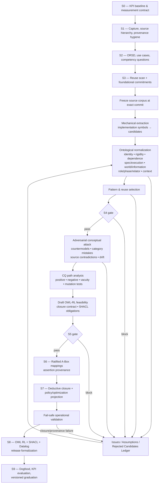
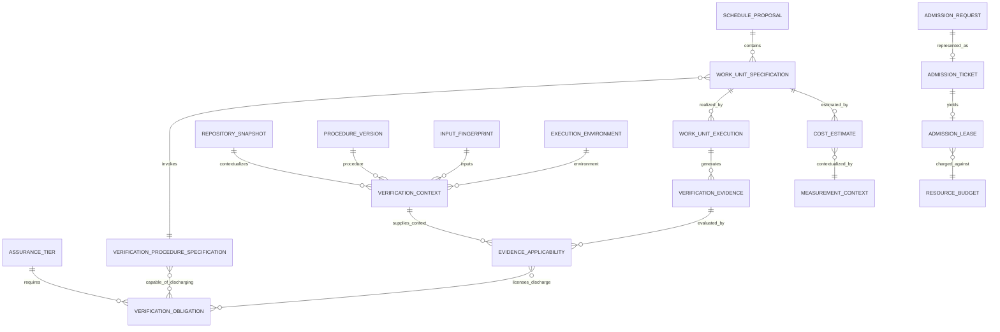

# Round 2 partner review 2 — foundational-ontology audit (external, received 2026-08-27)

> Provenance: operator-supplied from
> `~/YeeBois/projects/beep-effect21/scratchpad/partners/REVIEW2_FROM_THE_OTHER_SIDE_OF_THE_HARNESS.md`.
> A category-discipline review (UFO/OntoUML/OntoClean/BFO/DOLCE lens) of the mid-flight
> packet — distinct in kind from seats A-G: it attacks what the frozen names DENOTE,
> not artifact defects. Runtime/model provenance unverified; its repo cross-checks cite
> the same debbbb51f7 pin this packet verified independently. Disposition:
> round2-triage.md addendum 2.

# LLM-Guided Ontology Reasoning for Operational Software Systems

## Executive assessment

The central conclusion is intentionally adversarial:

> **The packet has an unusually strong engineering spine, but it is not yet ontologically safe enough to freeze its S4 T-Box.**

Its best decisions are genuinely good: requirements and competency questions precede formalization; the source corpus is pinned and mined before prose speculation; OWL 2 RL is separated from operational Datalog; probabilistic estimates are kept outside OWL; provenance and versioning matter; an executable projection closes the loop; and LLMs are already being pushed toward constrained extraction rather than unconstrained ontology invention. Those choices are well aligned with classical competency-question methodology, scalable OWL practice, provenance engineering, and the empirical direction of current LLM-assisted ontology systems. citeturn9search2turn23search0turn7search0turn12search0turn13search0 The uploaded packet explicitly embodies those commitments in its S0–S9 pipeline, CQ admission law, OWL 2 RL/Datalog split, provenance requirements, and adversarial pre-S4 loop. fileciteturn0file0

The danger is subtler. The packet is close to committing several **category mistakes at exactly the point where implementation vocabulary becomes ontology**:

| Finding | Adversarial judgment | Consequence |
|---|---|---|
| Typed-source extraction | Good as **candidate harvesting**, unsafe as ontological commitment | A TypeScript type or `LiteralKit` proves that a software representation exists; it does not prove that its name denotes a universal, kind, role, event, quality, relator, or information object. |
| `Proof` | Ontologically and epistemically too strong | A green verification artifact normally supplies **evidence**, not a mathematical proof of correctness. |
| `CertaintyTier` | Too strong unless explicitly operationalized | Passing selected verification obligations yields an **operational assurance/acceptance state**, not logical certainty. |
| `VerificationLane` → obligation | Procedure and requirement are conflated | A tier should require an **obligation/assurance condition**; a lane is one procedure capable of discharging it. |
| `WorkUnit` | Specification and execution are conflated | A schedulable plan item and the process that actually runs have different identities and temporal properties. |
| `CostEstimate` | Context is under-modeled | P50/P95 are estimates relative to population, observation window, hardware, procedure version, package/scope, and estimator—not intrinsic properties of a WorkUnit. |
| `CacheEpoch` | Likely too coarse for identity | Cache validity usually follows the relevant task-input/context fingerprint; an “epoch” may be useful operational grouping but cannot automatically function as the identity criterion for applicability. |
| `FILTER NOT EXISTS` | Closed-world semantics are implicit rather than formalized | Absence from an RDF graph is not ontological negation; safety requires a declared completeness boundary. |
| `CQ-010` P95 versus maximum cost | Not a hard invariant | A 95th percentile is not an upper bound. It cannot logically certify that execution “does not exceed” a budget. |
| `CQ-015` proof transfer | Known unsafe sufficiency condition | The packet already acknowledges that same epoch + shared cache is necessary but not sufficient. That should block proof reuse until fingerprint applicability is formalized. |
| Fleet P50/P95 as fairness | Insufficient | A percentile objective can sacrifice a minority indefinitely while the reported percentile remains excellent. No-starvation belongs in a hard policy invariant. |
| CQ-only term admission | Too strict in its current slogan | CQs should govern scope, but some supporting terms are necessary solely to make definitions, identity criteria, relations, and constraints ontologically coherent. |
| Multi-model adversarial consensus | Useful discovery mechanism, not epistemic authority | Correlated LLM agreement cannot establish identity, rigidity, dependence, equivalence, or truth. |
| `ControlIntervention` | Potential causal overclaim | Before/after measurement establishes temporal association unless the study design supports causal attribution. |

These are not stylistic complaints. UFO/OntoUML and OntoClean exist largely because ordinary domain models systematically confuse kinds with roles, identity-bearing types with anti-rigid states, relations with relation-bearers, and essential properties with contingent ones. OntoUML makes, for example, a `Kind` rigid and identity-providing; a `Role` anti-rigid, identity-inheriting, and relationally dependent; and a `Phase` anti-rigid but intrinsically conditioned. Its documented DepPhase anti-pattern exists specifically because confusing relational status with intrinsic phase is an ontological category error. citeturn22search6turn22search1turn22search10turn22search3 OntoClean was created to expose analogous misuse of taxonomic subsumption through meta-properties including rigidity, identity, unity, and dependence. citeturn18search0turn18search2

My strongest recommendation is therefore:

> **Do not let S4 mean “extract the T-Box.” Let S4 mean “extract the candidate conceptual vocabulary and force every candidate through ontological normalization.” The T-Box is an output of S4/S5 judgment, not an extraction product.**

The packet should preserve its formal-first instinct while changing what “formal-first” licenses. Mechanical extraction may establish:

\[
\text{source says that representation } x \text{ exists}
\]

It cannot establish:

\[
x \text{ is an ontological class}
\]

much less:

\[
x \sqsubseteq y,\qquad x \equiv y,\qquad
\operatorname{Rigid}(x),\qquad
\operatorname{IdentityProvider}(x).
\]

That separation is the single most important protection against an LLM turning the repository's implementation model into a metaphysics of the repository.

The appropriate architecture is consequently **hybrid rather than “LLM reasoning” in the loose sense**:

\[
\boxed{
\text{LLM} = \text{extractor}+\text{hypothesis generator}+\text{critic}
}
\]

\[
\boxed{
\text{Ontology engineer} = \text{ontological commitment authority}
}
\]

\[
\boxed{
\text{OWL/RL + Datalog + SHACL + tests} = \text{semantic enforcement}
}
\]

\[
\boxed{
\text{Optimizer} = \text{decision/scheduling authority within validated constraints}
}
\]

Current evidence supports this conservative division. OntoGPT/SPIRES constrains extraction with explicit schemas rather than granting the model free ontology authority; DRAGON-AI reports promising generated definitions and relations but still finds subtle expert-detectable errors; recent axiom-generation work likewise treats LLM output most defensibly as candidate knowledge requiring validation rather than an autonomous source of logical truth. citeturn12search0turn12search1turn13search0turn12academia48

The live repository also strengthens one packet-specific warning. At commit `debbbb51f77ae10015788dec0b819f12b96c3552`, the deployed scheduler defines `AdmissionWorkKind` as `full-proof | merged-preview | review-fix | publish`, `AdmissionPriority` as `publish | verify`, models distinct durable admission tickets and active leases, and charges explicit token weights—3, 5, 1, and 1 respectively—with configuration for memory reserve, hard floor, aging, heartbeat, and review-fix capacity. fileciteturn4file0 Therefore the ontology must distinguish **deployed admission semantics** from proposed DRR or P95-based abstractions. A concept named `SeatGrant` can still be useful, but only if S4 proves what it abstracts and maps it deliberately to `YeetAdmissionLease` rather than silently replacing the repository's real semantics.

## Foundational stance and upper-ontology tradeoffs

A rigorous review must first stop calling every item in the requested list an “upper ontology.” They are different kinds of artifacts.

UFO, BFO, and DOLCE are foundational/top-level ontologies or foundational ontology systems. OntoUML is a conceptual modeling language founded on UFO. OntoClean is a methodology and meta-property framework for evaluating taxonomies. OBO Foundry is an ontology-development and governance ecosystem whose member ontologies frequently align with BFO; it is not itself a top-level ontology. ISO/IEC 21838 is a standards family setting requirements for top-level ontologies, with ISO/IEC 21838-2 specifying BFO. citeturn17search0turn22search2turn19search0turn18search0turn20search0turn6search3turn21search0

### Comparison of the foundational alternatives

| Framework | Fundamental orientation | Identity / rigidity / dependence apparatus | Processes and time | Relations, roles, social/software artifacts | Formal / engineering character | Recommended use here |
|---|---|---|---|---|---|---|
| **UFO** | Foundational ontology designed explicitly to support conceptual modeling; organized into interconnected micro-theories | Exceptionally strong treatment of sortality, identity, rigidity, dependence, moments/modes, roles, phases and relators | Rich event/situation treatment through the broader UFO family | Particularly strong for roles, relators, commitments, social and intentional entities | UFO has formal foundations; OntoUML operationalizes many distinctions for conceptual modeling | **Primary conceptual-analysis discipline for S4/S5**. Use it to decide what things are before encoding them in OWL. citeturn17search0turn17search3 |
| **OntoUML** | UFO-grounded modeling language rather than a separate upper ontology | Makes identity provider, rigidity and dependence explicit through stereotypes such as Kind, Subkind, Role, Phase, RoleMixin, Relator | Explicit phase/event distinctions and anti-patterns | Excellent at exposing role/relator and reification mistakes | Strong validation/anti-pattern ecosystem | **Mandatory conceptual QA notation or ledger**, even if final runtime ontology is plain OWL RL. citeturn22search1turn22search3turn22search6turn22search8 |
| **BFO** | Realist, domain-neutral upper ontology separating continuants and occurrents | Strong dependence distinctions: independent continuants; specifically/generically dependent continuants; qualities; roles/functions/dispositions | Process-centered occurrent branch | Rigorous but comparatively austere for software plans, social constructs and epistemic artifacts unless companion ontologies/patterns are used | BFO 2020 has OWL/Common Logic artifacts and ISO 21838 alignment | **Optional interoperability alignment**, especially if future integration with OBO/CCO/IOF ecosystems becomes a requirement. Do not import merely for prestige. citeturn19search0turn21search0 |
| **DOLCE / DnS** | Descriptive/cognitive foundational ontology, sensitive to commonsense and linguistic conceptualization | Rich distinctions among endurants, perdurants, qualities, descriptions and related categories | Strong temporal/perdurant account | DnS-style description/situation modeling is especially attractive for plans, norms, contexts and socio-technical systems | Official DOLCE is formally specified in first-order logic and has remained stable since its original WonderWeb development | **Pattern source for descriptions, plans and contextual situations**; probably too heavy to import wholesale for the operational core. citeturn22search2turn22search11 |
| **OntoClean** | Evaluation methodology, not a TLO | Central concern: identity, rigidity, unity, dependence and taxonomic constraints | Not a full event ontology | Extremely useful for catching role/kind and inheritance errors | Meta-property audit over taxonomy | **Mandatory S4/S5 gate**. Every substantial class hierarchy should be audited with OntoClean-style questions. citeturn18search0turn18search2 |
| **OBO Foundry** | Governance, interoperability and ontology-engineering principles | Usually inherited from member ontology choices, often BFO | Depends on constituent ontologies | Strong practices for scope, definitions, identifiers, relations, reuse, versioning and collaboration | Mature release/quality practices; ROBOT/ODK ecosystem | **Steal the governance discipline**: immutable releases, version IRIs, definitions, scope, relation reuse, QC. Do not call OBO itself the upper ontology. citeturn20search0turn23search2turn23search3 |
| **ISO/IEC 21838** | Requirements and conformance family for top-level ontologies | Evaluates foundational suitability; Part 2 specifies BFO | Depends on conforming TLO | Not itself a domain ontology | Standardization/conformance role | **Use as an evaluation lens**, not as something to “align classes to.” citeturn6search3turn21search0 |

The right choice is therefore not “pick UFO or BFO and import it.” The correct architecture for this packet is more conservative:

**UFO/OntoUML should govern conceptual analysis.**  
**OntoClean should govern taxonomy QA.**  
**PROV-O should carry reusable provenance semantics.**  
**OWL 2 RL should carry the deliberately small executable ontology.**  
**SHACL should carry integrity/closure requirements.**  
**Datalog should carry explicitly closed operational derivations.**  
**BFO alignment should be a separate optional mapping module.**  
**DOLCE/DnS should be mined for useful contextual patterns rather than imported wholesale.**  
**OBO principles should govern release discipline.**  
**ISO 21838 should inform top-level quality criteria.**

That recommendation deliberately avoids strong equivalence mappings among foundational ontologies. UFO, BFO and DOLCE embody different foundational commitments and modeling objectives; asserting `owl:equivalentClass` across their top categories is much stronger than documenting conceptual similarity. Conservative `rdfs:subClassOf`, `skos:closeMatch`, or an external mapping artifact is preferable until equivalence has actually been demonstrated. UFO is explicitly motivated by conceptual-model semantics, BFO has a realist continuant/occurrent architecture, and DOLCE explicitly adopts a descriptive/cognitive stance. citeturn17search0turn19search0turn22search2

### Identity, rigidity and dependence before taxonomy

For every S4 candidate, the first question should not be “what is its superclass?” It should be:

\[
\textbf{What makes two instances the same individual?}
\]

Only then should inheritance be considered.

OntoUML's `Kind` is a rigid sortal that supplies identity; a `Subkind` rigidly specializes an existing identity provider; a `Role` is anti-rigid and relationally dependent; a `Phase` is anti-rigid but determined by an intrinsic condition; a `Relator` objectifies a relationship and mediates participants. citeturn22search6turn22search14turn22search1turn22search10turn22search8 These distinctions are extraordinarily relevant to software operations.

Consider the packet's likely candidates:

| Candidate | Questions S4 must answer before class admission |
|---|---|
| `Checkout` | What provides identity: filesystem path, repository clone lineage, workspace UUID, or content state? Does a checkout remain the same checkout after its tree changes? Almost certainly yes, meaning checkout identity must not be conflated with tree identity. |
| `TreeState` | Is this a Git tree object, working directory state, or complete verification-relevant snapshot including untracked files, tool/config/environment? A name is insufficient; the identity criterion must be explicit. |
| `ChangeSet` | Is identity based on `(base snapshot, target snapshot)`, a patch artifact, commit range, or semantic set of changed entities? Different diff algorithms can yield different representations of the same transition. |
| `VerificationLane` | Is a lane an enduring procedure specification, a command configuration, a role that a task plays, or an execution? It should almost certainly not be both specification and process. |
| `WorkUnit` | Is this a plan/specification for scheduled work, or a concrete execution? It cannot safely be both because an execution has start/end/outcome while a specification can be executed multiple times. |
| `SeatGrant` | Is it an information artifact granting authorization, a social/organizational relator between scheduler/requester/resource, or a temporal state? The deployed repository's `YeetAdmissionLease` strongly suggests that “lease” semantics deserve first-class analysis. fileciteturn4file0 |
| `GrantState` | Are `Waiting`, `Active`, and `Released` types in reality, temporal phases of a lease, or codes describing a state? A TypeScript literal enumeration does not settle this. |
| `FailureSignature` | Almost certainly an information object/classification signature, not the failure event itself. Many failure occurrences may instantiate or be classified by the same signature. |
| `CostEstimate` | An information object/estimate about predicted behavior in a specified context, not an intrinsic physical quality of a procedure. |
| `Proof` | If it is a CI artifact/result, model as evidence. If it is genuinely a formal proof, define proof language, conclusion, premises and verifier. Mixing these is unacceptable. |
| `CacheEpoch` | Does it have genuine temporal identity, or is it merely a convenient identifier for a set of cache-applicability conditions? This is central to safe proof reuse. |
| `ControlIntervention` | Is it merely an operational change event, or does it assert causal intervention semantics? The latter requires stronger evidence. |

A useful rule is:

> **If an object can be rerun, distinguish its specification from its execution. If its truth or applicability can change with context, reify that context. If it exists only because two or more participants stand in a relation, test whether a relator pattern is appropriate. If membership can change without the individual ceasing to exist, test role/phase rather than kind/subkind.**

The OntoUML documentation's role, phase and relator constraints directly embody these distinctions. citeturn22search1turn22search3turn22search8turn22search10

### Software-domain ontology failure modes

The software domain is particularly hostile to naïve ontology induction because source code contains many *representational* categories whose existence says nothing about their ontological status. A schema can encode a DTO, status code, cache key, configuration option, event payload, database projection, runtime process, or actual domain entity with identical syntactic machinery.

| Failure mode | Typical software symptom | Ontological defect | Required defense |
|---|---|---|---|
| **Implementation-is-reality** | Every interface/type becomes a class | Representation mistaken for universal | Candidate ledger + conceptual review |
| **Enum-is-taxonomy** | String union becomes subclasses | Codes mistaken for universals | Controlled-vocabulary pattern or SHACL `sh:in` unless class semantics are justified |
| **State-is-kind** | `ActiveGrant` subclass of `Grant` | Anti-rigid state represented as rigid specialization | Phase/status analysis |
| **Role-is-kind** | `QueueOwner`, `Worker`, `Publisher` modeled rigidly | Relationally contingent membership | Role/dependence analysis |
| **Specification-is-execution** | Task definition and task run share identity | Repeatable description conflated with event | Plan/execution split |
| **Evidence-is-truth** | Green result = correctness/proof | Epistemic warrant conflated with world fact | Evidence/applicability model |
| **Identifier-is-identity** | String ID assumed to settle sameness | Technical key mistaken for identity criterion | Explicit identity policy |
| **Snapshot-is-checkout** | Checkout path and tree state conflated | Enduring object and changing state merged | Separate `Checkout` and `RepositorySnapshot` |
| **Current-state timelessness** | `hasCurrentEpoch` treated as timeless fact | Temporal index hidden | Snapshot or temporal relation |
| **N-ary relation flattened** | `validInEpoch` + `provesTree` independently asserted | Applicability depends jointly on several dimensions | Reified applicability/context pattern |
| **Estimate-as-quality** | `p95Ms` attached directly as permanent property | Contextual estimate treated as intrinsic | Estimate object with provenance/window/context |
| **Policy-as-fact** | “requires lane” interpreted as repository truth | Normative policy and descriptive state mixed | Explicit policy/specification layer |
| **Query-is-definition** | SPARQL happens to answer CQ, so ontology is deemed correct | Retrieval behavior replaces semantics | Logical definitions + tests |
| **Domain/range-as-validation** | OWL domain/range used to reject bad records | OWL domain/range causes inference, not database-style rejection | SHACL for integrity; OWL for entailment |
| **OWA/CWA collapse** | `FILTER NOT EXISTS` means false | Missing triple interpreted as negative fact | Scoped completeness contract |
| **`sameAs` overreach** | Two code identifiers look equivalent | Identity collapse propagates globally | Human-controlled equivalence |
| **Global epoch fallacy** | Same epoch implies reusable result | Relevant inputs/environment omitted | Applicability fingerprint |
| **Percentile-as-bound** | P95 compared to “maximum” | Statistical quantile treated as hard maximum | Separate hard resource charge from estimator |
| **Temporal association-as-causation** | KPI improved after change | Event sequence treated as causal proof | Causal-study metadata or weaker terminology |
| **Optimizer-is-ontology** | Scheduling preference encoded as class truth | Utility choice conflated with descriptive semantics | Separate policy/optimizer |
| **Drifted ontology** | Repo changed after extraction | T-Box models obsolete implementation | Source commit/version binding |
| **LLM consensus-as-proof** | Three models agree | Correlated hypotheses mistaken for validation | Mechanical countermodels + human authority |
| **Unqualified equivalence reuse** | External class mapped with `owl:equivalentClass` | Different conceptualizations collapsed | Conservative mappings |
| **Vacuous green test** | Zero rows because no test fixtures exist | Absence of evidence masquerades as invariant | Coverage/non-vacuity precondition |

OWL's model-theoretic semantics and SHACL's validation semantics are deliberately different; combining them is powerful precisely when the boundary is explicit. OWL 2 RL retains formal ontology semantics while enabling rule-oriented implementation, whereas SHACL is defined for graph validation and supports cardinality, closed shapes and SPARQL constraints. citeturn23search0turn23search1

### Preferred design patterns

For this domain, the most valuable patterns are not exotic.

**Requirement–procedure–execution–evidence–applicability** should replace the present tendency to let a “lane” simultaneously serve as obligation and procedure, and a “proof” simultaneously serve as result and epistemic conclusion.

**Plan–execution** separates schedulable `WorkUnitSpecification` or `ScheduleProposal` from `WorkUnitExecution`. PROV-O already distinguishes `prov:Plan`, `prov:Activity`, and `prov:Entity`, making it an excellent lightweight interoperability spine. citeturn7search0

**Relator/mediation** should be tested for leases/grants when the lease itself bears properties such as token weight, priority, expiry, requester and resources. OntoUML's relator construct exists to objectify relational properties among mediated participants. citeturn22search8

**Contextualized applicability** should be used whenever a result is valid only for a conjunction such as:

\[
(\text{procedure version},
\text{input fingerprint},
\text{repository snapshot},
\text{toolchain},
\text{environment},
\text{policy version})
\]

rather than distributing those conditions across unrelated binary properties.

**Measurement/estimate** should give each estimate a metric, population, estimator/version, observation interval, sample size, hardware class and provenance. P50 and P95 should not float as timeless qualities.

**Qualified provenance** should link generated evidence to the activity and plan that produced it and the source snapshot it used; PROV-O explicitly supports qualified influence when simple binary provenance is insufficient. citeturn7search0

Ontology Design Patterns are intended to package recurring modeling solutions and improve reuse and communication; they should be used as bounded solutions rather than imported as large foundational dependencies. citeturn11search4

## Formal reasoning architecture and the LLM epistemic boundary

The phrase “LLM-guided ontology reasoning” hides several categorically different forms of reasoning. They must not be permitted to bleed into one another.

### The reasoning modes

| Reasoning mode | Formal meaning in this system | Appropriate engine | LLM role | Production authority |
|---|---|---|---|---|
| **Deduction** | Derive conclusions entailed by accepted axioms and accepted facts | OWL 2 RL reasoner / Datalog | Explain, suggest queries, generate candidate tests | **Formal engine only** |
| **Abduction** | Find hypotheses which, if added, would explain an observation | Abductive DL/logic layer or explicit search | Generate candidate explanations and missing-assumption sets | Human/domain verification before admission |
| **Induction** | Generalize from observations, e.g. duration/failure models or candidate relations | Statistical/ML learner, ILP where appropriate | Feature extraction, hypothesis generation | External learned model; never silently becomes OWL truth |
| **Non-monotonic reasoning** | Derive conclusions that may be withdrawn when new information arrives; defaults/negation-as-failure | Stratified Datalog, well-founded/stable-model system where needed | Suggest policies and exceptions | Explicit policy program only |
| **Paraconsistent reasoning** | Continue useful reasoning in the presence of contradictory assertions without explosion | Quarantine/candidate reasoning layer | Detect and cluster conflicting claims | Optional candidate-review layer, not canonical released semantics |
| **Optimization** | Select the preferred admissible schedule under objective function and constraints | Deterministic optimizer/scheduler | Suggest heuristics, features and counterexamples | Versioned policy/optimizer |
| **Validation** | Determine whether data or ontology conforms to declared constraints | SHACL, profile checker, reasoner, test runner | Generate prospective tests | Mechanical checker |
| **Ontology evolution** | Apply controlled semantic changes | KGCL + OWL changes + review | Draft patches | Approved change workflow |

Description-logic abduction is formally studied as finding facts whose addition allows an ontology to entail an observation, while ontology-aware induction learns hypotheses from examples rather than deriving necessary consequences. citeturn14search2turn14search16 Paraconsistent description logics were developed because ordinary classical entailment handles inconsistency very differently from four-valued/paraconsistent systems; such machinery can be useful for a **candidate evidence graph**, but introducing it into the canonical operational ontology would change the semantic contract and should not happen casually. citeturn14search0

OWL reasoning itself should remain boringly monotonic. OWL 2's formal semantics is model-theoretic, and OWL 2 RL is a deliberately restricted profile that permits scalable rule-oriented reasoning while retaining OWL entailment semantics. citeturn6search2turn23search0 Non-monotonic operational rules belong in a separately named semantics layer.

### The semantics envelope

A mathematically disciplined operational architecture can be stated as follows.

Let:

\[
O_v = \text{versioned OWL 2 RL ontology}
\]

\[
A_t = \text{A-Box snapshot at operational time }t
\]

\[
C_t = \text{explicit completeness/closure declarations for }A_t
\]

\[
R = \text{versioned safe Datalog rules}
\]

\[
P_v = \text{versioned hard scheduling/admission policy}
\]

\[
\theta_t = \text{estimated parameters such as cost and failure probabilities}
\]

First calculate monotonic ontology closure:

\[
E_t = \operatorname{RLClosure}(O_v \cup A_t).
\]

Then validate that the closure assumptions needed by operational negation are actually satisfied:

\[
\operatorname{SHACL}(E_t,C_t)=\textsf{conforms}.
\]

Only then evaluate explicitly closed operational rules:

\[
M_t = \operatorname{lfp}(R,E_t,C_t).
\]

Let the hard admissible schedule space be:

\[
\mathcal F_t =
\{S \mid S \text{ satisfies } P_v \text{ under }M_t\}.
\]

Then optimization—not ontology entailment—chooses:

\[
S^* =
\underset{S\in\mathcal F_t}{\operatorname{argmin}}
\; J(S;\theta_t),
\]

with a deterministic final tie-break:

\[
S^* =
\operatorname{lexmin}
\left(
J(S;\theta_t),
\operatorname{stableKey}(S)
\right).
\]

This separation produces a crucial safety property:

> **Predicted quantities may influence preference among schedules that are already known to satisfy hard constraints; they do not establish the hard constraints.**

Therefore `p95Ms`, `estimatedFailureProbability`, or an LLM-generated confidence score belongs in \(\theta_t\), not in ontological truth and not automatically in \(P_v\).

This matters directly to CQ-010. A P95 of 10 minutes means roughly a 95th-percentile estimate under a defined distribution; it does **not** mean execution cannot take 11 minutes. The live scheduler instead has an explicit token accounting mechanism whose weights are part of deployed policy. fileciteturn4file0 The ontology should represent both concepts but never equate them:

\[
\texttt{predictedP95Duration}
\neq
\texttt{admissionCharge}
\neq
\texttt{hardExecutionLimit}.
\]

### Strictly forbidden LLM decisions

The correct prohibition is not “the LLM may never talk about these.” It should be encouraged to propose and attack all of them.

The prohibition is:

> **An LLM may propose a change in these categories, but its output alone can never authorize the change.**

| Forbidden autonomous decision | Why it is forbidden | What the LLM may do instead |
|---|---|---|
| Mint a production class IRI | Creates an ontological commitment | Propose candidate + CQ/support justification |
| Mint a production object/data property | Adds semantics with inferential consequences | Draft candidate signature and examples |
| Decide class vs individual | Fundamental category choice | Present competing analyses |
| Decide entity vs information artifact | World/representation distinction | Find evidence for each interpretation |
| Decide specification vs execution | Identity and temporal distinction | Flag ambiguous source usage |
| Decide kind vs role vs phase | Requires rigidity/dependence judgment | Perform OntoClean/OntoUML questionnaire |
| Decide relator status | Reifies relational dependence | Suggest relator pattern and countermodel |
| Establish identity criterion | Identity is foundational, not lexical | List candidate identity keys and failure examples |
| Designate identity provider | Controls entire sortal hierarchy | Propose and test alternatives |
| Decide rigidity or anti-rigidity | Governs valid subsumption | Supply modal counterexamples |
| Decide existential dependence | Foundational commitment | Surface dependency evidence |
| Decide relational dependence | Determines role semantics | Identify mediating relations |
| Assert subclass admission | May create invalid taxonomy | Draft axiom and entailment impact |
| Assert class equivalence | Very strong bidirectional semantic claim | Suggest mapping with evidence |
| Assert disjointness | Can create unsatisfiability | Produce candidate and collision report |
| Assert `owl:sameAs` | Collapses identities globally | Suggest possible match for human review |
| Assert `owl:differentFrom` | Commits distinct identity | Produce conflict/evidence report |
| Set OWL domain/range | Causes inference, not merely validation | Suggest signatures and expected inferred types |
| Add cardinality/functionality/inverse-functionality | Can alter identity/consistency behavior | Draft axiom + counterexample fixtures |
| Define an OWL key | Potentially identity-sensitive | Suggest key candidate and collision analysis |
| Decide upper-ontology equivalence | Foundational mappings are nontrivial | Recommend conservative mappings |
| Declare a data source complete | Authorizes closed-world reasoning | Produce completeness evidence report |
| Choose closed-world predicates | Semantic boundary decision | Suggest based on operational source guarantees |
| Add negation-as-failure/default semantics | Changes logic regime | Draft versioned rule and exception tests |
| Promote an induced correlation to ontology truth | Induction is not deduction | Store as estimate/hypothesis |
| Convert confidence to probability or truth | Model confidence is not semantics | Attach confidence only as proposal metadata |
| Resolve contradictory authoritative sources | Requires governance/domain judgment | Preserve both with provenance and escalate |
| Delete provenance because assertions “agree” | Agreement does not erase lineage | Consolidate while retaining source lineage |
| Reuse an existing IRI with changed meaning | Violates semantic stability | Propose deprecation/new term |
| Deprecate a production term | Compatibility/governance decision | Draft KGCL change |
| Change a term's definition materially | Can silently change referent | Generate impact analysis |
| Approve proof/evidence transfer | Can license unsafe skipped verification | Propose transfer and run applicability checks |
| Approve a fail-open scoped schedule | Safety-critical policy choice | Force conservative fallback |
| Choose hard admission rules | Operational safety policy | Simulate candidate policy |
| Set fairness/starvation policy | Normative resource-governance choice | Model tradeoffs |
| Approve release/version | Governance responsibility | Generate release candidate |
| Treat multi-agent consensus as validation | Models can share failure modes | Report consensus as evidence only |
| Override failed OWL/SHACL/CQ tests | Formal checker wins | Diagnose the failure |
| Quietly weaken a failing test | Goodhart/gaming risk | Propose change with explicit justification |
| Manufacture missing source evidence | Hallucination | Emit unresolved issue |
| Infer production facts from prose when authoritative formal source contradicts them | Source hierarchy violation | Record contradiction |
| Determine that a CQ is “satisfied” from natural-language plausibility | CQs are executable acceptance conditions | Generate/run the formal test |

This division is consistent with the direction of current LLM-supported ontology work: schema-constrained extraction is materially safer than unrestricted invention, while expert evaluation continues to uncover subtle defects even in high-quality generated ontology content. citeturn12search0turn12search1turn13search0turn12academia48

### Human and LLM collaboration

A strong workflow treats LLMs as **high-throughput epistemic labor**, not as the final ontologist.

The model should have five distinct seats:

**Extractor.** Transform authoritative code/docs into typed candidate assertions, never silently generalizing.

**Conceptual analyst.** Generate competing UFO/OntoClean analyses: “Grant is a relator,” “Grant is an information artifact,” “ActiveGrant is a phase,” and so forth.

**Adversary.** Search specifically for counterexamples to every candidate identity criterion, subsumption and operational rule.

**Test synthesizer.** Convert CQs, definitions and anti-patterns into positive, negative, inconsistency, mutation and SHACL fixtures.

**Change drafter.** Produce a KGCL/OWL/SHACL patch plus impact analysis.

The human/domain authority then performs the decisions the model is forbidden to make. Formal systems are downstream of both: no human or model can wave through an OWL profile violation, unsatisfiable class, failed SHACL constraint, or failed acceptance test.

Multi-agent review adds value when the agents are given **different falsification tasks**, not merely asked independently “is this ontology good?” The useful output of an adversarial round is not a vote count. It is a new countermodel, uncovered category mistake, source contradiction, missing CQ, or test capable of failing the present model. Two “dry” rounds are therefore a practical stopping heuristic, but not evidence of semantic completeness.

## Engineering discipline for ontology quality

### Competency questions are necessary but not sufficient

The packet's decision to put CQs before taxonomy is excellent. Grüninger and Fox's classical methodology uses competency questions to characterize what an ontology must be able to answer and then derives axiomatic requirements from those questions. citeturn9search2

The packet should, however, weaken this formulation:

> “Every T-Box term must appear directly in a Must/Should CQ.”

into:

> **Every T-Box term must have an explicit admission justification of one of two kinds:**
>
> **decision term** — directly required to answer a Must/Should CQ; or  
> **semantic-support term** — required to define, constrain, disambiguate, align, or preserve the correctness of a decision term.

Otherwise CQ minimalism can optimize for query surfaces while forcing ontological shortcuts. For example, `VerificationObligation` may be necessary to distinguish a normative requirement from the `VerificationProcedureSpecification` that satisfies it even if a query only returns the procedure. Rejecting the supporting class because no SELECT projects it would make the ontology *less* correct.

This is the same reason a software test suite is not the specification of every internal abstraction: a support abstraction can be indispensable to making the externally tested behavior correct.

The admission record should therefore contain:

```text
term
source
ontological category
identity criterion / identity provider
rigidity
dependence
CQ justification
semantic-support justification
reuse decision
definition
counterexamples considered
reviewer
status
```

### Test-driven ontology development

“CQ regression green” is a valid **release criterion**; it is not “certainty.” The stronger test stack is:

| Layer | Test | What it establishes |
|---|---|---|
| Syntax | RDF/OWL parse | Artifact is well formed |
| Profile | OWL 2 RL profile check | Runtime expressivity assumptions are respected |
| Logical consistency | Reasoner | No contradiction in the accepted ontology under its semantics |
| Coherence | Unsatisfiable-class scan | Named classes are not unintentionally impossible |
| Entailment | Positive logical fixtures | Required conclusion follows |
| Non-entailment | Negative fixtures | Dangerous conclusion does *not* follow |
| Inconsistency | Deliberately bad fixture | Contradictory input is detected where expected |
| Integrity | SHACL | Operational graph is sufficiently complete/well-shaped |
| CQ answer | SPARQL exact/golden tests | User requirement is answered |
| CQ non-vacuity | Antecedent/fixture coverage | Zero-row success is not due to no data |
| Mutation | Delete/weaken/change critical axiom | Test suite actually detects semantic regression |
| Metamorphic | Perturb irrelevant/relevant inputs | Applicability and invalidation behave as intended |
| Property-based | Random valid operational states | Scheduler invariants hold over broad state space |
| Determinism | Same frozen inputs twice | Same schedule byte-for-byte or canonical-equivalent |
| Drift | New source commit | Existing mapping still corresponds to repo reality |
| Performance | Fixed benchmark | RL closure/rules/query stay within operational budget |

OBO's release ecosystem provides a useful precedent: its registration checklist calls for parseability, logical consistency/coherence and absence of unintended unsatisfiable classes, while tooling such as ROBOT supports automated ontology reporting and reasoning in release pipelines. citeturn23search3turn9search0

The packet's present `expected_result: non_empty` tests are useful smoke tests but not strong semantic tests. A query can return one wrong row and pass. Wherever a fixture is deterministic, assert the exact expected result set, expected cardinality, or at least critical inclusions/exclusions.

Similarly:

```sparql
FILTER NOT EXISTS { ... }
```

cannot by itself mean “there is no such thing.” Under RDF/OWL's open-world semantics, it means no matching solution is present in the evaluated dataset. Operational negative conclusions therefore require the graph to be declared complete for the relevant predicate/context first. OWL and SHACL intentionally serve different semantic roles here. citeturn6search2turn23search1

### OWL, SHACL and Datalog division of labor

The packet's OWL 2 RL choice is defensible and probably correct. W3C defines RL specifically for scalable reasoning where full OWL 2 expressivity is traded for efficient rule-oriented implementation; profile-conformant core reasoning tasks have favorable polynomial bounds. citeturn23search0

But the conceptual boundary should be written down explicitly:

| Concern | Mechanism |
|---|---|
| Class/property meaning, subsumption, disjointness, monotonic entailment | **OWL 2 RL** |
| Graph completeness/cardinality/datatype/closed vocabularies | **SHACL** |
| Explicitly closed transitive/fixpoint operational computations | **Datalog** |
| Negative operational checks over complete snapshot | **Datalog/SPARQL/SHACL under closure contract** |
| Cost/failure prediction | **External statistical model** |
| Schedule objective | **Optimizer** |
| Provenance | **PROV-O + local provenance metadata** |
| Change intent | **KGCL + reviewed OWL/SHACL diff** |
| Human conceptual analysis | **UFO/OntoUML/OntoClean ledger** |
| LLM-generated content | **Candidate layer only** |

SHACL is the appropriate place for closed enumerations and required fields. For an operational code list that evolves, `sh:in` can be safer than pretending every literal member is an ontological class. The SHACL Recommendation explicitly provides `sh:in`, cardinality constraints, closed shapes and SPARQL-based constraints. citeturn23search1

### Provenance and versioning

PROV-O should be reused aggressively, but thinly. It provides the exact high-level distinctions needed here: entities, activities, agents, plans, generation/derivation and qualified influence relationships. citeturn7search0

Every **LLM-originated candidate** should be accompanied by at least:

| Provenance field | Purpose |
|---|---|
| source repository + commit | Reality version |
| source file and stable span/symbol | Evidence location |
| extraction activity ID | Reproducibility |
| model identifier | Model provenance |
| model/provider version when available | Drift analysis |
| prompt/template hash | Reproducibility |
| tool configuration hash | Reproducibility |
| retrieval inputs | Source audit |
| candidate assertion | What was proposed |
| epistemic status | extracted / inferred / hypothesized / estimated |
| confidence | Triage metadata only |
| reviewer decision | accepted / rejected / deferred |
| rejection rationale | Prevent repeated bad proposals |
| KGCL/change ID | Evolution lineage |
| ontology version | Target release |

For grouped assertions, model the assertion bundle or named graph as a `prov:Entity`, the extraction/review step as `prov:Activity`, and the model/human/tool as `prov:Agent` where appropriate. The important principle is that provenance describes *where a claim came from*, not whether the claim is true. citeturn7search0

OBO's versioning discipline should also be copied: official releases should have unique version IRIs and remain retrievable without alteration. citeturn23search2 That is particularly important here because schedule decisions must be reproducible against the exact ontology/policy/source version that generated them.

The following reproducibility tuple should be stored with every emitted schedule:

\[
\begin{aligned}
\texttt{DecisionContext} = (&
\texttt{repoCommit},\\
&\texttt{ontologyVersion},\\
&\texttt{ruleSetVersion},\\
&\texttt{policyVersion},\\
&\texttt{ABoxSnapshotId},\\
&\texttt{completenessContractVersion},\\
&\texttt{costModelVersion},\\
&\texttt{schedulerVersion})
\end{aligned}
\]

Without this tuple, “the ontology chose this schedule” is not reproducible.

### Quality metrics

Ontology quality should not be collapsed into the packet's operational KPI. The KPI determines **utility**. Ontological validity has independent conditions.

A recommended quality dashboard is:

| Dimension | Recommended release metric |
|---|---:|
| OWL 2 RL profile violations | **0** |
| Logical inconsistencies | **0** |
| Unintended unsatisfiable classes | **0** |
| Unresolved OntoClean/OntoUML blocker findings | **0** |
| Production terms without textual definition | **0** |
| Sortals without identity analysis | **0** |
| Anti-rigid types without role/phase rationale | **0** |
| Critical operational predicates without closure classification | **0** |
| Must-CQ test failures | **0** |
| Must-CQ vacuous passes | **0** |
| Safety-critical negative tests without positive antecedent coverage | **0** |
| Unsafe `owl:equivalentClass` / `owl:sameAs` mappings awaiting review | **0** |
| A-Box operational assertions lacking provenance | **0** for critical data |
| Schedules lacking full DecisionContext tuple | **0** |
| Source-to-ontology drift blockers | **0** |
| Mutation survival on critical inference rules | Target **near 0**; every critical mutation should be killed |
| LLM unsupported-claim acceptance rate | **0** |
| LLM proposal acceptance precision | Track, do not optimize blindly |
| Reviewer minutes per accepted semantic change | Track as process KPI |
| Repeated rejected proposal rate | Track; should fall as issue memory improves |
| Reasoner/rules/query latency | Benchmark against S7 operational budget |
| P50/P95 time-to-certainty | **Business/operational outcome**, not semantic correctness metric |

These thresholds are recommendations for this packet, not claims that a standards body mandates them. OBO's documented emphasis on logical coherence, scope, identifier/version discipline and stable releases nevertheless provides strong precedent for keeping ontology-quality gates distinct from application KPIs. citeturn20search0turn23search2turn23search3

## Recommended S4/S5 pipeline

The existing S0–S9 structure does not need to be discarded. It needs a conceptual gate inserted **inside** S4 and strengthened in S5.



The architecture deliberately places LLM extraction *before* ontological normalization but *before neither human nor formal judgment*. That is consistent with the strongest current constrained-extraction approach: LLMs are highly useful when forced to produce schema-bounded candidate structures, but generated ontology content still requires expert and formal review. citeturn12search0turn12search1turn13search0

### The S4 contract

S4 should be renamed conceptually, even if the packet retains the label:

> **S4 = formal-source candidate bootstrap and ontological normalization.**

It is not “the typed corpus tells us the T-Box.”

For each extracted source symbol:

\[
x
\longmapsto
\left<
\text{source},
\text{representation kind},
\text{candidate referent},
\text{ontological category},
\text{identity},
\text{rigidity},
\text{dependence},
\text{temporal behavior},
\text{CQ justification},
\text{status}
\right>
\]

The **S4 gate must fail** unless all of the following hold:

| S4 gate condition | Required evidence |
|---|---|
| Source commit is frozen | Exact commit hash and source manifest |
| Drift since packet creation is reconciled | Delta report against current target commit |
| Every mechanical candidate has provenance | Symbol/file/commit |
| Mechanical symbol ≠ automatic class | Candidate status explicit |
| Every accepted sortal has identity provider analysis | OntoUML/UFO ledger |
| Every identity-sensitive entity has criterion or explicit unresolved status | Identity worksheet |
| Every proposed role/phase has rigidity/dependence analysis | OntoClean worksheet |
| Every status/enum is classified as code, individual set, phase, role or true subtype | Modeling decision |
| Specification/execution ambiguity resolved | Explicit split or rationale |
| World object/information object ambiguity resolved | Explicit split or rationale |
| N-ary/context-dependent relations identified | Applicability/context pattern |
| All reused terms have semantic compatibility assessment | Reuse ledger |
| Strong equivalences have proof-level justification | Mapping report |
| Every accepted term has CQ or semantic-support justification | Admission record |
| Every accepted term has textual definition | Definition ledger |
| Definitions are non-circular | Review/test |
| Known rejected conceptualizations are preserved | Rejection ledger |
| Current repo concepts and prospective design are tagged separately | `deployed` / `prospective` status |
| No unresolved S4 issue can license an unsafe skip | Safety classification |
| S4 adversaries produced no unresolved category blocker | Review results |

For this packet specifically, **S4 should not pass until `Proof`, `CertaintyTier`, `WorkUnit`, `VerificationLane`, `SeatGrant`, `CostEstimate`, `TreeState`, `CacheEpoch`, `FailureSignature`, and `ControlIntervention` have explicit ontological analyses.**

### The S5 contract

S5 should become the point where candidate conceptualization is attacked as though it were a paper being reviewed by hostile foundational ontologists.

The adversarial seats should be intentionally asymmetric:

| Seat | Mandate |
|---|---|
| Identity adversary | Break every claimed identity criterion |
| OntoClean adversary | Find rigidity/dependence/subsumption violations |
| UFO/OntoUML adversary | Find role/phase/relator/specification/execution category mistakes |
| BFO/DOLCE outsider | Attempt an alternative upper-level categorization to expose hidden assumptions |
| Logic adversary | Find OWA/CWA, negation, cardinality, sameAs, domain/range problems |
| Operational-reality adversary | Compare conceptual model to exact repo code and runtime behavior |
| CQ adversary | Construct false-positive/vacuous CQ passes |
| Optimization adversary | Find places where estimate, policy and logical entailment are conflated |
| Provenance adversary | Find facts whose source/version cannot be reconstructed |
| LLM-safety adversary | Find any accepted commitment whose only authority is model consensus |

The **S5 gate** requires:

\[
\text{Conceptual coherence}
\land
\text{source fidelity}
\land
\text{logical feasibility}
\land
\text{CQ adequacy}
\land
\text{closure explicitness}
\land
\text{safety}
\]

not model consensus.

Concretely:

| S5 gate condition | Required result |
|---|---|
| Identity countermodels resolved | Pass |
| OntoClean constraints | No blocker |
| OntoUML anti-pattern scan | No blocker |
| Procedure/requirement/execution/evidence split | Explicit |
| OWL 2 RL profile feasibility | Pass |
| Critical domain/range/cardinality implications reviewed | Pass |
| Closed-world predicates enumerated | Complete list |
| Completeness witnesses defined | For every negative operational conclusion |
| CQ positive fixtures | Pass |
| CQ negative fixtures | Pass |
| CQ non-vacuity fixtures | Pass |
| Mutation tests on critical rules | Mutants killed |
| Proof/evidence transfer adversarial tests | Pass |
| Fail-open behavior | Conservative fallback demonstrated |
| Deployed scheduler parity | Pass |
| Prospective concepts cannot masquerade as deployed facts | Pass |
| Source drift report | Clean |
| Human/domain approval of foundational decisions | Recorded |
| KGCL patch impact | Reviewed |
| No LLM-forbidden decision accepted solely from model output | Pass |

### Fail-safe projection

The operational projection should have a simple rule:

\[
\neg \operatorname{ValidatedCompleteness}(C_t)
\Rightarrow
\operatorname{ConservativeSchedule}.
\]

Likewise:

\[
\neg \operatorname{Applicable}(Evidence,Context)
\Rightarrow
\text{evidence cannot discharge obligation}.
\]

and:

\[
\operatorname{FailOpen}(AffectedComputation)
\Rightarrow
\neg\operatorname{ScopedSkipLicensed}.
\]

This is stronger than merely running a zero-row CQ after the fact because it states the safety condition as part of the projection contract.

A percentile or learned estimate should never override it:

\[
\text{EstimatedCheap}(w)
\nRightarrow
\text{Safe}(w)
\]

and

\[
\text{HighConfidenceLLM}(a)
\nRightarrow
O_v \models a.
\]

## Adversarial audit and concrete remediation of the packet

The following audit is based on the uncommitted packet supplied in this conversation; the public repository is used only where explicitly stated as a current-reality cross-check. fileciteturn0file0 The live scheduler cross-check at `debbbb51…` is particularly important because the packet itself notes that its branch predates the newly deployed weighted admission scheduler. fileciteturn4file0

### Highest-priority conceptual blockers

| Severity | Current packet concept | Adversarial finding | Prescription |
|---|---|---|---|
| **BLOCKER** | `Proof` | Green verification output is being given the name of a deductively conclusive artifact | Rename the generic class to `VerificationEvidence` or `VerificationResultArtifact`. Reserve `FormalProof` for genuinely proof-theoretic artifacts. |
| **BLOCKER** | `CertaintyTier` | Operational verification completeness is not epistemic certainty | Prefer `AssuranceTier`, `VerificationAssuranceTier`, or `AcceptanceTier`; define it as policy-relative discharged obligations. |
| **BLOCKER** | `CertaintyTier requiresLane` | Normative requirement and execution mechanism conflated | Add `VerificationObligation`; tier requires obligations; procedure can discharge obligation. |
| **BLOCKER** | `WorkUnit` | Schedulable thing and executed process likely conflated | Split `WorkUnitSpecification` from `WorkUnitExecution`. |
| **BLOCKER** | `VerificationLane` | Need to decide whether lane is a procedure specification, organizational route, command template or execution kind | Define one referent. Likely `VerificationProcedureSpecification` with a separate lane/category vocabulary. |
| **BLOCKER** | `CacheEpoch × TreeState` validity | Context identity insufficiently justified | Replace “same epoch” as sufficiency with explicit `VerificationContextFingerprint`/applicability relation. Epoch may remain an operational grouping. |
| **BLOCKER** | CQ-015 | Packet already states same epoch + shared cache is only necessary | Upgrade applicability completeness to Must before evidence reuse is permitted. |
| **BLOCKER** | Negative SPARQL CQs | Zero rows can be vacuous and rely on implicit closure | Add completeness witness and antecedent tests. |
| **BLOCKER** | `p95Ms > maxGrantCostMs` | P95 is not a maximum; current deployed scheduler is token-weighted | Split prediction from admission charge and hard limit. |
| **BLOCKER** | Source-to-TBox extraction | “typed corpus” is being granted too much ontological authority | Typed corpus creates candidates, not classes. |
| **HIGH** | `SeatGrant` | Current code uses distinct queue `YeetAdmissionTicket` and active `YeetAdmissionLease`; one abstraction may erase lifecycle semantics | Model request/ticket/lease separately or prove the abstraction. fileciteturn4file0 |
| **HIGH** | `GrantState` | Likely code vocabulary/state, not necessarily taxonomy | Prefer a closed status vocabulary plus temporal status assertion; use phase semantics only if analytically justified. |
| **HIGH** | `CostEstimate` | Contextless P50/P95 invites false intrinsic reading | Reify estimate with procedure, scope, hardware, sample window, sample size, estimator and provenance. |
| **HIGH** | `FailureSignature` | Signature and failure occurrence can collapse | Separate `VerificationFailureEvent` from `FailureSignature`. |
| **HIGH** | `ControlIntervention` | Name implies causal interpretation | Use `OperationalChangeEvent` by default; classify as causal intervention only when experimental design supports it. |
| **HIGH** | “decision-relevance or death” | Can reject structurally necessary semantic support classes | Add semantic-support admission category. |
| **HIGH** | fleet P50/P95 fairness | P95 does not establish starvation freedom | Add hard max-wait/aging/no-starvation policy distinct from KPI. |
| **HIGH** | “certainty = CQ regression green” | Conflates ontology release acceptance with epistemic certainty | Rename concept: “ontology release accepted under declared test suite.” |
| **HIGH** | `hasCurrentEpoch` | Currentness is time/snapshot-relative | Assert currentness only inside `OperationalSnapshot` or temporal context. |
| **HIGH** | `TreeState` | Git tree may omit verification-relevant environmental state | Define exact boundary and fingerprint semantics. |
| **HIGH** | `ChangeSet` | Identity likely underdefined | Tie to source/target snapshots or explicit patch identity. |
| **HIGH** | CQ-013 cheapest/earliest | P50-only minimization does not establish earliest actionable failure | Move scheduling objective to explicit optimization model using probabilities, distributions, dependencies and current target tier. |
| **HIGH** | UC-001 local objective | “time-to-first-actionable-failure” may diverge from overall “time-to-certainty” | Prove surrogate consistency under assumptions or treat it as an empirical heuristic. |
| **MEDIUM** | closed literal domains | Representation layer and conceptual T-Box change are mixed | Distinguish code-vocabulary changes, SHACL-shape changes and ontological class changes. |
| **MEDIUM** | no punning | Good rule, but not sufficient conceptual validation | Keep it; add identity and meta-category audit. |
| **MEDIUM** | prospective DRR | Packet research can accidentally promote future policy to current reality | Every assertion should carry `deployed`, `proposed`, or `deprecated` operational status. |
| **MEDIUM** | LLM dry-2 convergence | Useful stopping criterion, not completeness evidence | Require blocker/counterexample yield, not agreement count. |
| **MEDIUM** | before/after KPI intervention | Ring-buffer and changing population can bias comparison | Version measurement rules and preserve censoring/population metadata; treat causal claims separately. |

### The fairness counterexample

The packet's instinct that fairness should not be an external afterthought is good, but placing it only “inside” fleet P50/P95 is mathematically insufficient.

Suppose 100 simultaneous episodes exist. A scheduler completes 96 in one minute and starves four forever.

Depending on the percentile convention, the reported P95 can remain approximately one minute even though four agents have no finite completion time.

Thus:

\[
\operatorname{GoodP95}
\nRightarrow
\operatorname{NoStarvation}.
\]

Fairness should therefore appear both as an outcome measurement **and** as a hard admission/scheduling invariant, for example:

\[
\forall r,\quad
\operatorname{eligible}(r)
\Rightarrow
\Diamond_{\le T}\operatorname{admitted}(r),
\]

or a practical aging guarantee. The deployed scheduler already contains an explicit priority-aging configuration and differentiates `publish` from `verify`, reinforcing that fairness/admission behavior exists as policy independently of the KPI. fileciteturn4file0

### Recommended conceptual core

A safer core looks approximately like this:



This need not all become first-class ontology terms. The CQ/support admission rule should keep only what is required. The diagram's purpose is to expose the distinctions that S4 must consciously collapse or preserve.

### Example OWL refactoring

A small OWL/PROV spine could begin:

```turtle
@prefix ciops: <https://oip.law/ontology/ci-ops#> .
@prefix owl:   <http://www.w3.org/2002/07/owl#> .
@prefix rdfs:  <http://www.w3.org/2000/01/rdf-schema#> .
@prefix prov:  <http://www.w3.org/ns/prov#> .

ciops:AssuranceTier
    a owl:Class .

ciops:VerificationObligation
    a owl:Class .

ciops:VerificationProcedureSpecification
    a owl:Class ;
    rdfs:subClassOf prov:Plan .

ciops:WorkUnitSpecification
    a owl:Class ;
    rdfs:subClassOf prov:Plan .

ciops:WorkUnitExecution
    a owl:Class ;
    rdfs:subClassOf prov:Activity .

ciops:VerificationEvidence
    a owl:Class ;
    rdfs:subClassOf prov:Entity .

ciops:VerificationContext
    a owl:Class .

ciops:EvidenceApplicability
    a owl:Class .

ciops:requiresObligation
    a owl:ObjectProperty ;
    rdfs:domain ciops:AssuranceTier ;
    rdfs:range ciops:VerificationObligation .

ciops:capableOfDischarging
    a owl:ObjectProperty ;
    rdfs:domain ciops:VerificationProcedureSpecification ;
    rdfs:range ciops:VerificationObligation .

ciops:realizesProcedure
    a owl:ObjectProperty ;
    rdfs:domain ciops:WorkUnitExecution ;
    rdfs:range ciops:VerificationProcedureSpecification .

ciops:generatedEvidence
    a owl:ObjectProperty ;
    rdfs:domain ciops:WorkUnitExecution ;
    rdfs:range ciops:VerificationEvidence .

ciops:aboutEvidence
    a owl:ObjectProperty ;
    rdfs:domain ciops:EvidenceApplicability ;
    rdfs:range ciops:VerificationEvidence .

ciops:inContext
    a owl:ObjectProperty ;
    rdfs:domain ciops:EvidenceApplicability ;
    rdfs:range ciops:VerificationContext .

ciops:licensesDischargeOf
    a owl:ObjectProperty ;
    rdfs:domain ciops:EvidenceApplicability ;
    rdfs:range ciops:VerificationObligation .
```

PROV-O explicitly supplies `Plan`, `Activity`, and `Entity`, so these alignments reuse a standard provenance spine without claiming that PROV itself solves the domain ontology. citeturn7search0

Notice what is deliberately absent:

```turtle
ciops:VerificationEvidence owl:equivalentClass ciops:Proof .
```

That would make the very equivalence under dispute an axiom.

### SHACL completeness contract

Operational negation should not be licensed unless the data snapshot declares and satisfies completeness conditions.

```turtle
@prefix ciops: <https://oip.law/ontology/ci-ops#> .
@prefix sh:    <http://www.w3.org/ns/shacl#> .
@prefix xsd:   <http://www.w3.org/2001/XMLSchema#> .

ciops:OperationalSnapshotShape
    a sh:NodeShape ;
    sh:targetClass ciops:OperationalSnapshot ;

    sh:property [
        sh:path ciops:sourceCommit ;
        sh:minCount 1 ;
        sh:maxCount 1 ;
        sh:datatype xsd:string
    ] ;

    sh:property [
        sh:path ciops:capturedAt ;
        sh:minCount 1 ;
        sh:maxCount 1 ;
        sh:datatype xsd:dateTime
    ] ;

    sh:property [
        sh:path ciops:completeForPredicate ;
        sh:minCount 1 ;
        sh:nodeKind sh:IRI
    ] ;

    sh:property [
        sh:path ciops:closureScope ;
        sh:minCount 1 ;
        sh:nodeKind sh:IRI
    ] .
```

SHACL is explicitly designed for graph validation, including minimum/maximum counts, value constraints, closed shapes and SPARQL constraints, making it the right layer for this contract. citeturn23search1

### Evidence applicability rather than epoch equality

A safe proof/evidence reuse rule should require all relevant fingerprint dimensions rather than merely a nominal epoch.

```turtle
ciops:EvidenceApplicabilityShape
    a sh:NodeShape ;
    sh:targetClass ciops:EvidenceApplicability ;

    sh:property [
        sh:path ciops:aboutEvidence ;
        sh:minCount 1 ;
        sh:maxCount 1
    ] ;

    sh:property [
        sh:path ciops:inContext ;
        sh:minCount 1 ;
        sh:maxCount 1
    ] ;

    sh:sparql [
        a sh:SPARQLConstraint ;
        sh:message "Evidence input fingerprint does not match the target context." ;
        sh:select """
          PREFIX ciops: <https://oip.law/ontology/ci-ops#>
          SELECT $this WHERE {
            $this ciops:aboutEvidence ?e ;
                  ciops:inContext ?ctx .
            ?e   ciops:inputFingerprint ?eFp .
            ?ctx ciops:inputFingerprint ?ctxFp .
            FILTER (?eFp != ?ctxFp)
          }
        """
    ] .
```

The real implementation should additionally cover every repository-defined cache-key component: task/procedure version, relevant global and task inputs, toolchain/environment where operationally material, and any other source-semantic factor discovered at S4. The packet itself already recognizes that same epoch/shared cache is not sufficient for CQ-015, so the correct response is to promote this issue from a note into a gate. fileciteturn0file0

### P95 is not admission charge

The conceptual split should be visible in data:

```turtle
ciops:wu-123
    a ciops:WorkUnitSpecification ;
    ciops:hasCostEstimate ciops:estimate-123 ;
    ciops:hasAdmissionCharge ciops:charge-123 .

ciops:estimate-123
    a ciops:CostEstimate ;
    ciops:p50DurationMs 12000 ;
    ciops:p95DurationMs 31000 ;
    ciops:sampleWindow ciops:window-2026-08 ;
    ciops:estimatorVersion "cost-model/v4" .

ciops:charge-123
    a ciops:AdmissionCharge ;
    ciops:weightTokens 3 .
```

The current repo's deployed admission policy explicitly uses token weights tied to work kind, so a mapping to the actual source semantics should be extracted rather than inferred from duration percentiles. fileciteturn4file0

### Datalog belongs to closure-sensitive operational derivation

For example, with dependency direction explicitly defined:

```prolog
% touched(ChangeSet, Package).
% depends_on(Dependent, Dependency).

affected(Change, P) :-
    touched(Change, P).

affected(Change, P) :-
    touched(Change, Q),
    depends_on_transitive(P, Q).

depends_on_transitive(P, Q) :-
    depends_on(P, Q).

depends_on_transitive(P, Q) :-
    depends_on(P, R),
    depends_on_transitive(R, Q).
```

This is the kind of fixpoint reasoning for which the packet's Datalog boundary is reasonable. OWL 2 RL is rule implementable, but application-specific closed-world reachability and operational fixpoints should remain explicitly identified rather than being rhetorically attributed to “OWL reasoning.” citeturn23search0

### Non-vacuity companion tests

CQ-009 currently asks for zero pairs of conflicting active grants. Add an antecedent test:

```sparql
PREFIX ciops: <https://oip.law/ontology/ci-ops#>

ASK {
  ?grant a ciops:AdmissionLease ;
         ciops:hasGrantState ciops:ActiveGrant .
}
```

The invariant query can then remain:

```sparql
PREFIX ciops: <https://oip.law/ontology/ci-ops#>

SELECT ?g1 ?g2 ?checkout WHERE {
  ?g1 ciops:occupiesCheckout ?checkout ;
      ciops:hasGrantState ciops:ActiveGrant .

  ?g2 ciops:occupiesCheckout ?checkout ;
      ciops:hasGrantState ciops:ActiveGrant .

  FILTER (?g1 != ?g2)
}
```

A test run is accepted only when:

\[
\texttt{antecedent ASK=true}
\land
\texttt{violation rows=0}.
\]

For test fixtures deliberately representing an empty scheduler, the antecedent expectation should instead be explicitly declared false. The point is that emptiness must be intentional, never accidental.

### Illustrative KGCL evolution

KGCL was designed to represent ontology/KG changes in a standardized model and controlled natural language so that edits can be tracked and exchanged as explicit change intents. citeturn8search1turn8search7 A migration might therefore carry a change such as:

```text
rename ciops:Proof from 'Proof' to 'Verification evidence'
```

alongside the reviewed OWL structural additions separating obligations, procedures, executions and evidence.

For safety, pin the exact KGCL implementation/version used in CI and test every generated patch against that parser before treating natural-language examples as executable syntax. KGCL should describe a reviewed semantic migration; it should not become an escape hatch around OWL/SHACL tests.

### Revised competency questions

The following CQs should be added or substituted before S5 exits:

| Candidate CQ | Type | Expected safety property |
|---|---|---|
| **What obligations constitute a given assurance tier?** | Enumerative | Tier semantics do not depend directly on implementation lane names |
| **Which procedure specifications are capable of discharging a given obligation?** | Relational | Requirement/procedure split |
| **Which execution generated a given evidence artifact?** | Provenance | Evidence has process lineage |
| **Under exactly which verification context is an evidence artifact applicable?** | Relational | Applicability explicit |
| **Does any evidence discharge an obligation when relevant input fingerprints differ?** | Constraint | Zero rows |
| **Does any evidence discharge an obligation without procedure/version provenance?** | Constraint | Zero rows |
| **Can a fail-open affected computation license an affected-scope skip?** | Constraint | False/zero |
| **Which predicates is this operational snapshot declared complete for?** | Enumerative | Closure explicit |
| **Is any `FILTER NOT EXISTS`-based decision executed without completeness authorization?** | Constraint | Zero |
| **What exact source commit, ontology version, policy version and A-Box snapshot produced this ScheduleProposal?** | Provenance | Reproducibility |
| **Does recomputing a ScheduleProposal from identical DecisionContext produce an identical canonical schedule?** | Property | Determinism |
| **Does any schedule use a prospective scheduler policy while marked as deployed?** | Constraint | Zero |
| **What admission token charge does the deployed scheduler assign each AdmissionWorkKind?** | Reality parity | Must match current code |
| **Does any hard-budget invariant use P50/P95 as if it were a deterministic upper bound?** | Constraint | Zero |
| **Can two estimates for the same WorkUnit but different measurement contexts coexist without contradiction?** | Positive | Yes |
| **Is every CostEstimate linked to observation window/model provenance?** | Integrity | Yes |
| **Does any `FailureSignature` get asserted as identical to a failure occurrence?** | Constraint | Zero |
| **Can an assurance tier remain held after evidence becomes inapplicable under a changed fingerprint?** | Constraint | No |
| **Does adding an irrelevant file change alter the schedule?** | Metamorphic | No, when source semantics declare irrelevance |
| **Does changing a relevant hash-surface input invalidate exactly the evidence whose applicability depends on it?** | Metamorphic | Yes |
| **Can an eligible request wait beyond the declared starvation bound without a modeled exception?** | Constraint | No |
| **Does an operational change automatically receive causal-intervention status merely because KPI changed later?** | Constraint | No |

A deterministic seeded A-Box should test exact answers for these. `non_empty` alone is insufficient for the safety-critical subset.

## Exhaustive audit checklist and prioritized bibliography

### Packet audit checklist

The checklist below is the form I would require an S4/S5 review panel to complete. A “yes” answer should point to an artifact, test, source span, or formal result—not prose confidence.

| Area | Audit question | Gate |
|---|---|---|
| **Scope** | Is the exact repo commit being modeled immutable and recorded? | S4 |
| Scope | Are deployed, experimental, proposed and historical concepts explicitly distinguished? | S4 |
| Scope | Is every authoritative source ranked by precedence? | S4 |
| Scope | Are out-of-scope concepts prevented from influencing runtime conclusions? | S5 |
| Scope | Is ontology scope distinct from KPI optimization scope? | S4 |
| **Candidate extraction** | Does every extracted code symbol enter as a candidate rather than automatic class/property? | S4 |
| Candidate extraction | Is source file/symbol/commit provenance complete? | S4 |
| Candidate extraction | Are aliases, DTOs, projections and transport schemas detected? | S4 |
| Candidate extraction | Are literal enums distinguished from ontological taxonomies? | S4 |
| Candidate extraction | Are source contradictions preserved rather than resolved by the LLM? | S4 |
| **Identity** | Does every identity-bearing class state what counts as the same individual? | S4 |
| Identity | Are implementation IDs distinguished from identity criteria? | S4 |
| Identity | Is `Checkout` identity distinct from `RepositorySnapshot` identity? | S4 |
| Identity | Is `ChangeSet` identity defined? | S4 |
| Identity | Is `CacheEpoch` identity defined independently from mere label equality? | S4 |
| Identity | Is WorkUnit specification identity distinct from execution identity? | S4 |
| Identity | Are `owl:sameAs`, inverse-functional properties and keys human-controlled? | S5 |
| **Rigidity** | Has every proposed subtype been classified rigid/anti-rigid/semi-rigid where relevant? | S4 |
| Rigidity | Can an instance leave the subtype while remaining the same individual? | S4 |
| Rigidity | Are active/waiting/released statuses modeled as codes/phases rather than unjustified kinds? | S4 |
| Rigidity | Can any anti-rigid type subsume a rigid type? | S5 blocker |
| **Dependence** | Is each role's relational dependence explicit? | S4 |
| Dependence | Are intrinsically conditioned phases separated from relational roles? | S4 |
| Dependence | Has `SeatGrant`/lease been evaluated as a relator? | S4 |
| Dependence | Are resource/requester/lease relationships sufficiently represented? | S4 |
| **Category** | Are physical/runtime entities separate from information artifacts? | S4 |
| Category | Are procedure specifications separate from executions? | S4 |
| Category | Are failure events separate from failure signatures? | S4 |
| Category | Are measurements/estimates separate from measured processes? | S4 |
| Category | Are policies/requirements separate from procedures? | S4 |
| Category | Is verification evidence separate from correctness/truth? | S4 |
| **Terminology** | Is `Proof` restricted to genuinely formal proof or renamed? | S5 blocker |
| Terminology | Is `CertaintyTier` operationally qualified or renamed? | S5 blocker |
| Terminology | Does every production term have a unique non-circular English definition? | S5 |
| Terminology | Are class labels singular and properties relation-like without encoding class names? | S5 |
| Terminology | Are synonyms separated from equivalence assertions? | S5 |
| **Reuse** | Was reuse searched before minting? | S4 |
| Reuse | Does every reused class/property actually match the intended semantics? | S5 |
| Reuse | Are PROV-O mappings used where provenance semantics genuinely match? | S5 |
| Reuse | Are BFO/DOLCE/UFO mappings kept conservative unless equivalence is proven? | S5 |
| Reuse | Are external ontology versions pinned? | S5 |
| **OWL** | Does the ontology pass OWL 2 RL profile validation? | S5/S8 |
| OWL | Is it logically consistent? | S5/S8 |
| OWL | Are there unintended unsatisfiable classes? | S5/S8 |
| OWL | Are domain/range axioms intended as inference, not validation shortcuts? | S5 |
| OWL | Are disjointness axioms backed by genuine ontological incompatibility? | S5 |
| OWL | Are cardinality restrictions semantically justified? | S5 |
| OWL | Are equivalence axioms stronger than intended mappings? | S5 |
| **Closed-world semantics** | Is every closed predicate explicitly listed? | S5 |
| Closed-world semantics | Is closure scoped to a snapshot/context rather than globally asserted? | S5 |
| Closed-world semantics | Is completeness validated before negation-as-failure? | S5/S7 |
| Closed-world semantics | Do `FILTER NOT EXISTS` CQs have non-vacuity tests? | S5 |
| Closed-world semantics | Does incomplete telemetry force conservative behavior? | S7 |
| **Cache and evidence** | Is evidence applicability jointly contextualized? | S5 |
| Cache and evidence | Does applicability include every repository-defined cache-key factor? | S5 |
| Cache and evidence | Is same-epoch/shared-cache treated as insufficient unless proven otherwise? | S5 blocker |
| Cache and evidence | Can invalidation revoke applicability without rewriting historical evidence? | S5 |
| Cache and evidence | Is evidence origin execution preserved? | S6 |
| Cache and evidence | Can inapplicable evidence ever discharge an obligation? | Must be impossible |
| **Scheduling** | Are hard constraints separated from estimated costs? | S5 |
| Scheduling | Is P95 prohibited from masquerading as a maximum? | S5 |
| Scheduling | Does ontology describe admissibility while optimizer chooses preference? | S5 |
| Scheduling | Is the currently deployed token policy represented faithfully? | S5 |
| Scheduling | Are prospective DRR semantics tagged as prospective? | S5 |
| Scheduling | Is starvation prevention a hard invariant or explicitly justified otherwise? | S5/S7 |
| Scheduling | Does scheduler output have a canonical deterministic tie-break? | S7 |
| Scheduling | Does fail-open affected analysis force conservative scope? | S7 |
| **KPI** | Are episode start/end events formally defined? | Pre-S7 |
| KPI | Is censoring handled and represented? | Pre-S7 |
| KPI | Is fleet population definition stable/versioned? | Pre-S7 |
| KPI | Can the metric be gamed by delaying episode start? | Must be tested |
| KPI | Can P95 hide starvation? | Must have separate invariant |
| KPI | Are local scheduling surrogate objectives empirically/theoretically linked to time-to-certainty? | S7 |
| KPI | Are before/after comparisons labeled observational unless causal design warrants more? | S7/S9 |
| **CQs** | Does every Must CQ have an executable test? | S5 |
| CQs | Are deterministic fixtures checked against exact answers where possible? | S5 |
| CQs | Does every zero-row CQ prove its antecedent fixture exists? | S5 |
| CQs | Are negative entailment tests present? | S5 |
| CQs | Are mutation tests present for critical axioms/rules? | S5 |
| CQs | Are CQ queries implementation artifacts distinct from ontology definitions? | S5 |
| CQs | Can semantic-support terms enter with explicit justification? | S4 |
| **SHACL** | Are required operational fields enforced? | S6/S8 |
| SHACL | Are closed vocabularies represented with deliberate shape semantics? | S6 |
| SHACL | Are completeness declarations validated? | S6 |
| SHACL | Are dangerous fingerprint mismatches rejected? | S6 |
| SHACL | Are provenance requirements enforced for critical data? | S6 |
| **Datalog/rules** | Is rule direction documented? | S5 |
| Datalog/rules | Are closed-world rules stratified/safe where applicable? | S8 |
| Datalog/rules | Are rule and ontology namespaces/versioning explicit? | S8 |
| Datalog/rules | Can operational rules infer something that OWL means differently? | S8 review |
| Datalog/rules | Are all non-monotonic rules segregated from OWL entailment? | S8 |
| **LLMs** | Is the extraction schema frozen during each run? | S4 |
| LLMs | Are models prohibited from silently minting terms? | S4 |
| LLMs | Are prompt/model/tool versions recorded? | S4 |
| LLMs | Is every proposal source-grounded? | S4 |
| LLMs | Is unsupported content routed to Issues/Assumptions? | S4 |
| LLMs | Are foundational decisions human-approved? | S5 |
| LLMs | Are adversarial seats assigned different falsification tasks? | S5 |
| LLMs | Is consensus explicitly non-authoritative? | S5 |
| LLMs | Are reviewer acceptance/rejection reasons retained? | S5 |
| LLMs | Is there an owned benchmark for extraction and axiom proposals? | S5 |
| **Provenance** | Does every critical A-Box assertion have source provenance? | S6 |
| Provenance | Does every generated schedule record full DecisionContext? | S7 |
| Provenance | Can an audit reconstruct exact source input? | S7 |
| Provenance | Are inferred versus asserted facts distinguishable? | S6 |
| Provenance | Are estimates distinguished from observed facts? | S6 |
| **Evolution** | Does every official ontology release have immutable version identity? | S8 |
| Evolution | Are KGCL changes reviewed and parser-tested? | S8 |
| Evolution | Are material referent changes issued new identifiers rather than silent relabeling? | S8 |
| Evolution | Does every ontology patch run the complete CQ/reasoner/SHACL suite? | S8 |
| Evolution | Is rollback to previous ontology/rule/policy version possible? | S8 |
| **Release** | Zero profile violations? | S8 |
| Release | Zero logical inconsistencies? | S8 |
| Release | Zero unintended unsatisfiable classes? | S8 |
| Release | Zero semantic blockers? | S8 |
| Release | Zero safety-critical vacuous tests? | S8 |
| Release | Deterministic projection demonstrated? | S8 |
| Release | Conservative behavior demonstrated under incomplete data? | S8 |
| Release | Source drift clean? | S8 |
| Release | Operational KPI comparison clearly separated from ontology-quality verdict? | S9 |

### Prioritized bibliography

The bibliography is deliberately biased toward primary specifications, official project documentation and seminal ontology-engineering work rather than secondary LLM commentary.

| Priority | Source | Why it matters |
|---|---|---|
| **Foundational** | Guizzardi et al., **“UFO: Unified Foundational Ontology”**, *Applied Ontology* | Core foundational account behind UFO; essential for identity, types, relations and conceptual-model semantics. citeturn17search0 |
| **Foundational** | Guarino & Welty, **“Evaluating Ontological Decisions with OntoClean”**, *Communications of the ACM*, 2002 | Seminal practical account of rigidity/identity/dependence constraints on taxonomy. citeturn18search0 |
| **Foundational** | OntoUML specification, **Kind** | Precise identity-provider and rigidity semantics. citeturn22search6 |
| **Foundational** | OntoUML specification, **Role** | Anti-rigidity and relational dependence. citeturn22search1 |
| **Foundational** | OntoUML specification, **Phase** | Intrinsic anti-rigid specialization and phase partitions. citeturn22search10 |
| **Foundational** | OntoUML specification, **Relator** | Reification/objectification of relational structure. citeturn22search8 |
| **Foundational** | OntoUML specification, **DepPhase anti-pattern** | Particularly useful concrete demonstration of role/phase category mistakes. citeturn22search3 |
| **Foundational** | Laboratory for Applied Ontology, **DOLCE official documentation** | Primary source for DOLCE's foundational, descriptive and FOL character. citeturn22search2turn22search11 |
| **Foundational** | **BFO 2020 specification/artifacts** | Continuant/occurrent and dependence framework; important for optional BFO alignment. citeturn19search0 |
| **Standards** | **ISO/IEC 21838-1**, Top-level ontologies | Requirements lens for top-level ontologies. citeturn6search3 |
| **Standards** | **ISO/IEC 21838-2**, Basic Formal Ontology | Standardized BFO account and conformance context. citeturn21search0 |
| **Methodology** | Grüninger & Fox, **“Methodology for the Design and Evaluation of Ontologies”**, 1995 | Seminal competency-question-driven methodology. citeturn9search2 |
| **Governance** | **OBO Foundry Principles** | Scope, identifiers, definitions, relations, collaboration and evolution practice. citeturn20search0 |
| **Governance** | OBO Foundry, **Versioning Principle** | Unique immutable version IRIs and retrievable releases. citeturn23search2 |
| **Quality** | OBO Foundry **Registration Checklist** | Practical consistency/coherence and version-quality expectations. citeturn23search3 |
| **Formal semantics** | W3C, **OWL 2 Web Ontology Language Profiles, Second Edition** | Normative basis for the packet's OWL 2 RL choice and its computational tradeoffs. citeturn23search0 |
| **Formal semantics** | W3C, **OWL 2 Direct Semantics** | Model-theoretic basis needed to understand entailment and the open-world boundary. citeturn6search2 |
| **Validation** | W3C, **Shapes Constraint Language (SHACL)** | Normative graph-validation layer for completeness, cardinality and integrity. citeturn23search1 |
| **Provenance** | W3C, **PROV-O: The PROV Ontology** | Standard provenance spine for entities, activities, agents, plans and qualified provenance. citeturn7search0 |
| **Patterns** | Ontology Design Patterns Association resources | Reusable bounded modeling solutions rather than monolithic ontology imports. citeturn11search4 |
| **Evolution** | **“A Change Language for Ontologies and Knowledge Graphs”**, KGCL | Formalized change intent and machine-processable ontology evolution. citeturn8search1 |
| **Quality tooling** | **ROBOT report/reason workflows** | Mature automated ontology QC/release approach from the OBO ecosystem. citeturn9search0 |
| **LLM extraction** | **OntoGPT / SPIRES** official project and documentation | Strong example of schema-constrained LLM extraction rather than unconstrained ontology invention. citeturn12search0turn12search1 |
| **LLM curation** | **DRAGON-AI** | Empirical evidence that LLM assistance can generate useful ontology content while subtle expert-visible defects remain. citeturn13search0 |
| **LLM axiom work** | **OntoAxiom** benchmark/work | Relevant evidence that candidate axiom generation still requires controlled validation rather than autonomous acceptance. citeturn12academia48 |
| **LLM ontology generation** | Recent CQ-oriented ontology-generation work including Ontogenia/CQ-by-CQ approaches | Supports CQ-centered decomposition while documenting quality variability in generated ontologies. citeturn12academia47 |
| **Agent ontology** | **AgentO**, ESWC 2026 | Particularly relevant neighboring work on LLM-assisted ontology/workflow modeling; useful as process evidence but not authority for foundational classification. citeturn12search2 |
| **Abduction** | AAAI work on **query/ABox abduction in description logics** | Formal basis for treating explanations as hypotheses rather than deductions. citeturn14search2 |
| **Induction** | Work on **inductive logic programming on top of ontologies** | Formal basis for separating learned hypotheses from deductive ontology consequences. citeturn14search16 |
| **Paraconsistency** | Research on **paraconsistent OWL/description logics** | Relevant when contradictory candidate evidence must be retained without permitting classical explosion. citeturn14search0 |

The governing principle tying these sources together is straightforward:

> **Ontology engineering is the disciplined control of commitments, not the production of vocabulary.**

UFO/OntoUML asks what kind of entity a candidate could be; OntoClean asks whether its taxonomic position respects identity, rigidity and dependence; competency questions ask why the ontology needs it; OWL states the monotonic semantics; SHACL states operational integrity requirements; Datalog handles explicitly closed operational derivations; PROV-O records lineage; KGCL records evolution; the optimizer selects actions; and the LLM accelerates extraction, hypothesis formation, adversarial search and patch drafting without receiving authority over any of those semantic boundaries. citeturn17search0turn18search0turn9search2turn23search0turn23search1turn7search0turn8search1

Applied strictly, that changes the packet's conceptual pipeline from:

\[
\text{typed names}
\rightarrow
\text{classes}
\rightarrow
\text{taxonomy}
\rightarrow
\text{reasoner}
\]

into:

\[
\boxed{
\begin{array}{c}
\text{authoritative reality} \\
\downarrow \\
\text{versioned representations} \\
\downarrow \\
\text{candidate referents} \\
\downarrow \\
\text{identity / rigidity / dependence analysis} \\
\downarrow \\
\text{patterns and foundational categorization} \\
\downarrow \\
\text{CQ-justified conceptual model} \\
\downarrow \\
\text{adversarial countermodels} \\
\downarrow \\
\text{OWL-RL semantics + SHACL closure contract} \\
\downarrow \\
\text{versioned A-Box + provenance} \\
\downarrow \\
\text{deductive / explicitly closed operational closure} \\
\downarrow \\
\text{hard admissibility constraints} \\
\downarrow \\
\text{deterministic optimization} \\
\downarrow \\
\text{auditable ScheduleProposal} \\
\downarrow \\
\text{measured operational value}
\end{array}
}
\]

That is the architecture I would permit to cross S5. It retains nearly everything good in the existing packet while denying the LLM, the source type system, the CQ suite, the optimizer, and even the OWL reasoner authority over questions they are not logically entitled to answer.