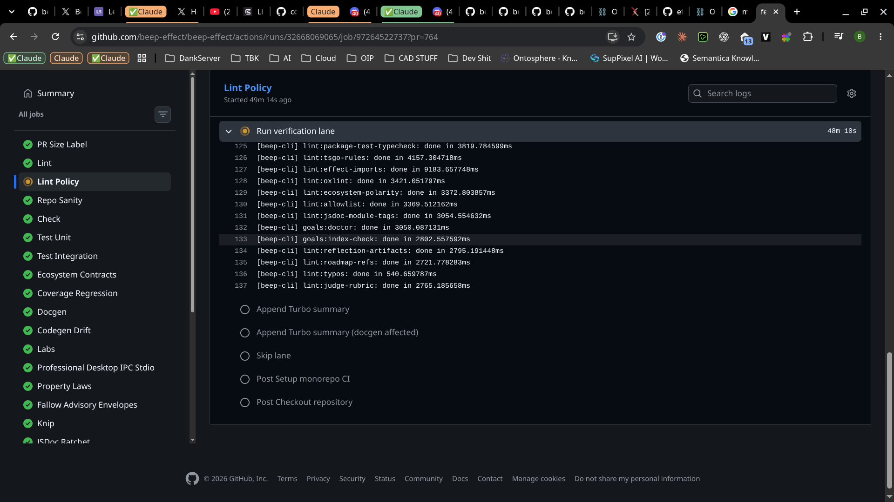

# Capture

<!--
Stage 0. Append-only raw dump: thoughts, links, screenshots (drop files in
assets/ and reference them), half-sentences, contradictions. Nobody tidies
this file; cleaning it up destroys provenance. New material goes under a new
dated heading at the bottom.
-->

## 2026-08-23

> Can we get to the bottom of why this "Lint Policy" and other jobs some times
> hand and cause 50+ minute jobs that innevitably fail once and for all & fix
> the issue?
>
> I just ran `aws login` so access to cloud watch is available.
>
> also for pulumi key here is the ref:
> `[redacted 1Password secret reference supplied out-of-band]`
>
> If we can't figure it out then we need to find a way that we should find a
> way to host some observability infrastructure and tool the crap out of the
> scripts & CI jobs so that we can actually figure out what is going on.

## 2026-08-23 — requested continuation mode

> Do some digging & give me some recommendations & run a $grilling session.
