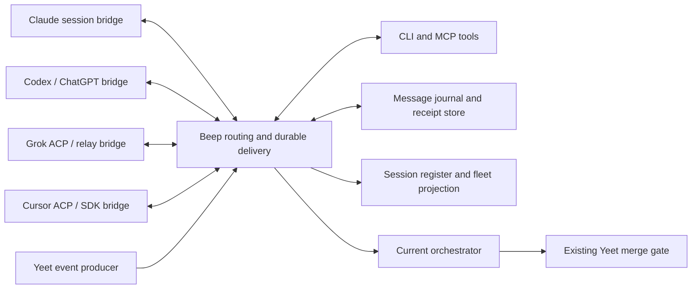

# Brief

Accepted by the operator on 2026-10-09. The capability spike is authorized.
Implementation/backend decisions remain subject to its evidence.

The authorized spike has now run. [Measured results](research/spike/README.md)
support three managed native adapters and explicit permission checks. A subsequent Claude web
idle app/worker exchange passed via visible UI. Other app surfaces, autonomous
reply tools and Cursor generation remain unqualified;
the full requested outcome retains those acceptance gates.

## Problem

The orchestrator can own a PR gate and record a worker's state, but cannot rely
on a common path to contact Claude, Codex/ChatGPT, Cursor and Grok sessions.
An agent may finish while the coordinator is idle; a review may invalidate a
worker's task while it is still generating; a handoff may leave replies pointed
at the predecessor. Durable state and live conversation must work together.

The requested outcome is direct, bidirectional communication in existing app
sessions and Beep-launched workers, without the operator copying messages
between them. Transport, context delivery, wakeup, steering and task completion
must have distinct observable receipts.

## Appetite

Capability is the priority. Proposed first increment: one bounded capability
spike covering all four provider families, both existing-session and managed
modes, with separate passing/failed/unsupported results per cell. Follow with
one production vertical slice before broad rollout. There is no operator-approved
calendar or money budget. Use existing authorized subscriptions; new paid
services or endpoints remain a money decision.

## Solution sketch

A workstation service exposes a typed message API over a private local socket,
with CLI and MCP tools, streaming subscriptions, durable replay and delivery
receipts, including ambiguous-consumption recovery. It reads fleet/session ownership from the existing register and
ledger, and binds short-lived endpoint registrations to runtime identities.
Human-started sessions enroll through supported channels or app bridges,
including a separately qualified browser-mediated conversation route;
managed workers enroll when Beep launches their native runtime interface.

Adapters advertise individual capabilities: receive while busy, start an idle
turn, steer, cancel, resume, attach, streaming text, tool progress, attachments,
permissions and context limits. A message can request a delivery mode. If the
adapter cannot satisfy it, the sender sees a typed unsupported/deferred result.
Rich provider features remain available through namespaced extensions.

The service routes direct messages, replies, directed groups and task/PR topics.
Agents can confer without routing every sentence through the orchestrator.
Delegation, model fallback and merging still follow the existing authority rules.
The orchestrator receives actionable work events and can change role holders
without losing messages addressed to the role.

A separate network gateway can connect host brokers and expose A2A task
interoperability. Local correctness must not depend on a cloud service. Agent
Relay is the strongest adoption candidate for the delivery layer; its runtime
and attach paths must pass the same probes as native adapters.

## Rabbit holes

- Claiming universal "realtime" from output streaming or a successful socket write.
- Equating a resumed history in a new process with the app session still on screen.
- Treating documented preview features or upstream source as installed behavior.
- Building a distributed broker before proving the last step into each app.
- Reimplementing ACP, session ownership, scheduling, Yeet inbox capture or merge gates.
- Creating recursive reply storms, competing session writers, or stale role holders.
- Inheriting provider-global plugins and hooks into disposable managed workers.

## No-gos

- No claim that all four existing apps can be controlled until their matrix passes.
- No replacement shared-memory service or new code index.
- No change to provider model pins, delegation chains, billing or merge authority.
- No automatic permission approval based on peer message content.
- No silent downgrade from same-session attachment to a fork, resume or new worker.
- No production daemon, app patch, settings change or deployment in this research packet.
