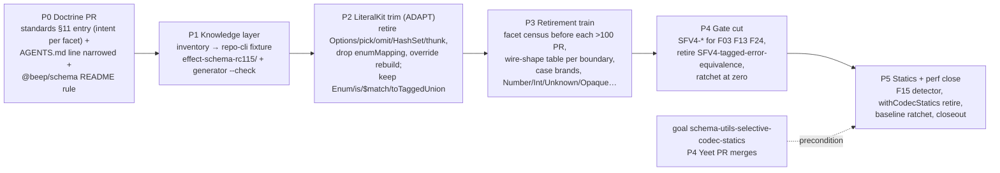

# Brief

<!--
Stage 3 (shape), drafted 2026-09-14 from CAPTURE.md, RESEARCH.md and the 21
DECISIONS.md entries. Fat-marker fidelity: the goal packet owns the design.
-->

## Problem

`@beep/schema` (`packages/foundation/modeling/schema`) was written against
older Effect v4 release candidates. Effect main keeps absorbing what it
hand-rolls: the retirement audit found 137 top-level concepts, of which 50
are RETIRE, 6 UNSURE (now retire, per the Role B decision), 4 ADAPT, 77 KEEP.
The largest surface, `LiteralKit`, has 536 direct consumers. Its schema facet
is already upstream's `S.Literals`; its keyed value API (`Enum`, `is`,
`$match`, `toTaggedUnion`) is what consumers use and has no upstream form, so
it is trimmed to that API, not deleted (reopened 2026-09-15 after a static
census; the 2026-09-14 retire ruling had judged the schema facet alone).

Three costs compound on every effect bump:

1. **Drift.** Nothing detects that a local concept became redundant. The
   rc.112..main delta (28 commits) had five ADOPT items nobody had picked up
   and one stale `propertyOrder` recognition.
2. **Type-check load.** The three measured packages instantiate 1.3M, 7.8M
   and 1.3M types; wrapper surfaces (codec statics, the kit's `M` type
   parameter) are the candidate local cost drivers; none is measured until
   the P5 ratchet and the per-PR before/after numbers.
3. **Agent priors.** Sub-agents write schema code from training-data
   memory of v3 or of local wrappers. There is no queryable, sha-pinned
   inventory of upstream's schema surface for prompts to be templated from.

Why now: the effect catalog moved to `4.0.0-rc.115` on 2026-09-12, the
knowledge-layer prototype exists (`research/inventory/`, 2,105 rows over 14
Role A modules), and the audit is fresh against upstream `51d4a2f08a`.

## Appetite

One goal packet, six phases, one release train. Budget: the retirements and
gate must land before the next effect RC bump forces a re-audit; treat that as
roughly six weeks of part-time attention plus Codex lane volume. The bound
shapes the solution three ways:

- Codemods, not hand edits, for anything over 100 files (`Number` 361, the
  `LiteralKit` facet renames 212, `Int` 143, `Unknown` 128, `Opaque` 103).
- Only families with census confidence at least 0.70 and reach at least 100
  files become detectors (F03, F13, F24, plus the F26 correction; F01 was
  dropped on 2026-09-15 after the LiteralKit ADAPT reopen, the type checker
  gates the trim). The rest are skill prose or dropped.
- The 77 KEEP concepts are not touched. Retirement is intent coverage, not a
  rewrite of `@beep/schema`.

## Solution Sketch

**P0 Doctrine, its own small docs PR.** The "Upstream-First
Foundation/Modeling" entry in `standards/architecture/11-evolution-and-deprecation.md`
(text drafted in `research/gate-and-knowledge-plumbing.md` §g, amended by
the 2026-09-15 decision): intent is judged on the consumed surface, facet by
facet; a concept whose dominant facet upstream does not cover is ADAPT (trim
the covered facets), otherwise it is retired, consumers adapt in the same PR,
no thin re-export alias. Any RETIRE over 100 consumers runs a static-facet
census before its PR opens. The same PR narrows the AGENTS.md Code Laws line:
`LiteralKit` stays the default for named literal domains, `S.Literals` for
anonymous inline unions; the user's global rule needs no change. Reviewers of
every later PR read a rule that already exists.

**P1 Knowledge layer.** Move `research/tools/schema-inventory.ts` and its
verifier into repo-cli; the rows land at
`packages/tooling/tool/cli/test/fixtures/effect-schema-rc115/inventory/*.jsonl`,
one directory per RC like `effect-vitest-rc115`. Identity stays
`(module, symbol, kind)`; `@internal` rows are kept and flagged, never
adoption targets. Hosted CI verifies shape and sha; `--check` against
`.repos/effect` is local. Agent prompts for the later phases are templated
from these rows.

**P2 LiteralKit trim (ADAPT).** The kit keeps its schema facet (already
`S.Literals`) and its keyed value API: `Enum`, `is`, `$match`,
`toTaggedUnion`, `LiteralToKey`. It loses the facets upstream covers:
`Options` (rename to `.literals`), `pickOptions` / `omitOptions` (`.pick`,
explicit complement), `HashSet` (call-site `HashSet.fromIterable`), `thunk`
(`F.constant(X.Enum.k)`), and `enumMapping` with its `M` type parameter and
collision/coverage validators (two consumers rewrite). The statics are
re-attached by overriding upstream's public `rebuild(ast)` so `check`,
`annotate` and `pipe` all keep them; today only `annotate` does.
`MappedLiteralKit` gets the same trim on its `From`/`To` kits. One PR, kit
and consumers together, done when the type check passes and no retired name
remains; a before/after `--extendedDiagnostics` number rides with it. The
codemod engine built here is reused by the P3 numeric and unknown groups.

**P3 Retirement train.** The remaining RETIRE and UNSURE concepts, grouped
by upstream target, each PR carrying its consumer migration. Before any
concept over 100 consumers opens its PR (`Number`, `Int`, `Unknown`,
`Opaque`), a static-facet census like the LiteralKit one decides RETIRE or
ADAPT; an uncovered dominant facet flips the row to ADAPT. The SPEC carries
a boundary→codec table (persisted column, HTTP payload, in-memory, log line)
naming the upstream codec per boundary; persisted and external contracts stay
byte-identical, only in-memory shapes may change. Case brands become
`S.decodeTo` + `String.*Case` for normalization or an inline
`S.String.check(S.isPattern(...))` for rejection. Role B targets: Mime lookup,
Ndjson stream shape, HttpStatus value-module lookups, with the losses
recorded.

**P4 Gate cut.** New `SFV4-*` rules in `SchemaFirstDetectors.ts` for F03,
F13, F24 with ratchet baselines (F01 dropped 2026-09-15: once the trim lands
the type checker is the gate); the stale `SFV4-tagged-error-equivalence` rule
and its remediation string are deleted; the `SchemaUtils` remediation strings
in `SchemaFirstPolicy.ts` are rewritten and the `LiteralKit` one is narrowed
to the surviving facets; `literal-kit-const-assertion` stays. Finding identity for the
parity lane is occurrence-anchored, not line-keyed. No parallel gate.

**P5 Statics and performance close.** After
`goals/schema-utils-selective-codec-statics` merges its P4 PR: F15 detector,
`withCodecStatics` retirement (`collectAnnotationsAt` survives), and the
performance ratchet against the committed rc.115 baseline
(@beep/schema 1,307,910 instantiations / 0.529 s; repo-cli 7,786,120 /
3.717 s; law-practice-domain 1,289,820 / 0.659 s), with one or two upstream
typeperf fixtures mirrored. Goal closes when the gate exists and its backlog
is zero.

**Standing behaviour after close.** Every effect bump: regenerate the
inventory directory for the new RC, run the parity lane, work the findings to
zero in the bump PR. "Going forward" is the lane, not an open goal.

## Rabbit Holes

- **Consumer counts are direct imports only.** Barrel re-exports and runtime
  namespace aliases hide dependents. Each retirement PR sizes itself with a
  compiler-backed closure (`graft callers --depth all` plus a type-check),
  not the census number.
- **Upstream `export` is not public API.** `Schema.BooleanLiterals` and
  `withArrayLengthConstraints` are `@internal`; the inventory flags them.
  Every adoption target is checked against installed `dist/*.d.ts`.
- **Wire-shape drift on stored data.** Timestamp, Duration, Uint8Array and
  the mutable collections all have upstream defaults that differ from ours.
  The boundary table is the control; a retirement PR that changes a persisted
  encoding is a migration PR and is out of this goal.
- **Line-keyed finding identity churns.** The existing schema-first key
  includes the line; the parity baseline needs occurrence anchors or it
  reports stale entries on unrelated edits.
- **Yeet capture cap.** PRs over 512 KiB of capture or roughly 4k paths take
  the manual `gh pr` path (memory: stale-base guard overflow). The `Number`
  and `Int` retirement PRs are the likely ones; the LiteralKit trim is about
  250 files and should fit.
- **Hosted CI cannot see the knowledge layer.** Only committed JSONL, policy
  and baselines run hosted; `.repos/effect`, graft and LLMs are local refresh
  inputs.
- **Decision revised at shape.** The 2026-09-12 "one PR for everything"
  batching decision is superseded by the 2026-09-14 rulings (doctrine ahead,
  statics after another goal merges). The train above is the replacement;
  Recorded in DECISIONS.md ("PR batching revised", 2026-09-14).
- **Decision revised at decompose.** The 2026-09-14 "LiteralKit retires"
  ruling is superseded by the 2026-09-15 facet-by-facet ADAPT ruling; the
  audit row's own "static-member census UNVERIFIED" note was the tell. Any
  audit row whose consumed surface was not censused is suspect until it is.

## No-Gos

- No deprecation shims, thin re-export aliases, or "compat" modules for any
  retired concept.
- No rewrite of the 77 KEEP concepts, and no new `@beep/schema` abstractions
  introduced while retiring old ones.
- No changes to persisted or externally served encodings; those are
  migration work outside this goal.
- No detectors for families under confidence 0.70 or reach 100 files (F05,
  F06, F04 and ranks 10 through 21); they are skill prose at most.
- No editing of the user's global rule files by an agent.
- No new workspace package for the inventory; it is a repo-cli fixture plus
  a generator.
- No graft, `.repos/effect` or LLM dependency in hosted CI.
