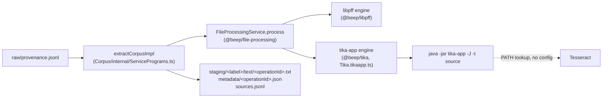
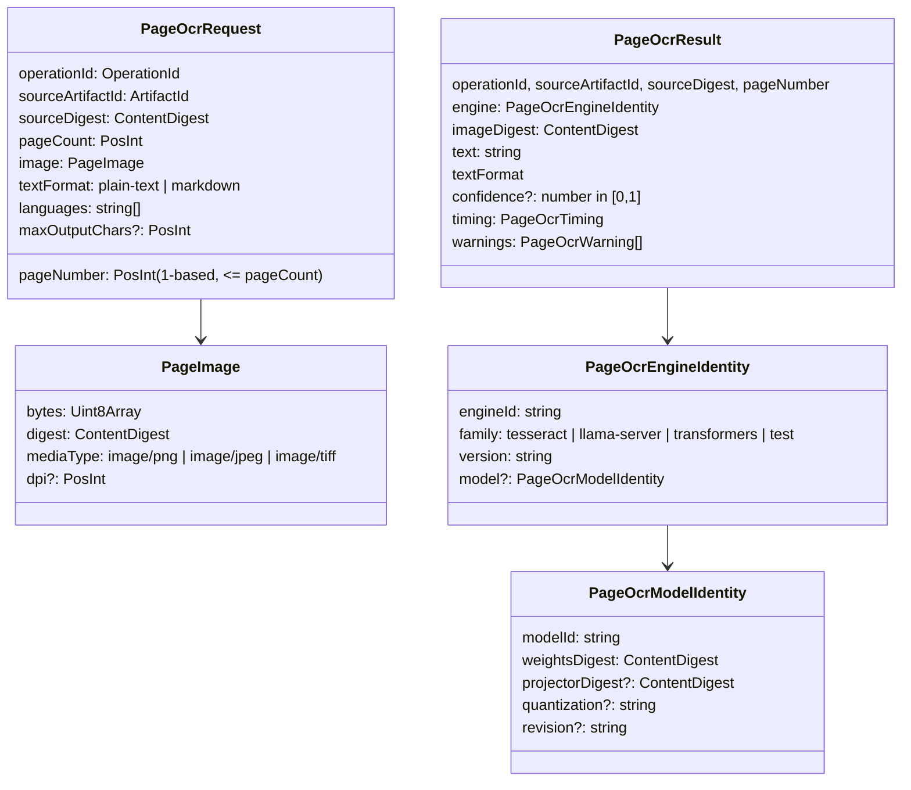

# OCR engine seam: design

2026-10-06. Schema first, then the service contract, then where drivers and
storage go. The schema and service contract in section 2 and 3 are landed in
`@beep/file-processing/PageOcr` with tests. Everything after section 3 is a
proposal; nothing is wired into `corpus extract`.

## 1. Where extraction reads text today



Facts read from the code:

- `makeTikaAppFileProcessingEngine` spawns `java -jar <jar> -J -t <file>` once
  per source and keeps only the first row of the JSON array
  (`decodeTikaResponseRecord` uses `A.head`).
- OCR is never requested or configured. Tika finds Tesseract on `PATH` and
  applies its own default: a PDF page is rendered and read only when its text
  layer is nearly empty. The engine descriptor does not say whether a text came
  from a text layer or from Tesseract; `sources.jsonl` records
  `engine: "apache-tika"` for both.
- Image sources (`png`, `jpg`, `tif`, ...) map to the `image-metadata` format
  family, and the engine drops their text
  (`operation.format === "image-metadata"` omits `text`). Tika does run
  Tesseract on them; the result is discarded.
- The Tika metadata row is kept per source in `metadata/<operationId>.json`. It
  carries `xmpTPg:NPages`, `pdf:charsPerPage` (one number per page) and
  `pdf:ocrPageCount`, which is enough to find low-text pages after the fact
  without re-opening the PDF.
- `FileProcessingSkipReason` already has `ocr-disabled`, unused.

## 2. Schema (landed)

`packages/foundation/capability/file-processing/src/PageOcr/PageOcr.schema.ts`



Choices and their reasons:

- **The unit is one page, not one document.** A re-read pass replaces some
  pages of a document and keeps the text layer of the others. A
  document-level request cannot express that.
- **The request carries a rendered image, not a PDF.** Rendering (resolution,
  color, which renderer) is a separate decision with its own digest. Engines
  stay free of PDF libraries, and two engines can be compared on the same
  bytes: `imageDigest` in the result proves it.
- **Model identity is a content digest.** `modelId` alone is ambiguous across
  quantizations and revisions. `weightsDigest` plus `projectorDigest` (GGUF
  vision models ship the vision projector as a second file) pins what ran.
- **`confidence` is optional.** Tesseract reports per-word confidence. The
  vision models surveyed do not report a calibrated score. A required field
  would force drivers to invent one.
- **Warnings are a closed set** (`output-truncated`, `repetition-suspected`,
  `empty-output`, `low-confidence`). These are the vision-model failure modes
  a caller must see before a page text may replace an earlier reading.
- **Reused, not new:** `ArtifactId`, `OperationId`, `ContentDigest` from
  `@beep/file-processing/Artifact`; the package-local `PosInt`.
  `SourceTextExtractor` in `@beep/provenance` (`{ name, version }`) is the
  existing extractor identity for canonical source text; section 5 maps
  `PageOcrEngineIdentity` onto it instead of widening it here.
- **Not reused:** `SourceTextPage` in the same package is a fixed-size window
  of code units over canonical text. It is not a document page. The new
  schemas say `PageOcr` and `PageImage` to keep the two apart.

## 3. Service contract (landed)

`packages/foundation/capability/file-processing/src/PageOcr/PageOcr.service.ts`

```ts
type PageOcrEngineShape = {
  readonly identity: PageOcrEngineIdentity
  readonly recognizePage: (request: PageOcrRequest) => Effect.Effect<PageOcrResult, PageOcrError>
}

type PageOcrServiceShape = {
  readonly engines: ReadonlyArray<PageOcrEngineIdentity>
  readonly recognizePage: (engineId: string, request: PageOcrRequest) => Effect.Effect<PageOcrResult, PageOcrError>
}
```

- `PageOcrService` is a `Context.Service`; `makePageOcrServiceLayer(engines)`
  routes by exact `engineId`.
- An unknown id fails with `engine-not-found`. The service never falls back to
  another engine: a stored page text must name the engine that produced it,
  and a silent fallback would make that a lie.
- `PageOcrError` reasons: `engine-not-found`, `engine-unavailable`,
  `image-rejected`, `recognition-failed`, `recognition-timed-out`,
  `output-limit-exceeded`. No process, HTTP or device detail crosses the
  boundary, the same rule `FileProcessingOperationError` follows.
- The page OCR service sits beside `FileProcessingService`, not inside
  `FileProcessingEngineShape`. The existing engine contract is "one source in,
  one text out"; adding pages to it would change every driver.

## 4. Drivers (proposed)

External engines belong in `packages/drivers/*`
(`standards/ARCHITECTURE.md`: "External engines, SDKs, services, frameworks
... `drivers/*`"). Each driver exports a constructor that returns a
`PageOcrEngineShape`. New packages come from `bun run beep create-package`.

| Driver | Wraps | Family | Notes |
| --- | --- | --- | --- |
| `@beep/tesseract` (new) | `tesseract <png> - tsv` | `tesseract` | The CPU baseline as a first-class engine. Gives per-word confidence, which Tika hides. |
| `@beep/llama-server-ocr` (new) | a running `llama-server` with a vision GGUF | `llama-server` | HTTP only. Compose on `@beep/openai-compat` (`OpenAiCompatClient`), which already speaks the OpenAI chat endpoint that `llama-server` serves. The driver does not start the server or pick a GPU; that is deployment. |
| `@beep/poppler` (new) | `pdftoppm`, `pdfimages -list`, `pdfseparate` | n/a | The page rasterizer: PDF page to `PageImage`, plus the "does this page carry a full-page raster" probe that the selector in section 6 needs. |

A Python `transformers` engine would be a fourth driver that talks to a small
local HTTP wrapper. It is listed in the family set and deferred until the
benchmark shows it beats the `llama-server` path.

Device ownership stays out of the repo contract. Which card, how many slots,
when a run may start: those are workstation rules, and the driver sees only a
base URL. `engine-unavailable` is the one signal it needs.

## 5. Storage: which engine produced a text

Today a source has one text file and one `engine` string. A re-read must not
overwrite either: the earlier text is evidence, and a bundle must be able to
say which reading it used.

Proposed layout, additive to an existing extract output:

```text
staging/<label>/
  sources.jsonl                 unchanged
  text/<operationId>.txt        unchanged (first reading)
  ocr/<ocrRunId>/
    run.json                    engine identity, render settings, selector, counts
    pages.jsonl                 one PageOcrRecord per page read
    text/<operationId>.txt      composed text for sources this run re-read
  text-readings.jsonl           one row per (source, reading): which file, which engine, which is preferred
```

- `PageOcrRecord` = `PageOcrResult` without the text body, plus `textDigest`
  and the page's byte range inside the composed text file. It is the page
  level provenance row.
- `ocrRunId` is derived from the engine identity digest, the render settings
  and the selector version, so re-running the same configuration is
  idempotent and a different model lands in a different directory.
- Composed text for a re-read source = per page, the new reading where the
  page was selected and the first reading otherwise, joined in page order.
  That needs page-separated first-reading text, which `tika -t` does not give.
  Two options: run Tika with XHTML output and split on `<div class="page">`,
  or have the pass re-read every page of a selected source. The second is
  simpler and costs more GPU time; the benchmark's seconds per page decide.
- `text-readings.jsonl` is where a bundle learns which engine produced the
  text it shipped: `{ artifactId, operationId, textPath, textDigest, reading:
  "first" | "ocr", ocrRunId?, engine, preferred }`. The enrich and bundle
  stages read `preferred` instead of assuming `text/<operationId>.txt`.
- For canonical source text, `PageOcrEngineIdentity` maps to the existing
  `SourceTextExtractor`: `name = engineId`, `version = <runtime version>` +
  `+` + the first 12 hex digits of the weights digest. `SourceTextIdentity`
  then pins the engine without a schema change in `@beep/provenance`.

## 6. Selecting what to re-read

The selector reads only an extract output (`sources.jsonl` and
`metadata/<operationId>.json`) and emits page-level work items. Four classes,
in the order they should be enabled:

| Class | Rule | Why |
| --- | --- | --- |
| A. low-text PDF pages | `pdf:charsPerPage[i] < 50` | Tika already sent these to Tesseract (or got nothing). This is the "scans" class. |
| B. image sources | format `image-metadata` | Their text is discarded today. A re-read is the first reading. |
| C. failed sources | row in `failures.jsonl` with a PDF or image extension | No text at all. |
| D. scanned pages with a text layer | a full-page raster on the page (`pdfimages -list`) and `pdf:charsPerPage[i] >= 50` | The text layer is an earlier OCR of unknown quality. Tika trusts it. Needs the `@beep/poppler` probe, so it comes last. |

Measured on the July extract (counts only, see `BENCHMARK.md`): class A is
1,052 of 2,845 PDF pages, class B is 252 sources, class D is 517 pages. Class
D is invisible to any chars-per-page rule and is one page in six.

Acceptance of a re-read is a separate rule, not part of the selector: a new
page text replaces the first reading only when it carries no
`output-truncated` or `repetition-suspected` warning and is not shorter than
the first reading by more than a set ratio. The ratio is an open question for
the align stage; the benchmark gives the first numbers.

## 7. Open questions

1. Page-separated first-reading text: split Tika XHTML, or re-read whole
   selected sources?
2. One `llama-server` per model, or one server with model swapping? Affects
   only deployment, not the contract.
3. Should class B change `FileFormatFamily` (`image-metadata` to an
   `image-text` family) so the first extraction keeps Tesseract's text, or
   stay a re-read-only path?
4. Acceptance ratio and whether a second engine must agree before a page
   reading replaces Tesseract on a document that matters.
