# Structural Fastener Distribution Process

**Packet:** `explorations/lejeune-bolt-agentic-demo`
**Lane:** research (external landscape)
**Date:** 2026-08-25
**Access date for all live URLs in this file:** 2026-08-25
**Purpose:** Ground an AI-agent design for LeJeune Bolt Company sales/logistics work — quote, source, order, and specify structural fasteners with a human approval gate — in the actual buyer → distributor → manufacturer workflow, not in a generic “industrial supply” story.

This is not LeJeune’s internal SOP. It is a cited reconstruction of the industry process that LeJeune’s published materials, Jackson LeJeune’s paraphrased day ([`CAPTURE.md:60-69`](../CAPTURE.md)), and public AISC/RCSC/ASTM/FHWA/manufacturer/ERP sources jointly describe. Anything that would require sitting at their desk, opening a manufacturer portal, or reading their mail is marked **UNVERIFIED**.

## How to read this

- Every factual claim carries a URL or a repo `path:line`.
- **UNVERIFIED** means: plausible from adjacent evidence, not proven for LeJeune, or not proven as a number/name/URL.
- No invented URLs, names, or quantities. Sample emails in §6 are labeled **SYNTHETIC EXAMPLES** and use fictional companies/jobs.
- Public-repo hygiene: company addresses and published company phones/emails only. Individual staff emails from the public site are not recopied here.

---

## 0. Where LeJeune sits in the chain

LeJeune Bolt Company is a Burnsville, Minnesota structural-fastener house (Western Region warehouse in Chino, CA) that sells high-strength bolts, matched assemblies, anchors/rods, hardware, and installation tools, and that invented and exclusively supplies the ASTM F3148 TNA® Torque+Angle fastening system ([lejeunebolt.com](https://lejeunebolt.com/); [tightenright.com](https://www.tightenright.com/); [shortspansteelbridges.org supplier page](https://www.shortspansteelbridges.org/suppliers/lejeune-bolt-company/); NASCC exhibitor sheet, [static.goexposoftware.com PDF](https://static.goexposoftware.com/nascc18/FORMfields/uploads/pressreleasescurprurl1516309071344399050.pdf)).

Public positioning:

| Claim | Source |
| --- | --- |
| Founded 1976/1977 in Burnsville; HQ 3500 West Highway 13, Burnsville, MN 55337; Western Region 3655 Placentia Ct, Chino, CA 91710 | [lejeunebolt.com](https://lejeunebolt.com/) (site says warehouse in 1976); brochure PDF says garage in Minneapolis in 1977 ([lejeunebrochure.pdf](https://lejeunebolt.com/lbc/wp-content/uploads/2016/07/lejeunebrochure.pdf)); LinkedIn “Founded 1977” ([linkedin.com/company/lejeune-bolt-company](https://www.linkedin.com/company/lejeune-bolt-company)) — **year conflict is published, not resolved here** |
| Privately held; 11–50 employees; specialties “Structural Bolts” | [LinkedIn company page](https://www.linkedin.com/company/lejeune-bolt-company) |
| “Leading supplier of structural fasteners and tools and exclusive source of the TNA® Torque + Angle Fastening System” | [LinkedIn](https://www.linkedin.com/company/lejeune-bolt-company); [tightenright.com](https://www.tightenright.com/) |
| Inventor and exclusive supplier of F3148 TNA; past projects listed include SoFi Stadium, Wilshire Grand Center, Bay Bridge SAS Span | Capability statement PDF ([03-158-Capability-Statement.pdf](https://lejeunebolt.com/lbc/wp-content/uploads/2021/08/03-158-Capability-Statement.pdf)) |
| Average industry tenure “over 20 years”; full line of structural products, concrete anchoring, stud welding, general-line fasteners; TONE/Makita tools, rental and repair | [shortspansteelbridges.org](https://www.shortspansteelbridges.org/suppliers/lejeune-bolt-company/) |
| TNA bolts “100% Melt & Manufacture in the U.S.”; Combined Method is an RCSC-approved installation method | [tightenright.com](https://www.tightenright.com/) |
| Chad M. Larson appears as an RCSC member on the 2020 specification’s membership roster | [2020 RCSC Specification PDF](https://www.boltcouncil.org/files/2020RCSCSpecification.pdf) (preface membership list) |
| Toll-free 800.872.2658 / “800.USA.BOLT”; overnight tools; ISO-based quality sampling before shipment; services include rotational-capacity testing, contract review, tool rentals, same-day tool repair | [lejeunebolt.com](https://lejeunebolt.com/); [lejeunebrochure.pdf](https://lejeunebolt.com/lbc/wp-content/uploads/2016/07/lejeunebrochure.pdf) |
| Microsoft Office is the system of record | [`CAPTURE.md:57-58`](../CAPTURE.md) — **UNVERIFIED beyond Jackson’s statement** |
| U.S. Bank Stadium and NASA proprietary/patented fasteners as jobs sold/fulfilled | [`CAPTURE.md:23-24`](../CAPTURE.md) — **UNVERIFIED in public sources searched for this lane** |

Jackson’s paraphrased day is the local workflow this report is trying to match ([`CAPTURE.md:60-69`](../CAPTURE.md)):

1. Intake emails/calls listing bolts and install tools → check manufacturers/sellers for availability, price, delivery windows, supply → log into those sellers’ systems and place orders for the buyer.
2. Clarify and specify what the buyer still needs given parts already purchased or in transit — matched nuts/washers and the rest of the jargon.

That is a **distributor-as-specifier** job, not a catalog-checkout job. Portland Bolt’s manufacturer-vs-distributor FAQ is the closest public description of the same middle: distributors stock repetitive A325 structural bolts, nuts, washers, anchors, and all-thread; they also broker nonstandard items from manufacturers to fabricators, erectors, and contractors; they run small orders to jobsites and fill bins ([portlandbolt.com manufacturer vs distributor](http://portlandbolt.com/technical/faqs/manufacturer-vs-distributor-whats-the-difference/)). LeJeune’s published mix is that plus a proprietary matched assembly (TNA), a test lab, and a tool-rental/repair shop ([lejeunebolt.com/product-portfolio](https://lejeunebolt.com/product-portfolio/); [lejeunebolt.com/tool-portfolio](https://lejeunebolt.com/tool-portfolio/); brochure services list).

```mermaid
flowchart LR
  EOR["EOR / AISC + RCSC specs"] --> DWG["Drawings + bolt schedule"]
  DWG --> FAB["Fabricator takeoff / RFQ"]
  DWG --> ER["Erector fill-in RFQ"]
  FAB --> DIST["Distributor inside sales"]
  ER --> DIST
  DIST --> SPEC["Spec clarification: grade, type, finish, matched assembly, certs, domestic"]
  SPEC --> SRC["Source: mill / manufacturer / master distributor / own TNA stock"]
  SRC --> QTE["Quote: price, ATP, lead, freight, docs"]
  QTE --> PO["Buyer PO"]
  PO --> SPO["Distributor PO into supplier system"]
  SPO --> SHIP["Ship / partial / backorder"]
  SHIP --> DOCS["MTR / CoC / RoCap / lot tags"]
  DOCS --> JOB["Jobsite + Skidmore / gun / DTI"]
```



---

## 1. Buyer → distributor → manufacturer flow

### 1.1 Who the buyer is

Typical structural-fastener buyers in this lane are **steel fabricators** (shop, often buying bolts that ship with steel) and **erectors** (field, often buying fill-in quantities, TC guns, calibrators, DTIs). Portland Bolt’s steel-fabrication page treats fabricators as a named vertical and lists hex assemblies, F3125 A325/A490 heavy hex, and Squirter® DTIs as everyday items ([portlandbolt.com/steel-fabrication](https://www.portlandbolt.com/about/industries/steel-fabrication/)). LeJeune’s product portfolio is written to the same two audiences: TC and heavy-hex structural assemblies for steel-to-steel, plus F1554 bent anchors, threaded rod, Powers mechanical/chemical anchors, clevises, and install tools ([lejeunebolt.com/product-portfolio](https://lejeunebolt.com/product-portfolio/)).

AISC’s economical-bolting FAQ is the engineer-side constraint the RFQ is trying to satisfy: prefer ¾″, ⅞″, and 1″; keep a ¼″ diameter step so an undersize bolt cannot be installed in the wrong hole; do not mix A325 and A490 of the same diameter on one project ([AISC Engineering FAQ 6. Bolting](https://www.aisc.org/aisc/solutions-center/engineering-faqs/6-bolting/)).

### 1.2 What an RFQ actually contains

ASTM F3125 §3, quoted by AISC FAQ 6.2, is the purchase-order schema the industry uses. Orders “shall include”:

1. ASTM designation
2. Quantity (number of bolts **or assemblies, including washers, if required**)
3. Size: nominal diameter, length, thread pitch if nonstandard
4. Grade: A325, A490, F1852, F2280, or metric A325M/A490M
5. Type: Type 1 or Type 3 (if omitted, supplier may furnish either)
6. Style: Heavy Hex or Twist-Off
7. Coatings/finishes if other than plain (Annex A1)

plus, when required, rotational-capacity testing and shipment as a bolt/nut/washer assembly. “For structural fasteners, you must order test reports.” ([AISC FAQ 6. Bolting](https://www.aisc.org/aisc/solutions-center/engineering-faqs/6-bolting/))

Portland Bolt’s “How to Order Bolts” expands that schema into the commercial fields a distributor actually quotes against: quantity, dimensions, finish, grade, configuration, thread length, nuts/washers/accessories, **domestic requirements**, delivery, quote-response time, freight (FOB / prepaid / collect / third-party), tax, and certification/special testing. Their worked example is the canonical RFQ sentence:

> “Please provide a quote for 100 pieces of a domestic ¾″ diameter × 30″ long hot-dip galvanized ASTM A307 grade A hex bolt with 4″ of thread. Include one (1) nut and (1) washer per bolt. Quote the materials FOB Los Angeles, California and deliver them no later than 3 weeks from the time of order placement. Certification is required and pricing is required by the end of the day.”
> ([portlandbolt.com/how-to-order-bolts](https://www.portlandbolt.com/technical/faqs/how-to-order-bolts/))

Industrial-fastener RFQ pages add ship-to (city / jobsite / warehouse), quote deadline, and documentation needs ([flangedpipesupply.com/fasteners](https://flangedpipesupply.com/fasteners/)). Fabrication-shop RFQs often arrive **piecemeal across several emails** and still need drawings ([anchordanly.com “The Perfect Request-for-Quote”](https://www.anchordanly.com/the-perfect-request-for-quote/)).

**UNVERIFIED:** LeJeune’s actual intake mix (Excel bolt lists vs. PDF schedules vs. phone vs. Teams) beyond Jackson’s “emails, calls, and other contacts” ([`CAPTURE.md:62-65`](../CAPTURE.md)).

### 1.3 Bid / takeoff sources

The bolt list is not invented at the distributor. It is extracted from:

| Source | What it contributes | Citation |
| --- | --- | --- |
| Structural drawings / shop drawings | Hole size, grip (ply thickness), connection type, whether the joint is snug-tight, pretensioned, or slip-critical | AISC shop-drawing workflow in the fabricator management manual ([cloud.aisc.org MgmtManual_2.pdf](https://cloud.aisc.org/teaching_aids/MgmtManual_2.pdf)); AISC FAQ 6.5 on joint types ([AISC 6. Bolting](https://www.aisc.org/aisc/solutions-center/engineering-faqs/6-bolting/)) |
| Bolt schedule on drawings | Diameter × length × grade × quantity by mark | Industry practice; AISC FAQ 6.2 ordering fields are what a schedule must resolve ([AISC 6. Bolting](https://www.aisc.org/aisc/solutions-center/engineering-faqs/6-bolting/)). A named “bolt schedule” template used by LeJeune customers is **UNVERIFIED**. |
| AISC 360-22 | When pretension / slip-critical is required; Group 120/144/150 strengths | [lejeunebolt.com](https://lejeunebolt.com/) cites AISC 360-22; RCSC 2020 is printed in the AISC Steel Construction Manual Part 16 ([accuristech preview of AISC 325:2023](https://store.accuristech.com/products/preview/2570489)) |
| RCSC 2020 *Specification for Structural Joints Using High-Strength Bolts* | Joint type, matched assemblies, pretension methods, inspection, storage/lube, reuse | [boltcouncil.org 2020 PDF](https://www.boltcouncil.org/files/2020RCSCSpecification.pdf) |
| ASTM F3125 / F3148 / F1554 / A563 / F436 / F959 / F2329 / B695 | Product, nut, washer, DTI, coating | AISC FAQ 6.2; LeJeune product pages; Portland Bolt grade pages |
| Project spec (DOT, AASHTO, AREMA, seismic AISC 358, Buy America) | Domestic melt-and-manufacture, Type 3 weathering, RoCap, extra certs | LeJeune TNA approvals ([lejeunebolt.com](https://lejeunebolt.com/); [tightenright.com](https://www.tightenright.com/)); FHWA bolt Q&A ([fhwa.dot.gov/bridge/boltsqa.cfm](https://www.fhwa.dot.gov/bridge/boltsqa.cfm)) |

TC bolt **length is not the same as hex length**. LeJeune’s “How the TC Bolt Works” adds a diameter-specific increment to **grip** (total material thickness) and rounds up to the nearest ¼″ — e.g. add 1″ to grip for ¾″, 1¼″ for 1″ ([howthetcboltworks.pdf](https://lejeunebolt.com/lbc/wp-content/uploads/2016/07/howthetcboltworks.pdf)). FHWA: bolt length is measured to the washer face of the head; grip is washer-face of head to washer-face of nut; recommended stick-out is flush to three threads, with 3–5 threads in the grip ([FHWA bolts Q&A](https://www.fhwa.dot.gov/bridge/boltsqa.cfm)). Field jargon on X matches that: “That’s a TC bolt, you don’t include the tit when measuring, that gets snapped off when torqued” ([@ISheik417, 2026-07-31](https://x.com/ISheik417/status/2083334399286735124), 3 likes / 1,655 views as fetched).

### 1.4 Quoting: what the distributor promises

A quote is not a unit price. Public sources consistently bundle:

- **Price** (affected by quantity/setup, weight, finish, grade, configuration, domestic vs import, extras for overtime/expedite) — [portlandbolt.com/how-to-order-bolts](https://www.portlandbolt.com/technical/faqs/how-to-order-bolts/)
- **Availability / ATP** (stock vs mill vs broker) — Jackson’s day ([`CAPTURE.md:63-65`](../CAPTURE.md)); Epicor fastener-distribution page (real-time inventory, “on water” inbound) ([epicor.com fastener distribution](https://www.epicor.com/en-us/solutions/industries/distribution/fastener-distribution-software/))
- **Lead time** (coating and heat-treat add time; large runs add machine hours) — Portland Bolt
- **Mill/lot traceability and certs** — AISC “you must order test reports”; Portland Bolt default MTRs on domestic/high-strength/custom; Fastenal MTR locator keyed by part + control number, with **all structural fasteners** on the MTR-required list ([Fastenal-MTR-Availability.pdf](https://crafter.fastenal.com/static-assets/pdfs/Fastenal-MTR-Availability.pdf))
- **Buy American / Buy America / BABA / AIS / DFARS** — not interchangeable; see §2.9
- **Freight terms** — FOB, prepaid, collect, third-party; include-or-exclude freight on the quote — Portland Bolt
- **Matched-assembly promise** — RCSC commentary cases where bolt and nut are a manufactured matched assembly (galvanized; TC; F3148 combined method; RoCap required) ([AISC FAQ 6.2](https://www.aisc.org/aisc/solutions-center/engineering-faqs/6-bolting/))

LeJeune’s commercial differentiators in public copy are **on-time / overnight**, **ISO-style outgoing inspection**, **contract review**, **RoCap testing**, and **tool sales/rental/repair** ([lejeunebolt.com](https://lejeunebolt.com/); brochure). Those are quote-line items, not afterthoughts: a fabricator bidding a pretensioned job is often buying **bolts + guns + Skidmore time + extra assemblies for verification**.

### 1.5 Sourcing across manufacturers and master distributors

Jackson: “check manufacturers & sellers for availability, price, delivery windows, supply… then log into those sellers’ systems and place orders” ([`CAPTURE.md:63-66`](../CAPTURE.md)).

Public manufacturer / large-inventory names that actually make or stock F3125 structural product in North America (this is the **industry set**, not a confirmed LeJeune AVL — **UNVERIFIED as LeJeune suppliers unless noted**):

| Name | What they are | Ordering surface (public) | Citation |
| --- | --- | --- | --- |
| **LeJeune TNA / F3148** | Exclusive LeJeune matched 144 ksi fixed-spline assemblies; melt & manufacture in the U.S.; Combined Method | LeJeune sales / tightenright; authorized CA distributors Boulons Plus / Precision Bolts | [tightenright.com](https://www.tightenright.com/) |
| **LeJeune TC (F1852 / F2280)** | Sold as assemblies; **Domestic and Import available** on Type 1 plain A325 TC and A490 TC; MG A325 TC **Domestic Only**; Type 3 A325 TC **Domestic only**, marketed for DOT bridges | LeJeune product portfolio | [lejeunebolt.com/product-portfolio](https://lejeunebolt.com/product-portfolio/) |
| **Nucor Fastener** (St. Joe, IN) | Domestic mill; hex, structural bolts/nuts, Tru-Tension assemblies; “Login to Order” portal; ~10,000 cataloged parts, up to 75,000 tons capacity | [nucor-fastener.com](https://nucor-fastener.com/) (“Login to Order products”); EPD ([SCS-EPD-10327](https://cdn.scscertified.com/products/cert_pdfs/SCS-EPD-10327_Nucor_Fastener_031025.pdf)) | Brighton Best (USA) posts that it “proudly carries Nucor Fastener Products” including “A325, A490 & TC structural products” ([@BrightonBest, 2026-08-13](https://x.com/BrightonBest/status/2087975128898662820), 3 likes / 49 views) |
| **Infasco** (Marieville, QC; Ivaco / Heico) | Manufacturer; TC assemblies F1852/F2280; heavy hex A325/A490; INF3013 coating for A325 **and** A490 TC (A490 cannot be mechanically galvanized) | “Get a quote”; seven NA warehouses; ~20 million lb stock | [infasco.com TC bolts](https://infasco.com/en/product/tension-control-bolts/); [infasco.com about](https://infasco.com/en/about/); [INF3013 article](https://infasco.com/en/2023/05/31/the-next-generation-of-tension-control-bolts/) |
| **Haydon Bolts** (est. 1864) | Manufacturer + large inventory of hex and TC/twist-off; “Delivered Next Day from Maine to North Carolina”; sister link to St. Louis Screw & Bolt | [haydonbolts.com](https://haydonbolts.com/) | — |
| **Unytite, Inc.** | “Leading Manufacturer for Domestic Structural Bolts”; melt and process exclusively in the U.S.; F1852/F2280 TC and A325/A490 heavy hex | [unytiteusa.com/structural-bolts](https://www.unytiteusa.com/products/structural-bolts) | — |
| **Import mill channel** | Portland Bolt: most standard imported construction fasteners come from Asia or India and are sold through “two or three wholesalers who directly import them” | [manufacturer vs distributor](http://portlandbolt.com/technical/faqs/manufacturer-vs-distributor-whats-the-difference/) | Named importers **UNVERIFIED** |
| **Master / large distributors** | Stock Nucor/Infasco/import structural; counter + will-call + LTL | Brighton Best X post above; Bostwick Braun Infasco catalog (standard pack quantities, e.g. 170-count TC) ([bostwickbraun.com Infasco](https://www.bostwickbraun.com/Brands/Infasco/Catalog/Products/Fasteners?page=1)) | Whether LeJeune buys from these houses **UNVERIFIED** |

Channels the industry uses, all named in public ERP copy: **counter, fax, email, EDI, and online** ([Epicor fastener distribution](https://www.epicor.com/en-us/solutions/industries/distribution/fastener-distribution-software/)). Nucor exposes a login portal. Infasco exposes “Get a quote.” Jackson’s “log into those sellers’ systems” is consistent with manufacturer portals + distributor ERPs; **which logins LeJeune actually holds is UNVERIFIED**.

Phone/email remain first-class. Anchor Danly’s fabrication-RFQ note — information arriving in three or four emails over hours — is the same texture as a bolt list that is missing Type, finish, or “assemblies vs pieces” ([anchordanly.com](https://www.anchordanly.com/the-perfect-request-for-quote/)).

### 1.6 PO placement, tracking, backorders, partials

Distributor-side order flow in fastener ERPs (Prophet 21 as the documented example): quote → order on one screen; inventory visibility including inbound; orders from counter/fax/email/EDI/web into one flow; kitting of hardware sets; lot/cert data on the line; secondary processing (plating/rework) tracked as a stage; vessel/container (“on water”) tracking for imports ([Epicor](https://www.epicor.com/en-us/solutions/industries/distribution/fastener-distribution-software/); [e-c-solutions.com Prophet 21 for fasteners](https://www.e-c-solutions.com/en/industries/distribution-erp-fasteners/); [datixinc.com fastener distribution](https://datixinc.com/industries/distribution/fastener-distribution-erp/)).

**Partials and backorders** are implied by that stack (ATP, inbound, mill lead times) but a LeJeune-specific partial-ship policy is **UNVERIFIED**. Structural jobs are erection-sequence sensitive: a missing ⅞×2½ TC keg can idle a raising gang even if 90% of the list shipped. AISC/RCSC do not write the commercial backorder rule; they write the technical reason partials hurt (pre-installation verification is **lot- and lubrication-specific**, so mixing leftover lots in the field is a quality event — AISC FAQ 6.3–6.4).

### 1.7 Shipping / logistics

Public LeJeune copy: “On-Time Delivery,” “Need it Overnight? Sure,” UPS mark, 800.USA.BOLT, new/rental tools from an online store ([lejeunebolt.com](https://lejeunebolt.com/)). Haydon advertises next-day Maine-to-North-Carolina ([haydonbolts.com](https://haydonbolts.com/)). Portland Bolt quotes FOB or delivered, prepaid/collect/third-party ([how-to-order-bolts](https://www.portlandbolt.com/technical/faqs/how-to-order-bolts/)).

ERP UoM for this commodity is **pieces, pounds, kegs, and pallets** ([Epicor](https://www.epicor.com/en-us/solutions/industries/distribution/fastener-distribution-software/)). Bostwick Braun’s Infasco cards show **standard pack** counts (e.g. 170) ([bostwickbraun.com](https://www.bostwickbraun.com/Brands/Infasco/Catalog/Products/Fasteners?page=1)). Jobsite deliveries and bin-fill are named distributor tasks ([Portland Bolt manufacturer vs distributor](http://portlandbolt.com/technical/faqs/manufacturer-vs-distributor-whats-the-difference/)).

**UNVERIFIED:** LeJeune’s carrier mix, will-call vs. jobsite, whether they ship mill-direct, and keg vs. carton standards they actually use.

### 1.8 MTRs, CoCs, lot control

Three different documents get used as if they were one:

| Document | What it is | Citation |
| --- | --- | --- |
| **MTR / mill test report** | Chemistry and mechanicals of the **heat** of steel, tied to a heat number | [Cyclone Bolt MTR vs CoC](https://www.cyclonebolt.com/traceability-for-a193-a194-fasteners/); [All-Pro Fasteners procurement guide](https://apf.com/2026/05/20/the-procurement-professionals-guide-to-fastener-quality-and-documentation/) |
| **CoC / certificate of conformance** | Supplier statement that the **finished product** meets the PO and spec | Same; VDOT accepts some anchor assemblies by CoC + galvanizing cert + visual ([VDOT MD-479-25](https://www.vdot.virginia.gov/media/vdotvirginiagov/doing-business/technical-guidance-and-support/technical-guidance-documents/materials/md-479-25_acc-2025-10-27.pdf)) |
| **Manufacturer test report / assembly lot cert** | F3125/F1852/F2280 assembly tension test, RoCap lot, source ID marking | AISC FAQ 6.2; NCDOT 1072-7 requires manufacturer test report with testing date, city/state of manufacture, lot number, RoCap lot, source ID, plus MTRs showing melt location ([NCDOT 2006 spec book excerpt](https://connect.ncdot.gov/resources/Specifications/2006DrawingsEnglishUnits/2006%20Standard%20Spec%20Book.pdf)); Merced County SIQMP Appendix G requires RoCap lot numbers and ASTM cert/report sections, plus Buy America cert ([countyofmerced.com SIQMP](https://www.countyofmerced.com/DocumentCenter/View/18688/SIQMP-Appendix-G---Structural-Fasteners)) |

Fastenal’s commercial pattern is the one a demo agent should mimic: vendor MTRs uploaded to a database; each DC-to-branch move carries a **traceability/control number** on the invoice and package; customer retrieves MTR by part + control number; **all structural fasteners** require MTRs on corporate POs ([Fastenal-MTR-Availability.pdf](https://crafter.fastenal.com/static-assets/pdfs/Fastenal-MTR-Availability.pdf)).

Lot identity is per **diameter × length combination**, not per grade family. Australian Steel Institute TN017 (useful as a process description, not as a U.S. code): once bolts leave the box they are untraceable unless the erector records which lot went where ([steel.org.au TN017](https://www.steel.org.au/Membership/media/Australian-Steel-Institute/Tech%20Notes/TN017-Traceability-V1-0.pdf)). RCSC 2020 §2.9 is “Test Reports”; §2.10 is storage/lubrication — the U.S. binding text ([RCSC 2020 PDF](https://www.boltcouncil.org/files/2020RCSCSpecification.pdf)).

LeJeune publishes a **Test Lab** function (staff titles “Tool Repair, Test Lab” / “Shipping/Receiving, Test Lab” on [lejeunebolt.com](https://lejeunebolt.com/)) and **rotational capacity testing** as a service (brochure). That is the distributor doing the manufacturer/distributor RoCap that ASTM F3125 and FHWA assign to “manufacturer or distributor and … fabricator or contractor at the time of installation” ([FHWA Q1](https://www.fhwa.dot.gov/bridge/boltsqa.cfm); [portlandbolt.com RoCap](https://www.portlandbolt.com/technical/faqs/rotational-capacity-testing/)).

### 1.9 Returns

RCSC 2020 §2.11 (as summarized by AISC FAQ 6.11): plain Group 120 heavy hex may be reused in snug-tight joints without EOR approval, and in pretensioned/slip-critical joints **with** EOR approval; **galvanized or coated bolts of any group, galvanized/coated spline-end assemblies, and Group 150 heavy hex shall not be reused**. “Touching-up or re-tightening bolts loosened by adjacent installation is not reuse.” ([AISC 6. Bolting](https://www.aisc.org/aisc/solutions-center/engineering-faqs/6-bolting/))

That is a **field reuse** rule, not a restocking policy. Commercial returns of opened kegs, mixed lots, or assemblies whose factory lube has been disturbed are a distributor policy question. **UNVERIFIED** for LeJeune. Technical reasons a return desk would refuse restock of opened structural assemblies are public: TC/F3148 matched assemblies may not be field-relubricated except by the manufacturer (AISC FAQ 6.4 / RCSC §2.10.4); Skidmore training shows a rusted or de-lubed TC shearing at the same torque but **under** required kips ([Skidmore YouTube transcript via search](https://www.youtube.com/watch?v=x3F-UV1EY1M)).

---

## 2. The spec-clarification job

This is Jackson’s second job ([`CAPTURE.md:67-69`](../CAPTURE.md)) and LeJeune’s “Expert Advice” / “attention to detail before, during, and after the sale” copy ([lejeunebolt.com](https://lejeunebolt.com/); [product-portfolio](https://lejeunebolt.com/product-portfolio/)). AISC’s 2016-spec FAQ says the cost-minimizing spec is often “Group A bolts” leaving method to the bidder; if the engineer wants TC they must call F1852/F2280; if they do **not** want TC they must call A325/A490 ([aisc.org Modern Steel “Top 10 FAQs”](https://www.aisc.org/modern-steel/news/top-10-faqs-about-the-manual-2016-specification-part-two)). The distributor is the person who notices the drawing said “A325” and the erector showed up with a shear wrench.

### 2.1 Why a bolt assembly needs matched nuts, washers, DTIs

RCSC commentary, via AISC FAQ 6.2, lists **four cases** where bolt and nut are a manufactured matched assembly:

1. Galvanized bolts (Commentary 2.8) — nuts are over-tapped for zinc; must be lubricated and RoCap-tested by manufacturer or distributor.
2. Tension-control (twist-off) bolts (Commentary 2.4.1; ASTM F3125 §16.1.5).
3. ASTM F3148 spline-drive bolts installed by the combined method (RCSC 2.4.2).
4. When rotational-capacity testing is required.

([AISC 6. Bolting](https://www.aisc.org/aisc/solutions-center/engineering-faqs/6-bolting/))

TC assemblies are sold as **bolt + nut + F436 washer** already assembled. Fastenal: “Each bolt is preassembled with an ASTM F436 flat washer and the appropriate heavy hex nut and sold as an assembly” ([fastenal.com structural bolts](https://www.fastenal.com/fast/services-and-solutions/engineering/structural-bolts)). LeJeune: “Pre-certified, matched and tested assemblies”; “Featuring LeJeune exclusive solid film nut lubricant” on MG A325 TC ([product-portfolio](https://lejeunebolt.com/product-portfolio/); [rentals.lejeunebolt.com TC](https://rentals.lejeunebolt.com/portfolio-items/tension-control-bolts/)). Unytite describes the same three-piece assembly and electric shear wrench ([unytiteusa.com](https://www.unytiteusa.com/products/structural-bolts)).

Compatible nuts (industry tables, not a substitute for the PO): A563 DH / DH3 (or A194 2H as alternative in some tables) with F436 Type 1 / Type 3 washers, matched to bolt type and coating ([STS Industrial TC overview](https://www.stsindustrial.com/services-resources/additional-resources/tension-control-bolts); [California Fastener F959 pairing table](https://www.californiafastener.com/specifications/astmf959)). Portland Bolt: salespeople are trained to quote the least expensive **compatible** nut unless the PO names another ([how-to-order-bolts](https://www.portlandbolt.com/technical/faqs/how-to-order-bolts/)).

DTIs (ASTM F959) are **grade-specific**. A Type 325 DTI under an A490 flattens too early; a Type 490 DTI under an A325 may never compress. Example loads at 1″: A325 51–61 kips vs A490 64–77 kips ([portlandbolt.com DTI washers](https://www.portlandbolt.com/products/washers/dti-washers/); [portlandbolt.com ASTM F959](https://www.portlandbolt.com/technical/specifications/astm-f959/)). Squirter® / DuraSquirt® variants extrude colored silicone for visual inspection ([californiafastener.com F959](https://www.californiafastener.com/specifications/astmf959)). FHWA: DTIs are **not** in the RoCap assembly; they are in the installation-verification test ([FHWA Q7](https://www.fhwa.dot.gov/bridge/boltsqa.cfm)).

### 2.2 TC (twist-off) vs heavy hex

| | Heavy hex (F3125 A325 / A490) | Twist-off TC (F1852 / F2280) | TNA F3148 (LeJeune) |
| --- | --- | --- | --- |
| Head | Heavy hex | Round/heavy head + **breakaway spline** | Round head + **fixed** spline (no dropped tips) |
| Sold as | Components; matched if galvanized/RoCap | Factory assembly only | Factory matched assembly |
| Tool | Impact + turn-of-nut / calibrated wrench / DTI | Electric **shear wrench** (“TC gun”, “LeJeune gun”) | TAE Torque+Angle tools |
| Inspection | Match-marks, DTI gaps, calibrated torque | Spline sheared **and** systematic snug first | Quantified snug (torque) + specified angle |
| Coatings | A325: plain, MG B695, HDG F2329, Zn/Al F1136/F2833. A490: **not** HDG; Zn/Al or thermal diffusion | F1852: plain or MG. F2280: **plain only** in the common tables | Plain or MG B695 Class 55; Type 1 and Type 3 |

Sources: [AISC 6. Bolting](https://www.aisc.org/aisc/solutions-center/engineering-faqs/6-bolting/); [f3125bolts.com/grades](https://www.f3125bolts.com/grades/); [fastenal structural bolts](https://www.fastenal.com/fast/services-and-solutions/engineering/structural-bolts); [lejeunebolt.com/product-portfolio](https://lejeunebolt.com/product-portfolio/); [tightenright.com](https://www.tightenright.com/); [Hackaday TC mechanism](https://hackaday.com/2024/11/07/mechanisms-tension-control-bolts/) (calls the shear wrench a “LeJeune gun”); Infasco INF3013 as an A490-legal thin-film alternative to MG ([infasco.com INF3013](https://infasco.com/en/2023/05/31/the-next-generation-of-tension-control-bolts/)).

LeJeune’s TC how-it-works sheet is the line a salesperson recites: three friction faces; nut is lubricated and has the smallest bearing area so it turns; **the shear wrench is not calibrated and has no effect on final tension** — calibration is built into the assembly at production ([howthetcboltworks.pdf](https://lejeunebolt.com/lbc/wp-content/uploads/2016/07/howthetcboltworks.pdf)). AISC FAQ 6.6 still warns: a sheared spline only proves that **that bolt** saw enough torque to snap the neck; the joint is only right if it was **systematically snug-tightened first** ([AISC 6. Bolting](https://www.aisc.org/aisc/solutions-center/engineering-faqs/6-bolting/)).

### 2.3 A325 vs A490, now F3125 grades

ASTM F3125 (2015) consolidated A325, A325M, A490, A490M, F1852, F2280. Drawings still say “A325.” Mechanical headlines:

- **Group 120:** A325 / F1852 — 120 ksi min tensile (F3125 eliminated the old A325 drop to 105 ksi above 1″)
- **Group 150:** A490 / F2280 — 150–173 ksi (A490 has a **maximum** tensile; over-hard is noncompliant)
- **Group 144:** F3148 — 144 ksi, LeJeune TNA; RCSC 2020 added it

([structuremag.org “New Twists and Turns”](https://www.structuremag.org/article/new-twists-and-turns-in-structural-bolting/); [californiafastener.com F3125](https://www.californiafastener.com/specifications/astmf3125); [RCSC 2020 preface items 4–5](https://www.boltcouncil.org/files/2020RCSCSpecification.pdf); [tightenright.com](https://www.tightenright.com/))

Type 1 = carbon/alloy; Type 3 = weathering. FHWA: prefer A325; A490 is more sensitive to hydrogen stress cracking; if A490 is used, review certs for tensile **within min and max**, and run RoCap with A490 tension values and watch the **upper** tension limit ([FHWA Q1](https://www.fhwa.dot.gov/bridge/boltsqa.cfm)). Screening Eagle’s 2026 X post restates the hardness ceiling: “A bolt at 42+ HRC can shatter… That’s why standards like ASTM A490 set a maximum hardness, not just a minimum” ([@ScreeningEagle_, 2026-08-12](https://x.com/ScreeningEagle_/status/2087509039798161621)).

AISC FAQ 6.2: **do not** substitute A354 BC/BD, A449, or SAE J429 Grade 5/8 for F3125 A325/A490 — different dimensions (especially thread length), so published turn-of-nut rotations do not apply ([AISC 6. Bolting](https://www.aisc.org/aisc/solutions-center/engineering-faqs/6-bolting/)). Fully-threaded **A325T** exists only for A325, length ≤ 4 diameters ([same FAQ](https://www.aisc.org/aisc/solutions-center/engineering-faqs/6-bolting/)).

LeJeune’s TNA pitch is a Group 144 bolt that can replace mixed A325/A490 inventories and, with MG, give “galvanized A490 equivalent strength” ([NASCC exhibitor PDF](https://static.goexposoftware.com/nascc18/FORMfields/uploads/pressreleasescurprurl1516309071344399050.pdf); OATI Microgrid case: galvanized steel requiring A490-equivalent tension, fabricator chose F3148 TNA MG ([lejeunebolt.com/oati-microgrid](https://lejeunebolt.com/portfolio-items/oati-microgrid/))). Substituting TNA for a drawing that says A490 is an **EOR/spec** question, not a sales-desk default. **UNVERIFIED** how often LeJeune wins that substitution.

### 2.4 Pretensioned vs snug-tight (RCSC)

RCSC 2020 §4: snug-tightened, pretensioned, slip-critical ([RCSC 2020 TOC](https://www.boltcouncil.org/files/2020RCSCSpecification.pdf)). AISC FAQ 6.5:

- **Snug-tight:** RCSC §8.1. No specified tension. “A few impacts of an impact wrench or the full effort of an ironworker with an ordinary spud wrench.” Plies in **firm contact**, not necessarily continuous contact. No upper pretension limit. TC bolts **may** be used in snug-tight joints even if splines shear. Analogized to lug nuts. Permitted in most bearing connections except AISC E6 cases; Group 120 in tension only when loosening/fatigue are not issues.
- **Pretensioned** when: spec requires it; significant load reversal; fatigue with no reversal; Group 120 in tensile fatigue; **Group 144 or 150 in tension or combined shear+tension, with or without fatigue**.
- **Slip-critical** when: fatigue with reversal; oversized holes; most slotted holes; slip would be detrimental. More expensive because of faying-surface class.

Pretension methods (RCSC §8.2, five as of 2020): **turn-of-nut**, **calibrated wrench** (daily, nut-turned only; 2020 banned turning the head), **twist-off TC**, **DTI**, **combined method** (initial torque + smaller additional rotation; weekly confirmation of initial torque; used with F3148). All require snug first, from the most rigid point out, possibly several cycles. Pre-installation verification (RCSC §7) is required whenever pretensioning ([AISC FAQ 6.3 and 6.6](https://www.aisc.org/aisc/solutions-center/engineering-faqs/6-bolting/)).

### 2.5 Install tools the RFQ forgets

| Tool | Role | LeJeune / industry source |
| --- | --- | --- |
| **Shear wrench / TC gun / “LeJeune gun”** | Inner socket holds spline, outer drives nut; uncalibrated | [lejeunebolt.com/tool-portfolio](https://lejeunebolt.com/tool-portfolio/) (S-61EZ, GS-91EZ, battery/electric; TONE); [Hackaday](https://hackaday.com/2024/11/07/mechanisms-tension-control-bolts/) |
| **TAE Torque+Angle tools** | Combined method for TNA | [tightenright.com](https://www.tightenright.com/); capability statement |
| **Calibrated impact / nut runner** | Calibrated-wrench method; torque set from Skidmore **that day, that lot** | AISC FAQ 6.6; [Skidmore Model HS page](https://www.surkon.com/model-hs-bolt-tension-calibrator) |
| **Skidmore-Wilhelm calibrator** | Hydraulic load cell; pre-installation verification; short-bolt workaround via DTI or calibrated torque in a plate | AISC FAQ 6.9 names Skidmore-Wilhelm explicitly; Caltrans BCM 55-1.03 lists models MS/M/ML and special **flat bushings to test TC and DTIs** ([dot.ca.gov PDF](https://dot.ca.gov/-/media/dot-media/programs/engineering/documents/structureconstruction/bcrp-vol2/bcm55103att03a11y.pdf)) |
| **DTI feeler gauge** | Residual gap (commonly 0.015″ in F959 lab tests) | [DuraSquirt tech sheet](https://www.allfasteners.com.au/media/entry/file/t/e/tech_sheet_durasquirt_dti_spec.pdf); AISC FAQ 6.6 |
| **Spud wrench** | Alignment + snug by hand | [Hackaday](https://hackaday.com/2024/11/07/mechanisms-tension-control-bolts/); AISC snug-tight definition |
| **Extra assemblies** | Verification consumes bolts; lots must match the work | RCSC §7; FHWA |

LeJeune’s tool business is not adjacent — it is the same order. Site: “largest supplier of TONE installation tools in North America”; sales, rental, repair, overnight ([lejeunebolt.com](https://lejeunebolt.com/)). Brochure: tool rentals, same-day tool repair.

### 2.6 Anchor rods (F1554)

F1554 is the anchor-rod spec (not F3125). Grades **36 / 55 / 105** ksi yield; color codes blue / yellow / red; Grade 55 weldable via S1; Grade 105 typically not welded. Nuts/washers are a separate pairing (DH heavy hex for 105). Configurations: straight, bent, headed, all-thread. LeJeune stocks bent anchors to A36 or F1554, plain/MG/HDG, plus cut-to-length rod in grades A, B7, 36, 55, 60, 75, 105 ([product-portfolio threaded rod / bent anchors](https://lejeunebolt.com/product-portfolio/); [californiafastener.com F1554](https://www.californiafastener.com/spec-library/astm-f1554); [portlandbolt.com/anchorrods grades](https://www.anchorrods.com/grades/)).

FHWA Q15: galvanized anchor threads often will not take a nut until zinc is brushed off hot; several states require nuts **shipped assembled on the rod** ([FHWA bolts Q&A](https://www.fhwa.dot.gov/bridge/boltsqa.cfm)). That is a classic “you also need these fasteners” call.

### 2.7 Galvanizing / coating compatibility

AISC FAQ 6.2: for TC, **only mechanical galvanizing** is permitted because it is thinner and more uniform. Fastenal: A490 should **not** be HDG or electroplated — zinc bath can exceed tempering temperature; pickling risks hydrogen embrittlement ([fastenal blueprint structural bolts](https://blueprint.fastenal.com/structural-bolts.html)). LeJeune product list: A325 hex in MG B695 Class 55 and HDG F2329; A490 hex in Zn/Al F1136; A325 TC MG domestic only; A490 TC plain; TNA MG ([product-portfolio](https://lejeunebolt.com/product-portfolio/); NASCC PDF also lists F2833 Zn/Al). Infasco INF3013 is marketed specifically as an A490-legal thin film at half MG thickness that still fits a shear-wrench socket ([INF3013](https://infasco.com/en/2023/05/31/the-next-generation-of-tension-control-bolts/)).

HDG nuts are tapped **oversize after** galvanizing; MG nuts are tapped **before**. Galvanized nuts should be dyed-lubricated so lube is visible; RoCap on every lot combination ([TurnaSure catalog excerpt](https://turnasure.com/pdf/TurnaSure-Combined-Inch-Metric-Series-25th-Edition-August-2025.final.pdf)). Mixing a plain DH nut onto an HDG bolt, or a 325 DTI onto an A490, is the kind of silent RFQ error the veteran catches.

Faying surfaces: 2020 RCSC **prohibits** hand wire-brushing galvanized slip-critical faying surfaces (it can reduce slip); HDG faying surfaces are Class A ([AISC FAQ 6.7](https://www.aisc.org/aisc/solutions-center/engineering-faqs/6-bolting/); [galvanizeit.org RCSC 2020 note](https://galvanizeit.org/knowledgebase/article/revision-to-rcsc-specification-for-structural-connections-brings-cost-benefits-for-hdg)).

### 2.8 Rotational-capacity (RoCap / RC) testing

ASTM F3125 Annex: RoCap “evaluate[s] the presence of a lubricant, the efficiency of lubricant and the compatibility of assemblies.” Galvanizing raises thread friction and torque-tension scatter; the test shows a lubricated galvanized nut can be rotated from snug **well past** pretension rotation without stripping or galling ([portlandbolt.com RoCap](https://www.portlandbolt.com/technical/faqs/rotational-capacity-testing/)).

Two procedures in common use:

- **ASTM-style:** assemble with 3–5 threads in grip; snug to ≥10% proof; mark; rotate 240° / 360° / 420° by length class; fail on inability to install/remove, thread shear, torsional/tension failure (elongation is not failure).
- **DOT/AASHTO:** add a torque-at-tension cap and a final tension ≥ 1.15× installation tension; nut must still turn by finger to the test position.

([portlandbolt.com RoCap](https://www.portlandbolt.com/technical/faqs/rotational-capacity-testing/); [FHWA Q4, Q11](https://www.fhwa.dot.gov/bridge/boltsqa.cfm); FHWA-SA-91-031 Appendix A1)

LeJeune lists RoCap testing as a **sold service** (brochure). That is both a lab line and a quote checkbox (“RoCap certs included”).

### 2.9 Domestic / Buy American / DFARS — different laws, same RFQ box

Portland Bolt: “Most federally funded highway jobs require 100% domestic product while many military projects require that only 50% of the product be domestic and/or product from only certain countries is acceptable.” Domestic is “in almost all cases… more expensive than the identical imported item.” Nuts are often dual-inventoried import and domestic ([how-to-order-bolts](https://www.portlandbolt.com/technical/faqs/how-to-order-bolts/)).

Hayward Pipe’s 2025 explainer (pipe/valve vertical, same legal stack) separates the labels buyers conflate ([haywardpipe.com](https://www.haywardpipe.com/made-in-the-usa-buy-american-and-federal-sourcing-rules)):

| Label | Applies to | Steel/fastener rule of thumb |
| --- | --- | --- |
| “Made in USA” (FTC) | Marketing | Not a procurement clause |
| **Buy American Act** (FAR 25.1) | Direct federal buys | Manufactured in U.S. + domestic-content threshold (stated as 65%, rising to 75% by 2029 on that page) |
| **Buy America** (FHWA/FTA/Amtrak grants) | Federally aided highways/transit | **100%** U.S. iron/steel; melt, manufacture, **and coating** in the U.S. |
| **BABA** (IIJA 2021) | Broader federally funded infrastructure | Expands Buy America-style rules across agencies |
| **AIS** | EPA SRF water | 100% U.S. iron/steel including coating |
| **DFARS 252.225-7001** | DoD | U.S. or qualifying countries; extra specialty-metal / fastener / traceability clauses ([acquisition.gov 252.225-7001](https://www.acquisition.gov/dfars/252.225-7001-buy-american-and-balance-payments-program.)) |

LeJeune’s TNA copy uses the highway phrase **“100% Melt & Manufacture in the U.S.”** ([tightenright.com](https://www.tightenright.com/)). Their A325 TC MG and Type 3 TC are listed **Domestic Only**; Type 1 plain TC is **Domestic and Import available** ([product-portfolio](https://lejeunebolt.com/product-portfolio/)). That split is the quoting trap: the same diameter/length has two SKUs, two prices, two cert packages.

**UNVERIFIED:** how LeJeune certifies BABA vs FHWA Buy America vs DFARS on a given PO, and whether NASA work ([`CAPTURE.md:24`](../CAPTURE.md)) used DFARS specialty-metal language.

### 2.10 Lot control as a sales skill

Veterans treat lot as a first-class field: do not mix lots in one connection; keep factory lube; protected storage; only pull a shift’s worth; return unused to storage (RCSC §2.10 via AISC FAQ 6.4). Pre-installation verification is **per lot, diameter, and condition** (calibrated wrench: **daily**; combined method initial torque: **weekly**) ([AISC FAQ 6.6](https://www.aisc.org/aisc/solutions-center/engineering-faqs/6-bolting/)). A distributor who ships three partial lots without saying so has created a field testing problem.

---

## 3. Data points a distributor tracks

### 3.1 Per line item (what the quote/order row is)

Synthesized from ASTM F3125 §3 (AISC FAQ 6.2), Portland Bolt’s 13 order fields, Epicor’s fastener data model, and Fastenal’s MTR keys. **LeJeune’s actual item-master columns are UNVERIFIED.**

| Field | Why it exists |
| --- | --- |
| Customer / job / mark / drawing rev | RFQs name jobs; piecemeal emails need a join key |
| ASTM designation + **grade** (A325 / A490 / F1852 / F2280 / F3148) | Head stamp vs. PO vs. drawing often disagree |
| **Type** 1 vs 3 | Weathering vs painted; supplier may pick Type 1 if omitted |
| **Style** heavy hex vs twist-off vs TNA fixed-spline | Determines tool and matched-assembly rules |
| Diameter, length, thread / A325T flag | Weight-priced; TC length from grip table |
| Finish: plain, MG B695 Cl.55, HDG F2329, F1136, F2833, INF3013, etc. | Price, lead, matched nut, RoCap, A490 legality |
| Assembly vs piece: bolt only / nut / washer / DTI / full set | TC is a set; hex may be components |
| Qty, **UoM** (each, keg, lb, pallet), standard pack, MOQ | Epicor UoM; Infasco pack sizes |
| Need-by, ship-to (shop vs jobsite), FOB/freight | Portland Bolt §9–11 |
| Domestic / BABA / AIS / DFARS flag | Dual SKU |
| Cert package: MTR, CoC, mill location, RoCap, assembly tension test | AISC “must order test reports” |
| Lot / heat / control number (post-receipt) | Fastenal pattern; RCSC test reports |
| Price, breaks, margin vs current vendor cost | Ximple fastener ERP whitepaper: outdated cost sheets erode margin ([ximplesolution.com PDF](https://www.ximplesolution.com/resources/Fasteners_Cloud_ERP_Whitepaper.pdf)) |
| ATP, mill lead, inbound container | Epicor “on water” |
| Tools / rental / extra verification assemblies | LeJeune tool P&L |
| Substitution / equivalent pending EOR | AISC 6.2 substitution bans |

### 3.2 Per supplier (what the veteran has in a notebook)

| Field | Public evidence it is tracked |
| --- | --- |
| Stock vs mill vs broker | Jackson; Portland Bolt distributor vs manufacturer |
| Portal / EDI / phone | Nucor “Login to Order”; Epicor EDI+email+fax |
| Domestic melt mill vs import wholesaler | Portland Bolt; Unytite/Nucor domestic claims |
| Standard pack / keg / MOQ | Bostwick Braun pack qty; Epicor kegs |
| Price breaks / contract / landed cost (duty, freight, broker) | Epicor import cost management |
| Lead time by finish (plain vs MG vs HDG) | Portland Bolt finish → lead |
| Coating capabilities (can this mill MG A325 TC? A490 Zn/Al?) | F3125 annex; Infasco INF3013 |
| Cert reliability / mill location on MTR | FHWA/NCDOT/Merced checklists; Merced: “many foreign bolts… may not be in full compliance” |
| Lot discipline and lube brand | RCSC §2.10; LeJeune solid-film nut lube on MG TC |
| Will they RoCap and ship certs without a fight? | LeJeune sells the test; Portland Bolt does it before ship |
| Quirk: over-tap, dye color of lube, spline diameter vs socket | TurnaSure HDG vs MG tap sequence; Infasco INF3013 socket-fit claim |

BoltWise’s 2026 marketing (fastener-distributor AI quoting on top of P21 / INxSQL / Business Edge / Infor CSD) is useful as a **problem statement**, not as a capability claim for this packet: quoting still happens in email and spreadsheets; tribal knowledge fills the gap; ERP remains system of record ([getboltwise.com/erp-integrations](https://getboltwise.com/erp-integrations)). That matches Jackson + M365 ([`CAPTURE.md:57-66`](../CAPTURE.md)).

---

## 4. Common ERP / quoting systems in fastener distribution

LeJeune’s named system of record is **Microsoft Office / M365** ([`CAPTURE.md:57-58`](../CAPTURE.md)). Whether they also run a distribution ERP is **UNVERIFIED**. The industry around them does.

| System | Role in this vertical | Citation |
| --- | --- | --- |
| **Epicor Prophet 21** | Purpose-built fastener distribution ERP: pieces/lb/keg/pallet UoM, lot+cert, kitting, VMI/consignment, counter+EDI+email, plating as a stage, inbound containers. Named customers: Quality Screw and Nut, Tower Fasteners, Tropic Fasteners, Würth Supply, All Fasteners, Falcon Metals, Field Fastener Supply. NFDA member. | [epicor.com fastener distribution](https://www.epicor.com/en-us/solutions/industries/distribution/fastener-distribution-software/); [e-c-solutions.com](https://www.e-c-solutions.com/en/industries/distribution-erp-fasteners/) |
| **Infor CloudSuite Distribution** | Wholesale distribution ERP; listed by BoltWise and 2026 “best of” roundups as a fastener-adjacent stack | [getboltwise.com](https://getboltwise.com/erp-integrations); [wifitalents.com 2026](https://wifitalents.com/best/fastener-distribution-software/) |
| **Distribution One** (now Advantive) | Wholesale ERP; published fastener case: A-JAX Fasteners | [advantive.com fastener software](https://www.advantive.com/industry/distribution/fastener-software/); [erpfocus.com Distribution One](https://www.erpfocus.com/distribution-one-erp-vendor-profile-220.html) |
| **DDI Inform ERP** | Smaller-distributor ERP; compared directly to P21 for HVAC/electrical/**fasteners**/industrial | [conveyance365.com DDI vs P21](https://conveyance365.com/blog/ddi-system-vs-epicor-prophet-21/); [wifitalents.com](https://wifitalents.com/best/fastener-distribution-software/) |
| **INxSQL** | Fastener-distributor ERP; BoltWise integration (quoting from **emails and spreadsheets**) | [getboltwise.com](https://getboltwise.com/erp-integrations) |
| **The Business Edge** | Same BoltWise list | [getboltwise.com](https://getboltwise.com/erp-integrations) |
| **Microsoft Dynamics 365 BC** | Named as a fastener option when firms want ERP-grade control without a vertical package | [wifitalents.com](https://wifitalents.com/best/fastener-distribution-software/) |
| **Custom / Office** | Spreadsheets + email as the quoting surface even when an ERP exists | BoltWise; Ximple whitepaper; Jackson/M365 |

Prophet 21’s own marketing is a checklist of **why structural fastener distribution is hard**: unlimited item attributes, lot/cert, dual UoM, kitting, VMI, secondary processing, import landed cost, “on water” inventory ([Epicor](https://www.epicor.com/en-us/solutions/industries/distribution/fastener-distribution-software/)). Lumina’s fastener-desk questions add cross-reference / interchange lookup — manufacturer part vs house SKU ([lumina-erp.com fasteners](https://lumina-erp.com/markets/fasteners-hardware)).

For this demo: do not assume LeJeune will let an agent write into P21. The capture says the office corpus is **M365**. An agent that parses Outlook RFQs into a fastener knowledge graph, then proposes a quote for approval, is aligned with both the brief and with BoltWise’s “emails and spreadsheets on top of ERP” description.

---

## 5. Pain points and tacit knowledge retiring veterans carry

Capture: “Many employees at the business are retiring → lost pros / experience / domain knowledge soon” ([`CAPTURE.md:26-27`](../CAPTURE.md)). Short Span Steel Bridges repeats the tenure claim: “average industry tenure of over 20 years” ([shortspansteelbridges.org](https://www.shortspansteelbridges.org/suppliers/lejeune-bolt-company/)).

Public analog (not LeJeune-specific, same failure mode):

- Supply House Times 2026: the retiring rep knows who wants a phone call, which contractor stalls until the third follow-up, which lines move in Q4 — none of that is in the account list ([supplyht.com](https://www.supplyht.com/articles/107236-your-best-sales-rep-just-retired-now-what)).
- Ximple fastener ERP whitepaper: inside sales hunting **multiple pricing spreadsheets** for customer-specific rates and volume breaks; outdated cost → margin erosion; no live multi-branch ATP while quoting; VMI counted by tribal knowledge ([ximplesolution.com PDF](https://www.ximplesolution.com/resources/Fasteners_Cloud_ERP_Whitepaper.pdf)).
- BoltWise: “reduce reliance on tribal knowledge”; quoting from emails/spreadsheets; messy item masters ([getboltwise.com](https://getboltwise.com/erp-integrations)).
- Experlogix / Ascentra: new reps quote incompatible substitutes; veterans forget which exception applies; “Dave” is the configurator ([experlogix.com](https://experlogix.com/tribal-knowledge-passing-the-buck-how-your-quoting-process-is-costing-you-revenue/); [ascentra.io](https://ascentra.io/resources/hidden-cost-of-manual-quoting)).

**Tacit items that are fastener-specific** (each has a public hook; encoding them as LeJeune policy is **UNVERIFIED**):

| Veteran knowledge | Why it does not live in a catalog |
| --- | --- |
| **Drawing said A325, erector has a gun** → quote F1852 assemblies, not A325 hex, or flag EOR | AISC “if you want TC, specify F1852” ([Modern Steel FAQ](https://www.aisc.org/modern-steel/news/top-10-faqs-about-the-manual-2016-specification-part-two)) |
| **Do not mix A325 and A490 of the same diameter** | AISC FAQ 6.1 |
| **A490 + HDG is usually a no** | Fastenal blueprint; Infasco INF3013 as the workaround |
| **Type omitted → supplier may ship Type 1 or 3** | ASTM F3125 §3.1.5 via AISC 6.2 — disaster on a weathering job |
| **TC length from grip, ignore the spline (“tit”)** | LeJeune length table; X field jargon |
| **Matched MG nut dye / LeJeune solid-film lube** | Product page; RCSC no field relube of TC |
| **This mill’s MG is thick and the TONE socket will not start** | Infasco’s INF3013 “still fit the socket” is the inverse of that complaint |
| **DOT job = Type 3, domestic, RoCap, mill location on MTR, no Type 1 leftover from the last building** | LeJeune Type 3 TC “DOT approved bridge”; NCDOT/Merced/FHWA |
| **Buy America ≠ Buy American ≠ DFARS ≠ “Made in USA”** | Hayward Pipe matrix; Portland Bolt highway vs military |
| **Quote extra bolts for Skidmore and first-shift verification** | RCSC §7 consumes product |
| **Don’t ship three lots onto one raising; the inspector will RoCap each combo** | FHWA Q1 “all combinations of fastener assembly lots” |
| **Short bolts need Skidmore bushings / DTI workaround** | Caltrans BCM table of TC bushings; AISC FAQ 6.9 |
| **Anchor rods: ship nuts on the rod or the field will torch the zinc** | FHWA Q15 |
| **Customer always wants FOB shop, not jobsite, except the erector who will-calls at 6 a.m.** | Supply House Times “who prefers a phone call” class of knowledge |
| **Substitution: A325T for short A325 hex; TNA for mixed-grade jobs; never SAE 8 for A490** | AISC 6.2; LeJeune TNA marketing |
| **Supplier quirk: mill X will not certify melt city; mill Y’s DH nuts run tight on HDG** | TurnaSure over-tap note; Merced foreign-bolt warning |
| **Project quirk: stadium night pours, bridge freeze-thaw, seismic 358 SidePlate, AREMA** | LeJeune TNA approval list; OATI winter install story |

The **knowledge-graph implication**: the valuable triples are not “⅞ A325 costs $X.” They are `(:Job, :requires, :BuyAmericaMeltAndCoat)`, `(:F2280, :incompatibleFinish, :HDG)`, `(:Customer, :prefers, :TCAssemblies)`, `(:Lot, :mustNotMixWith, :Lot)`, `(:RFQ, :missing, :Type)`. Those live in email threads and veteran heads, which is exactly the ingest story in [`CAPTURE.md:71-77`](../CAPTURE.md).

---

## 6. How emails and calls encode this

### 6.1 The encoding

A structural RFQ email is a **lossy serialization** of F3125 §3 + RCSC joint type + project law. Typical compression:

- Subject: job name + “bolt list” / “TC’s” / “anchors” / “need by Friday”
- Body: diameter × length × qty in a pile, often without Type, finish, or “assembly vs pieces”
- Attachment: Excel, PDF schedule, or a photo of a drawing bubble
- Side channel: “we’re using guns” (means F1852/F2280 or TNA, not hex)
- Afterthoughts in a second email: “DOT,” “domestic,” “certs with the truck,” “ship to the iron”
- Supplier reply: stock vs mill, mill name, finish, **lot/RoCap**, ATP date, freight, “nut/washer included,” exceptions (“no MG A490; quoting F1136 / INF3013 / TNA”)

Calls add the tacit layer: “same as the last Target,” “inspector is a stickler for Skidmore,” “don’t send import, they bounced it last time.” Anchor Danly’s observation that RFQs arrive piecemeal is the design constraint for an ingest agent ([anchordanly.com](https://www.anchordanly.com/the-perfect-request-for-quote/)).

### 6.2 SYNTHETIC EXAMPLES

The following five messages are **invented**. Company names, jobs, quantities, prices, and dates are fictional. Jargon is taken from the cited sources above. They are **not** LeJeune correspondence.

---

**SYNTHETIC EXAMPLE 1 — Fabricator RFQ (building, pretensioned TC)**

```
From: estimator@northshore-steel.example
To: sales@distributor.example
Subject: RFQ – Metro Clinic – steel pkg 3 – TC bolt list

Need pricing and ship dates for the attached takeoff (S-sheets + bolt sched rev C).
Job: Metro Clinic, Duluth – ship to our shop, not the site.
Need on dock 18 Sep so we can ship steel 25 Sep.

Please quote as assemblies (bolt/nut/washer), domestic if you can, mill certs + assembly lots with the truck.

7/8 x 2-1/2  F1852  Type 1  plain     2,400
7/8 x 3      F1852  Type 1  plain     1,150
7/8 x 3-1/2  F1852  Type 1  plain       420
3/4 x 2      F1852  Type 1  plain     3,800
3/4 x 2-1/2  F1852  Type 1  plain       900

Drawings say A325 / pretensioned / N bolts. Field is running TONE guns. If you
want to quote hex + DTIs instead, flag it – erector will not thank us.

Also: 2 extra kegs each of the 7/8 x 2-1/2 and 3/4 x 2 for Skidmore and
kick-off. Can we rent a GS-91 and a Skidmore ML for two weeks starting 16 Sep?

Bid due Thursday noon.
```

What an agent must parse: F1852 not A325; Type 1 plain; assemblies not pieces; domestic preferred not required; shop ship-to vs jobsite; extra verification qty; tool rental; “N bolts” (threads included in shear plane); bid clock.

---

**SYNTHETIC EXAMPLE 2 — Erector fill-in RFQ (jobsite, mixed leftover)**

```
From: pm@lakeside-iron.example
To: sales@distributor.example
Subject: URGENT – Hwy 52 overpass – short 1" TCs and a gun

We're hanging tonight. Shop billed us 1 x 3-1/4 A325 TC but the spline's
included in their length (classic). Actual grip is 2" plate + 3/4" splice –
we need 1 x 3-1/4 measured UNDER THE HEAD, not counting the tit.

Need:
  1 x 3-1/4  F1852 Type 1 MG     180  (B695 cl 55, matched DH MG nuts)
  1" F436 Type 1 MG washers      180  if they're not already on the assemblies
  7/8 F959 Type 325 squirters     40  – inspector wants DTIs on the moment
                                       connections even though the rest is TC

THIS IS A STATE JOB. Melt and manufacture USA, coating in USA, mill certs
showing melt city. No import. RoCap lots on the packing list.

Will-call Burnsville 2 pm if you have stock. If not, overnight to:
  Lakeside Iron – c/o job trailer, Hwy 52 overpass, mile marker 14, Pine Island MN
  Need-by: tomorrow 6 am. Call the foreman if the driver can't find us.

Also: our S-61 is throwing chips. Can you swap a rental today and keep ours
for repair?
```

What an agent must parse: TC length convention; MG matched assembly; DTI grade 325 not 490; Buy America (melt+manufacture+coat); will-call vs trailer; tool swap; inspector-driven extra.

---

**SYNTHETIC EXAMPLE 3 — Anchor + hex RFQ (fabricator, F1554 + A490)**

```
From: purchasing@prairie-fab.example
To: sales@distributor.example
Subject: RFQ – County shops – column anchors + A490 hex

Per EOR markups (attached PDF, bubbles on S101 / S401):

ANCHORS  (F1554, color as spec)
  (12)  1-1/4 x 36"  F1554 Gr 55 S1 weldable  HDG F2329  4" hook
        4" thread each end? confirm – drawing is messy
        nuts: A563 DH HDG  (2) per rod   washers: F436  (2) per rod
        SHIP NUTS RUN ON. Last job the galv wouldn't start.
  (12)  templates / plywood jigs if you still do those  UNVERIFIED we might
        burn our own

STEEL-TO-STEEL
  3/4 x 2-1/2  A490 Type 1 plain heavy hex   860
  A563 DH plain                               860
  F436 Type 1                                 860
  F959 Type 490                               860   (turn-of-nut + DTI)

Do NOT galvanize the A490. If they want coating, we need F1136 or TNA –
I'll RFI the EOR. Snug-tight on the girts (A307 / A325T ok?); pretension
on the moment frames.

FOB our dock Sioux Falls. Certs: MTR + CoC. Not a highway job, no Buy
America, but owner is "domestic preferred."

Need quote COB today, material week of 12 Oct.
```

What an agent must parse: F1554 grade/color/S1; nuts-on-rod; A490 coating ban; DTI type 490; possible TNA substitution only via RFI; mixed snug vs pretension; domestic-preferred ≠ Buy America.

---

**SYNTHETIC EXAMPLE 4 — Supplier reply (stock + mill, certs)**

```
From: inside-sales@mill-channel.example
To: sales@distributor.example
Subject: RE: Metro Clinic – F1852 Type 1 plain

Jackson –

7/8 x 2-1/2  F1852 T1 plain asm   2,400  STOCK  ATP today   $xx.xx/c  keg 200
7/8 x 3      F1852 T1 plain asm   1,150  STOCK  800 now / 350 mill Fri
7/8 x 3-1/2  F1852 T1 plain asm     420  MILL   10 working days
3/4 x 2      F1852 T1 plain asm   3,800  STOCK
3/4 x 2-1/2  F1852 T1 plain asm     900  STOCK

Domestic Unytite / Nucor mix – I'll hold one mill per diameter if you want
clean lots. Import is ~18% less and 2 weeks; you said domestic-if-you-can.

Assemblies include A563 DH + F436 T1. Factory wax, do not relube.
MTRs + F3125 assembly tension tests + lot tags PDF with ASN.
RoCap not required on plain building TC unless your spec says so – we
can run it in lab at $xx/lot if the inspector is the DOT guy from last job.

GS-91 + Skidmore ML: rental week min, pickup Burnsville. Extra kegs ok,
same lots as production qty.

FOB Burnsville; we can LTL to Duluth shop on your account.

Need PO today to hold the 7/8 x 3 mill cut-in.
```

What an agent must parse: split ATP; mill-hold for lot cleanliness; domestic vs import delta; what’s in the assembly; lube warning; optional RoCap; rental; hold-expiring stock.

---

**SYNTHETIC EXAMPLE 5 — Supplier reply (exception / substitution)**

```
From: orders@structural-mill.example
To: sales@distributor.example
Subject: RE: Hwy 52 – 1" F1852 MG domestic – EXCEPTION

Cannot supply 1 x 3-1/4 F1852 Type 1 MG domestic in 180 pcs this week.

Options:
  A) 1 x 3-1/4 F1852 T1 MG domestic   mill  4 weeks  (B695 cl 55, matched
     DH MG dyed blue, RoCap lot with shipment, melt+galv USA)
  B) 1 x 3-1/4 F1852 T1 MG import     STOCK  ATP tomorrow  – I will not
     ship this on a state job unless you send a waiver
  C) 1 x 3-1/4 F3148 TNA MG Type 1 domestic  STOCK  210 pcs  – Combined
     method, TAE tool, 144 ksi. Your drawing says A325 TC. EOR has to
     accept F3148. We have the RCSC 2020 combined-method language in a
     one-pager if you need to forward it.
  D) 1 x 3-1/4 A325 hex MG + F959 325 MG DTIs + F436  – turn-of-nut.
     Guns will not install these.

Will-call of Option B or C possible today 2 pm. Option A we can
partial 60 pcs from another distributor (**mixed lots** – your inspector
will want two RoCaps).

Not quoting A490 MG. If this mark is actually A490, say so now.

– mill
```

What an agent must parse: legal no (import on state job); coating/grade wall; TNA as **engineered substitute** not a silent swap; mixed-lot warning; gun incompatibility with hex; A490 MG refusal.

---

## 7. Implications for an agent (this packet)

Map Jackson’s two jobs ([`CAPTURE.md:60-69`](../CAPTURE.md)) onto tools, not onto a chatbot:

| Human move | Agent move (always with approval) | Hard rule to encode |
| --- | --- | --- |
| Read the RFQ | Parse diameter/length/grade/type/style/finish/qty/ship-to/need-by/certs/domestic | Missing Type is not Type 1 |
| “They said A325 but they have guns” | Propose F1852/F2280/TNA; do not silently convert | AISC specify-the-grade FAQ |
| Check mill portals | Retrieve ATP, pack qty, mill origin, cert status | Dual domestic/import SKUs |
| Quote | Price + ATP + lead + freight + doc package + extras (Skidmore, guns, verification kegs) | Matched assembly when galvanized/TC/TNA/RoCap |
| Place PO | Write supplier PO **after** approval | Lot-hold per diameter |
| Specify leftovers | “You also need DH MG nuts / 325 DTIs / nuts on the rods / a bushing for the Skidmore” | RCSC matched-assembly list; FHWA Q15 |
| Refuse | A490+HDG, SAE 8 for A490, mixed grades same diameter, field relube of TC | AISC 6.1–6.2, 6.4; Fastenal A490 coating |

M365 as the corpus means the first demo surface is **Outlook RFQs + Excel lists + PDF schedules + sent quotes**, not a Prophet 21 extract ([`CAPTURE.md:57-58, 71-77`](../CAPTURE.md)). Industry ERPs still matter as the **shape** of the item master the graph should grow into (§3–§4).

---

## 8. UNVERIFIED (explicit)

- LeJeune’s real AVL (Nucor, Infasco, Haydon, Unytite, named importers).
- Whether they run Prophet 21 / Infor / DDI / INxSQL / Distribution One or only M365.
- EDI vs portal vs phone split.
- Return/restock policy on opened kegs.
- NASA / U.S. Bank Stadium fulfillment details beyond [`CAPTURE.md:23-24`](../CAPTURE.md) and LeJeune’s own project PDFs.
- Numeric prices, pack quantities they use, or “15–20% project savings” as a fact — that figure appears in a LinkedIn post attributed to the company ([LinkedIn company page](https://www.linkedin.com/company/lejeune-bolt-company)) and is marketing, not measured here.
- Founding year 1976 vs 1977 (both appear on LeJeune properties).

---

## Sources

Access date for all rows: **2026-08-25**. Licenses: web pages are publisher copyright; RCSC PDF is © RCSC 2020 (reference only, not reproduced beyond cited facts); repo files are this checkout.

| URL or path | What it evidenced | License / notes |
| --- | --- | --- |
| [`explorations/lejeune-bolt-agentic-demo/CAPTURE.md:23-27, 57-77`](../CAPTURE.md) | Jackson’s day; M365 SOR; retirement; stadium/NASA claims as capture | Repo |
| https://lejeunebolt.com/ | HQ/Chino, TNA approvals, overnight tools, 800.USA.BOLT, test-lab titles, founding-year wording | Publisher © |
| https://lejeunebolt.com/product-portfolio/ | F1852/F2280/A325/A490/TNA SKUs, domestic vs import, MG/HDG/F1136, F1554 bent anchors, Powers anchors | Publisher © |
| https://lejeunebolt.com/tool-portfolio/ | Shear wrenches S-61EZ/GS-91EZ, TONE, rental | Publisher © |
| https://lejeunebolt.com/lbc/wp-content/uploads/2016/07/howthetcboltworks.pdf | Grip-to-length adds; uncalibrated gun; factory calibration | Publisher © |
| https://lejeunebolt.com/lbc/wp-content/uploads/2016/07/lejeunebrochure.pdf | RoCap testing, contract review, tool rental/repair, ISO-style sampling | Publisher © |
| https://lejeunebolt.com/lbc/wp-content/uploads/2021/08/03-158-Capability-Statement.pdf | TNA inventor/exclusive; SoFi, Wilshire Grand, Bay Bridge SAS; tools list | Publisher © |
| https://lejeunebolt.com/portfolio-items/oati-microgrid/ | F3148 MG as A490-equivalent tension on galvanized steel | Publisher © |
| https://rentals.lejeunebolt.com/portfolio-items/tension-control-bolts/ | TC features; solid-film nut lube; domestic/import split | Publisher © |
| https://www.tightenright.com/ | F3148 melt & manufacture US; Combined Method; TAE tools; CA distributors | Publisher © |
| https://www.linkedin.com/company/lejeune-bolt-company | Size, founded 1977, TNA exclusive, F-3148 marketing post | Publisher © |
| https://www.shortspansteelbridges.org/suppliers/lejeune-bolt-company/ | Tenure >20 years; TONE/Makita; TNA AASHTO/AREMA | Publisher © |
| https://static.goexposoftware.com/nascc18/FORMfields/uploads/pressreleasescurprurl1516309071344399050.pdf | NASCC product sheet: F3125 grades, coatings F1136/F2833/B695/F2329, TNA 144 ksi | Event PDF |
| https://www.aisc.org/aisc/solutions-center/engineering-faqs/6-bolting/ | Ordering schema, matched assemblies, substitutions, snug/pretension/slip-critical, five pretension methods, storage/lube, Skidmore, washers, reuse | AISC © |
| https://www.aisc.org/modern-steel/news/top-10-faqs-about-the-manual-2016-specification-part-two | Specify F1852 if you want TC; Group A if method is bidder’s choice | AISC © |
| https://www.boltcouncil.org/files/2020RCSCSpecification.pdf | 2020 spec: Groups 120/144/150, F3148, combined method, storage, reuse, five methods; Chad M. Larson on roster | © RCSC 2020 — reference only |
| https://www.portlandbolt.com/technical/faqs/how-to-order-bolts/ | RFQ fields, domestic vs import, freight, certs, worked example | Publisher © |
| http://portlandbolt.com/technical/faqs/manufacturer-vs-distributor-whats-the-difference/ | Distributor vs mill; import wholesalers; jobsite runs | Publisher © |
| https://www.portlandbolt.com/technical/faqs/rotational-capacity-testing/ | RoCap definition and ASTM vs DOT procedures | Publisher © |
| https://www.portlandbolt.com/about/industries/steel-fabrication/ | Fabricator vertical; F3125; DTIs | Publisher © |
| https://www.portlandbolt.com/products/washers/dti-washers/ | F959 type 325 vs 490 loads | Publisher © |
| https://www.portlandbolt.com/technical/specifications/astm-f959/ | F959 types and compression ranges | Publisher © |
| https://www.f3125bolts.com/grades/ | F3125 grade table; TC sold as assemblies | Publisher © |
| https://www.californiafastener.com/specifications/astmf3125 | F3125 consolidation; pretension methods | Publisher © |
| https://www.californiafastener.com/specifications/astmf959 | DTI pairing; MG not HDG on DTIs | Publisher © |
| https://www.californiafastener.com/spec-library/astm-f1554 | F1554 36/55/105 | Publisher © |
| https://www.anchorrods.com/grades/ | F1554 color codes | Publisher © |
| https://www.fastenal.com/fast/services-and-solutions/engineering/structural-bolts | F3125 grades; TC as assemblies; four install methods | Publisher © |
| https://blueprint.fastenal.com/structural-bolts.html | A490 not HDG/electroplate; hydrogen embrittlement | Publisher © |
| https://crafter.fastenal.com/static-assets/pdfs/Fastenal-MTR-Availability.pdf | MTR by part+control number; all structural fasteners | Publisher © |
| https://www.fhwa.dot.gov/bridge/boltsqa.cfm | A325 vs A490; length vs grip; RoCap rotations; DTI not in RoCap; stick-out; relube; nuts-on-rod | U.S. gov works |
| https://www.structuremag.org/article/new-twists-and-turns-in-structural-bolting/ | F3125 history; 1¼″ TC; pretension tables | Publisher © |
| https://hackaday.com/2024/11/07/mechanisms-tension-control-bolts/ | Shear wrench / “LeJeune gun”; Skidmore lot testing | Publisher © |
| https://www.youtube.com/watch?v=x3F-UV1EY1M | Skidmore TC lube vs tension demo (title/description via search) | YouTube |
| https://dot.ca.gov/-/media/dot-media/programs/engineering/documents/structureconstruction/bcrp-vol2/bcm55103att03a11y.pdf | TC factory lube; Skidmore models; TC/DTI bushings | CA gov |
| https://www.surkon.com/model-hs-bolt-tension-calibrator | Skidmore HS specs | Publisher © |
| https://nucor-fastener.com/ | Login to Order; domestic mill portal | Publisher © |
| https://cdn.scscertified.com/products/cert_pdfs/SCS-EPD-10327_Nucor_Fastener_031025.pdf | Nucor Fastener IN capacity, Tru-Tension, F3125 in EPD | SCS/Nucor |
| https://infasco.com/en/product/tension-control-bolts/ | Infasco TC assemblies F1852/F2280 | Publisher © |
| https://infasco.com/en/about/ | 7 warehouses, ~20M lb stock, 12,000 products | Publisher © |
| https://infasco.com/en/2023/05/31/the-next-generation-of-tension-control-bolts/ | INF3013; A490 cannot be MG | Publisher © |
| https://haydonbolts.com/ | Hex/TC inventory; next-day ME–NC; SLSB sister | Publisher © |
| https://www.unytiteusa.com/products/structural-bolts | Domestic TC + heavy hex; melt in USA | Publisher © |
| https://www.bostwickbraun.com/Brands/Infasco/Catalog/Products/Fasteners?page=1 | Standard pack quantities | Publisher © |
| https://www.epicor.com/en-us/solutions/industries/distribution/fastener-distribution-software/ | P21 fastener: UoM, lots/certs, EDI/email, kitting, on-water, plating | Publisher © |
| https://www.e-c-solutions.com/en/industries/distribution-erp-fasteners/ | P21 lot/cert, kegs, counter quoting | Publisher © |
| https://datixinc.com/industries/distribution/fastener-distribution-erp/ | P21 secondary processing, VMI, landed cost | Publisher © |
| https://www.advantive.com/industry/distribution/fastener-software/ | Distribution One; A-JAX case | Publisher © |
| https://www.erpfocus.com/distribution-one-erp-vendor-profile-220.html | Distribution One → Advantive | Publisher © |
| https://conveyance365.com/blog/ddi-system-vs-epicor-prophet-21/ | DDI Inform vs P21 | Publisher © |
| https://getboltwise.com/erp-integrations | P21, INxSQL, Business Edge, Infor CSD; email/spreadsheet quoting; tribal knowledge | Publisher © (vendor) |
| https://wifitalents.com/best/fastener-distribution-software/ | 2026 roundup: P21, Infor, DDI, D365 BC | Publisher © — treat as secondary |
| https://lumina-erp.com/markets/fasteners-hardware | Cross-reference / interchange as a desk question | Publisher © |
| https://www.ximplesolution.com/resources/Fasteners_Cloud_ERP_Whitepaper.pdf | Spreadsheet price breaks, tribal VMI, margin erosion | Publisher © |
| https://www.haywardpipe.com/made-in-the-usa-buy-american-and-federal-sourcing-rules | BAA vs Buy America vs BABA vs AIS vs DFARS vs FTC | Publisher © |
| https://www.acquisition.gov/dfars/252.225-7001-buy-american-and-balance-payments-program. | DFARS 252.225-7001 | U.S. gov |
| https://www.countyofmerced.com/DocumentCenter/View/18688/SIQMP-Appendix-G---Structural-Fasteners | RoCap lots, ASTM reports, Buy America, foreign-bolt warning | CA county |
| https://connect.ncdot.gov/resources/Specifications/2006DrawingsEnglishUnits/2006%20Standard%20Spec%20Book.pdf | Manufacturer test report + MTR melt location | NCDOT |
| https://www.vdot.virginia.gov/media/vdotvirginiagov/doing-business/technical-guidance-and-support/technical-guidance-documents/materials/md-479-25_acc-2025-10-27.pdf | CoC vs CMTR vs RoCap packages | VDOT |
| https://apf.com/2026/05/20/the-procurement-professionals-guide-to-fastener-quality-and-documentation/ | MTR vs CoC vs lot traceability | Publisher © |
| https://www.cyclonebolt.com/traceability-for-a193-a194-fasteners/ | MTR vs CoC distinction | Publisher © |
| https://www.steel.org.au/Membership/media/Australian-Steel-Institute/Tech%20Notes/TN017-Traceability-V1-0.pdf | Lot per diameter×length; box-level traceability | ASI — AU practice, process analog |
| https://www.stsindustrial.com/services-resources/additional-resources/tension-control-bolts | Nut/washer pairing table | Publisher © |
| https://www.anchordanly.com/the-perfect-request-for-quote/ | Piecemeal RFQ emails | Publisher © |
| https://flangedpipesupply.com/fasteners/ | RFQ fields including ship-to and docs | Publisher © |
| https://www.supplyht.com/articles/107236-your-best-sales-rep-just-retired-now-what | Veteran tacit knowledge leaving | Publisher © |
| https://experlogix.com/tribal-knowledge-passing-the-buck-how-your-quoting-process-is-costing-you-revenue/ | Tribal quoting errors | Publisher © |
| https://ascentra.io/resources/hidden-cost-of-manual-quoting | Spreadsheet/email quoting SPOF | Publisher © |
| https://turnasure.com/pdf/TurnaSure-Combined-Inch-Metric-Series-25th-Edition-August-2025.final.pdf | HDG vs MG nut tapping; dyed lube; RoCap | Publisher © |
| https://galvanizeit.org/knowledgebase/article/revision-to-rcsc-specification-for-structural-connections-brings-cost-benefits-for-hdg | 2020 RCSC no wire-brush HDG faying surfaces | AGA © |
| https://cloud.aisc.org/teaching_aids/MgmtManual_2.pdf | Shop drawings / fabrication sequence | AISC teaching aid |
| https://x.com/BrightonBest/status/2087975128898662820 | Nucor A325/A490/TC stocked at BBI (3 likes, 49 views) | X post |
| https://x.com/ISheik417/status/2083334399286735124 | TC length excludes spline (3 likes, 1,655 views) | X post |
| https://x.com/ScreeningEagle_/status/2087509039798161621 | A490 max hardness / embrittlement (1 like, 46 views) | X post |
