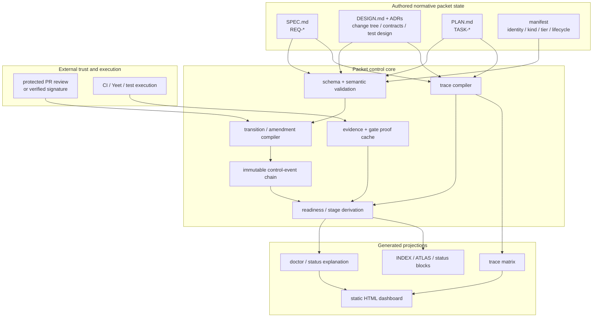

# Deep research: beep-effect exploration and goal packet redesign

## Executive assessment

The supplied packet already contained a substantial three-pass design exploration: strict pre-code planning, exact file trees, exhaustive symbol planning, lifecycle/readiness/run-state separation, event sourcing, requirements traceability, evidence receipts, deterministic materialization, approval gates, agent skills, gate memoization, and several later corrections. The original starting requirements were especially clear: predetermine the file tree, predetermine module symbols, formally amend the design when reality diverges, and make greater use of HTML artifacts. fileciteturn0file0

The updated design keeps the underlying goal but changes several mechanisms.

**The strongest recommendation is to make the packet system strict about architectural commitments while deliberately leaving low-level implementation detail flexible.** The exact planned file change set should be mandatory for Standard and Full work, including tests. Public, serialized, cross-package, persistence, CLI, service, event, and otherwise architecturally significant symbols should also be planned. Requiring **every private helper, local constant, test-local symbol, and intermediate type** in advance is not recommended: it creates amendment churn, encourages ceremonial compliance, and prematurely freezes details whose correct shape is often discovered during implementation. This is consistent with both OpenAI’s ExecPlan model of plans as living documents and Michael Nygard’s original ADR rationale that important architectural decisions should be captured in small, maintainable records rather than assuming all decisions can or should be made at project start. citeturn18view1turn16search1

The second major change is architectural: **event-source the packet’s control plane, not the entire packet.** Git already versions `SPEC.md`, `DESIGN.md`, `PLAN.md`, research, and decisions. A small immutable chain of lifecycle/stage/design-amendment events gives the system replayability and auditability without requiring every document edit to participate in an event-sourcing architecture. That matters because empirical research on real event-sourced systems identifies schema evolution, projection rebuilding, learning curve, and data privacy as recurring costs, while Temporal’s replay model illustrates how strongly deterministic replay constrains side effects and version evolution. citeturn16search2turn12view1

The third major correction concerns approvals. **An editable packet field must never be accepted as proof that a human approved the packet.** For GitHub-hosted repositories, the cleanest trust anchor is a protected pull-request review bound to the reviewed diff, with stale-approval dismissal or approval of the most recent reviewable push. GitHub supports required reviewers, code-owner reviews, stale-review dismissal, and approval by someone other than the latest pusher. citeturn11search0turn11search5turn11search10

A related factual correction was made to the supplied proposal: when Sigstore gitsign is used, **`gitsign verify` with the expected certificate identity and OIDC issuer should be used for identity verification**. The gitsign project explicitly warns that `git verify-commit` does not pass expected identity information and therefore verifies integrity/transparency-log presence without establishing the expected signer identity. citeturn17search0

Finally, I treated the supplied Markdown as the only evidence about beep-effect itself. Claims in it about concrete commands, prior packets, Yeet journals, proof manifests, existing state machines, packet counts, Notion decisions, or exact template behavior were **not independently verified against the monorepo**, because the requested operating assumption was that repository access was unavailable. They have therefore been converted into an explicit repository-grounding checklist rather than silently promoted to architecture facts. fileciteturn0file0

## Recommended packet-system architecture

The target architecture now follows a stricter ownership rule:

> **Author judgment once; derive everything else.**

Authored packet files own requirements, design intent, architectural decisions, and vertical implementation slices. Immutable control records own lifecycle/stage/amendment transitions. GitHub or another externally verifiable system owns approvals. CI owns raw execution logs. Readiness, indexes, trace matrices, portfolio views, evidence summaries, and HTML dashboards are derived projections.



### Packet state

The source draft was right to observe that lifecycle, readiness, and execution are different concepts, but storing all three creates opportunities for drift. The revised ownership is:

| Concept | Recommended canonical source | Persist separately? |
|---|---|---|
| Packet identity and schema | Manifest | Yes |
| Policy/design tier | Manifest or guarded policy decision | Yes |
| Portfolio lifecycle | Single guarded writer/control event | Yes |
| Exploration resume stage | Control-event chain | Derived |
| Exploration highest stage reached | Control-event chain | Derived |
| Goal readiness | Valid artifacts + transitions + approvals + evidence | **Derived** |
| Implementation/run state | Existing execution driver, if the source claim is confirmed | **Not in the packet** |
| Progress percentage | Completed task graph where possible | Derived |

Readiness should therefore answer **why** a packet is or is not ready rather than exposing an editable label:

```json
{
  "ready": false,
  "tier": "full",
  "blockedBy": [
    {
      "code": "DESIGN_APPROVAL_STALE",
      "subject": "DESIGN.md"
    },
    {
      "code": "REQ_WITHOUT_TEST_ORACLE",
      "id": "REQ-014"
    }
  ]
}
```

This is also much closer to how assurance systems are normally structured: requirements are uniquely identified, linked to verification approaches, and managed with bidirectional traceability rather than relying on a mutable “done” marker. NASA explicitly recommends bidirectional traceability and change management across requirements, design, verification, and related artifacts. citeturn19search0turn19search1

### Packet mapping

Using only the packet semantics described by the supplied Markdown, the proposed ownership is:

| Concern | `./explorations` role | `./goals` role |
|---|---|---|
| Raw opportunity | `INBOX.md` / `CAPTURE.md` as described | Upstream lineage |
| Research/provenance | `RESEARCH.md` and supporting research | Referenced rather than recopied |
| Decisions | `DECISIONS.md` as described | `DESIGN.md` / ADR references |
| Behavioral/product shape | `BRIEF.md` / shape stage | `SPEC.md` |
| Capability/dependency planning | `MAP.md` / decompose | Design input |
| Exact change tree | Seed before graduation for higher-risk work | Normative `DESIGN.md` |
| Significant-symbol ledger | Seed before graduation where justified | Normative `DESIGN.md` |
| Test/oracle design | Seed during design | `DESIGN.md` |
| Requirements | Requirement source | `SPEC.md`, `REQ-*` |
| Vertical slices | Candidate decomposition | `PLAN.md`, `TASK-*` |
| Control amendments | Stage/decision reopening | Immutable control events |
| Verification | Research evidence | `EVD-*` evidence receipts |
| Readiness | Derived | Derived |
| Rich review UI | Generated | Generated static HTML |

These filenames are “as described by the supplied packet,” not live-repository confirmations. fileciteturn0file0

## Research-backed design decisions

### Tiered planning rather than uniform ceremony

The revised design introduces **Light, Standard, and Full** planning tiers.

| Tier | Suitable work | Required design |
|---|---|---|
| **Light** | Mechanical/local fixes with no public, persistence, security, build, or dependency-boundary change | Acceptance requirement, affected-file intent, focused oracle |
| **Standard** | Normal multi-file feature inside established architecture | Exact change tree, significant/boundary symbol ledger, test design, task slices, material risks |
| **Full** | Cross-package APIs, serialized contracts, persistence/migrations, auth/security, CI/build/release, broad refactors | Standard requirements plus call/data flow, compatibility, migration/rollback, threat analysis, least-confident decisions, independent review and approval |

This risk adaptation is consistent with NIST SSDF, whose current project page identifies SSDF 1.1 as the finalized SSDF and explicitly says implementation should consider risk, cost, feasibility, applicability, and automatability rather than treating the framework as a universal checklist. It also calls out tracking security requirements, risks, design decisions, and provenance. citeturn18view0

GitHub Spec Kit offers a useful comparison: it separates governing principles, specification, technical planning, task generation, implementation, clarification, consistency analysis, and specification checklists. The useful lesson for beep-effect is that each concern should have a clear owner and cross-artifact analysis should happen before implementation—not that beep-effect should add an independent Spec Kit hierarchy beside its existing packet system. citeturn12view2turn12view3

### Exact files, but only significant symbols

The exact file-tree requirement is retained for Standard and Full packets and strengthened by comparing the approved tree to the actual diff. The validator should distinguish:

- planned and changed;
- planned but untouched;
- changed but unplanned;
- generated output changed without its generator/input;
- paths outside the approved package or architecture envelope.

The universal symbol requirement was narrowed. The design ledger should cover exported APIs, package exports, serialized schemas, errors crossing boundaries, services/capabilities, persistence objects and migrations, events/messages, CLI contracts, configuration contracts, cross-package helpers, and other architecturally significant symbols.

Private implementation helpers stay within an approved **design envelope** and need not trigger a ceremonial design reapproval unless they alter a dependency, observable contract, requirement, side effect, persistence boundary, or architectural decision. That follows the original ADR idea of documenting architecturally significant decisions rather than attempting to record every coding choice. citeturn16search1

### Amendments become classified changes

Instead of “any unplanned symbol requires a stop,” amendments have four classes:

| Amendment | Example | Consequence |
|---|---|---|
| Implementation detail | New private helper in an approved file | Record in final design delta; no gate reopen |
| Leaf surface | Extra test fixture or implementation file in an approved package | Machine-validated auto-amendment |
| Contract | New export, schema field, CLI option, event, dependency edge | Re-run design validation; invalidate relevant approval/evidence |
| Architecture/scope | New package, external dependency, auth boundary, changed acceptance | Reopen the owning design/alignment gate and require human authority |

`OPPORTUNITIES.md` is therefore reserved for **repeatable process or tooling misses**, rather than receiving an entry for every implementation-local discovery.

### Hybrid control-event chain

The updated proposal uses one immutable record per state-changing control event, rather than one high-contention packet-level JSONL file:

```text
ops/
  manifest.json
  events/
    000001-created-<digest>.json
    000002-tier-set-<digest>.json
    000003-design-approved-<digest>.json
    000004-ready-entered-<digest>.json
    000005-design-amended-<digest>.json
```

Each event carries a parent digest and expected revision. Two children of the same head are a detectable fork rather than a silent last-writer-wins update. The approach preserves replay and compare-and-swap semantics while leaving document version history to Git.

Full event sourcing remains a future option rather than a prerequisite. The event-sourcing study by Overeem et al., based on nineteen systems and twenty-five engineers, specifically identifies event evolution, projection rebuilding, steep learning curve, technology limitations, and data privacy as practitioner challenges; versioned events and upcasting are among the observed evolution tactics. citeturn16search2

### Traceability and test-shaped requirements

The updated packet introduces the smallest useful ID vocabulary:

`REQ-* → DEC/ADR-* → TASK-* → TEST-* → EVD-* → commit/PR`

NASA guidance supports unique identifiers and an explicit verification approach for requirements, while its requirements-management process calls for bidirectional traceability and controlled changes to baselines. citeturn19search0turn19search1

EARS is retained as an optional constrained syntax for normative behavioral requirements. Its original IEEE RE 2009 work was designed to reduce ambiguity, complexity, and vagueness using a small family of natural-language requirement templates. citeturn16search0

For example:

```text
REQ-014 — Stale design approval cannot satisfy readiness

When the digest of an approval-governed design artifact changes,
the packet readiness evaluator shall mark the prior approval stale
until an authorized reviewer approves the new subject.

Verification: TEST-021
Decision: DEC-008
```

The trace matrix is generated. Explicit references in the owning artifacts are authoritative; filename inference is not.

### Evidence and attestations

Evidence receipts are designed around a subject and a claim:

```text
EVD-0042
  subject:
    source digest
    DESIGN.md digest
    policy/tool versions
  predicate:
    command
    exit code
    bounded/redacted result
    output digest
    artifact references
```

That layout is intentionally compatible with the in-toto model, which standardizes verifiable claims about software-production subjects and predicates. citeturn17search2

The revised recommendation does **not** require every receipt to be cryptographically signed. Routine local gates can use deterministic digest-bound receipts; repository-level guarantees can use CI/check and protected-review state; externally consumed or particularly high-assurance evidence can use in-toto/Sigstore or GitHub artifact attestations. GitHub describes artifact attestations primarily as build-provenance mechanisms and explicitly notes that generating them without subsequently verifying them provides no security benefit. Their availability for private/internal repositories also depends on GitHub plan. citeturn17search1turn17search3

## Risks, security, maintainability, and verification

The most important failure modes are not syntax errors in the packet schema; they are **false assurance**.

| Failure mode | Revised mitigation |
|---|---|
| Agent edits its own approval record | Verify external PR review or signer identity |
| Design changes after approval | Bind approval to reviewed commit/digest and reject stale approval |
| Old passing tests reused after source change | Evidence subject digest + policy/tool digest |
| All gates invalidated by any worktree edit | Memoize against the smallest complete input set |
| Cache result reused after policy/tool upgrade | Policy and tool versions are part of proof key |
| Parallel transitions | Expected revision + parent digest + fork detection |
| Partial filesystem write | Prospective validation + staged atomic publication + fault tests |
| Path traversal/symlink attack | Root containment and symlink-safe filesystem policy |
| Secrets copied into receipts | Schema-level allowlist/redaction and bounded summaries |
| Research prompt injection | Research is treated as untrusted data, not executable instructions |
| HTML/diagram injection | Escape/sanitize data; Mermaid strict/sandbox |
| Full event history accumulates personal information | Data minimization and retention policy |
| Massive design packet | Compact `DESIGN.md`, ADRs for significant decisions, generated views |
| Agents optimize metrics instead of outcomes | Treat metrics as observations, not targets |

For generated HTML, OWASP recommends context-appropriate output encoding and sanitization, and warns against treating CSP as the primary XSS defense. Mermaid’s default `securityLevel: "strict"` encodes HTML in labels and disables click functionality; its sandbox mode further isolates rendering. citeturn11search3turn14search0

Where the HTML dashboard becomes a genuine stakeholder-facing web surface rather than merely a developer convenience, WCAG 2.2 is the current W3C Recommendation and provides technology-neutral, testable accessibility criteria. citeturn13search0

There is also a privacy consideration in choosing tamper-evident infrastructure. GDPR is one example of a legal regime containing data-minimization/storage-limitation principles and a qualified right to erasure, which means “append-only forever” is not automatically compatible with every class of retained personal data. citeturn14search8 Gitsign separately warns that certificates placed in the public Rekor ecosystem may contain identities such as user email addresses or repository identifiers, so public transparency logging should not be an automatic default for private packet approvals. citeturn17search0

### Verification strategy

The updated report proposes model/property tests for the transition core rather than manually enumerating every illegal-state fixture. fast-check’s model-based testing APIs are explicitly built around generated commands with preconditions and model/real-system comparison, including asynchronous/scheduled runners for race-sensitive systems. citeturn16search6turn16search7

Among the blocking laws:

- every state/event pair either transitions legally or returns a typed error;
- illegal transitions never mutate storage;
- repeating an idempotency key is a byte-identical no-op;
- identical event prefixes produce identical projections;
- stale design approval always makes readiness false;
- stale evidence cannot satisfy verification;
- an event with a missing parent is invalid;
- two children of one control head produce a detectable fork;
- old event versions upcast without semantic change;
- policy/tool/input changes invalidate proof-cache reuse;
- irrelevant unrelated files do not invalidate a properly scoped packet proof;
- generated HTML safely renders script/event-handler/`javascript:` payloads;
- path traversal and symlink escapes fail before publication.

Targeted mutation testing is recommended only for high-risk invariants such as stale-approval rejection, transition legality, path safety, and proof-cache invalidation. It is a useful non-vacuity check, but not a sensible always-on test for every package because mutation testing deliberately executes altered program variants and is substantially more expensive than ordinary tests. StrykerJS is the relevant TypeScript/JavaScript tool family. citeturn9search16

For Effect/TypeScript implementation, the report remains intentionally architectural because the installed Effect version was not inspected. Effect’s documented model of typed success/error/dependency channels and unified schema validation fits a pure packet compiler with injected filesystem, Git, approval-verification, and clock services; concrete APIs should be selected only after package/version grounding. citeturn15search0

## Migration and adoption strategy

The implementation sequence was changed to reduce bootstrap risk and make gate economics visible early.

**Ground and measure first.** Inspect the real templates, manifests, current commands, package boundaries, CI configuration, mutable state surfaces, and existing proof/evidence infrastructure. Build good/bad packet fixtures from real history. This is where the numerous source-document assertions about existing `beep goals`, Yeet, proof manifests, generated indexes, ATLAS ownership, and previous packet decisions are confirmed or rejected. fileciteturn0file0

**Introduce a read-only packet core.** Decode real schemas, derive state/readiness, compile materialization plans, and produce typed diagnostics without changing existing workflow.

**Move mutation through a single writer and add proof memoization.** Mutating paths should preview a deterministic prospective plan, validate the overlay, publish atomically, and revalidate. Cache keys include gate ID, policy version, tool version, and the complete but smallest valid input-digest set.

**Introduce tiered design contracts.** Standard and Full work receive exact change trees, significant-symbol ledgers, test design, and amendment envelopes. Higher-risk work receives migration, compatibility, rollback, threat, and approval requirements.

**Add trace and evidence freshness.** Stable IDs and bounded receipts come before cryptographic attestation.

**Add approval verification and HTML views.** Only after the actual collaboration/trust environment is known should GitHub review APIs, gitsign, in-toto, or another identity infrastructure become dependencies.

**Pilot in advisory mode, then ratchet.** A small feature, a cross-package feature, and a migration/refactor should exercise the system before violations become universally blocking. Gate cold/warm runtime, stale-proof catches, design amendments, human approval latency, false positives, and envelope breaches should be observed to improve the policy rather than turned into optimization targets.

That sequence also follows the general direction of NIST SSDF’s outcome- and risk-oriented adoption model instead of treating process mechanics as an end in themselves. citeturn18view0

## Deliverables and changelog

The attached Markdown was replaced at the same filename with the researched revision. The downloadable research bundle contains the revised document and the exact original, so the update remains auditable.

| Deliverable | Contents |
|---|---|
| Updated Markdown | Executive summary, evidence boundary, packet mapping, target architecture, comparisons, threat model, tests, migration plan, definition of done, open questions, full source ledger, and changelog |
| Original input | Preserved verbatim for diff/audit |
| Changelog | Separate compact change table plus an embedded detailed changelog in the updated document |
| Architecture diagrams | Mermaid control plane, readiness state flow, and rollout sequence |
| Event schema | Illustrative JSON Schema for immutable packet control events |
| Evidence schema | Illustrative subject-bound evidence-receipt JSON Schema |
| HTML prototype | Dependency-free, static, non-normative packet trace/readiness dashboard |
| Source ledger | Annotated primary/official research links |
| Manifest | SHA-256 and byte-size manifest for the bundle contents |

The highest-impact edits are:

| Original direction | Updated direction |
|---|---|
| Predetermine every module symbol | Predetermine public/boundary/serialized/architecturally significant symbols; permit private implementation detail inside an approved envelope |
| Any new symbol/file causes substantial amendment | Four amendment classes; only contract/architecture/scope changes require strong reopening |
| Every miss feeds `OPPORTUNITIES.md` | Only repeatable/systemic process misses do |
| Three stored state axes | Minimal persisted identity/lifecycle; derived readiness/stage; runner state external |
| Whole-packet event sourcing | Hybrid control-event chain; Git remains history for authored packet documents |
| Single packet JSONL | Immutable per-control-event records with parent digest/fork detection |
| Packet-local `approvals[]` | Externally verifiable protected review or verified signer identity |
| `git verify-commit` for gitsign | `gitsign verify` with expected identity and issuer |
| Broad in-toto adoption immediately | Cheap local subject-bound receipts first; signed attestations where consumers verify them |
| Separate machine task store by default | Keep `PLAN.md` authoritative unless repository grounding proves a machine store necessary |
| Large monolithic design artifact | Compact `DESIGN.md` plus small supersedable ADRs |
| Absolutely no code before design | No **production implementation** before design; isolated disposable research spikes remain legal |
| Uniform strict gate | Light / Standard / Full risk tiers |
| HTML as another artifact type | HTML as a deterministic, generated, non-normative projection |
| Many model skills | Begin with design/amend/resume orchestration; deterministic tooling owns validation disciplines |

**Primary artifact:** [Download the updated Markdown](sandbox:/mnt/data/Add%20more%20strict%20planning%20%26%20design%20requirements%20in%20%203b869573788d80439e67dcdb50378a93.md)

**Complete artifact bundle:** [Download the ZIP](sandbox:/mnt/data/beep-effect-packet-system-research-2026-08-10.zip)

The full bundle contains twelve files, including the original source, updated Markdown, changelog, diagrams, schemas, research ledger, HTML prototype, and integrity manifest.