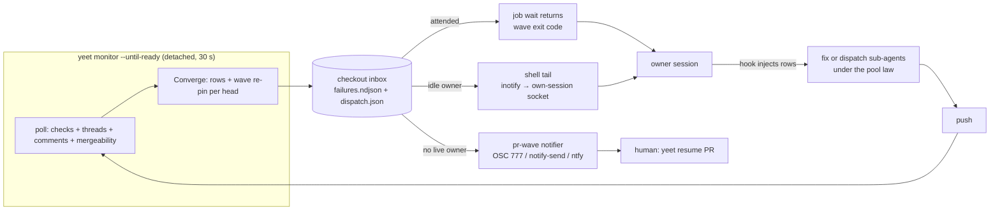

# Brief

<!--
Stage 3. Drafted 2026-09-25 from CAPTURE.md, RESEARCH.md (2026-09-24) and
DECISIONS.md D1–D27 (align 2026-09-24, grill-with-docs 2026-09-25). Fat-marker
fidelity: field lists are indicative, file:line cites are where the change
lands, not how. Shape exits when the operator confirms this matches the
picture in their head.
-->

## Problem

The canonical PR babysit — `bun run beep yeet monitor --until-ready --detach`
then `bun run beep yeet job wait <jobId>` — loses bad news. The detached loop
writes exactly one inbox row, `pr-merge-ready`, and exits on the first
required red; only the attended `--watch` stream runs the convergence that
writes `check-failed`, `review-thread` and `base-drift` rows, and it has never
been run detached. The wave record (`.beep/inbox/dispatch.json`) coalesces
checks only. A required red, a base conflict, an unresolved review thread or
a human comment that lands while the owning session is blocked in `job wait`,
idle, or dead therefore reaches nobody durably. During the time-to-certainty
C3 closeout train the operator was the notification path three times.

Measured (`RESEARCH.md`): the GitHub webhook the repo already has delivers in
2.08 s median; the poll path lands a row about 20 s after the event on the
30 s loop, 42 s typical worst, 84 s observed once. The harness already
supplies the wake primitives — hook injection at every tool boundary, a
per-session messaging socket with own-child delivery even in bypass mode —
and the desktop app's `set_monitor auto_fix` switch proves the demand but is
app-only, session-scoped and unattributed. What is missing is a durable
producer, a per-head attribution record that survives a push, and a wake path
for an idle session.

This packet does not chase seconds. Event-to-row latency is a recorded trade
(D24) and a decompose-stage gate (D9); the problem is that bad news is not
captured, attributed or delivered at all.

## Appetite

One goal packet, three PR-sized slices in order (D27): producer, delivery,
escalation. Days-scale each, about two weeks of lane time end to end. This is
a budget, not an estimate. The socket probe that opens slice 2 is the cut
line: a failed probe closes slice 2 as cut — the probe result is recorded in
`research/`, idle-owner wake stays what it is today (rows injected at the
session's next tool call, plus the desktop switch where a PR is bound), and
slice 3 still ships. No rejected D15 option is revived and the budget never
extends. Outside the budget: ack-directory
and `seenIds`/`firstSeenAt` pruning ship as their own small PR (D5).

## Solution Sketch

### Vocabulary (tooling-local, not glossary terms)

Durable home: the yeet skill's inbox section (`.claude/skills/yeet/SKILL.md`),
updated with the producer slice; there is no Yeet runbook and the glossary is
out of scope.

- **checkout** — a repository root; `<checkout>/.beep/inbox/` is its inbox.
  A linked worktree is its own checkout. Never "lane": that word is the
  check-name field in a failure capsule and a pool or quality lane elsewhere.
- **inbox row** — one typed NDJSON row in `failures.ndjson` (`yeet-inbox/v1`)
  with a severity (P0–P2), a capsule and a deterministic id; cleared by an
  ack receipt or by wave supersede.
- **capsule** — the row's payload: PR number, head SHA, and the kind-specific
  facts (check name and link, thread id, comment id, merge state).
- **wave** — the per-head record `dispatch.json` (`yeet-dispatch/v1`): the pin
  `(PR, headSha)` plus queued capsule ids. A row whose capsule misses the pin
  is superseded, unless its kind is wave-exempt.
- **owner session** — the session the PR session registry records for the
  PR; live when its recorded harness session id maps to a live process.

### Three flows



1. **Attended.** The orchestrator submits the detached monitor and blocks on
   `job wait`. Every poll the monitor runs the extracted convergence with
   full-fidelity checks, writes rows, and re-pins the wave for the head. A
   required red or a base conflict is no longer terminal (D16). The moment a
   new P0/P1 wave lands on the job's PR, `job wait` returns with exit code 2
   (`wave`) without acking the rows — they stay live so the hook injects them
   at the next tool call and the P0 gate holds until the fix lands; the
   orchestrator fixes or dispatches under the pool law in force (D14),
   pushes, and re-runs `job wait` on the same job. Exit 0 is still `ready`.
2. **Idle owner.** The same rows land. A probe-gated shell tail, spawned by
   the SessionStart hook, sees the inotify event and posts one message per
   new wave into its own session's messaging socket (own-child delivery,
   D15/D20). The session wakes; the hook injects the rows.
3. **No live owner.** The monitor finds no live owner in the registry
   (unknown counts as dead, D19). A pr-wave notifier escalates through the
   existing OSC 777 / notify-send / ntfy ladder with `yeet resume <pr>` in the
   local body (D18). Automatic takeover stays a gate.

### Slice 1 — producer (`@beep/repo-cli`, `commands/Yeet/internal/`)

- **Measurement first (D4, D23).** `Status.ts:868` requests
  `name,state,bucket,link,workflow,completedAt,startedAt`; `GhStatusCheck`
  grows the four as `S.optionalKey`; `YeetStatusRemote.checks` becomes
  `S.Array(YeetWatchCheck)` through `withKeyDefaults` so the legacy snapshot
  fixture still decodes. First-seen stamps in the hook session files
  (`firstSeenAt` map, `schemaVersion` unchanged). Output: a push → row → ack
  timeline per head, the number D12/D24 are revisited against.
- **`internal/Converge.ts` (D23).** The watch's private convergence moves out
  with a narrowed signature (head SHA, PR number, checks, threads, merge
  state, base, repo root); `dispatchYeetCheckFailure` takes
  `{ headSha, prNumber }`. Both `WatchMode` and `MonitorLoop` import it.
- **Loop contract (D16).** Under `--until-ready`, `required-red` and the base
  conflict are non-terminal; the wave is re-pinned every poll; `ready`,
  `merged`, `closed`, `settle-timeout`, `poll-error-budget` stay terminal.
  `ProofJobLauncher.wait` gains a wave return keyed to the job's PR (exit 2,
  `wave`; the wave rows are not acked — only the proof-job row is
  observed-acked at settle, as today); `yeetMonitorExitFor` grows the code.
- **Conflicts (D6, D17).** A P0 `base-conflict` row at the existing
  `yeetBaseConflictFor` site with a `conflictRow` guard beside `announcedRow`;
  a seventh ack kind `cleared`, written by the monitor when the same head is
  observed mergeable again; a new head supersedes through the wave.
- **Comments (D13, D21).** P1 `pr-comment` rows for human, non-self,
  top-level comments; the comment watermark is namespaced per consumer, and
  the `--until-ready` first-cycle backlog becomes rows, not stdout. The
  backlog window is comments created after the job's submit time; older
  comments only advance the watermark. A row carries the URL, the author and
  a bounded excerpt (about 200 characters), never the full body.
- **Wave-exempt kit (D7, D22).** `YeetInboxWaveExemptRowKind =
  LiteralKit(["review-thread", "pr-comment"])`; `yeetInboxRowLiveness` reads
  it; the hook carries the exempt-plus-observed union as one jq literal, and a
  repo-cli test asserts the literal equals the kits. `base-drift` keeps
  superseding on a push.
- **Attribution (D3).** `CLAUDE_CODE_SESSION_ID` and `CODEX_THREAD_ID` join
  the proof-job allowlist (two strings, one test).
- **Law text with the code (D25).** `AGENTS.md` closeout bullet, the yeet
  skill's wave and exit-1/re-arm text, `CheckOutcome.ts` and `Remediation.ts`
  JSDoc, the ttc exit-code table. The operator registers any
  `.claude/settings.json` hook change.

Schema deltas, fat-marker:

```text
YeetBaseConflictRow   S.Class  kind: S.tag("base-conflict")  severity P0
                      capsule { prNumber, headSha, mergeStateStatus, observedAt }
                      id = f(prNumber, headSha, "base-conflict")
YeetPrCommentRow      S.Class  kind: S.tag("pr-comment")     severity P1
                      capsule { prNumber, headSha, commentId, author, url, excerpt (~200 chars) }
                      id = f(prNumber, commentId)            (a push does not change it)
YeetInboxRow          S.Union([...existing seven, the two above])   (bare union, grandfathered)
YeetInboxWaveExemptRowKind   LiteralKit(["review-thread", "pr-comment"])
YeetAckResolutionKind        + "cleared"   (attributed to the monitor job)
yeetMonitorPolicyTerminals   until-ready drops "required-red"; conflicts never terminal
job wait outcome             settled | wave   → exit 2 in yeetMonitorExitFor; wave rows stay unacked
YeetDispatchWave             entries for reds AND conflicts, keyed by head SHA
monitor-comments.json        watermark keyed by consumer mode
yeet-hook-session/v1         + firstSeenAt: { "<rowId>": "<iso>" }   (additive, no bump)
PROOF_JOB_FORWARDED_ENV_NAMES + CLAUDE_CODE_SESSION_ID, CODEX_THREAD_ID
```

### After measurement (inside the goal, outside the three slices)

- **Snapshot collapse (D9).** The watch snapshot's ten GraphQL requests
  collapse to one combined query — or the `--until-ready` Status chain does —
  as a follow-up PR once slice 1's push → row → ack timeline shows which chain
  is the cost. Not part of any slice.

### Slice 2 — delivery (`.claude/hooks/`)

- **Probe gate (D20).** Before any tail code: post to
  `$CLAUDE_CODE_MESSAGING_SOCKET` from an in-hook child, a plain background
  child and a `setsid -f` child; record one accepted frame, one refusal, and
  which senders a bypass session delivers, in `research/`. A failed probe
  re-opens D15 and cuts this slice to hook injection plus slice 3.
- **The tail.** A shell worker beside `yeet-inbox.sh`: spawned by the
  SessionStart hook, which returns inside its 2 s budget and fires on
  startup, resume, clear and compact alike — so the spawn is idempotent: a
  pid file keyed by session id records the tail's pid and `/proc` start
  identity, and a later SessionStart returns when that tail is live;
  `inotifywait` on
  `.beep/inbox/`, the hook's jq liveness, one message per new P0/P1 wave
  (a pointer plus a one-line attributed summary; the hook injects the rows
  themselves), cwd outside the lane and one inotify fd so the retire fence
  never sees it as a holder, token read from env and never logged, self-reap
  by polling the session pid's `/proc` start identity, teardown registered on
  the SessionEnd hook as a second command the operator adds beside
  `hook-pulse.sh`, with the self-reap covering crashes. Acceptance: survives the hook timeout, delivers into a
  bypass session, `yeet sweep --retire` still succeeds with it running, then
  proxy-session delivery. A session census at fleet scale (17 clones, 75
  checkouts) closes the slice.
- **Sender home (D26).** Hook-side shell; any TypeScript reader goes through
  `internal/cli/EnvConfig.ts` with the token as `Config.Redacted`. Promotion
  trigger: a second non-repo-cli consumer, or handshake/framing/retry/
  redaction growth, moves it to a new Claude Code driver package under `packages/drivers/`.

### Slice 3 — escalation

- **pr-wave notifier (D18).** A sibling of `sequence-break-notifier.sh` that
  takes a wave descriptor, reuses the transport ladder, resolves on the row's
  ack rather than a permission bracket, keeps its own ledger namespace. It is
  invoked monitor-side: the detached unit is the only process that knows
  there is no live owner, so it spawns the notifier with the wave descriptor.
  From a unit the ladder is notify-send (DBUS is forwarded by ttc ruling 39)
  plus ntfy (`BEEP_SEQUENCE_BREAK_NTFY_*` reaches the unit only if the
  submitting shell exported it; absence is recorded as
  `transport-unconfigured`); Ghostty's OSC 777 needs a terminal and is out of
  this path. The local desktop body may carry `yeet resume <pr>` and a
  one-line summary; ntfy and the evidence ledger stay generic. The existing
  notifier is untouched.
- **Liveness (D11, D19).** No live owner in the registry, unknown included,
  escalates. Every Codex-attributed owner escalates until the resume-footer
  Codex live guard ships; that guard is a later dependency, not a blocker.

## Rabbit Holes

- **The socket wire contract.** Unspecified anywhere; six prose hits, zero
  code. The probe is the only way in; do not design the tail around a guessed
  frame.
- **Detachment vs two ancestry fences.** `setsid -f` reparents to the
  `systemd --user` subreaper, so the retire fence's `ancestryPidsOf` test
  fails for the tail and harness own-child provenance may too. Mitigations
  are in the sketch (cwd outside the lane, inotify fd only, regression test);
  if provenance is ancestry-based the slice is cut, not stretched.
- **P0 under `unknown` liveness.** The hook keeps `unknown`-liveness rows and
  blocks Stop on any live P0; a checkout with no or a stale `dispatch.json`
  therefore blocks every turn end until an attributed ack. This is today's
  class for `check-failed` too, and `cleared` covers only the same-head case.
  The goal packet inherits it as a documented behaviour, not a fix.
- **Backlog window for comment rows (decided).** On a long-lived PR the
  first-cycle backlog could be dozens of comments. The window is comments
  created after the job's submit time; older ones advance the watermark
  silently. The accepted miss is a comment posted between a previous
  monitor's exit and this submit.
- **Wave return scoping.** `job wait` must return only for waves on the
  job's own PR; two monitors in one checkout on different PRs must not wake
  each other's waiter.
- **Legacy status snapshot.** Widening `YeetStatusRemote.checks` with
  constructor defaults would fail the hand-written fixture; `withKeyDefaults`
  is the idiom. Nothing in production decodes `status.json`.
- **Timestamps for non-Actions checks.** `gh pr checks --json` accepts
  `startedAt`/`completedAt`, but external status contexts may leave them
  null; the measurement must tolerate absence rather than assume it.
- **Hook parity test.** Parsing a jq literal out of a shell file is brittle;
  keep the list on one marked line and test that exact line.
- **Comment cursor migration.** Existing `monitor-comments.json` files are
  unnamespaced; the first namespaced run must not replay history as rows.
- **Tail accumulation.** One tail per session across 64 checkouts; SessionEnd
  does not fire on a crash, so the `/proc` start-identity reap is the real
  guarantee, and the census must prove it.
- **`inotifywait` on a dotfile directory and NDJSON offsets.** The
  systemd-path-unit dotfile limitation does not apply to inotify, but this is
  unmeasured here; `failures.ndjson` is never rotated today.
- **SessionStart is not one-shot.** The hook has no matcher and fires on
  startup, resume, clear and compact; without the session-keyed pid file a
  `/compact` would start a second tail.
- **`.beep/inbox/` may not exist yet.** `inotifywait` on a missing directory
  fails; the tail creates the directory, or watches `.beep/` for its
  creation, before watching the inbox.
- **Notifier configuration reaches the unit only by inheritance.** The ntfy
  base URL, topic and token are `BEEP_SEQUENCE_BREAK_NTFY_*` names the
  proof-job allowlist forwards by prefix; a submit from a shell without them
  yields desktop-only escalation and a `transport-unconfigured` ledger line.

## No-Gos

- **A webhook receiver.** The poll stays (D9). The candidate is a decompose-
  stage gate and carries its constraints from ship-velocity c2 Rank 4: an
  edge trigger that performs one conditional reconciliation read and keeps a
  60–120 s healing poll, `(PR, headSha)` debounce of 250–500 ms for matrix
  bursts, the seven PR events, routing by `repository.id + PR number + head
  SHA`. The repo's existing `workflow_job` webhook belongs to the CI fleet
  autoscaler and is not reused.
- **Automatic takeover of a dead owner's PR.** A gate, not a build (D11); a
  fired gate must name which of the four surfaces PR #921 removed (lease,
  watcher, takeover, mutation fence) it would restore.
- **Any launcher.** No auto-launched fixer lanes, no `yeet repair` hybrid,
  no model-choice directive in dispatch; the woken orchestrator dispatches
  under the pool law in force (D14).
- **Cadence changes.** 30 s stays; no adaptive regime; `--watch` keeps 10 s.
  The ~42 s durable p95 is a recorded trade against ship-velocity A1 (D24).
- **Cross-checkout delivery or a workstation-level inbox.** Same checkout is
  the contract (D8, binding reason `standards/git-worktrees.md`);
  `sibling-collision` stays producerless.
- **A new Claude Code driver package under `packages/drivers/` or an architecture decision
  entry now.** The promotion trigger is named instead (D26). No glossary
  entry, no `12-observability.md` edit.
- **Settings-level opt-ins.** No `crossSessionInbound: accept`, no
  cross-machine delivery (`isolatePeerMachines: true` stands), no agent edit
  to `.claude/settings.json` hook wiring.
- **Touching `sequence-break-notifier.sh` or `hook-pulse.sh` invariants.**
- **Changes to `--watch` beyond the shared exempt kit.** The attended
  stream keeps its 10 s cadence, its snapshot and its exit codes; slice 1
  touches it only through `YeetInboxWaveExemptRowKind` and the extracted
  `Converge.ts` it now imports.
- **The snapshot collapse inside the three slices.** D9's ten-to-one GraphQL
  collapse is a post-measurement follow-up in the goal, not slice work.
- **Ack, `seenIds` and `firstSeenAt` pruning.** Its own small PR (D5).
