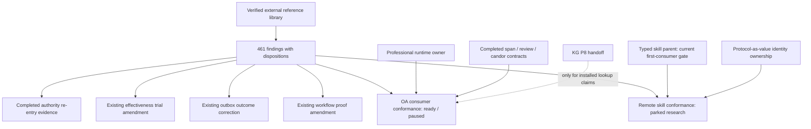

# Graduation and dependency map

The promised-now artifacts exist. [Independent admission](research/ADMISSION-REVIEW.md)
accepted the OA goal as ready/paused and the remote child as parked research.
[Routing](research/ROUTING.md) accounts for every finding; parked rows are explicit
outcomes, not an implied hidden implementation backlog.

| Artifact | Mission / value | Existing capability and owner | State / first slice |
| --- | --- | --- | --- |
| [oa-evidence-consumer-conformance](../../goals/oa-evidence-consumer-conformance/README.md) | Prove source correspondence, proposition support and current human promotion stay distinct at the OA consumer | OfficeActionReview, VerifiedSpan, ClaimEvidenceReview, CandorPolicy/shared gate; agentic-professional-runtime owns consumer | Ready, paused. P0 pins actual structural output/downstream acceptance seam and one public fixture; eight positive/negative families |
| [remote-skill-activation-conformance](../remote-skill-activation-conformance/README.md) | Observe remote origin/content approval across native activation, cache/copy/restart | Completed SkillContract and authority; typed-agent-skill-contracts owns intake, protocol-as-value owns identity seam | Parked research. Select host before inert same-bytes/same-URI/two-origin control |
| [workflow amendment](../../goals/effect-v4-workflow-engine-spike/research/RESEARCH-CORPUS-2026-10.md) | Map observed/physical outcome anomalies onto existing crash proof | Existing14 P0constraints, Effect workflow/cluster, existing spike owner | Evidence attachment; no second runtime or claimed restart proof |
| [outbox amendment](../../goals/m365-agent-outbox/research/RESEARCH-CORPUS-2026-10.md) | Replace missing-draft inference with positive reconciliation evidence | Existing M365 write-safe executor and outbox send/audit owner | SPEC D-12 and fixture checkpoint; no mailbox/runtime change |
| [effectiveness amendment](../../goals/coding-agent-effectiveness-evidence-loop/research/RESEARCH-CORPUS-2026-10.md) | Test task utility, constraint compliance and negative transfer under equal budgets | Current evidence loop, existing task/receipt/skill contracts | Paired baseline/treatment/abstention pilot; diagnosis/return-budget extensions intake-gated |
| [authority re-entry](../agent-execution-sandbox/research/RESEARCH-CORPUS-2026-10.md) | Compare final arguments, intent lineage and uncertain outcomes against paper obligations | Completed execution authority and existing sandbox exploration | Re-entry evidence only; lifecycle unchanged |

No core component is silently net-new. The OA consumer fixture/composition is the
bounded new work; any support shape must first prove existing review contracts
cannot express it. Native host behavior is explicitly unknown, which is why its
packet is research rather than a ready implementation goal.

## Sequencing and coordination

First adopt the concrete outbox correction within its current fixture phase.
The OA goal can begin only through its runtime owner's P0 intake; its in-process
fixture does not discharge the parent's installed-KG acceptance requirement.
Effectiveness follows its current P2 evidence readiness. Workflow proof must
precede any consumer promise of durable deadline behavior. Remote host selection
and typed/protocol frontiers remain gates; no child displaces Amendment J's QA
settlement first consumer. Visible packet backlinks and research notes are the
asynchronous coordination record, not invented owner agreement.

Completed-retained span, candor, authority, schema-parity and skill-kernel packets
remain complete. Other experiments—including output ontology, compiler replay,
CAD rule checks, expanded legal evaluation, oversight UI and provider change
sensors—remain parked with specific triggers in routing.jsonl. A trigger reopens
this exploration at decompose for independent admission; it does not start a goal
automatically.
