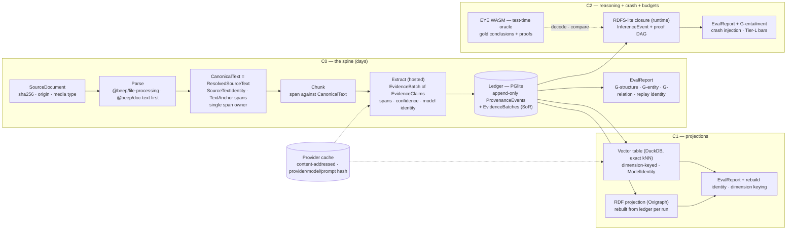

# Brief — Semantica Port Atlas & Lab

<!-- Stage 3. Shape Up pitch at fat-marker fidelity. v1.0 ratified 2026-08-24; review
amendments S7/S8 applied during PR #794 closeout; v1.1 = MAP-grill amendments M1–M6 (Parser and
Canonicalizer rows, rabbit holes 1–2, graduation targets) applied 2026-08-24. -->

Status: **v1.1 — v1.0 RATIFIED by Benjamin 2026-08-24** ("matches the picture"; S1–S6 folded in; M1–M6 amendments applied the same day, see Review status) — synthesized from `CAPTURE.md`, `RESEARCH.md`, and the `DECISIONS.md`
Current law table (D1–D18, A1–A9, B1–B6, G1–G7, O1–O5). Where this brief and the law table
disagree, the table wins; where this brief adds something new it is marked **⚠ Challenge** and
is open for review.

## Problem

Semantica is a 27-module Python knowledge-graph framework whose *ideas* are good (typed
provenance, pipeline-as-DSL, reasoning with explanations, ontology-aware extraction) and whose
*implementation* is unreliable in ways that matter: a random-vector embedding fallback shaped
like success, a "parallel" pipeline engine that runs sequentially, a SPARQL reasoner whose
`execute_query` always raises, simulated HermiT/Pellet consistency checks, fourteen bare-`pass`
ontology façade methods, an empty `evals` module (D6). Benjamin ran it, found it "quite buggy",
carries three unpushed fixes on a local branch, and built a Notion atlas to separate wheat from
chaff.

The opportunity is bigger than a port. Research showed the TypeScript ecosystem has **no**
Datalog/production-rule engine that clears both the license and the maintenance gates, and only
one candidate in ten (EYE, WASM) can emit checkable derivations at all (rubric gate 8). A
schema-first, provenance-carrying, Effect-native construction substrate — where extraction,
storage, and reasoning share one append-only evidence ledger and every conclusion carries a
proof DAG as data — has no incumbent. The v3 archive already holds a working restricted Rete
with a 46-test oracle to build against.

Why now: the bake-off research is done and converged; five family sheets exist as candidate
screens; the shared schema (v1.3) and workload contract (v1.3) are ratified; the reviewers'
falsifications (winners named before prerequisites existed; five composition seams) are
reconciled. What is missing is the one thing that turns screens into verdicts: **a running,
replayable chain over real papers**. Every further hour of desk research is now lower-value
than a day of canary.

## Appetite

**Goal 1 is the staged canary C0 → C1 → C2 and nothing else; there is no calendar (S1).**
Benjamin: "I don't see a reason to delay anything if prerequisite work & requirements are met."
What bounds the work is Shape Up's circuit breaker, denominated in probes: each family enters a
stage with its first-probe candidate; a stage failure buys that family exactly one more
candidate; a second failure parks the family and drops the packet back to decompose. Wall-clock
is Tier-D telemetry in every EvalReport and never gates. This keeps the contract's falsifier
("the bundle or the shape is wrong") able to fire without pretending a solo lab with agent
fan-out has a six-week cycle to protect.

What the appetite buys: Goal 1 only. The atlas backlog (templates → IR row-fill → 27 module
analyses → render/diff sync) is gated behind the canary (O3) and is not inside this appetite.
The NET-NEW reasoning substrate is a dated spike with kill criteria, launched only after C2
passes (A6). The two OSS ambitions (standalone reasoning package, publishable evals harness) are
MAP gates, not promises (O4). A window, sidecar/IPC work, packaging matrix, and any UI are
later milestones (A5, D12, D16).

The budget shapes the solution: hosted models via a thin provider contract instead of a local
model lane (G6); replay-from-cache instead of fully-offline inference (G7); the existing
Oxigraph adapter rebuilt-from-ledger per run instead of a persistent triple store (G defaults);
exact vector query over a dimension-keyed table instead of an ANN index; RDFS-lite closure as
the M1 runtime reasoner instead of a rule engine.

## Solution Sketch

### The lab and its charter

A private Tauri lab app at apps/labs/semantica (spelled in prose until it exists), created by
`bun run beep create-package semantica --type app --app-kind tauri --lab --description "Semantica port canary: headless Document→KG→eval chain over F1 + W1"` (G2; `--lab` refuses an empty description), **headless-first**
(A5): the proof surface for M1 is tests, a CLI entry, and later MCP — never the window. The lab
owns **knowledge construction**: ingest → parse → canonicalize → chunk → extract → ledger →
derived projections → reasoning → provenance → evals. "Derived projections" means the
rebuild-from-ledger vector and RDF tables C1 proves are disposable; that is construction-side
work because it proves the ledger is the system of record. `trustgraph-workbench` keeps the
**consumption** side: retrieval, GraphRAG, hybrid search, graph analytics, and graph UX over
whatever projections exist; the ontology slice is the shared spine both consume (D13). The lab runs under full
code law but is exempt from ceremony (docgen, JSDoc ratchet, coverage, changeset, Storybook);
it exports nothing reusable — earned code graduates by extraction to a durable owner
(`standards/architecture/15-lab-apps.md`).

### The chain, staged

- **C0** proves the spine: F1 fixtures + the three G-relation W1 papers (which also carry
  G-structure and G-entity labels), parsed to a `CanonicalText` (= `ResolvedSourceText`; spans
  as `TextAnchor`s, no loss map — M1), chunked with spans, extracted by a hosted model into an
  `EvidenceBatch`, appended atomically to the PGlite ledger with its `ProvenanceEvent`s, and
  scored into a schema-validated
  `EvalReport` over G-structure, G-entity **and G-relation** (S7: the relation-drop tripwire
  runs in the same stage that writes the Extractor verdict). **Pass** = second run with the
  network disabled reproduces the EvalReport bytes from the provider cache (G7); every span
  slices back to its text; relation count on the G-relation papers is non-zero.
- **C1** adds the two derived projections: a dimension-keyed vector table with exact kNN in
  DuckDB, and an RDF projection rebuilt from the ledger into Oxigraph per run, queried by
  SPARQL. **Pass** = rebuild identity (drop projections, rebuild, identical query results);
  embedding dimension is frozen by this stage with an alternate-dimension fixture proving the
  keying (B4 defaults).
- **C2** adds reasoning and hostility: an RDFS-lite closure over the RDF projection emitting
  `InferenceEvent`s checked against EYE for the `G-entailment/rdfs` suite; a crash injected
  between ledger commit and projection rebuild, followed by restart and identical rebuild; the
  full Tier-L bars measured at **bundle** level (B5/G4). **Pass** (S8) = the derived conclusion
  set equals EYE's on every gold case (closure equality), AND every `InferenceEvent` validates
  against its own rule (premises present in inputs-or-closure, rule instance correct); crash
  identity; cold start <5 s; p95 <100 ms. Matching EYE's particular premise set is not
  required — an entailment with two valid derivations must not fail C2.

A stage failing falsifies its families without blocking the spine (G1). Family verdicts are
written only after the matching stage passes; until then everything is park-pending-canary and
only final park/drop values reach the Notion atlas (B1).

### Service boundaries (D8 made concrete)

The port boundary is the `Context.Service` contract; a second backend later is one new Layer
against an existing contract — no plugin system, no adapter zoo. Fat-marker roster for Goal 1;
decompose refines it into the MAP capability table.

| Contract (lab-local, promotion-shaped) | Stage | First-probe Layer | Cited brick | Parked alternates |
| --- | --- | --- | --- | --- |
| `DocumentSource` | C0 | local file + committed fixture | `@beep/file-processing` | URL ingest (gate 6 SSRF policy first) |
| `Parser` (per media type) | C0 | PDF: `@beep/doc-text` (unpdf/PDF.js) first, direct `unpdf` text items in the lab as the breaker's single retry (M1); MD, HTML | `@beep/doc-text`, `@beep/md`, `@beep/html`, `@beep/tika`, `@beep/pandoc-ast` | MuPDF (AGPL), OCR, DOCX |
| `Canonicalizer` → `CanonicalText` | C0 | compose (M1): `ResolvedSourceText` (`@beep/file-processing` `SourceText`) = `@beep/provenance` `SourceTextIdentity` + text; spans = `@beep/provenance` `TextAnchor`; tripwire = `verifyTextAnchor`; no loss map | `@beep/file-processing`, `@beep/provenance`, `VerifiedSpan` locators in `@beep/langextract` | — |
| `Chunker` | C0 | span-preserving sentence/section splitter | `@beep/nlp` | semantic chunking |
| `Extractor` → `EvidenceBatch` | C0 | hosted LLM (LangExtract shape) **and** pattern (Wink) under one gold probe | `@beep/langextract`, `@beep/nlp-processing` (both carry known defects — see rabbit holes) | local models |
| `Ledger` (system of record) | C0 | PGlite, append-only | `@beep/pglite`, `@beep/postgres`, `@beep/provenance` | — |
| `ProviderCache` | C0 | content-addressed on-disk cache keyed by provider/model/prompt/input hash | NET-NEW | — |
| `EmbeddingModel` (from `effect/unstable/ai`) → `EmbeddingVector` | C1 | `@effect/ai-openai` `OpenAiEmbeddingModel.layer` through a new `@beep/openai` driver mirroring `@beep/anthropic` (S3-rev) | Layer ships in `@effect/ai-openai` rc.111 (root dep); **NET-NEW = the thin driver package** + the lab's `ModelIdentity` wrapper (borrow effect-ontology `ProviderMetadata` dimension invariant, add revision/artifactHash) | Venice/xAI via openai-compat later; Snowflake/ONNX local lane |
| `VectorIndex` | C1 | DuckDB exact kNN, dimension-keyed tables | `@beep/duckdb` (has **no** vector surface; the lab does exact kNN in SQL app-locally) | pgvector-on-PGlite (contingent runner-up), ANN |
| `RdfProjection` | C1 | Oxigraph rebuild-from-ledger per run | `packages/drivers/oxigraph`, `@beep/rdf`, `@beep/semantic-web` | persistent store |
| `Reasoner` (runtime) → `InferenceEvent` | C2 | ρdf closure: rdfs2, 3, 5, 7, 9, 11 as `RdfsRule` values + one SKOS broader-transitivity rule, naive fixpoint (S5) | NET-NEW (small), v3 `rete` audit vocabulary as seed | v3 Rete salvage and NET-NEW certified-rules spike (ablated on `G-entailment/rules`) |
| `ProofOracle` (test-time only) | C2 | EYE WASM decoding gold proofs | NET-NEW wiring (no EYE driver in-repo) | — |
| `Evaluator` → `EvalReport` | C0 | schema-validated report, qa-inventory pattern | `beep qa` inventory discipline | — |

Cross-cutting laws every contract obeys: branded ids; spans + model identity + provenance refs
survive every stage or the stage declares itself lossy in its type; typed degraded states
instead of success-shaped fallbacks (gate 4); `HashSet`/`HashMap`, never native; decode at
boundaries; `Effect.fn`/`Effect.fnUntraced` for generators.

### What "done" looks like for Goal 1

A CLI/test entry in the lab runs W1 (25 manifest papers) + F1 end-to-end twice — once live, once
with the network off — and both runs emit byte-identical `EvalReport`s carrying corpus hash,
`gold/v1` version, per-metric scores, Tier-L results, and Tier-D telemetry. Each canary stage's
pass flips its families from park-pending-canary to a real verdict in `DECISIONS.md`, and only
then in the atlas.

### After Goal 1 (named so lab code is written promotion-shaped — D16)

- **Storage-inversion spike** (A6): delete/compaction/desktop-storage semantics for the
  append-only ledger, before provenance-first becomes binding.
- **NET-NEW reasoning spike** (A6, `research/adhd-reasoning.md`): proof-ledger kernel +
  budget-certified rules + evidence-graph workspace, entered via its three named first-step
  probes as kill criteria, ablated against the EYE oracle.
- **Atlas backlog** (O3): templates on 3–4 exemplar rows → IR row-fill → 27 module analyses →
  the D5 render/diff sync pipeline (queued MAP candidate; re-entry trigger semantica 0.6.7+).
- **OSS gates** (O4): standalone reasoning package; publishable evals harness.
- **Window / explorer** (D12, D16): thin workbench vs defer, decided in the goal packet.
- **Graduation targets**: `CanonicalText` is already composed from `@beep/file-processing` +
  `@beep/provenance` (M1, nothing to promote); `EvidenceBatch`/`ConflictWitness` smell like
  `@beep/epistemic-domain` extensions (`ContradictionCandidate`, `Activity`/`UsageRecord`
  precedents); the ledger and `InferenceEvent` smell like `@beep/provenance` extensions;
  `ModelIdentity` has no in-repo carrier and smells like a driver-family contract. Named now,
  decided at promotion.

## Rabbit Holes

Each is patched here or graduates as an explicit constraint the goal packet inherits.

1. **Span canonicalization drift (amended M1).** Every bake-off review found no sheet named the
   thing spans address. The repo already does: `SourceTextIdentity` (textDigest + extractor
   name/version) + `TextAnchor` (UTF-16 half-open, width-checked) + `verifyTextAnchor` own span
   meaning, and `goals/citation-verified-span-substrate` constraint 4 makes the extracted raw text
   canonical with normalization locator-only. Patch: `CanonicalText` = `ResolvedSourceText`; no
   raw→canonical loss map (a second normalized text would make spans unprovable); every stage
   maps spans as `TextAnchor`s or declares itself lossy in the type. C0's pass criterion is
   `verifyTextAnchor` succeeding for every span.
2. **Known defects in our own bricks.** `@beep/nlp-processing`'s WinkBackend fabricates a
   zero-based span on an `indexOf` miss; the `@beep/langextract` handoff drops relations; the
   Oxigraph adapter ignores `timeoutMs`; `shacl-engine` hangs on a violating fixture (B6, drafts
   in `research/drafts/repo-issues.md`). Patch: the lab decodes brick output at its boundary
   into typed degraded states and must not inherit a fabricated span or a silent drop; fixes
   ride cleanup-on-touch, not this packet (O1) — with one exception: the `@beep/nlp` Handoff
   envelope's mention/span drop (mints unresolvable `MentionId`s, never reads the aligned span) is
   fixed now in its own PR as `nlp-ir/1.1` (M2). Constraint inherited: the C0 extraction probe
   must detect both defects if they leak (a span that does not slice back; a relation count of
   zero on the G-relation papers is a failure, not a score).
3. **Gold-label circularity (settled, S2).** If the same provider family proposes the gold and
   performs extraction, the eval measures self-agreement (self-enhancement bias, Zheng 2023;
   Panickssery 2024). Patch: `EvalRun` carries a schema refinement `gold.proposer.provider !==
   extractor.provider`; the spot-checked fraction is a committed number in `gold/v1`. Zero new
   code: `@beep/langextract` takes an injected `LanguageModel` and four hosted Layers exist.
4. **Embeddings lane: contract exists, Layer does not.** G6 routes M1 embeddings "via the agents
   slice"; live search finds no `EmbeddingModel` Layer anywhere in `packages/**/src` or `apps`.
   The contract itself is Effect's own: `effect/unstable/ai/EmbeddingModel` (v4 rc.111 —
   `embed`/`embedMany`, `EmbedResponse`, `Dimensions`, `EmbeddingRequest` resolver). Patch: the
   lab builds one hosted Layer with `EmbeddingModel.make({ embedMany })` over `@beep/venice-ai`'s
   existing `createEmbedding` operation (any openai-compat provider is one more Layer), and
   wraps `EmbedResponse` into the shared schema's `EmbeddingVector` + `ModelIdentity` so a
   vector without model identity stays unrepresentable. Graduation home for the Layer is the
   provider driver, not the agents slice — G6's wording now reads "via a hosted
   `EmbeddingModel` Layer". **Settled (S3-rev):** `@effect/ai-openai` already ships
   `OpenAiEmbeddingModel.layer` (rc.111, root dependency); it is composed through a new
   `@beep/openai` driver mirroring `@beep/anthropic`. Nothing engine-shaped is written. Anthropic
   is out (no embeddings API); Venice/xAI arrive later as openai-compat configs.
5. **Hosted nondeterminism vs replay.** Temperature 0 is not determinism. Patch (G7): the
   provider cache is the determinism — keyed on provider/model/version/prompt hash/input hash;
   replay never re-calls; API-unavailable is a typed degraded state. Constraint: the cache key
   schema is part of the shared schema, not an implementation detail.
6. **Embedding dimension freeze.** Patch (B4 defaults): vector tables are dimension-keyed; the
   dimension is frozen only by C1 with an alternate-dimension fixture proving the keying.
7. **Bundle-level budgets.** Per-family passes were vacuous (B5). Patch: every EvalReport
   records the sum of loaded winners; Tier-L bars (cold start, p95) are the only hard gates;
   RSS/deps/model bytes are alarms and Tier-D telemetry (G4).
8. **Oxigraph at canary scale.** Fresh-store-per-request plus an ignored `timeoutMs` is
   acceptable for rebuild-per-run over 25 papers but cannot bound a runaway SPARQL. Patch: the
   lab wraps every oracle/projection call in an Effect-level timeout; C1 measures rebuild cost
   per run and records it. Constraint inherited: a persistent triple store is a post-canary
   decision.
9. **"DuckDB exact vector" is not a vector store decision.** `@beep/duckdb` has no vector
   surface. Patch: C1 does exact kNN in SQL over dimension-keyed arrays app-locally; ANN and
   pgvector-on-PGlite stay contingent runners-up. Nobody should read C1 as an index verdict.
10. **Crash injection needs a definition.** Patch: C2 kills the sidecar process after the ledger
    transaction commits and before projections rebuild, restarts, and requires projections to
    rebuild to an identical state. This proves the narrow "projections are derived" claim only;
    delete/compaction semantics are the storage-inversion spike's territory (A6).
11. **Proof comparison is neither tree isomorphism nor premise-set identity (S5, amended S8).**
    EYE nests `r:Extraction`/`r:Conjunction` steps we never emit, and an entailment reachable by
    two subclass paths lets sound engines pick different premise sets. Patch: C2's gate is
    closure equality on conclusions plus per-`InferenceEvent` validation against its rule; EYE's
    proofs are the gold conclusion source and a spot-check oracle, not a shape to match.
    Proof-shape equivalence is a spike question. Corollary:
    G-entailment splits into `rdfs` (gates C2; ρdf + SKOS via one explicit transitivity rule,
    since SKOS hierarchy is not RDFS entailment) and `rules` (the ~20 production-rule cases;
    gates the spike). The v3 Rete salvage has no proof objects and no truth maintenance, so it
    enters at the spike, not as the C2 runtime.
12. **Tauri crate as dead weight (settled, S4).** A `--app-kind tauri` lab carries a Rust crate
    that Labs CI never checks (no Cargo) and M1 never opens, and the scaffold has no headless
    entry point at all. Patch: scaffold once, `cargo check` once locally, freeze `src-tauri`
    through C0–C2, and add `server/main.ts` + `src/runtime/Layer.ts` by hand on day one
    (Professional Desktop's split) as the proof surface. `--app-kind service` was rejected by
    D12's precedent (conversion churn).
13. **Corpus reality.** Only 76 of 443 papers are on disk; W1 is defined by a committed
    manifest (id + sha256 + bytes), never a directory (B3). The 367 undownloaded papers are
    parked, not a prerequisite.
14. **Identity truncation and hardwired dimensions (S6).** effect-ontology brands ids as 12 hex
    chars of a SHA-256 and bakes `vector(768)` into DDL and codec. Patch: brands carry the full
    digest; vector tables are dimension-keyed (B4). Constraint inherited: no id brand may
    truncate; no DDL may name a dimension.
15. **Silent provider fallback (S6).** effect-ontology's embedding fallback chain swaps
    voyage→nomic under callers with only a counter. Patch: `DegradedEmbedding` is the only legal
    degraded state; a provider swap is a new `ModelIdentity`, never a hidden retry. Same law as
    gate 4's random-vector exhibit.

## No-Gos

These become non-goals in the graduated `SPEC.md`.

- No plugin system, adapter zoo, or multi-driver support (D8). A second backend is one new
  Layer against an existing contract, later.
- No local models, ONNX runtimes, GPU/ROCm lanes, or model downloads in M1 (G6).
- No fully-offline live inference as an M1 criterion; offline means replay from the provider
  cache (G7).
- No consumption-side retrieval, GraphRAG, hybrid search, graph analytics (centrality,
  communities, PageRank), or graph UX — that is `trustgraph-workbench`'s charter (D13). The
  lab's C1 rebuild-from-ledger projections are construction proofs, not retrieval features.
- No window, sidecar/IPC bridge, packaging matrix (macOS/Windows/arm64), or explorer UI in
  M1 (A5, D12, D16). Mobile is a permanent no-go.
- No OCR, DOCX, email, or archive ingestion; no URL ingest before a gate-6 SSRF policy exists.
- No agent-framework integrations (Agno/CrewAI/OpenClaw), MCP editor targets, LLM provider
  multiplexing, visualization backends, or deploy infrastructure (D10 auto-parks).
- No server-only or operator-managed engines (FalkorDB, Neo4j, hosted Qdrant, Jena server);
  recoverable via Layer (D9).
- No `adopt`/`pick-one` values written to the Notion atlas before the matching canary stage
  passes; no atlas backlog work inside Goal 1 (B1, O3).
- No NET-NEW reasoning substrate as the M1 runtime; it is a dated post-C2 spike (A6).
- No reusable `@beep/*` export, root `src/index.ts`, export map, docgen surface, or
  `packages/*/tables` migration from the lab (labs law); no imports of
  `apps/professional-desktop` internals.
- No Oppold corpus references in any committed artifact (D14).
- No posting or pushing of `research/drafts/*` without Benjamin (O1, O2).

## Review status

S1–S5 settled and S6 folded 2026-08-24 (`DECISIONS.md`, shape grill). The effect-ontology deep
read (`research/effect-ontology-map.md`, 159 rows, skeptic-flagged rows kept) changed the shared
schema to v1.2: `ModelIdentity` gains `taskType`; the provider cache key is a contract; five
families anchor on live `@beep/*` symbols; `QuadDelta` becomes C1's rebuild-identity witness;
three more success-shaped anti-patterns are forbidden by construction. Benjamin confirmed the brief matches
the picture in his head on 2026-08-24; the packet moved to decompose. The MAP grill (M1–M6,
same day) amended the Parser and Canonicalizer rows, rabbit holes 1–2 and the graduation targets
from live source: `@beep/doc-text` is the first PDF probe, `CanonicalText` composes
`ResolvedSourceText` + `TextAnchor` with no loss map, and the Handoff span drop is fixed in PR A.
