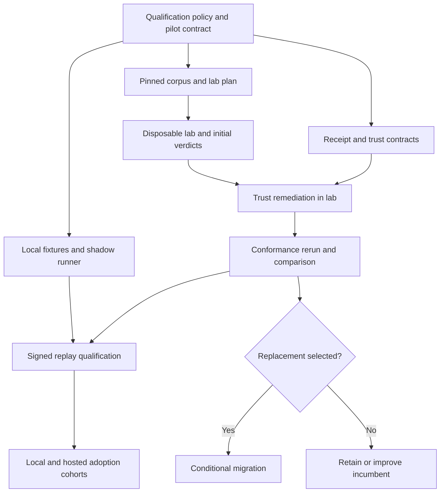

# Graduated implementation map

Approved and graduated 2026-09-08. The four primary packets exist with scoped
launchers. Their authored-but-not-started lifecycle is `paused`; invoke a
launcher to begin implementation. Migration remains a gated candidate.

## Goal packets

| Candidate slug | Mission and ownership | Exit evidence |
| --- | --- | --- |
| `turborepo-task-qualification` | Make cacheability an evidence-backed computation contract. Own census, qualification policy/projection, transitions, experiments, and config drift audit. | Reconstructable population, invalidation fixtures, pilot contract and evidence, attributed remediation, audited handoff for later cohorts. |
| `turborepo-cache-conformance` | Make protocol and backend comparison reproducible. Own pinned corpus, exact client runner, backend comparison, disposable lab topology and lifecycle. | Separate spec/stable/canary verdicts, fault receipts, measured envelope, teardown proof, frozen-rubric comparison. |
| `turborepo-cache-trust-observability` | Make accepted artifacts and failed requests attributable within a bounded trust model. Own receipt contracts, signing posture, tag carriage, bearer/tenant policy, epochs, redaction and stable telemetry. | Auth/signature/tenant negative tests, rotation/rollback drill, safe correlated receipts, lab remediation and scoped production hardening. |
| `turborepo-quality-cache-adoption` | Apply qualified reuse and graph improvements across local quality and hosted CI. Own feature matrix, cohorts, task configuration, archive transport, consumer wiring and measured warming. | Final disposition for every in-scope computation; eligible work adopted in proven profiles; required statuses remain fresh; measured benefit and rollback. |
| `turborepo-cache-backend-migration` | Deploy and observe a selected replacement. Own conditional cutover, routing, operational docs and retirement. | Passing selection gate, seven/seven/fourteen-day observation, rehearsed incumbent rollback, explicit retirement decision. |

The first four are the graduated promised-now set:

1. [Task qualification](../../goals/turborepo-task-qualification/README.md).
2. [Cache conformance](../../goals/turborepo-cache-conformance/README.md).
3. [Trust and observability](../../goals/turborepo-cache-trust-observability/README.md).
4. [Quality-cache adoption](../../goals/turborepo-quality-cache-adoption/README.md).

Keep migration queued here until a comparison passes the hard gates and
material-win rule. Then reopen this exploration at `decompose` for the explicit
backend decision and migration packet. Retaining or improving the incumbent
is a valid result and creates no migration goal.

## Sequencing and dependencies

These are artifact dependencies, not a requirement to finish entire goals in
strict sequence. The lab can report failures before trust remediation lands,
then rerun the same corpus. Qualification can complete local discovery and
shadow tooling while remote replay waits for trust gates. Agree shared schema
contracts before independent implementation lanes begin.

Production remote adoption also waits for trust remediation to be deployed
through its scoped rollout. Lab conformance alone cannot activate production
read/write use. Local graph improvements with completed proof can progress
independently of backend selection.

## First vertical slice

1. Refresh the actual workspace/script population. Report configured graph
   nodes and executable computations separately.
2. Introduce the reviewed policy in the existing policy pack and a Cache command
   that reports the contract/state for one computation. Add a Quality drift
   check with explicit pilot scope and honest inherited-unassessed reporting.
3. Use a small synthetic fixture to prove missing-script exclusion, semantic
   invalidation, output/log comparison, and rejection of unsupported promotion.
4. Apply the same worksheet to `@beep/identity#lint` in one local profile. Inspect
   subprocesses, root config, dependency inputs, toolchain, outputs and logs.
5. Run repeated fresh and shadow comparisons. Complete signed remote replay in
   the disposable fixture/lab after its trust contract passes.
6. Produce a receipt linking the decision, effective configuration, exact
   versions/profile/epoch, perturbations and next action. Promote only after
   the full protocol passes; otherwise implement the attributed repair.

Whole-family cache settings and the full Yeet proof model stay outside this
slice. Its value is demonstrating the decision and enforcement path end to end.

## Capability check

| Component | Existing capability | Net-new work |
| --- | --- | --- |
| Qualification policy | [`@beep/repo-configs`](../../packages/tooling/policy-pack/repo-configs/src/index.ts) and its [`allowlist projection`](../../packages/tooling/policy-pack/repo-configs/src/internal/eslint/EffectLawsAllowlistSnapshotCodegen.ts). | Cache schemas, entries, profile/epoch rules, explicit `cache` facade. |
| Discovery and qualification | [`Cache` facade](../../packages/tooling/tool/cli/src/commands/Cache/index.ts), [`schemas`](../../packages/tooling/tool/cli/src/commands/Cache/Cache.schemas.ts), [`TurboCache` posture](../../packages/tooling/tool/cli/src/internal/cli/TurboCache.ts). | Experiment runner, transitions, materialization and drift checks; earned Cache role files. |
| Protocol corpus and runner | [`Contract`](./research/remote-cache-contract.md), [`corpus plan`](./research/conformance-corpus-plan.json), existing Cache group. | Exact-client process adapter, generated/adversarial cases and wire receipts. The corpus is planned, not implemented. |
| Generic evidence | [`EvidenceReceipt`](../../packages/foundation/modeling/skill-contract/src/EvidenceReceipt.ts). | Cache predicates and producer/result receipts stay in the Cache domain. |
| Conformance helpers | [`ConformanceLedger`](../../packages/tooling/test-kit/test-utils/src/ConformanceLedger/ConformanceLedger.test-kit.ts). | Remote protocol semantics are net-new. Reuse only helpers with demonstrated semantic fit. |
| Runtime and lab | [`CiTurboCache`](../../infra/src/CiTurboCache.ts), [`Lambda adapter`](../../infra/lambda/turbo-cache/README.md). | Disposable topology, budgets/lifecycle, trust remediation, candidate adapters. |
| Quality enforcement | [`Quality`](../../packages/tooling/tool/cli/src/commands/Quality). | Invoke Cache policy audit and carry receipts; Cache stays the state writer. |
| Hosted presentation | [`Ci`](../../packages/tooling/tool/cli/src/commands/Ci), [`check.yml`](../../.github/workflows/check.yml), [`heavy.yml`](../../.github/workflows/heavy.yml). | Result classes and resolved workflow identity; preserve required statuses. |
| Yeet integration | [`Yeet`](../../packages/tooling/tool/cli/src/commands/Yeet), [`time-to-certainty`](../../goals/time-to-certainty/README.md). | Curated cache-fact consumption bridge. No new proof ledger or imports of Yeet internals. |
| Graph and archive transport | [`turbo.json`](../../turbo.json), child configs in the [`census`](./research/task-census.md), [`setup-monorepo-ci`](../../.github/actions/setup-monorepo-ci/action.yml). | Qualified task changes, config identity, output ownership and archive timing. |
| Attribution and warming | Existing Cache dashboard/warmer, [`ci-lane-economics`](../../goals/ci-lane-economics/README.md). | Reuse-layer attribution, measured selection, explicit budgets and receipts. |
| Feature coverage | Official [`skill`](../../.claude/skills/turborepo/SKILL.md), pinned CLI/schema/source and [`research`](./research/report-source.md). | Applicable-feature matrix with experiments and owners; no generic build planner. |

These paths are checked source homes, not a requirement to create every role
immediately. Use the architecture command and package generator where earned.

## Single writers and integration seams

- Qualification owns policy/projection. Adoption supplies cohort evidence and
  proposes transitions through that contract; it has no second state store.
- Conformance owns corpus/results. Trust owns receipt semantics and backend
  policy remediation. Agree the shared schema before either producer is built.
- Conformance owns lab provisioning; trust owns adapter changes used in the lab.
  Sequence overlapping infra/Lambda edits or assign explicit file ownership.
- Adoption owns consumer wiring and task changes. Adjacent goals retain proof,
  timing, placement, and ontology authority.
- Migration starts only after selection. If no replacement qualifies, incumbent
  production hardening stays with trust/observability and retains the signing
  and rollout evidence requirements.

## Gates and deferred details

| Gate | Required evidence | Owner |
| --- | --- | --- |
| Shape acceptance | User confirms scope, first slice and candidate map. | Exploration. |
| Graduation | Complete brief, settled/deferred questions, named candidates/dependencies, capability citations. | Exploration using repo templates and source ledger. |
| Lab deployment | Numeric cost/TTL/load bounds, preview, immutable pins, isolated credentials/namespaces, teardown plan. | Conformance goal, before deployment. |
| Qualification | Full comparison/perturbation matrix, at least ten shadow decisions per profile, zero unexplained divergence. | Qualification goal. |
| Hosted adoption | Qualified entry, production trust readiness, named cohort, fresh-status proof and rollback. | Adoption and trust goals. |
| Replacement | Every hard gate and frozen material-win rule pass. | Conformance result followed by backend selection. |

Backend choice, numeric lab budget, hosted cohort, and retention/SLO values are
deferred to measured implementation gates. They do not prevent drafting goals.
They do prevent an agent from guessing values and deploying or broadening use.

## Inherited risks

Untracked inputs, absolute-root compiler state, shared coverage paths, unsafe
logs, swallowed remote errors, signature/tenant confusion, workflow drift, and
changed toolchains all carry forward. Preserve the
[`risk register`](./research/risks-and-rabbit-holes.md),
[`ownership map`](./research/ownership-map.md), and
[`source ledger`](./research/SOURCES.md) in goal provenance.
