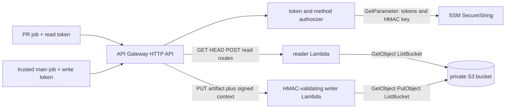

# P3 asymmetric Turbo remote cache design

Date: 2026-08-10

Status: design and non-deployed scaffold only

## Decision

Use `ducktors/turborepo-remote-cache` with S3, but enforce static-token asymmetry
with a Lambda authorizer and two shim processes behind one HTTP API:

- the authorizer resolves both SSM tokens and applies the token-and-method
  matrix before a shim is invoked;
- the reader runs with `READ_ONLY=true` and has only S3 read permissions;
- the writer runs with `READ_ONLY=false` and has only the additional
  `s3:PutObject` permission; and
- API Gateway exposes artifact `PUT` only through the writer integration.

This is defense in depth. A leaked PR token encounters four independent write
barriers: the authorizer denies it on `PUT`, only `PUT` targets the writer, the
reader role has no S3 write action, and the writer wrapper requires an
authorizer-produced HMAC before delegating to the shim. The authorizer and
writer resolve the HMAC key from one SSM SecureString; the value is never a
Pulumi input or Lambda environment value. The writer's Lambda resource
permission is scoped to this API's artifact `PUT` execution ARN. A direct
same-account `lambda:InvokeFunction` call therefore lacks a valid HMAC even if
its caller already has identity-policy permission to invoke the function.

Do not use Lambda aliases for the split. Lambda environment variables belong to
published function versions, not aliases, so aliases cannot independently set
`READ_ONLY` or token lists. Separate functions from one ZIP make the boundary
clear.

The older packet note proposed presigned S3 reads. This design supersedes that
implementation detail while preserving its trusted-write/PR-read-only security
invariant.

## Research findings

### Shim authentication

The current shim documentation defines three authentication modes: `static`,
`jwt`, and `none`. In static mode, `TURBO_TOKEN` is a comma-separated allow-list.
It does not attach a permission to an individual static token. Therefore two
values in one `TURBO_TOKEN` setting have equal authority.

The shim now has two native forms of read/write control:

- `READ_ONLY=true` makes an entire server process read-only. It permits artifact
  `GET` and `HEAD` plus event acknowledgements, while rejecting artifact `PUT`
  and cache cleaning with 403.
- JWT mode supports `JWT_READ_SCOPES` and `JWT_WRITE_SCOPES`, so JWT claims can
  distinguish readers from writers.

JWT scope enforcement could satisfy the charter inside one process, but it adds
an issuer, key rotation, and claim-minting system solely for cache credentials.
The chosen Lambda authorizer reuses SSM SecureString and provides a visible AWS
method and IAM boundary without putting the trusted token in the reader process.

Sources:

- [Shim environment variables][shim-env]
- [Environment variable source document][ses]

### Lambda and S3 support

The npm package exports `turborepo-remote-cache/aws-lambda`, and its dependencies
include Fastify's Lambda adapter plus AWS SDK v3 S3 clients. The project has a
community-contributed Lambda guide that bundles that handler, uses an IAM role,
and configures `STORAGE_PROVIDER=s3` and `STORAGE_PATH=<bucket>`.

S3 is a first-class documented storage provider. It uses the normal AWS SDK
credential chain, explicitly supports Lambda roles, and recommends an S3
lifecycle rule. That is mature enough for a cache blob store, subject to a live
compatibility and payload-size probe before serving CI.

The Lambda deployment guide is explicitly community-contributed and not
maintainer-supported. Treat it as a packaging recipe, not an operational SLA.

Sources:

- [Package exports and dependencies][shim-package]
- [Lambda deployment guide][shim-lambda]
- [Supported storage providers][shim-storage]

Direct raw-source fetches from the workspace failed because DNS resolution for
`api.github.com` was unavailable. The design therefore cites reachable project
documentation, GitHub-rendered sources, Vercel's API reference, and AWS docs.

### Turbo request surface

The Vercel artifact API, which the shim implements, defines these cache calls:

- `GET /v8/artifacts/status` checks remote-cache status;
- `GET /v8/artifacts/{hash}` downloads an artifact;
- `HEAD /v8/artifacts/{hash}` checks whether an artifact exists;
- `PUT /v8/artifacts/{hash}` uploads an artifact;
- `POST /v8/artifacts/events` records cache-usage events; and
- `POST /v8/artifacts` queries artifact information.

The current shim's `READ_ONLY` contract specifically preserves `POST` event
acknowledgements. Events are telemetry, not cache content, so the reader can
acknowledge them. The query route is also read-only. No `/clean` route is
exposed.

Sources:

- [Vercel artifact API methods][vercel-api]
- [Artifact existence endpoint][vercel-head]
- [Shim read-only behavior][shim-env]

## Architecture

The Lambda ZIP exports the read shim handler, an authorizer handler, and a
writer wrapper handler. The authorizer resolves both token parameter ARNs,
compares the bearer token, and denies the read token unless the route method is
in the read matrix. For an allowed write, it signs the API Gateway request id,
method, and raw path with the separate writer HMAC key. The writer resolves the
same key, verifies the signature on every event, and only then delegates to the
shim. Missing or invalid signatures fail closed. Authorization caching is
disabled so a result for one method cannot authorize another. Pulumi state and
Lambda environments contain parameter ARNs, never secret values.

All three execution roles use the account-local
`arn:aws:iam::<account>:policy/beep-ci-fleet-boundary` boundary. The reader role
cannot call `s3:PutObject`; the writer role cannot delete objects because cache
cleaning is not part of the CI request surface. The authorizer can read the two
token parameters and the HMAC parameter; the writer can read only the HMAC
parameter. Both roles receive `kms:Decrypt` only for the configured CMK that
encrypts those three SecureStrings. Neither role receives unrelated KMS access,
and the authorizer has no S3 access.

The S3 bucket policy independently denies non-HTTPS requests and denies object
access from every principal except the reader and writer role ARNs. The reader
is allowed `s3:GetObject`; the writer is allowed `s3:GetObject` and
`s3:PutObject`, with its identity policy still denying delete. No AWS service
principal needs cache-object access. Stack administrators retain bucket
control-plane permissions and can update or remove the policy, but cannot read,
write, or delete cache objects while the data-plane restriction is installed.
The entire component inherits the enclosing stack's AWS provider and region so
Lambda, API Gateway, S3, IAM, and Lambda permissions cannot silently diverge.

## Request-method matrix

| Request | PR token | Trusted token | Integration | S3 authority |
| --- | --- | --- | --- | --- |
| `GET /v8/artifacts/status` | allow | allow | reader | list/read |
| `GET /v8/artifacts/{hash}` | allow | allow | reader | list/read |
| `HEAD /v8/artifacts/{hash}` | allow | allow | reader | list/read |
| `POST /v8/artifacts` | allow | allow | reader | list/read |
| `POST /v8/artifacts/events` | allow | allow | reader | none/read process |
| `PUT /v8/artifacts/{hash}` | deny | allow | writer | list/read/write |
| `POST /v8/artifacts/clean` | no route | no route | none | none |
| Any other method or path | no route | no route | none | none |

The HTTP API invokes its request authorizer before a route integration. The
authorizer interprets the bearer token and route method; API Gateway routes an
allowed read directly to the read-only shim with `AUTH_MODE=none` and an allowed
write to the HMAC-validating wrapper. The wrapper is the only path to the writer
shim and rejects unsigned or incorrectly signed events before delegation.

## Payload-size deployment gate

The Lambda shape has a hard qualification gate. HTTP APIs accept at most 10 MB,
and synchronous Lambda invocation payloads are limited to 6 MB. Binary bodies
are normally base64-encoded in the Lambda event, so the practical artifact
ceiling is below 4.5 MB after encoding and event overhead. The shim's default
upload body limit is 100 MB, which does not override AWS service limits.

Before deployment, collect the size distribution of `.tar.zst` entries from
representative Check, Build, Docgen, Test Integration, and Coverage runs. If any
useful artifact approaches the practical Lambda ceiling, do not deploy this
data path. Keep the same method/token/IAM model but run the two shim processes
behind an ALB on scale-to-zero-capable containers, or choose a protocol-aware
direct-S3 implementation.

Sources:

- [HTTP API quotas][aq]
- [Lambda synchronous payload quota][lambda-invoke]
- [Shim 100 MB body default][shim-env]

## Token distribution

Create two independent random tokens in SSM SecureString:

- The trusted token is a GitHub environment secret. The environment permits
  only pushes to `main`; PR jobs never reference the environment.
- The read token is either a repository secret for same-repository PRs or a
  repository variable if fork PRs must consume the cache. It is
  public-equivalent by design, but publishing it increases download-abuse and
  cost exposure.

GitHub environments can restrict deployment branches and gate access to their
secrets. The workflow must also test `github.event_name == 'push'` and
`github.ref == 'refs/heads/main'`; the environment rule is the authority, while
the expression prevents accidental job wiring.

Source:

- [GitHub deployment environments][ge]

The current manual burst workers are persistent. A trusted token used there can
remain in a process environment, checkout, diagnostic file, or reused VM after
the originating job ends. Therefore:

- do not expose the trusted token to manual burst workers;
- before P2, seed writes only from GitHub-hosted runners or another proven
  one-job execution boundary; and
- enable trusted writes on `beep-ec2-heavy` only after the P2 ephemeral cutover
  proves teardown.

## Cost estimate

Illustrative low-volume month, excluding free tiers:

- 100,000 API/Lambda requests;
- 50 GB average S3 Standard retention after the 30-day lifecycle rule;
- 100,000 S3 reads and 20,000 writes; and
- 512 MB Lambda functions averaging 200 ms.

At current us-east-1 public rates, storage is about $1.15/month. API Gateway is
about $0.10 before large-request units. Lambda requests and duration are about
$0.19. S3 request charges are pennies. The base service estimate is roughly
$1.50-$3/month plus CloudWatch logs and internet data transfer.

At ten times the request volume and 500 GB retained, expect roughly $15-$25 per
month before material internet egress. The first 100 GB/month of aggregate AWS
internet egress is free; traffic beyond the account allowance can dominate the
bill. Add a billing alarm well below the packet's $100 monthly projection.

Sources:

- [API Gateway pricing][api-price]
- [Lambda pricing][lambda-price]
- [S3 pricing][s3-price]

## Rollout plan

1. Measure real artifact sizes and stop if the Lambda ceiling is unsafe.
2. Build a pinned shim ZIP with the authorizer and writer-wrapper handlers and
   run protocol tests against both shim modes, the token-method matrix, and
   direct-invoke HMAC rejection.
3. Deploy the private bucket, lifecycle rule, three boundaried roles, three
   Lambda functions, and method-split HTTP API from a stack entrypoint added
   later.
4. Seed trusted writes from GitHub-hosted `main` jobs only.
5. Wire `TURBO_API`, `TURBO_TOKEN`, and `TURBO_TEAM` into `check.yml`. PR jobs
   receive the read token; trusted hosted jobs receive the write token.
6. Run cold and warm pairs with Turbo verbosity and summaries. Record hit rate,
   bytes restored, wall time, Lambda errors, 403s, and cost.
7. Prove a PR can read a known artifact and receives 403 on a direct artifact
   `PUT` using its token.
8. Complete P2 cutover and teardown proof.
9. Enable trusted writes on ephemeral fleet jobs. Keep manual burst workers
   read-only or cache-disabled.

## Risks and controls

| Risk | Control |
| --- | --- |
| PR cache poisoning | Method split, writer token isolation, writer HMAC, read-only S3 role, bucket data-plane policy |
| Read token leak | Treat as public-equivalent; rate/cost alarms; easy rotation |
| Trusted token leak | Main-only environment; SSM references; ephemeral jobs only |
| Reader code exploit | Reader role has no S3 write or delete action |
| Cache growth | 30-day expiration and one-day multipart abort rule |
| Bad trusted artifact | Version pinning, optional signing, rotation and bucket purge runbook |
| Oversized artifact | Mandatory size probe; change compute/data path before deployment |
| Shim regression | Pin exact package/ZIP digest and run read/write denial probes |

Artifact signing with `TURBO_REMOTE_CACHE_SIGNATURE_KEY` is useful defense in
depth, but it does not replace write isolation: any job holding a signing key
could create a valid poisoned artifact.

## Operator decisions still needed

1. Do representative artifacts fit below the practical Lambda payload ceiling?
2. Must fork PRs consume cache? If yes, approve the read token as a repository
   variable and accept public download/cost exposure.
3. What exact `TURBO_TEAM` namespace should own the cache keys?
4. Use the existing cache bucket named in the packet record, or let the new
   component own a replacement bucket without creating a dual writer?
5. Which CI KMS key encrypts the two cache-token parameters and writer HMAC
   parameter? Its key ARN is required by the scaffold's narrowly scoped
   `kms:Decrypt` statements.
6. Is 30-day retention appropriate after the first size and hit-rate sample?
7. Is artifact signing worth distributing a third secret to trusted jobs?

[api-price]: https://aws.amazon.com/api-gateway/pricing/
[aq]: https://docs.aws.amazon.com/apigateway/latest/developerguide/http-api-quotas.html
[ge]: https://docs.github.com/actions/concepts/workflows-and-actions/deployment-environments
[lambda-invoke]: https://docs.aws.amazon.com/lambda/latest/api/API_Invoke.html
[lambda-price]: https://aws.amazon.com/lambda/pricing/
[s3-price]: https://aws.amazon.com/s3/pricing/
[ses]: https://github.com/ducktors/turborepo-remote-cache/blob/main/docs/environment-variables.md
[shim-env]: https://ducktors.github.io/turborepo-remote-cache/environment-variables
[shim-lambda]: https://ducktors.github.io/turborepo-remote-cache/running-in-lambda.html
[shim-package]: https://github.com/ducktors/turborepo-remote-cache/blob/main/package.json
[shim-storage]: https://ducktors.github.io/turborepo-remote-cache/supported-storage-providers.html
[vercel-api]: https://vercel.com/docs/rest-api
[vercel-head]: https://examples.vercel.com/docs/rest-api/reference/endpoints/artifacts
