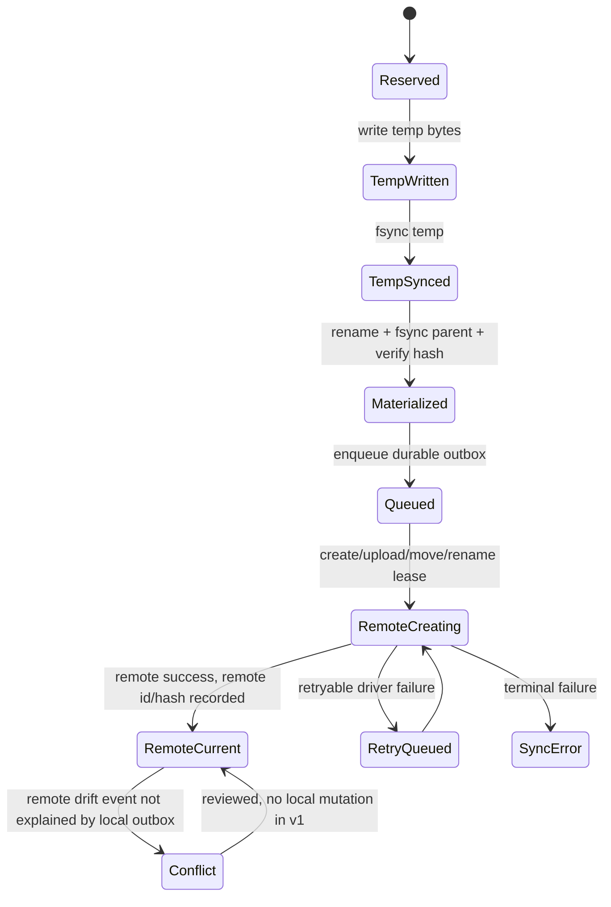

# Sync-State Model

Freshness: 2026-07-08

Scope: P0 research note for legal-document-intake task 5. This is documentation
only; no feature code is implemented here.

## (a) Durable Sync Tables

The sync store should be owned by the net-new `documents` slice because
`SPEC.md` assigns Document, FilingDecision, SyncState, and IntakeBatch language
to that slice, while workspace only owns vault config
(`goals/legal-document-intake/SPEC.md:26`). The DMS boundary must remain a
documents use-cases port, with Box as a server adapter over `@beep/box`, so
sync tables should store documents-domain IDs and provider-neutral remote IDs,
not generated Box SDK types (`goals/legal-document-intake/SPEC.md:89`).

The repo persistence convention is schema-first entity models projected into
slice-local table packages. Workspace tables define entity table files such as
`Thread.table.ts` by importing the domain entity and exporting
`EntityTable.pgTableFrom(Thread)` (`packages/workspace/tables/src/entities/Thread/Thread.table.ts:8`,
`packages/workspace/tables/src/entities/Thread/Thread.table.ts:27`).
Workspace then aggregates table metadata in `DbSchema`
(`packages/workspace/tables/src/Schema.ts:8`,
`packages/workspace/tables/src/Schema.ts:34`) and exports it from the tables
package (`packages/workspace/tables/src/index.ts:21`,
`packages/workspace/tables/src/index.ts:28`). Epistemic follows the same
pattern for `UsageRecord` (`packages/epistemic/tables/src/entities/UsageRecord/UsageRecord.table.ts:8`,
`packages/epistemic/tables/src/entities/UsageRecord/UsageRecord.table.ts:24`).
The generic `@beep/drizzle` projection is metadata-only and attaches the source
entity definition to the Drizzle table (`packages/drivers/drizzle/src/EntityTable.models.ts:466`,
`packages/drivers/drizzle/src/EntityTable.models.ts:501`,
`packages/drivers/drizzle/README.md:52`). The migration aggregation boundary is
`packages/_internal/db-admin`, where targets declare a schema name, table names,
and a Drizzle schema object (`packages/_internal/db-admin/src/migrations/ArchitectureLab.ts:79`,
`packages/_internal/db-admin/src/migrations/WorkspaceThread.ts:25`,
`packages/_internal/db-admin/src/targets.ts:49`). Therefore the implementation
shape should be `packages/documents/domain` entities plus
`packages/documents/tables` projections, later registered as a db-admin target.

Existing entity persistence includes base fields such as `createdAt`, `orgId`,
`rowVersion`, `schemaVersion`, `source`, and `updatedAt`
(`packages/shared/domain/src/entity/BaseEntity.ts:71`,
`packages/shared/domain/src/entity/BaseEntity.ts:95`). Persist descriptors can
name columns and attach storage-neutral index hints
(`packages/foundation/modeling/schema/src/EntitySchema/EntitySchema.persist.ts:273`,
`packages/foundation/modeling/schema/src/EntitySchema/EntitySchema.persist.ts:296`,
`packages/foundation/modeling/schema/src/EntitySchema/EntitySchema.persist.ts:383`),
and the Drizzle projection converts supported index hints to indexes or unique
indexes (`packages/drivers/drizzle/src/EntityTable.models.ts:338`,
`packages/drivers/drizzle/src/EntityTable.models.ts:388`). That supports using
unique hints for local path and remote ID identity columns, plus btree/lookup
hints for workspace and status columns.

Proposed table set:

1. `documents_sync_item`: one row per local vault item tracked by sync.
   Columns: base entity columns; `workspace_id`; `vault_root_id` or vault
   config reference; `local_rel_path`; `item_kind` (`file` or `folder`);
   `content_sha256`, `content_hash_algo`, `content_size_bytes`,
   `local_mtime_ms`, `local_generation`; `remote_provider`; `remote_item_type`;
   `remote_id`; `remote_parent_id`; `remote_name`; `remote_version_id`;
   `remote_etag`; `last_pushed_sha256`; `last_pushed_generation`;
   `sync_state`; `materialization_state`; `last_remote_event_id`.
   Keys/invariants: unique `(workspace_id, local_rel_path)`; unique
   `(remote_provider, remote_id)` when `remote_id` is not null; folders have
   null content hashes; `remote_current` requires `remote_id` and
   `last_pushed_sha256 = content_sha256` for files; local path is always
   relative to the canonical vault root and never a raw absolute path.

2. `documents_sync_content_snapshot`: append-only hash observations.
   Columns: base entity columns; `sync_item_id`; `local_generation`;
   `content_sha256`; `content_hash_algo`; `content_size_bytes`;
   `local_mtime_ms`; `observed_by` (`materialization`, `watch_scan`,
   `startup_scan`); `observed_at_ms`; `file_stat_json`.
   Keys/invariants: unique `(sync_item_id, local_generation)`; current
   `documents_sync_item.content_sha256` must point to the latest accepted
   snapshot; failed materialization attempts may write snapshots only after the
   final path is verified.

3. `documents_sync_outbox`: durable local-to-DMS operations.
   Columns: base entity columns; `sync_item_id`; `operation_type`
   (`create_folder`, `upload_file`, `upload_new_version`, `move_remote`,
   `rename_remote`); `idempotency_key`; `operation_status` (`queued`,
   `leased`, `succeeded`, `retryable_failed`, `terminal_failed`,
   `squashed`); `input_local_generation`; `input_content_sha256`;
   `from_rel_path`; `to_rel_path`; `target_remote_parent_id`;
   `remote_id_before`; `remote_id_after`; `attempt_count`; `lease_owner`;
   `leased_at_ms`; `last_error_json`; `succeeded_at_ms`.
   Keys/invariants: unique `idempotency_key`; operation success is the only
   transition that advances `documents_sync_item.remote_id` or
   `last_pushed_sha256`; queued move/rename operations can be squashed into a
   not-yet-succeeded create/upload operation for the same item.

4. `documents_sync_cursor`: provider cursor registry.
   Columns: base entity columns; `workspace_id`; `remote_provider`;
   `cursor_kind` (`box_events`); `stream_type`; `stream_position`;
   `last_polled_at_ms`; `last_event_id`; `backfill_after_ms`;
   `cursor_status`; `cursor_error_json`.
   Keys/invariants: unique `(workspace_id, remote_provider, cursor_kind,
   stream_type)`; cursor updates are committed only after all events in the
   response have been deduped and either matched to expected local pushes or
   inserted as conflicts.

5. `documents_sync_conflict`: remote drift review records.
   Columns: base entity columns; `workspace_id`; `sync_item_id` nullable for
   unknown remote items; `remote_provider`; `remote_id`; `remote_event_id`;
   `remote_event_type`; `conflict_kind` (`remote_create`, `remote_edit`,
   `remote_move`, `remote_rename`, `remote_delete`, `remote_unknown`);
   `local_rel_path_snapshot`; `remote_path_snapshot`; `local_sha256_snapshot`;
   `last_pushed_sha256_snapshot`; `remote_payload_json`; `resolution_status`;
   `resolved_by_principal`; `resolved_at_ms`.
   Keys/invariants: unique `(remote_provider, remote_event_id)` where
   available; conflict rows never mutate local vault content or local path in
   v1; resolving a conflict records a decision but does not turn sync into
   bidirectional merge.

6. `documents_materialization_journal`: crash recovery for local vault writes.
   Columns: base entity columns; `workspace_id`; `intake_batch_id`;
   `target_rel_path`; `target_abs_path_hash`; `temp_abs_path_hash`;
   `temp_rel_path`; `expected_sha256`; `actual_sha256`; `byte_count`;
   `phase` (`reserved`, `temp_written`, `temp_fsynced`, `renaming`,
   `committed`, `cleanup_required`, `abandoned`); `error_json`.
   Keys/invariants: at most one nonterminal row per `(workspace_id,
   target_rel_path)`; `committed` requires the final path to exist with the
   expected content hash; sync outbox rows are created only after
   materialization is committed.

The packet survey already records that no sync engine, durable sync state,
cursor registry, conflict records, or resumable jobs exist today
(`goals/legal-document-intake/research/exploration-findings.md:38`). The tables
above fill that gap without changing D4: local vault remains canonical and
remote drift is review-only (`goals/legal-document-intake/SPEC.md:28`).

## (b) Atomic-Materialization Protocol

Atomic local materialization is a hard spec constraint: a failed filing must not
leave partial files in the vault (`goals/legal-document-intake/SPEC.md:97`).
The existing utility layer has a synchronous `renameSync` wrapper over
`node:fs` (`packages/foundation/modeling/utils/src/FileSystem.ts:331`,
`packages/foundation/modeling/utils/src/FileSystem.ts:350`) and tests show that
the wrapper moves a path and leaves the old path absent and the new path present
(`packages/foundation/modeling/utils/test/FileSystem.test.ts:80`). The utility
layer also exposes `statSync`, `readdirSync`, `rmSync`, and `existsSync`
(`packages/foundation/modeling/utils/src/FileSystem.ts:284`,
`packages/foundation/modeling/utils/src/FileSystem.ts:325`,
`packages/foundation/modeling/utils/src/FileSystem.ts:385`,
`packages/foundation/modeling/utils/src/FileSystem.ts:423`), but it does not
currently expose a first-class fsync helper in the cited file-system surface
(`packages/foundation/modeling/utils/src/index.ts:112`). The implementation
should therefore add fsync-capable filesystem behavior at the app/server
boundary when P1/P3 code is written, rather than weakening the protocol.

Protocol for a single local write:

1. Reserve a `documents_materialization_journal` row with `phase = reserved`
   and set the corresponding sync item to `materializing` inside a database
   transaction. This transaction does not claim remote sync eligibility.
2. Write bytes to a temp path on the same filesystem as the final vault path,
   preferably under a hidden sibling temp directory beneath the vault root, so
   the final rename remains same-device atomic.
3. Hash while writing. After the final byte, flush and fsync the temp file.
   Then update the journal to `temp_fsynced` with `actual_sha256` and
   `byte_count`.
4. Rename the temp file to the final target path. Then fsync the destination
   directory so the directory entry survives a crash. Mark journal
   `committed`, upsert `documents_sync_item`, append
   `documents_sync_content_snapshot`, and enqueue the durable sync outbox row
   in one database transaction after the final path is verified.
5. Only after that transaction commits may the sync worker pick up the outbox
   operation and call the DMS adapter.

Crash-recovery invariants:

- If the app crashes before rename, the temp file is disposable. Recovery finds
  `reserved`, `temp_written`, or `temp_fsynced` rows, removes temp files when
  possible, and retries or marks `cleanup_required`.
- If the app crashes after rename but before the database commit, recovery
  stats and hashes the final path. If the hash matches the journal, recovery
  completes the DB commit path. If it does not match, recovery creates a local
  materialization error and does not enqueue remote sync.
- If the app crashes after the DB commit but before remote upload, the outbox
  row remains queued and is picked up on restart.
- `content_sha256` is advanced only after final-path verification.
  `last_pushed_sha256` is advanced only after the remote adapter confirms the
  upload/update succeeded.
- The database and filesystem cannot share a single ACID transaction, so the
  journal is the bridge. The invariant is not "DB and FS commit atomically"; it
  is "every crash state is detectable and either completed or cleaned without
  exposing partial bytes as a filed document."

## (c) Remote-Drift Detection Choice: Box Events/Webhooks vs Polling

Repo-verified Box driver surface: the public `Box` service composes generated
SDK operations with hand-written streaming operations
(`packages/drivers/box/src/Box.service.ts:64`,
`packages/drivers/box/src/Box.service.ts:73`). Generated operations include
`events.getEvents` and `events.getEventsWithLongPolling`
(`packages/drivers/box/src/_generated/Box.operations.gen.ts:162`), while the
hand-written streaming surface exposes `events.getEventStream`
(`packages/drivers/box/src/Box.streaming.ts:532`,
`packages/drivers/box/src/Box.streaming.ts:640`,
`packages/drivers/box/src/Box.streaming.ts:1148`). Generated query models
include `streamType`, `streamPosition`, `limit`, and event-type filters
(`packages/drivers/box/src/_generated/Box.models.gen.ts:31315`,
`packages/drivers/box/src/_generated/Box.models.gen.ts:31450`), and the
generated stream-type literals include `all`, `changes`, `sync`, `admin_logs`,
and `admin_logs_streaming`
(`packages/drivers/box/src/_generated/Box.models.gen.ts:31374`). The same
driver exposes file and folder operations needed for one-way push:
`files.getFileById`, `files.updateFileById`, `folders.createFolder`,
`folders.getFolderItems`, and `folders.updateFolderById`
(`packages/drivers/box/src/_generated/Box.operations.gen.ts:188`,
`packages/drivers/box/src/_generated/Box.operations.gen.ts:233`,
`packages/drivers/box/src/_generated/Box.operations.gen.ts:1930`,
`packages/drivers/box/src/_generated/Box.operations.gen.ts:2386`). Uploads are
covered by generated preflight and streaming upload methods
(`packages/drivers/box/src/_generated/Box.operations.gen.ts:517`,
`packages/drivers/box/src/Box.streaming.ts:646`,
`packages/drivers/box/src/Box.streaming.ts:1167`).

Repo-verified webhooks surface: generated operations include
`webhooks.createWebhook`, `getWebhooks`, `updateWebhookById`,
`deleteWebhookById`, and `validateMessage`
(`packages/drivers/box/src/_generated/Box.operations.gen.ts:534`,
`packages/drivers/box/src/_generated/Box.operations.gen.ts:5396`).

Box API knowledge, external and checkable later: `GET /events` returns event
entries and a `next_stream_position`; its `stream_position` query can start at
`now`, `0`, or a stored position. Source checked 2026-07-08:
<https://developer.box.com/reference/get-events>. Box API knowledge, external:
the events overview says user events may be duplicate/out of chronological
order and dedupe by event ID is expected; `admin_logs_streaming` is near-real
time but may also include duplicates/out-of-order events and only has a recent
window. Source checked 2026-07-08:
<https://developer.box.com/guides/events>. Box API knowledge, external:
`OPTIONS /events` returns real-time servers for long-polling events. Source
checked 2026-07-08: <https://developer.box.com/reference/options-events>.

Box API knowledge, external and checkable later: `POST /webhooks` creates a
webhook with a target, an `address`, and triggers. Source checked 2026-07-08:
<https://developer.box.com/reference/post-webhooks>. Box API knowledge,
external: the Box webhooks overview says V2 webhook notification URLs must be
HTTPS and support verification/retries. Source checked 2026-07-08:
<https://developer.box.com/guides/webhooks>.

Recommendation: use Box event-stream polling as the primary remote-drift
detector, not webhooks. The desktop app may be offline and has no public HTTPS
endpoint available for Box to call, so webhooks would require an additional
relay service that is not in this packet's target surfaces
(`goals/legal-document-intake/SPEC.md:64`,
`goals/legal-document-intake/SPEC.md:76`). Event-stream polling works with the
sidecar when online, persists a cursor in `documents_sync_cursor`, and resumes
after restart. Periodic folder listing via `folders.getFolderItems` should be a
secondary reconciliation scan for startup/bootstrap, cursor gaps, or long
offline periods, not the primary drift detector, because it has no event IDs or
stream position and must infer changes from remote tree snapshots.

For v1 one-way push, event handling should classify remote events this way:

- Remote event matches a just-succeeded local outbox operation by remote ID,
  path/name, and/or pushed hash: record `last_remote_event_id` and advance the
  cursor; do not create a conflict.
- Remote event changes an item whose current `last_pushed_*` snapshot does not
  match the observed remote payload: insert `documents_sync_conflict`.
- Remote event references an unknown remote item under the mirror root: insert
  an `remote_create` or `remote_unknown` conflict.
- Remote delete/trash/move/rename never deletes or moves local files in v1,
  because D4 says remote changes are conflicts-to-review and not auto-merged
  (`goals/legal-document-intake/SPEC.md:28`).

## (d) Restart-Survival and Convergence

Restart survival should come from durable tables, not from background fiber
state. On boot, the sync service should:

1. Replay `documents_materialization_journal` recovery before starting remote
   sync. This preserves the atomic write invariant from the spec
   (`goals/legal-document-intake/SPEC.md:97`).
2. Load queued or leased `documents_sync_outbox` rows. Expired leases become
   queued; succeeded rows are not replayed because their idempotency keys and
   sync item snapshots already record the remote result.
3. Load `documents_sync_cursor` and resume Box event polling from the stored
   `stream_position`. Process events idempotently by unique
   `(remote_provider, remote_event_id)` conflict keys and by the cursor row.
4. Run a startup vault scan to catch local file-system changes missed while the
   app was not running. The packet already identifies the sync engine as net
   new work, so the scan is part of the new documents sync service rather than
   reuse of an existing engine (`goals/legal-document-intake/research/exploration-findings.md:38`).
5. Optionally run a remote folder-list reconciliation under the Box mirror root
   if the cursor is missing, stale, or known to have fallen outside the Box
   event retention window.

Create/move/rename convergence under the one-way push model:

- Create: local materialization commits the final path and hash, then enqueues
  `create_folder` rows for missing remote ancestors and `upload_file` for the
  file. Success records the provider remote IDs in `documents_sync_item`.
- Rename before upload succeeds: the outbox squashes the pending upload/create
  to the latest `local_rel_path` and remote name before calling Box.
- Rename after upload succeeds: the outbox uses the existing `remote_id` and a
  `rename_remote` operation, then updates `remote_name` and
  `last_pushed_generation` only after success.
- Move before upload succeeds: the outbox squashes the create/upload to the
  final parent path. Move after upload succeeds uses `move_remote` with the
  persisted `remote_id` and target remote parent ID.
- Remote drift during any of the above inserts a conflict unless it can be
  proven to be the remote echo of the local outbox operation.

## File-Watch and DrainableWorker Fit

`packages/foundation/modeling/utils/src/FileSystem.ts` contains the existing
file-watch primitive. `makeWaitForFile` subscribes to
`FileSystem.watch(directory)`, filters watch events by exact basename, and
returns the first matching event with `Stream.runHead`
(`packages/foundation/modeling/utils/src/FileSystem.ts:429`,
`packages/foundation/modeling/utils/src/FileSystem.ts:460`,
`packages/foundation/modeling/utils/src/FileSystem.ts:465`). The utility index
describes this as an async watch helper alongside synchronous wrappers such as
`renameSync`, `readdirSync`, and `statSync`
(`packages/foundation/modeling/utils/src/index.ts:112`). This is useful for
waiting on specific sentinel files or narrow test events, but it is not a
recursive vault watcher, not a durable event log, and not a sync engine.

`DrainableWorker` is the existing queue primitive. Its interface exposes
`enqueue` and `drain` (`packages/foundation/modeling/utils/src/DrainableWorker.ts:30`),
and `makeDrainableWorker` creates an unbounded transactional queue, tracks
outstanding work with a `TxRef`, forks the worker in the current scope, and
resolves `drain` only when outstanding work reaches zero
(`packages/foundation/modeling/utils/src/DrainableWorker.ts:76`,
`packages/foundation/modeling/utils/src/DrainableWorker.ts:79`,
`packages/foundation/modeling/utils/src/DrainableWorker.ts:82`,
`packages/foundation/modeling/utils/src/DrainableWorker.ts:93`). Its test proves
that `drain` waits for work enqueued while another item is still processing
(`packages/foundation/modeling/utils/test/DrainableWorker.test.ts:7`,
`packages/foundation/modeling/utils/test/DrainableWorker.test.ts:40`,
`packages/foundation/modeling/utils/test/DrainableWorker.test.ts:49`).

Fit in the sync design:

- Use file watching as a notification accelerator: when a local vault change is
  observed, enqueue a lightweight "scan this path" command.
- Use `DrainableWorker` for in-process serialization/debouncing of scan,
  materialization recovery, outbox pumping, and event polling tasks.
- Keep durability in `documents_sync_outbox`, `documents_sync_cursor`,
  `documents_sync_item`, and `documents_sync_conflict`. The worker can be
  interrupted because every meaningful state transition is persisted before or
  after each side effect.
- In tests, expose the worker's `drain` effect so sync tests can deterministically
  wait for queued work rather than sleeping. This follows the utility's stated
  purpose of replacing timing-sensitive sleeps with deterministic drain
  (`packages/foundation/modeling/utils/src/index.ts:59`).

## Proposed SPEC Amendments (not yet applied)

None. This note narrows D4/P3 implementation choices by recommending Box
event-stream polling plus listing reconciliation, but it does not supersede
D1-D11. The recommendation is consistent with one-way local canonical sync and
remote drift as conflict records (`goals/legal-document-intake/SPEC.md:28`) and
with P3's restart-survival exit criteria (`goals/legal-document-intake/PLAN.md:17`).

## Recommendation

Implement sync state as schema-first documents-domain entities projected through
a `packages/documents/tables` package, following the `EntityTable.pgTableFrom`
and `DbSchema` pattern used by workspace and epistemic tables
(`packages/workspace/tables/src/entities/Thread/Thread.table.ts:27`,
`packages/workspace/tables/src/Schema.ts:34`,
`packages/epistemic/tables/src/entities/UsageRecord/UsageRecord.table.ts:24`).
The SQL below is illustrative documentation only; implementation should express
these as domain models plus table projections where possible.

```sql
-- Documentation-only sketch, not a migration.

create table documents_sync_item (
  id serial primary key,
  entity_type text not null,
  org_id integer not null,
  workspace_id integer not null,
  row_version integer not null,
  schema_version text not null,
  source text not null,
  created_at bigint not null,
  updated_at bigint not null,

  vault_root_id integer not null,
  local_rel_path text not null,
  item_kind text not null check (item_kind in ('file', 'folder')),
  materialization_state text not null,
  sync_state text not null,
  content_hash_algo text,
  content_sha256 text,
  content_size_bytes bigint,
  local_mtime_ms bigint,
  local_generation integer not null,

  remote_provider text not null,
  remote_item_type text,
  remote_id text,
  remote_parent_id text,
  remote_name text,
  remote_version_id text,
  remote_etag text,
  last_pushed_sha256 text,
  last_pushed_generation integer,
  last_remote_event_id text,

  unique (workspace_id, local_rel_path),
  unique (remote_provider, remote_id)
);

create table documents_sync_outbox (
  id serial primary key,
  entity_type text not null,
  org_id integer not null,
  workspace_id integer not null,
  row_version integer not null,
  schema_version text not null,
  source text not null,
  created_at bigint not null,
  updated_at bigint not null,

  sync_item_id integer not null,
  operation_type text not null,
  operation_status text not null,
  idempotency_key text not null unique,
  input_local_generation integer not null,
  input_content_sha256 text,
  from_rel_path text,
  to_rel_path text,
  target_remote_parent_id text,
  remote_id_before text,
  remote_id_after text,
  attempt_count integer not null default 0,
  lease_owner text,
  leased_at_ms bigint,
  last_error_json jsonb,
  succeeded_at_ms bigint
);

create table documents_sync_cursor (
  id serial primary key,
  entity_type text not null,
  org_id integer not null,
  workspace_id integer not null,
  row_version integer not null,
  schema_version text not null,
  source text not null,
  created_at bigint not null,
  updated_at bigint not null,

  remote_provider text not null,
  cursor_kind text not null,
  stream_type text not null,
  stream_position text not null,
  last_event_id text,
  last_polled_at_ms bigint,
  cursor_status text not null,
  cursor_error_json jsonb,

  unique (workspace_id, remote_provider, cursor_kind, stream_type)
);

create table documents_sync_conflict (
  id serial primary key,
  entity_type text not null,
  org_id integer not null,
  workspace_id integer not null,
  row_version integer not null,
  schema_version text not null,
  source text not null,
  created_at bigint not null,
  updated_at bigint not null,

  sync_item_id integer,
  remote_provider text not null,
  remote_id text,
  remote_event_id text,
  remote_event_type text not null,
  conflict_kind text not null,
  local_rel_path_snapshot text,
  remote_path_snapshot text,
  local_sha256_snapshot text,
  last_pushed_sha256_snapshot text,
  remote_payload_json jsonb not null,
  resolution_status text not null,
  resolved_by_principal jsonb,
  resolved_at_ms bigint,

  unique (remote_provider, remote_event_id)
);

create table documents_materialization_journal (
  id serial primary key,
  entity_type text not null,
  org_id integer not null,
  workspace_id integer not null,
  row_version integer not null,
  schema_version text not null,
  source text not null,
  created_at bigint not null,
  updated_at bigint not null,

  intake_batch_id integer,
  target_rel_path text not null,
  target_abs_path_hash text not null,
  temp_rel_path text not null,
  temp_abs_path_hash text not null,
  expected_sha256 text not null,
  actual_sha256 text,
  byte_count bigint,
  phase text not null,
  error_json jsonb
);
```

Single-item lifecycle:



Drift-detection choice: primary Box event-stream polling using
`events.getEvents` or `events.getEventStream` with a durable
`stream_position`, plus startup/repair folder-list reconciliation through
`folders.getFolderItems`. Do not make webhooks the v1 primary path because a
desktop app that is offline or lacks a public HTTPS endpoint cannot reliably
receive webhook callbacks; a relay service would be new infrastructure outside
the named P3 target surface (`goals/legal-document-intake/SPEC.md:76`,
`goals/legal-document-intake/PLAN.md:17`).
