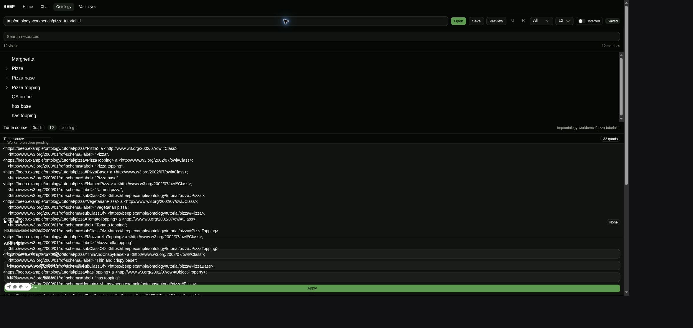

# Probe D04 — Ontology graph pending

Date: 2026-07-12  
Target: `http://127.0.0.1:1421` (new Chrome tab)

Opened `tmp/ontology-workbench/pizza-tutorial.ttl`. The document loaded with 33 quads, while the graph badge remained `pending` and the surface showed `Worker projection pending`.

## Console messages

Every console message was checked (all levels) for `worker|Worker|visualizer|Failed|import|module|MIME`.

Verbatim matching messages: **none**.

## Network requests

Requests were checked for `visualizer` or `worker` during a clean reload, Ontology navigation, and opening the pizza fixture.

Matching requests: **none**. Therefore there is no worker URL, HTTP status, or response content-type to report; no request reached the network.

## Required probe

Exact output:

```text
{"workerCtor":"undefined","badge":["pending"]}
```

## Direct worker-construction probe

Exact result:

```text
TypeError: Worker is not a constructor
```

## Answers

### (a) Is there any console error mentioning the worker or module resolution? Quote it.

No. There were no console messages at any level matching the requested terms, so there is no worker/module-resolution console error to quote.

### (b) Did any network request for the visualizer worker fail (or return HTML/wrong MIME)? Give URL + status + content-type.

No. There was no network request matching `visualizer` or `worker`. URL: none; status: none; content-type: none.

### (c) Does the worker constructor throw? Quote the error.

Yes. The direct probe returned:

```text
TypeError: Worker is not a constructor
```

### (d) Best-supported conclusion for why the graph stays pending

The observed cause is earlier than Vite URL resolution. On this page, `globalThis.Worker` is unavailable (`typeof Worker === "undefined"`). The client bridge reads `globalThis.Worker` and immediately returns when it is undefined, without setting the graph error atom. Consequently no worker is constructed, no worker URL is requested, neither the worker `error` nor `messageerror` listener can fire, the backend atom remains empty, and the UI renders that empty state as `pending` indefinitely.

This evidence does **not** support a linked-workspace Vite build, HTML fallback, or MIME failure: such a failure would require a worker request, and none occurred.

## Screenshot


