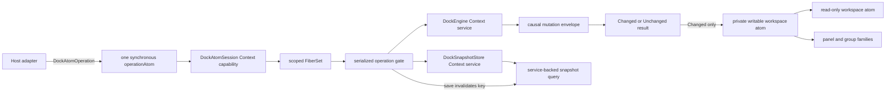

# Dockview core, reconsidered from first principles

This POC treats a dock workspace as a headless transactional state machine. It
does not port `dockview-core` class-by-class. The earlier sketches beside this
directory remain intact; the greenfield implementation is isolated in
[`poc/`](./poc/).

The central claim is that DOM state is a projection of dock state, never the
source of dock topology. Pointer, keyboard, RPC, and programmatic adapters all
compile intent into the same schema-decoded operation and command algebras.

## Architecture



One `makeDockAtoms()` call owns one Atom factory, registry, service graph,
operation lane, and lifetime. `operationAtom` is deliberately synchronous at
the host boundary: it submits into the Context-owned Effect runtime. A scoped
`FiberSet` keeps submissions alive, while a semaphore evaluates and publishes
them in submission order. `awaitIdle` gives tests and non-visual hosts an
explicit completion barrier.

The result atom exposes the latest submission as a typed `AsyncResult`. An
older completion cannot overwrite that latest result, but every completion is
still logged with its submission id and operation kind. State is read only
after acquiring the serialization permit, preventing stale read/modify/write
transitions when commands arrive rapidly.

There are two intentionally different reactive state categories:

- Live layout is local immutable state. Effect Atom owns it directly, and
  projections use ordinary dependency tracking.
- Persisted snapshots are service-backed state. Their query is a
  `runtime.atom(...)` bound to a custom `factory.withReactivity(...)` key;
  successful saves invalidate that key.

## Schema-first domain algebra

The layout is a binary tree:

```text
DockWorkspace
|- EmptyWorkspace(revision = 0)
`- PopulatedWorkspace(revision = 0, root)
   `- DockNode
      |- TabsNode(groupId, before = [], active, after = [])
      `- SplitNode(splitId, layout)
         |- HorizontalSplitLayout(axis, leftRatio = 5000, left, right)
         `- VerticalSplitLayout(axis, topRatio = 5000, top, bottom)
```

The schema carries defaults and removes invalid states:

- A populated workspace always has a root.
- A split always has exactly two children; unary splits are impossible.
- A tab group is a non-empty zipper with the active panel stored directly.
- Panels live in exactly one leaf rather than a record plus drifting references.
- Closing or moving the final panel removes its leaf and promotes its sibling.
- The public workspace codec checks panel, group, and split identity uniqueness
  across the complete recursive tree; the reducer preserves reason-specific
  typed diagnostics for the same invariant.
- Split shares use exact integer basis points from `1000` through `9000`, so
  complements such as `9000 -> 1000` cannot acquire floating-point drift.
- Constructor-only defaults keep `.make(...)` calls terse while encoded
  snapshots remain explicit and strict.
- Optional external state is represented by `Option`; `null` and `undefined`
  do not leak into the core model.

Tagged constructors never repeat schema-owned `kind`, `_tag`, or `axis` values.
The recursive knot follows the `@beep/md` pattern: a typed suspended
`DockNode.Type` / `DockNode.Encoded` codec is declared first, the horizontal and
vertical layout classes and `SplitNode` tagged class consume it, and the
`DockNode` union is defined last. Mutual recursion therefore does not force any
member back to an unowned structural schema.

The principal discriminated unions are:

- `PanelView`: renderer-registry component or serializable text
- `DockWorkspace`: empty or populated
- `DockNode`: tabs or split
- `SplitLayout`: horizontal `{ leftRatio, left, right }` or vertical
  `{ topRatio, top, bottom }`
- `DockPlacement`: root, tab, or semantic split side
- `DockMoveTarget`: existing tabs or a new semantic split
- `CommandOrigin`: user gesture or API call
- `DockCommand`: open, activate, move, close, resize, or clear
- `DockEvent`: changed semantic notifications, including restore
- `DockMutationResult`: changed state/events or explicit unchanged reason
- `DockAtomOperation`: typed command, unknown command, save, or restore

`PanelView` remains a union intentionally: it is the serializable contract a
host renderer adapter consumes, even though the topology reducer treats both
members identically. Per-group selection belongs to core topology; any single
global keyboard-focus concept belongs to the host adapter.

The nesting rule is semantic, not mechanical. It is used where members have
genuinely disjoint properties or where common metadata belongs to an outer
envelope. `SplitLayout` prevents horizontal and vertical geometry from being
mixed; `DockMutationOutcome(commandId, origin, result)` keeps causality in one
place while `DockMutationResult` owns changed/unchanged payloads. An
axis-specific `SplitResizedEvent` payload and a `{ revision, content }`
workspace envelope are plausible later applications. They are deliberately
not added until a consumer needs self-contained axis data or revision and
content acquire independent lifecycles. Literal-only reasons and sides remain
flat because nesting them would add shape without excluding an invalid state.

## Model-owned pure behavior

Schemas and classes are the public companions for their data. There is no
`DockTree` helper namespace and no family of free `isSame*`, `find*`, or
constructor-default helpers:

```ts
PanelId.equals(panel.id, candidateId)
Panel.findInTabs(tabs, candidateId)
pipe(root, TabsNode.findForPanel(candidateId))
pipe(root, DockNode.replaceAtGroup(groupId, replacement))
pipe(workspace, DockWorkspace.withRevision(revision))
```

Branded schemas keep `.is(value)` as the unary runtime guard and expose the
binary, dual equivalence as `.equals(left, right)`. Multi-argument topology
operations are dual so the same static works data-first or in a pipe. Zipper
construction and mutation live on `TabsNode`; split geometry lives on
`SplitLayout` and `SplitNode`; traversal and recursive rewrites live on
`DockNode`; workspace projections, content equality, the empty default, and
revision installation live on `DockWorkspace`.

## Effect and Context boundaries

`Context.Service` is used for capabilities, not as a service-locator bag:

- `DockEngine` owns replaceable transition policy and snapshot codecs.
- `DockSnapshotStore` is the external persistence port; the POC supplies an
  isolated in-memory layer.
- `DockAtomSession` owns ordered execution and publication for one registry.

Pure recursive traversal and zipper manipulation are colocated on the model
companions. The reducer composes those operations into typed Effects and owns
only command policy, typed rejection, revision advancement, event production,
invariant diagnostics, logging, and metrics.

Browser, RPC, IndexedDB, collaboration, authorization, or policy layers can
replace service implementations without changing the domain or Atom graph.

## Transaction semantics

A command produces
`Effect<DockMutationOutcome, DockTransitionError>`. The outcome is the causal
envelope; its `result` is the nested `Changed | Unchanged` union:

1. Validate the current complete tree.
2. Evaluate one immutable command.
3. Validate a complete candidate before publication.
4. Return an outcome with command causality exactly once and a `Changed` result
   containing the next state and semantic event, or an `Unchanged` result with
   an explicit reason.
5. Publish exactly once for `Changed`; publish nothing for `Unchanged` or
   failure.

No-op activation and resize therefore do not bump revision, emit events, or
notify workspace subscribers. Events describe accepted state changes; this
POC does not claim to be an event-sourced persistence model.

Snapshot encoding validates global invariants before serialization. Restore
decodes and validates the whole snapshot before installation. A changed restore
uses `current.revision + 1` and records the snapshot's revision separately as
provenance; an identical restore is `Unchanged`.

## Proven scenario

The focused tests prove:

1. Open, activate, resize, move-to-tab, move-to-split, close, and tree collapse.
2. Exact split-side semantics and basis-point complements at `9000` and `7000`.
3. Explicit unchanged outcomes with stable revision and zero Atom publication.
4. Schema JSON round-trips and refusal to encode globally invalid trees.
5. Monotonic restore with snapshot provenance.
6. Revision exhaustion remains in the declared typed error channel without
   masking idempotent outcomes or business rejections.
7. Rapid typed and unknown submissions preserve ordered state changes.
8. Save/query invalidation and typed malformed-input or missing-snapshot errors.
9. Invalid initial state is rejected before a registry is exposed.

## Deliberately outside this POC

- DOM rendering and framework adapters
- pointer/touch drag backends, ghosts, hit testing, and gesture coalescing
- bounded backpressure for high-frequency pointer-resize streams
- floating groups and popout-window resource lifecycles
- sash constraint solving and layout measurement
- maximize, hidden views, overflow, themes, and tab accents
- undo/redo, collaboration, RPC, and snapshot migrations
- compatibility with existing Dockview serialized payloads

The POC's `dispose()` is a synchronous adapter convenience. A production host
with asynchronously finalized custom layers should own the registry/runtime in
an Effect `Scope` and await that scope's close. Likewise, resize gesture
coalescing belongs at the pointer adapter; the kernel preserves every submitted
operation and intentionally does not guess which commands may be dropped.

## Files and verification

- [`poc/Domain.ts`](./poc/Domain.ts) - schemas, defaults, unions, commands,
  errors, and their pure companion behavior
- [`poc/Reducer.ts`](./poc/Reducer.ts) - invariant validation and typed
  transitions
- [`poc/DockEngine.ts`](./poc/DockEngine.ts) - engine and persistence services
- [`poc/DockAtomProtocol.ts`](./poc/DockAtomProtocol.ts) - session operation and
  outcome schemas
- [`poc/DockAtoms.ts`](./poc/DockAtoms.ts) - isolated runtime, serialization,
  lifetime, and projections
- [`poc/test`](./poc/test) - transition, codec, concurrency, Atom, and failure
  proofs

Run the focused proof from the repository root:

```sh
bunx tsgo -p scratchpad/dockview/tsconfig.json --pretty false
(cd scratchpad/dockview && bunx biome check --config-path biome.json poc)
bun test scratchpad/dockview/poc/test scratchpad/test/dockview-anchored-box.test.ts
```
