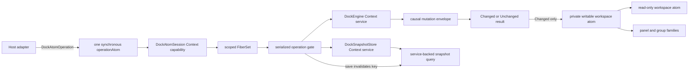

# Dockview core, reconsidered from first principles

This POC treats a dock workspace as a headless transactional state machine. It
does not port `dockview-core` class-by-class. The greenfield implementation is
isolated in [`poc/`](./poc/).

The central claim is that DOM state is a projection of dock state, never the
source of dock topology. Pointer, keyboard, RPC, and programmatic adapters all
compile intent into the same schema-decoded operation and command algebras.

## Architecture



One `makeDockAtoms()` call owns one Atom factory, registry, service graph,
operation lane, and lifetime. `operationAtom` is deliberately synchronous at
the host boundary: it submits into the Context-owned Effect runtime. A scoped
`FiberSet` keeps submissions alive, while a semaphore evaluates and publishes
them in submission order. `awaitIdle` gives tests and non-visual hosts an
explicit completion barrier.

The result atom exposes the latest submission as a typed `AsyncResult`. An
older completion cannot overwrite that latest result, but every completion is
also appended to `operationFeedAtom` with its monotone submission ordinal and
operation kind, including typed failures, while logging remains unchanged. State is read only
after acquiring the serialization permit, preventing stale read/modify/write
transitions when commands arrive rapidly.

The feed is an unbounded append-only Atom log so `useAtomValue` and
`useAtomSubscribe` adapters can recover every in-order entry from the cumulative
window even when React coalesces notifications. Appending is synchronous and
never waits on a slow subscriber; losslessness lasts for the attached session,
at the explicit cost of memory growing with completed operations until
`dispose()` tears down the registry and its feed.

There are two intentionally different reactive state categories:

- Live layout is local immutable state. Effect Atom owns it directly, and
  projections use ordinary dependency tracking.
- Persisted snapshots are service-backed state. Their query is a
  `runtime.atom(...)` bound to a custom `factory.withReactivity(...)` key;
  successful saves invalidate that key.

Geometry is a derived projection, not kernel state: the ratio tree plus a host-supplied
container box produces per-group pixel boxes and sash hit rectangles. Each split rounds
the leading extent once and assigns the trailing extent from the remainder, guaranteeing
that leading + gap + trailing exactly equals the parent extent. `GeometryOptions.minGroupExtent`
(default 0) adds a per-split-local minimum: a feasible split clamps its partition so both
sides receive at least the minimum, an infeasible split keeps the proportional partition,
and the exact-partition invariant holds in every case. It is deliberately not a global
constraint solver — nested same-axis trees clamp level-by-level, and per-group minimum
maps, LayoutPriority, and snap-to-collapse remain out. Content-aware minimums (a panel's
text wants 142px) are pure inputs to this clamp; see
`explorations/computable-workspace-geometry/` for why they never require DOM measurement.

Floating topology is part of the same headless kernel. Each workspace carries a
`floating` array of `{ anchoredBox, root }` members; array order is z-order, with
the last member topmost. Every member projects its recursive root inside a box
resolved and clamped against the host container. Docked maximize still receives
the complete container, while floating projections remain above it and are not
affected by maximize.

## Schema-first domain algebra

The layout is a binary tree:

```text
DockWorkspace(floating = [])
|- EmptyWorkspace(revision = 0) // empty docked tree; floating may be non-empty
`- PopulatedWorkspace(revision = 0, root, maximized = none)
   `- DockNode
   |- TabsNode(groupId, before = [], active, after = [], metadata.visible = true)
      `- SplitNode(splitId, layout)
         |- HorizontalSplitLayout(axis, leftRatio = 5000, left, right)
         `- VerticalSplitLayout(axis, topRatio = 5000, top, bottom)
```

The schema carries defaults and removes invalid states:

- A populated workspace always has a root.
- A split always has exactly two children; unary splits are impossible.
- A tab group is a non-empty zipper with the active panel stored directly.
- Panels live in exactly one leaf rather than a record plus drifting references.
- Closing or moving the final panel removes its leaf and promotes its sibling.
- The public workspace codec checks panel, group, and split identity uniqueness
  across the complete docked-plus-floating forest; the reducer preserves reason-specific
  typed diagnostics for the same invariant.
- Split shares use exact integer basis points from `1000` through `9000`, so
  complements such as `9000 -> 1000` cannot acquire floating-point drift.
- Constructor-only defaults keep `.make(...)` calls terse while encoded
  snapshots remain explicit and strict.
- Panels persist render mode and an optional custom-tab renderer key; groups
  persist locked mode, header visibility, and header position.
- Optional external state is represented by `Option`; `null` and `undefined`
  do not leak into the core model.
- `PopulatedWorkspace.maximized` is an optional group identity checked globally:
  when present it must resolve to a visible group in the tree.

Tagged constructors never repeat schema-owned `kind`, `_tag`, or `axis` values.
The recursive knot follows the `@beep/md` pattern: a typed suspended
`DockNode.Type` / `DockNode.Encoded` codec is declared first, the horizontal and
vertical layout classes and `SplitNode` tagged class consume it, and the
`DockNode` union is defined last. Mutual recursion therefore does not force any
member back to an unowned structural schema.

The principal discriminated unions are:

- `PanelView`: renderer-registry component or serializable text
- `DockWorkspace`: empty or populated
- `DockNode`: tabs or split
- `SplitLayout`: horizontal `{ leftRatio, left, right }` or vertical
  `{ topRatio, top, bottom }`
- `DockPlacement`: root, indexed/active-policy tab insertion, semantic split,
  or workspace-root split
- `DockMoveTarget`: existing tabs, a new semantic split, or a workspace-root split
- `DockGroupMoveTarget`: tab merge or group relocation split variants
- `CommandOrigin`: user gesture or API call
- `DockCommand`: open, activate, update panel, move panel, move group, update
  group, close, resize, clear, maximize, restore maximized, float, dock floating,
  or move a floating member
- `DockEvent`: changed semantic notifications, including per-facet panel
  updates, group metadata updates, and restore
- `DockMutationResult`: changed state/events or explicit unchanged reason
- `DockAtomOperation`: typed command, unknown command, save, or restore

`PanelView` remains a union intentionally: it is the serializable contract a
host renderer adapter consumes, even though the topology reducer treats both
members identically. Per-group selection belongs to core topology; any single
global keyboard-focus concept belongs to the host adapter.

The nesting rule is semantic, not mechanical. It is used where members have
genuinely disjoint properties or where common metadata belongs to an outer
envelope. `SplitLayout` prevents horizontal and vertical geometry from being
mixed; `DockMutationOutcome(commandId, origin, result)` keeps causality in one
place while `DockMutationResult` owns changed/unchanged payloads. An
axis-specific `SplitResizedEvent` payload remains a plausible later application.
Persisted snapshots now use a `{ version, workspace }` envelope so future
migrations always begin from an explicit format version; the live workspace
remains envelope-free because revision and content still share one lifecycle.
Literal-only reasons and sides remain flat because nesting them would add shape
without excluding an invalid state.

Whole-group relocation deliberately uses `GroupSplitPlacement` and
`GroupRootSplitPlacement`, distinct from panel-opening `SplitPlacement` and
`RootSplitPlacement`. The relocation variants carry only the new split's id,
side, ratio, and (for a sibling split) reference group. They do not carry a
`newGroupId`, because relocation preserves the moving group's identity and an
unused replacement identity would be a representable invalid state.

## Model-owned pure behavior

Schemas and classes are the public companions for their data. There is no
`DockTree` helper namespace and no family of free `isSame*`, `find*`, or
constructor-default helpers:

```ts
PanelId.equals(panel.id, candidateId)
Panel.findInTabs(tabs, candidateId)
pipe(root, TabsNode.findForPanel(candidateId))
pipe(root, DockNode.replaceAtGroup(groupId, replacement))
pipe(workspace, DockWorkspace.withRevision(revision))
```

Branded schemas keep `.is(value)` as the unary runtime guard and expose the
binary, dual equivalence as `.equals(left, right)`. Multi-argument topology
operations are dual so the same static works data-first or in a pipe. Zipper
construction and mutation live on `TabsNode`; split geometry lives on
`SplitLayout` and `SplitNode`; traversal and recursive rewrites live on
`DockNode`; workspace projections, content equality, the empty default, and
revision installation live on `DockWorkspace`.

## Effect and Context boundaries

`Context.Service` is used for capabilities, not as a service-locator bag:

- `DockEngine` owns replaceable transition policy and snapshot codecs.
- `DockSnapshotStore` is the external persistence port; the POC supplies an
  isolated in-memory layer.
- `DockAtomSession` owns ordered execution and publication for one registry.

Pure recursive traversal and zipper manipulation are colocated on the model
companions. The reducer composes those operations into typed Effects and owns
only command policy, typed rejection, revision advancement, event production,
invariant diagnostics, logging, and metrics.

Browser, RPC, IndexedDB, collaboration, authorization, or policy layers can
replace service implementations without changing the domain or Atom graph.

That replaceable-engine claim is proven by a policy layer that wraps the live
engine's `transition`; `lockedGroupsPolicy` is the concrete example. Policies
see the same validated state and typed-error channel, while the Atom graph
remains unchanged.

## Transaction semantics

A command produces
`Effect<DockMutationOutcome, DockTransitionError>`. The outcome is the causal
envelope; its `result` is the nested `Changed | Unchanged` union:

1. Validate the current complete tree.
2. Evaluate one immutable command.
3. Validate a complete candidate before publication.
4. Return an outcome with command causality exactly once and a `Changed` result
   containing the next state and semantic event, or an `Unchanged` result with
   an explicit reason.
5. Publish exactly once for `Changed`; publish nothing for `Unchanged` or
   failure.

No-op activation and resize therefore do not bump revision, emit events, or
notify workspace subscribers. Events describe accepted state changes; this
POC does not claim to be an event-sourced persistence model.

Snapshot encoding validates global invariants before serialization and wraps
the workspace in a versioned `{ version, workspace }` envelope. Restore decodes
and validates the whole envelope before installation. A changed restore uses
`current.revision + 1` and records the decoded workspace's revision separately
as provenance; an identical restore is `Unchanged`.

Panel and group update patches use explicit `Option` fields and replace each
present facet as a whole value. Group `locked` metadata is data only here; the
reducer deliberately does not veto moves because that belongs to the upcoming
replaceable policy layer.

Maximize follows dockview's auto-exit policy. Structural commands (`openPanel`,
`movePanel`, `moveGroup`, `closePanel`, and `clearWorkspace`) restore normal
projection in the same transition. Activating another group also restores it,
while activation inside the maximized group and `resizeSplit` retain it.
Activating a hidden group reveals it. Panel/group metadata updates retain
maximize except that hiding the maximized group restores normal projection.
Every automatic restore appends `GroupRestoredEvent` to the command's event
batch, including collapse paths that remove the maximized group.

## Divergences and their costs

- The POC uses a binary tree with basis-point ratios, while gridview uses
  N-child branches sized in pixels. A three-way row therefore requires nested
  ratios rather than one flat branch, and resizing or projecting it must account
  for both levels. The `[1000, 9000]` `SplitRatio` bound also forbids any split
  beyond 90/10.
- Hidden groups retain the split ratios that describe the both-visible layout.
  If only one child subtree is visible it receives the full parent extent with
  no gap or sash; an all-hidden tree projects no geometry. This proportional
  representation is strictly simpler than dockview's pixel-oriented
  `cachedVisibleSize`: restoring visibility recovers the exact ratio without
  cached-size state or container-size invalidation.
- Closing the active panel promotes the zipper's first `after` panel, or its
  last `before` panel when `after` is empty. Dockview instead activates by MRU,
  so hosts cannot reproduce dockview's close-selection behavior without keeping
  additional recency state and issuing a follow-up activation policy.
- Global focus is host-owned here. Dockview serializes `activeGroup`, so this
  POC intentionally cannot restore a globally focused group without a host
  envelope that stores that separate concern.
- Groups are non-empty by construction. There is no `addGroup` operation and no
  representation for empty-group watermark states; a host needing either must
  add a distinct topology state rather than temporarily violating the zipper.
- Popout window lifecycle is not modeled yet; floating members are topology and
  geometry only. `FloatGroupCommand` starts with one group, while later cross-tree
  moves may make a floating member's root a complete split subtree.
- Panel parameter updates deliberately use whole-record replacement: hosts
  read, modify, and write the complete `PanelParameters` record instead of
  dockview's shallow merge where `undefined` deletes keys.
- Merging groups preserves the destination group's metadata; the source group
  dissolves together with its metadata.
- Version-one snapshots written before required panel render mode and group
  metadata fields were introduced fail snapshot decoding cleanly; the envelope
  version remains 1 because this kernel has not been published.
- Each `Changed` result publishes its semantic event exactly once, after the
  accepted next state is known. This single timing contract subsumes dockview's
  `onWillMutateLayout` / `onDidMutateLayout` pair, `Emitter.pause` (which drops
  events rather than buffering them), and `AsapEvent` coalescing. Adapters that
  need those distinct phases or dropped/coalesced notifications must synthesize
  them outside the kernel.

## Proven scenario

The focused tests prove:

1. Open (including indexed and inactive), activate, reorder, resize,
   move-to-tab, move-to-split/root-edge, close, and tree collapse.
2. Exact split-side semantics and basis-point complements at `9000` and `7000`.
3. Explicit unchanged outcomes with stable revision and zero Atom publication.
4. Schema JSON round-trips and refusal to encode globally invalid trees.
5. Monotonic restore with snapshot provenance.
6. Revision exhaustion remains in the declared typed error channel without
   masking idempotent outcomes or business rejections.
7. Rapid typed and unknown submissions preserve ordered state changes.
8. Save/query invalidation and typed malformed-input or missing-snapshot errors.
9. Invalid initial state is rejected before a registry is exposed.
10. Whole-group merge preserves source order and applies explicit activation
    policy while collapsing the source leaf.
11. Whole-group sibling/root relocation preserves the complete zipper,
    creates the requested split geometry, and reports topology no-ops.

## Deliberately outside this POC

- DOM rendering and framework adapters
- pointer/touch drag backends, ghosts, hit testing, and gesture coalescing
- bounded backpressure for high-frequency pointer-resize streams
- floating groups and popout-window resource lifecycles
- edge groups
- tab-group chips
- sash constraint solving and layout measurement
- maximize, hidden views, overflow, themes, and tab accents
- undo/redo, collaboration, RPC, and snapshot migrations
- compatibility with existing Dockview serialized payloads

The POC's `dispose()` is a synchronous adapter convenience. A production host
with asynchronously finalized custom layers should own the registry/runtime in
an Effect `Scope` and await that scope's close. Likewise, resize gesture
coalescing belongs at the pointer adapter; the kernel preserves every submitted
operation and intentionally does not guess which commands may be dropped.

## Files and verification

- [`poc/Domain.ts`](./poc/Domain.ts) - schemas, defaults, unions, commands,
  errors, and their pure companion behavior
- [`poc/Reducer.ts`](./poc/Reducer.ts) - invariant validation and typed
  transitions
- [`poc/DockEngine.ts`](./poc/DockEngine.ts) - engine and persistence services
- [`poc/DockAtomProtocol.ts`](./poc/DockAtomProtocol.ts) - session operation and
  outcome schemas
- [`poc/DockAtoms.ts`](./poc/DockAtoms.ts) - isolated runtime, serialization,
  lifetime, and projections
- [`poc/test`](./poc/test) - transition, codec, concurrency, Atom, and failure
  proofs

Run the focused proof from the repository root:

```sh
bunx tsgo -p scratchpad/dockview/tsconfig.json --pretty false
(cd scratchpad/dockview && bunx biome check --config-path biome.json .)
bun test scratchpad/dockview/poc/test scratchpad/test/dockview-anchored-box.test.ts
```

This scratchpad deliberately uses `bun test`; repository packages use Vitest,
and the scratchpad is exempt from that package convention by choice.
