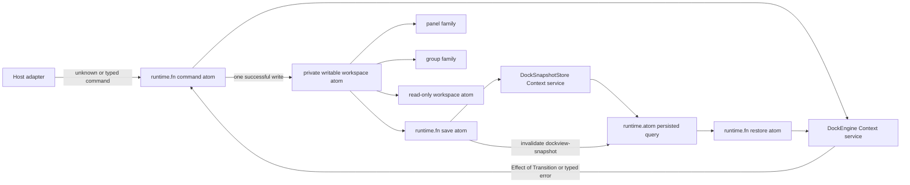

# Dockview core, reconsidered from first principles

This POC treats a dock workspace as a headless transactional state machine. It
does not port `dockview-core` class-by-class. The existing sketches beside this
directory remain intact as prior experiments; the greenfield implementation is
isolated in [`poc/`](./poc/).

The central claim is simple: the DOM is a projection of dock state, never the
source of dock topology. Pointer, keyboard, RPC, and programmatic APIs compile
their intent into the same schema-decoded command algebra.

## Architecture



There are two intentionally different state categories:

- Live layout is client-local state, so Effect Atom owns it directly. Derived
  atoms use normal dependency tracking; Reactivity keys would be redundant.
- Persisted snapshots are external/service-backed state, so the query is a
  `runtime.atom(...)` bound with `factory.withReactivity(...)`, and save uses a
  `runtime.fn(...)` mutation with the matching key.

Each `makeDockAtoms()` call creates a private `Atom.context` factory and memo
map. That prevents layer instances from leaking across dock workspaces while
still sharing one service graph inside a workspace.

## Domain algebra

The layout is a binary tree:

```text
DockWorkspace
|- EmptyWorkspace
`- PopulatedWorkspace
   `- DockNode
      |- TabsNode(groupId, before[], active, after[])
      `- SplitNode(splitId, axis, ratio, start, end)
```

This removes several invalid states rather than checking them later:

- A populated workspace always has a root.
- A split always has exactly two children; unary splits are impossible.
- A tab group is always non-empty.
- The active panel is stored directly in a tab zipper, so it cannot point at a
  panel outside its group.
- Panels live directly in exactly one tab leaf. There is no normalized record
  plus a second set of references that can drift.
- Closing or moving the last panel from a leaf removes that leaf and promotes
  its sibling, so empty groups and redundant splits never persist.

`SplitNode` uses `S.TaggedStruct` plus `S.suspend` as the one recursive-schema
exception to the normal `S.Class` preference. TypeScript cannot put a class in
its own recursive union base expression. Every non-recursive domain object
remains an annotated schema class, and the complete recursive union is still a
runtime schema and JSON codec.

The principal discriminated unions are:

- `PanelView`: component registry key or plain text
- `DockWorkspace`: empty or populated
- `DockNode`: tabs or split
- `DockPlacement`: root, tab, or semantic split side
- `CommandOrigin`: user gesture or API call
- `DockCommand`: open, activate, move, close, resize, or clear
- `DockEvent`: the accepted semantic outcomes plus restore

Commands carry a `commandId` and an explicit origin. This replaces ambient
"mutation origin" stacks and makes emitted events causally attributable.

## Why Context services

`Context.Service` is used for capabilities, not as a service-locator bag and
not to wrap every helper:

- `DockEngine` owns replaceable transition policy and snapshot codecs. It is
  stateless, so Atom registries remain independent even when a layer is shared.
- `DockSnapshotStore` is a real external port. The POC supplies an isolated
  in-memory layer; a browser, RPC, IndexedDB, or collaborative implementation
  can replace it without changing the atom graph.

Pure tree traversal and zipper manipulation stay plain functions. Future
boundaries that genuinely merit services include drop policy, renderer
registry, popout windows, layout measurement, and persistence migrations.

## Transaction semantics

One command produces an `Effect<DockTransition, DockTransitionError>`.

1. The engine evaluates the complete command against the current immutable
   state.
2. It validates global uniqueness invariants on the complete candidate tree.
3. Failure remains in a tagged error channel and the Atom adapter performs no
   write.
4. Success returns the full next state and a non-empty event list.
5. The command atom publishes the next state exactly once.

Snapshot restore follows the same rule: parse JSON with `S.fromJsonString`,
decode the complete workspace, validate global invariants, then install it in
one atom write. The live state is never cleared before validation.

## Proven scenario

The tests exercise the architectural cross-section rather than UI polish:

1. Open the first panel as the root group.
2. Open a second tab in that group.
3. Open a third panel in a new group split to the right.
4. Resize the split.
5. Activate and move a panel across groups.
6. Close the last panel in the old group and prove split collapse.
7. Encode/decode a snapshot and prove schema equivalence.
8. Save, clear, and restore through the Atom/service boundary.
9. Reject duplicate or malformed commands without changing live state.

## Deliberately outside this POC

- DOM rendering and framework adapters
- pointer/touch drag backends, ghosts, and hit testing
- floating groups and popout window resource lifecycles
- sash constraint solving and layout measurement
- maximize, hidden views, overflow, themes, and tab accents
- undo/redo, collaboration, RPC, and snapshot migrations
- compatibility with existing Dockview serialized payloads

Those become adapters or additional command variants around the kernel. They do
not need to own the topology model.

## Files and verification

- [`poc/Domain.ts`](./poc/Domain.ts) - schemas, unions, commands, events, errors
- [`poc/Reducer.ts`](./poc/Reducer.ts) - tree queries and typed transitions
- [`poc/DockEngine.ts`](./poc/DockEngine.ts) - Context services and layers
- [`poc/DockAtoms.ts`](./poc/DockAtoms.ts) - isolated Atom runtime and projections
- [`poc/test`](./poc/test) - transition, codec, Atom, and failure proofs

Run the focused proof from the repository root:

```sh
bunx tsgo -p scratchpad/dockview/tsconfig.json
(cd scratchpad/dockview && bunx biome check --config-path biome.json poc)
bun test scratchpad/dockview/poc/test
```
